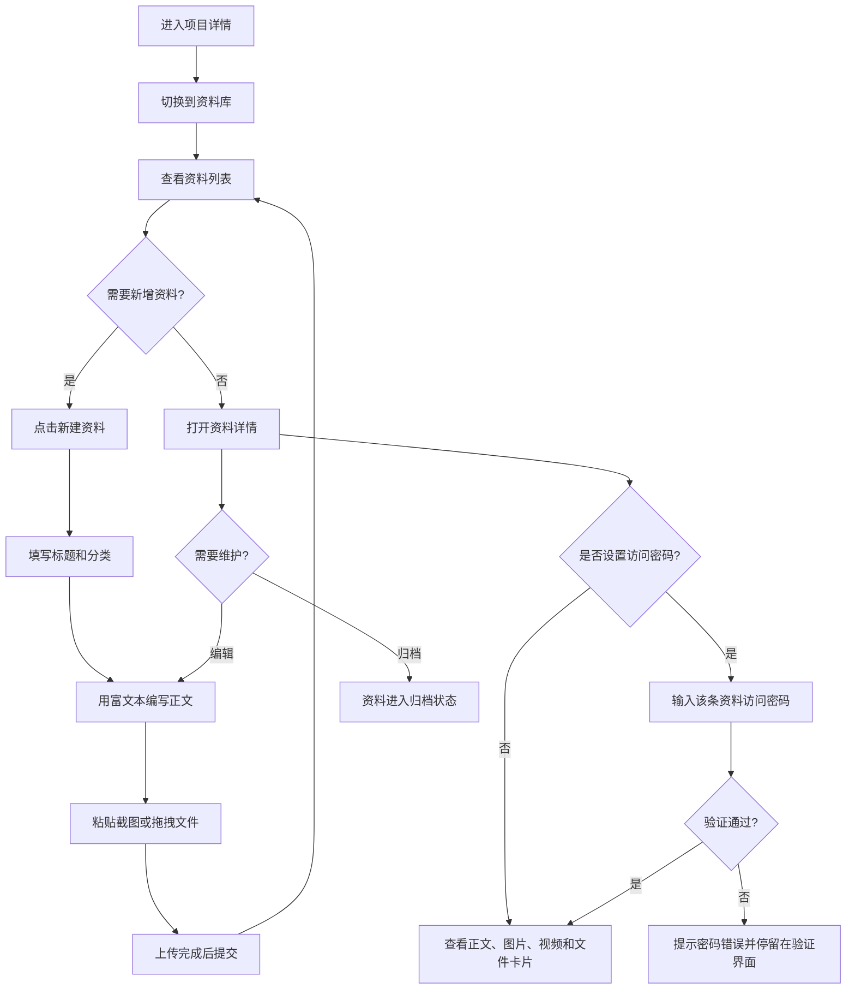

# 项目资料库

## Problem Frame

项目除了需求、任务和 Bug，还会沉淀长期有效的项目资料，例如上游对接参数、测试/正式环境说明、客户资料、会议纪要、实施记录和常用链接。这些内容不应该强行挂到某个工作项下，也不适合恢复成单纯“文件列表”。需要在项目维度提供一个独立的“资料库”，用于沉淀可检索、可编辑、可归档的项目资料。

当前项目已经在工作项新建和讨论区使用富文本编辑器，资料库新建/编辑也应复用这套富文本体验；如果现有实现还只是页面内重复片段，规划和实现时应提炼为可复用组件。

## Requirements

**资料库入口与列表**
- R1. 项目详情页新增一个 tab，命名为“资料库”。
- R2. 资料库展示资料列表，列表项至少包含标题、分类、摘要、创建人、最后更新时间和状态。
- R3. 资料列表支持按关键词搜索，优先覆盖标题、正文摘要和分类。
- R4. 资料列表支持按分类筛选，分类第一期至少包括：对接参数、客户资料、会议纪要、实施文档、其他。
- R5. 资料列表应优先展示未归档资料；归档资料可通过筛选查看。

**资料新建与编辑**
- R6. 用户可以在项目资料库中新建资料条目。
- R7. 新建资料时需要填写标题、分类和正文。
- R8. 正文输入使用项目现有富文本编辑器体验，支持基础排版、粘贴截图、拖拽图片/视频/文件和上传状态展示。
- R9. 编辑资料时继续使用同一富文本组件，并显示创建时间、创建人、最后编辑时间和最后编辑人。
- R10. 资料允许编辑，不做物理删除；不再需要的资料通过“归档”处理。

**内容展示**
- R11. 资料详情页或详情弹窗应以富文本正文为主，图片和视频可点击预览，普通文件以文件卡片形式展示。
- R12. 资料正文中的附件应走现有受控下载/预览入口，不暴露对象存储长期地址。
- R13. 资料内容应适合保存非工作项信息，包括但不限于上游对接参数、客户资料、方案说明、会议纪要和项目注意事项。

**权限与安全**
- R14. 项目成员可查看资料库；只读成员只能查看，项目成员/项目负责人可新建和编辑，具体权限沿用现有项目权限体系。
- R15. 新建资料时可以选择设置访问密码；不设置密码的资料默认不加密，点击即可查看详情。
- R16. 每条资料独立保存自己的访问密码；访问密码只用于该资料条目，不复用用户登录密码或项目级统一密码。
- R17. 设置了访问密码的资料在列表中可见标题、分类、创建人、更新时间和“受保护”状态，但查看正文详情前必须输入正确访问密码。
- R18. 访问密码不得明文存储；系统只能保存密码哈希，并在验证通过后展示资料详情。
- R19. 资料创建、编辑、归档和受保护资料查看尝试应记录项目动态或审计信息，便于追溯谁在什么时候变更或访问了资料。

**富文本复用**
- R20. 资料库新建/编辑不得重新实现一套割裂的富文本交互，应复用或提炼现有富文本编辑器。
- R21. 提炼后的富文本组件应能服务至少三类场景：工作项新建说明、工作项讨论/回复、项目资料正文。

## User Flow

## Success Criteria

- 项目成员能在项目维度保存不属于需求/任务/Bug 的资料。
- 上游对接参数、客户资料、会议纪要等内容可以通过资料库创建、查看、搜索和归档。
- 新建/编辑资料时的富文本、粘贴截图和拖拽上传体验与工作项现有体验一致。
- 设置访问密码的资料必须先通过该条资料的访问密码验证才能查看正文详情。
- 资料库不会退化为单纯文件列表；正文和附件能围绕同一资料条目组织。
- 资料不会被物理删除，历史变更至少能通过动态或审计追溯。

## Scope Boundaries

- 第一阶段不做复杂知识库层级、多人协同实时编辑或全文版本对比。
- 第一阶段不把资料强制关联到具体需求、任务或 Bug；如果后续需要关联，可另行设计。
- 第一阶段的“保险箱”能力只做单条资料访问密码校验；不做项目级保险箱、共享密码管理、密钥脱敏展示或密钥轮换。
- 不恢复旧的“文件 tab”作为核心体验；文件应作为资料正文的一部分或资料条目的附件呈现。

## Key Decisions

- 命名为“资料库”：比“文件”更宽，能覆盖文档、参数、客户资料和项目知识沉淀。
- 使用“资料条目 + 富文本正文 + 内联附件”：比纯文件管理更适合保存上下文和说明。
- 支持归档不支持删除：符合项目协作记录长期保留的产品原则。
- 单条访问密码作为资料级保护能力：创建资料时可选设置；设置后查看详情需要验证该条资料密码。
- 富文本组件需要复用/提炼：避免工作项、讨论和资料库各自维护一套上传与编辑体验。

## Dependencies / Assumptions

- 现有工作项新建和讨论区已有富文本、粘贴/拖拽上传、图片/视频预览和受控下载能力，可作为资料库体验基础。
- 项目详情页现有 tab 结构可承载新的“资料库”入口；当前“详情”tab 更适合继续作为项目概览。

## Outstanding Questions

### Resolve Before Planning

- 无。

### Deferred to Planning

- [Affects R14][Technical] 资料库具体沿用哪些现有 RBAC 权限点，还是新增项目资料相关权限点。
- [Affects R19][Technical] 资料编辑历史第一期只记录项目动态/审计，还是需要保存可查看的历史版本。
- [Affects R20][Technical] 现有富文本编辑器应提炼到模板 partial、前端初始化函数约定，还是进一步抽象成更通用的 composer 组件。

## Next Steps

→ 使用 `ce:plan` 基于本文档制定实现计划。
