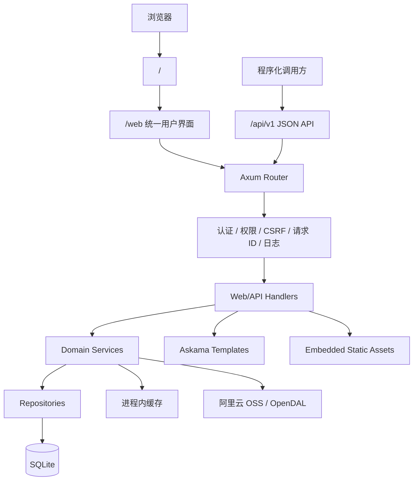

# feat: 搭建 api 模块技术架构

## Overview

元策采用多模块仓库形态，但初期所有业务代码只落在 `api` 模块。`api` 是一个 Rust 单体服务，负责：

- `/web` 统一用户界面，包含项目协作和系统管理能力。
- `/api` JSON API。
- 首次访问时的系统管理员自助初始化。
- HTML / CSS / JS / htmx 静态资源打包进二进制。
- SQLite 数据访问、迁移、seed。
- 仅 development / test / local 环境可显式执行的 local seed 超级管理员。
- 进程内内存缓存。
- 阿里云 OSS 对象存储配置、签名上传和签名下载基础能力。

关键调整：不再建设独立 `/admin` 后台。系统管理员也是普通用户账号，只是拥有系统管理权限。所有页面能力都在 `/web` 下完成，通过轻量 RBAC 控制菜单、页面和操作。

参考 qfy-sc 的 RBAC、SQL 迁移、分页、SQL / repository、页面密度、Git 工作流、配置治理、敏感信息和运维规则，但不照搬其 Go、React、Ant Design、PostgreSQL、Redis、worker 多模块、独立后台和多 portal 账号模型。

## Problem Frame

元策需要先建立清晰的工程骨架和架构规则，否则后续项目、需求、任务、Bug、系统管理、API、迁移和页面会很快混杂。当前目标不是一次性实现全部业务，而是先固定 `api` 模块的技术边界、目录、路由、数据访问、迁移、缓存、统一 Web 页面和测试规范。

统一 `/web` 可以减少两套登录、两套路由、两套 layout 和两套用户模型带来的复杂度。系统管理功能作为 `/web/system/*` 的受保护区域存在，权限由统一用户模型和轻量 RBAC 控制。

## Requirements Trace

- R1-R2. 支持项目中心的需求、任务、Bug、工作台能力。
- R3-R4. 系统管理能力内置在 `/web`，通过轻量 RBAC 控制菜单、页面和操作。
- R20. 首次访问时支持一次性系统管理员初始化，首个管理员由用户填写用户名、显示名称和密码，初始化完成后自动进入 `/web` 并关闭初始化入口。
- R5. `/` 默认跳转 `/web`。
- R6. 用户界面和系统管理页面统一 `/web`。
- R7. 不提供 `/admin` 独立后台入口。
- R8. API 接口统一 `/api`。
- R9. htmx partial 归属 `/web`，不混入 `/api`。
- R10-R12. 多模块仓库初期只实现 `api`，Rust 单体服务，页面资源打包进二进制。
- R13-R15. SQLite 作为唯一真实数据源；不引入 Redis；内存缓存只做性能优化。
- R16. `/web/system/storage` 提供对象存储设置，第一版支持阿里云 OSS。
- R17-R18. 同步参考项目中适合元策的开发规范，但按 Rust + SQLite + htmx 单体服务适配。
- R19. 对象存储密钥和敏感配置不得明文进入代码、文档、日志或普通页面展示。
- R21. 开发 / 测试环境允许显式 local seed 固定超级管理员，生产环境必须拒绝该逻辑。

## Scope Boundaries

- 不新增 `worker` 模块。
- 不新增独立前端工程。
- 不新增独立 `/admin` 后台入口。
- 不拆分后台用户和用户端用户。
- 不引入 Redis、MQ、PostgreSQL、Elasticsearch 或分布式锁。
- 不做微服务拆分。
- 不做复杂数据权限矩阵、审批式授权、多 portal 账号域或外部 IAM；但第一版做轻量 RBAC。
- 生产环境不预置默认管理员账号、默认密码或通过 seed / 环境变量注入首个管理员密码。
- local seed 超级管理员只允许 development / test / local 环境显式执行，不进入生产发布流程。
- 不把 htmx HTML partial 设计为 `/api` 响应。
- 不把内存缓存作为持久状态来源。
- 不同时接入多个对象存储供应商；第一版只支持阿里云 OSS。
- 不在第一阶段实现所有附件业务场景；先建设统一对象存储配置和上传 / 下载签名底座。

## Context & Research

### Current Repo

- 当前仓库只有项目规范、需求文档和 CE 目录占位。
- 已有需求文档：`docs/brainstorms/yuance-mvp-requirements.md`。
- 目前没有 Rust manifest、`api` 模块、数据库代码或页面代码。

### qfy-sc References

以下参考路径相对于 qfy-sc 仓库：

- `AGENTS.md`：CE 流程、提交、SQL、页面和分页规范。
- `api/README.md`：API 模块职责、命令、seed、迁移边界。
- `docs/runbooks/api-migrations.md`：迁移与 seed 运行手册。
- `docs/standards/git-workflow.md`：每轮小闭环 commit / push、提交边界、diff 检查和禁止 `git add .` 的规范。
- `docs/standards/sql-repository-convention.md`：SQL / repository / service 分层规则。
- `docs/standards/data-list-server-pagination.md`：服务端分页规范。
- `docs/standards/admin-page-content-density.md`：管理页面内容密度规范，可转为元策系统管理页面规范。
- `docs/standards/worker-ui-component-style-guide.md`：Go template + htmx UI 规范，可迁移为 Rust template + htmx。
- `docs/standards/ui-help-tooltip-pattern.md`：说明提示规范。
- `docs/standards/platform-operation-settings.md`：区分运营设置与开发 / 运维配置的归属边界。
- `docs/standards/provider-runtime-config.md`：第三方运行态配置入库、密钥不放环境变量、mock / 正式配置边界。
- `worker/internal/migrate/run.go`：多 scope 迁移命令模式。
- `worker/internal/migrationguard/guard.go`：历史 migration 不可变 guard 规则。
- `worker/internal/server/templates/layout.html`：topbar、sidebar、toast 源，可作为统一 `/web` shell 参考。
- `worker/internal/server/static/worker.css`：样式变量、布局和组件类。
- `api/internal/domains/adminauth/handler.go`：bootstrap status / init 路由形态；只借鉴流程，不照搬 `/admin` 路径。
- `api/internal/domains/adminauth/service.go`：bootstrap required / init 的事务、首个管理员创建和自动登录逻辑。
- `api/internal/domains/adminauth/domain.go`：bootstrap init 输入模型。
- `api/internal/domains/adminauth/service_test.go`：bootstrap required 测试场景。
- `api/schema/011_admin_auth_rbac.sql`：qfy-sc 账号、角色、权限、角色绑定、角色权限绑定、session 表结构参考。
- `api/queries/platform/admin_rbac.sql`：qfy-sc RBAC CRUD、授权、权限快照查询参考。
- `api/internal/domains/rbac/*`：qfy-sc RBAC service / repository / handler 分层参考。
- `api/seeds/core/010_admin_rbac_core.sql`：qfy-sc core seed 权限点、系统角色和角色权限绑定参考。
- `api/seeds/local-admins/010_portal_test_accounts.sql`：qfy-sc 本地 / 测试账号 seed 参考。
- `admin/src/features/auth/pages/LoginPage.tsx`：登录页根据 bootstrap 状态切换为首次初始化表单的交互形态；只借鉴交互，不引入 React。
- `admin/src/services/auth.ts`：bootstrap status / init 客户端接口；只借鉴契约。
- `api/internal/domains/storageconfig/*`：对象存储配置、版本、探测、导出、签名上传 / 下载的 domain 模式。

### External References

- Axum 官方文档：支持 nested router、全局 state、Tower middleware/layer、HTML/redirect response；适合 `/web`、`/api` 两路由分区。
- SQLx 官方文档：支持 SQLite、连接池、迁移、compile-time checked query、offline prepare；适合 SQLite 单体服务。
- Askama 官方文档：支持 Rust compile-time checked HTML templates、自动 HTML escaping、模板文件位于 crate root `templates`。
- Apache OpenDAL 官方文档：支持阿里云 OSS backend、endpoint / bucket / access key 配置、presigned upload/download 和 async object storage 访问；阿里云 OSS 可通过 OSS service 或 S3 compatible virtual host style 接入。

## Key Technical Decisions

- Rust Web 框架选 Axum：路由分区、middleware、state 和 Tower 生态清晰，适合单体服务。
- 数据层选 SQLx + SQLite：不引入 ORM；保留 SQL 可读性；支持迁移和 offline query metadata。
- 模板选 Askama：模板编译期检查、自动转义，降低服务端渲染页面的运行时风险。
- 静态资源编译进二进制：`api/static` 中的 CSS、JS、htmx vendor 文件通过 embed 方式服务，不依赖外部 CDN。
- CLI 单二进制多子命令：`yuance-api serve`、`yuance-api migrate ...`、`yuance-api seed ...`。
- `serve` 不自动执行 migration：迁移是显式发布步骤，避免运行态隐式改库。
- SQLite 是唯一真实数据源：session、权限、项目、工作项、审计都持久化到 SQLite。
- 内存缓存只做旁路优化：session、权限快照、系统设置可缓存，但写入后必须失效，重启可从 SQLite 恢复。
- `/api` 只返回 JSON：htmx 页面和片段留在 `/web`，保持接口边界清晰。
- 系统管理不设独立后台：`/web/system/*` 承载用户、角色、系统设置、对象存储和审计能力。
- RBAC 采用 qfy-sc 的核心形态并轻量化：保留 users、roles、permissions、user_roles、role_permissions、session snapshot、`is_super_admin` 兜底；移除 portal_type、owner_type、Redis 依赖和多后台隔离。
- 权限判断校验 permission key，不直接校验角色名；角色只是权限集合，系统内置角色由 core seed 幂等维护。
- 首个系统管理员采用一次性自助初始化：空库首次访问 `/web` 时展示初始化页，用户填写 username / display_name / password；成功后创建系统管理员、绑定 `system_admin` 角色、建立 session 并跳转 `/web`；初始化完成状态单独持久化，后续不能因管理员被删除或禁用而重新开放公开初始化入口。
- 开发测试固定超管采用显式 local seed：默认账号 `yuance_admin`，默认密码 `Yuance@2026Dev!`，只允许 `YUANCE_ENV=development|test|local` 执行；生产环境必须直接拒绝。
- 对象存储第一版接入阿里云 OSS：配置入 SQLite，由 `/web/system/storage` 管理；业务上传通过服务端生成短期 presigned URL，不让浏览器接触长期 AccessKey。
- 密钥材料加密入库：OSS AccessKey Secret 等敏感值只保存密文和展示 hint，导出明文能力不进入第一版默认页面。
- 开发规范同步为项目标准文档：把 qfy-sc 中适用的 Git、SQL / repository、分页、migration、seed、页面 UI、说明提示、敏感配置治理规则转成元策版 `docs/standards` 和 `docs/runbooks`。

## Open Questions

### Resolved During Planning

- 是否保留独立 `/admin`：否。统一为 `/web` 页面入口，系统管理能力走权限模型。
- 是否拆分后台用户和用户端用户：否。用户模型统一，管理员只是拥有系统管理权限的用户。
- 权限是否只做硬编码角色判断：否。参考 qfy-sc 做轻量 RBAC；元策只去掉多 portal、多后台和 Redis，不牺牲角色 / 权限 / 权限快照的基本模型。
- SQL migration 是否放在 worker：否，元策没有 worker 模块，migration 放在 `api/migrations`，但命令和 guard 逻辑参考 qfy-sc worker。
- 是否使用 Redis：否，使用内存缓存替代 Redis。
- htmx partial 是否放 `/api`：否，归属 `/web`。
- 对象存储是否需要纳入第一版架构：是，先接入阿里云 OSS 的配置、探测、上传签名、下载签名和对象元数据基础能力。
- 管理员初始化是否参考 qfy-sc：是，保留“先检查 bootstrap 状态，再由用户填写首个系统管理员并自动登录”的核心流程；元策改为 `/web/login` 服务端渲染 + htmx 提交，不使用 `/admin` 路由。
- 开发测试是否可内置固定超管：可以，但只能通过显式 `seed local-admin` / `seed dev-admin` 类命令执行，并且必须有环境 guard；正式环境仍走 `/web` 自助初始化。
- 参考项目开发规范是否同步：是，但必须改写为元策版，不能复制 qfy-sc 的项目名、端口、Go / React / PG / Redis / worker / 独立后台约束。

### Deferred to Implementation

- 最终依赖版本：创建 `api/Cargo.toml` 时以本机可用 Rust 工具链和最新兼容版本确定。
- 模板引擎若 Askama 对复杂复用造成明显摩擦，可在实施前评估 MiniJinja，但默认先用 Askama。
- SQLite migration runner 使用 SQLx 内置 migrator 还是封装薄层，需要在实现时根据 guard、status 和 up-to 需求确定。
- 对象存储实现使用 OpenDAL OSS backend 还是阿里云 OSS/S3 签名专用 crate，需要在实现时按 Rust 生态成熟度、presign 能力和测试便利性确认；默认优先评估 OpenDAL。

## High-Level Technical Design

> This illustrates the intended approach and is directional guidance for review, not implementation specification. The implementing agent should treat it as context, not code to reproduce.



## Architecture Inventory

### 1. Workspace 与模块

目标结构：

```text
Cargo.toml
README.md
api/
  Cargo.toml
  README.md
  .env.example
  src/
  templates/
  static/
  migrations/
  queries/
  schema/
  seeds/
  tests/
docs/
  brainstorms/
  plans/
  solutions/
```

约束：

- 根 `Cargo.toml` 只声明 workspace。
- 初期 workspace member 只有 `api`。
- 不新增 `crates/`、`worker/`、`admin/`、`web/`。
- 所有 Rust 业务代码位于 `api/src`。

### 2. `api/src` 分层

目标结构：

```text
api/src/
  main.rs
  lib.rs
  app/
    mod.rs
    serve.rs
    migrate.rs
    seed.rs
  platform/
    mod.rs
    config.rs
    db.rs
    error.rs
    telemetry.rs
    cache.rs
    time.rs
    pagination.rs
    storage.rs
    crypto.rs
    security/
    web/
  domains/
    auth/
    users/
    projects/
    work_items/
    comments/
    activities/
    dashboard/
    settings/
    storage/
    files/
    audit/
  web/
    mod.rs
    router.rs
    response.rs
    htmx.rs
    csrf.rs
    user/
    api/
```

职责：

- `app`：CLI 子命令入口和启动编排。
- `platform`：跨业务基础设施。
- `domains`：业务领域，按 domain 拆分 service / repository / model。
- `web`：Axum 路由、handler、模板响应、JSON 响应、htmx 约定。

### 3. CLI 命令

二进制命名建议：`yuance-api`。

命令：

```text
yuance-api serve
yuance-api migrate status
yuance-api migrate up
yuance-api migrate up-to <version>
yuance-api migrate create <name>
yuance-api migrate guard [base-ref]
yuance-api seed core
yuance-api seed demo
yuance-api seed local-admin
yuance-api repair admin-unlock
yuance-api repair admin-create
yuance-api help
```

规则：

- `serve` 只启动服务，不自动迁移。
- `migrate` 只操作 `api/migrations`。
- `seed core` 可幂等执行，用于正式基础数据。
- `seed demo` 只用于本地和演示。
- `seed local-admin` 只用于 development / test / local，创建固定开发测试超级管理员；生产环境执行必须失败。
- `repair` 只处理受控运维修复，不参与普通启动流程。

### 4. 配置

配置来源：

- 环境变量。
- 本地开发通过 `api/.env`，仓库提交 `api/.env.example`。

建议变量：

```text
YUANCE_HTTP_ADDR=127.0.0.1:33033
YUANCE_DATABASE_URL=sqlite://data/yuance.sqlite3
YUANCE_DATA_DIR=data
YUANCE_SESSION_SECRET=change-me
YUANCE_SESSION_TTL=12h
YUANCE_CACHE_SESSION_TTL=5m
YUANCE_LOG_LEVEL=info
YUANCE_ENV=development
YUANCE_SECURITY_MASTER_KEY=change-me-32-byte-minimum
```

约束：

- `.env` 不提交。
- `.env.example` 不放真实密钥。
- SQLite 默认文件放在 `data/`，`data/` 应加入 `.gitignore`。
- `YUANCE_SECURITY_MASTER_KEY` 只用于本机示例；非 local 环境必须使用稳定强随机值，变更前需要规划历史密文重加密。
- 阿里云 OSS endpoint、region、bucket、AccessKey 不作为常驻环境变量读取；初次导入可以通过 `/web/system/storage` 录入或受控 seed 写入 SQLite。

### 5. 路由分区

路由规则：

```text
/                         -> 302 /web
/web                      -> 用户工作台
/web/login                -> 登录；未初始化时展示首次初始化表单
/web/logout               -> 退出
/web/bootstrap/init       -> 首次系统管理员初始化表单提交
/web/projects             -> 项目列表
/web/projects/:id         -> 项目详情
/web/requirements         -> 需求列表
/web/tasks                -> 任务列表
/web/bugs                 -> Bug 列表
/web/me                   -> 个人中心
/web/system               -> 系统管理首页，需 `system.dashboard.view`
/web/system/users         -> 用户管理
/web/system/roles         -> 角色管理
/web/system/permissions   -> 权限点查看
/web/system/projects      -> 项目全局管理 / 查看
/web/system/settings      -> 系统设置
/web/system/storage       -> 对象存储设置
/web/system/audit         -> 审计日志

/api/healthz              -> 存活检查
/api/readyz               -> 就绪检查
/api/v1/...               -> JSON API
/api/v1/bootstrap/status  -> 可选 JSON 初始化状态
/api/v1/bootstrap/init    -> 可选 JSON 初始化接口
/api/v1/storage/upload-url   -> 对象上传签名
/api/v1/storage/download-url -> 对象下载签名
```

响应边界：

- `/web` 返回 HTML 或 htmx partial。
- `/api` 返回 JSON。
- MVP 优先让 `/web/login` 在服务端判断是否需要 bootstrap；JSON bootstrap 接口只在后续需要程序化初始化或独立客户端时补充。
- API 错误统一返回 JSON error envelope。
- Web 未登录默认重定向登录页。
- API 未登录返回 `401`。
- 无权限 Web 返回 HTML 错误页；API 返回 `403`。

### 6. htmx 约定

规则：

- 页面级完整 HTML 使用 layout。
- 局部刷新模板命名为 partial。
- htmx 请求通过 `HX-Request` 判断是否返回 partial。
- 成功后需要跳转时使用 `HX-Redirect`。
- 表单校验失败返回 `422` 和原表单 partial。
- 删除、启用、禁用、状态流转等操作优先局部刷新当前 panel。
- toast 通过响应头或隐藏 toast source 统一处理。

静态资源：

- htmx vendored 到 `api/static/vendor/htmx.min.js`。
- 项目脚本集中在 `api/static/app.js`。
- 项目样式集中在 `api/static/app.css`。
- 禁止模板内散落大段内联脚本和内联样式。

### 7. 模板结构

目标结构：

```text
api/templates/
  layouts/
    base.html
    auth.html
    web.html
  components/
    pagination.html
    flash.html
    modal.html
    tabs.html
    tooltip.html
    status_badge.html
  web/
    bootstrap.html
    login.html
    dashboard.html
    projects/
    work_items/
    system/
      dashboard.html
      users/
      roles/
      permissions/
      projects/
      settings/
      storage/
      audit/
  errors/
    400.html
    401.html
    403.html
    404.html
    500.html
```

规则：

- 只有一个 Web layout，根据当前用户权限展示普通协作菜单和系统管理菜单。
- 公共组件集中在 `components`。
- 页面模板只表达页面结构，不写业务判断大逻辑。
- 复杂状态文本在 Rust view model 中准备好。
- 模板默认自动 HTML escaping。

### 8. Web UI 与系统管理页面规则

统一 `/web` shell：

- 顶部栏 + 左侧导航 + 主内容区。
- 普通成员看到：工作台、项目、需求、任务、Bug、我的。
- 具备对应权限的用户额外看到：系统管理、用户管理、角色管理、权限点、系统设置、对象存储、审计日志。
- 首屏直接展示统计、筛选、表格、表单或操作按钮。
- 默认不放营销式标题、副标题、介绍文案。
- 高风险操作使用确认弹窗。
- 常规新增 / 编辑使用居中弹窗。
- 列表使用服务端分页。
- 操作反馈使用 toast。
- 说明提示用于字段、表头、配置口径，不写长篇帮助。

导航建议：

```text
工作台
项目
需求
任务
Bug
我的
系统管理（按权限显示）
  用户管理
  角色管理
  权限点
  项目治理
  系统设置
  对象存储
  审计日志
```

### 9. 用户工作区规则

用户工作区保持服务端渲染和 htmx：

- 项目详情页是主工作入口。
- 需求、任务、Bug 使用统一列表结构和不同筛选项。
- 状态流转操作使用 htmx 局部刷新。
- 评论和动态在详情页显示。
- 我的工作台聚合分配给当前用户的需求、任务、Bug。

### 10. Auth / Session / Bootstrap / RBAC

认证方式：

- Web 使用服务端 session + HttpOnly Cookie。
- API 初期复用 session 认证；后续如需要外部集成，再增加 personal access token。
- 空库首次访问 `/web` 时跳转 `/web/login`，登录页根据初始化状态展示“首次初始化”表单，而不是普通登录表单。

持久化：

- session 记录保存在 SQLite。
- session 快照可放内存缓存。
- 密码使用 Argon2id hash。
- 初始化完成状态保存在 SQLite，不只通过“当前管理员数量为 0”推断，避免误删管理员后重新暴露初始化入口。
- auth snapshot 包含 user、role_codes、permission_keys、is_super_admin，用于菜单、页面和操作权限判断。

首次系统管理员初始化：

- 参考 qfy-sc 的 `BootstrapRequired` / `BootstrapInit` 流程，但适配为 Rust + Axum + Askama + htmx。
- `GET /web/login` 查询初始化状态；未完成时渲染 `api/templates/web/bootstrap.html` 或登录页内 bootstrap variant。
- `POST /web/bootstrap/init` 接收 username、display_name、password 和 CSRF token。
- 初始化只允许在未完成状态执行；成功后在一个 SQLite 事务中创建首个用户、绑定 `system_admin` 角色、写入初始化完成状态、写审计日志、创建 session。
- 初始化成功后设置 HttpOnly session cookie，并通过 redirect 或 `HX-Redirect: /web` 进入工作台。
- 初始化完成后再次访问提交接口返回 409 或渲染“初始化已完成，请登录”的表单错误。
- 并发初始化只能成功一个；通过初始化状态行的唯一约束、事务和 SQLite write lock 保证。
- 用户名和密码校验沿用普通登录账号规则；密码字段使用 `autocomplete="new-password"`。

Cookie 规则：

- `HttpOnly`
- `SameSite=Lax`
- 生产环境启用 `Secure`
- 登录、登出、密码变更、账号禁用都要影响 session。

RBAC 规则：

- 初期内置系统角色：`system_admin`、`member`。
- 初期内置权限点按 `resource.action` 命名，例如 `system.users.view`、`system.users.manage`、`project.view`、`work_item.manage`。
- 权限点按 `group`、`page`、`action` 归类，用于菜单展示、页面访问和按钮 / 表单操作控制。
- handler 和 service 校验 permission key，不直接校验角色名。
- `is_super_admin` 作为受控兜底能力，仅首个初始化账号默认拥有；普通系统管理员也应通过角色权限工作。
- 首个初始化账号必须拥有 `system_admin` 角色和 `is_super_admin=true`。
- `/web` 登录用户可访问基础工作区。
- `/web/system/*` 需要对应系统管理权限。
- 业务对象操作需校验项目成员关系。
- 项目成员关系负责数据范围，RBAC 负责功能入口和操作权限；两者必须同时满足。
- 角色、角色权限、用户角色、账号状态或密码变化后，相关 session / permission cache 必须失效。

轻量 RBAC 数据模型：

```text
users
roles
permissions
user_roles
role_permissions
sessions
```

从 qfy-sc 直接吸收：

- 角色表：`role_code`、`role_name`、`status`、`is_system`、`data_scope_type`、`data_scope_payload`。
- 权限表：`permission_key`、`permission_name`、`resource_type`、`resource_key`。
- 绑定表：用户-角色、角色-权限唯一约束。
- 鉴权快照：登录和 session 恢复时聚合 role_codes、permission_keys、is_super_admin。
- 管理能力：角色 CRUD、权限点查看、角色权限分配、用户角色分配、用户启停、重置密码。

不照搬：

- `portal_type`：元策只有统一用户域。
- `owner_type` / `owner_id`：MVP 不做分销商 / 供应商主体账号域。
- Redis session store：元策 session 持久化 SQLite，热点快照使用进程内缓存。
- 三后台路由和 Bearer token 协议：元策 Web 使用 HttpOnly Cookie session。

### 11. CSRF

Web 表单必须有 CSRF 防护：

- GET 不需要 CSRF。
- POST / PUT / PATCH / DELETE 需要 CSRF。
- htmx 请求同样需要携带 CSRF token。
- API JSON 如果使用 Cookie session，也需要 CSRF；如果未来使用 Bearer token，可按 token 认证规则处理。

### 12. SQLite 数据访问

基础规则：

- 使用 SQLx SQLite pool。
- SQLite 开启 WAL。
- 设置合理 busy timeout。
- 所有写操作通过 service 控制事务。
- repository 是唯一数据库访问边界。
- handler 不直接访问数据库。
- service 不写 raw SQL。

推荐分层：

```text
handler -> service -> repository -> SQLx -> SQLite
```

### 13. SQL 文件与 Repository 规范

参考 qfy-sc SQL / repository 规范，适配 Rust：

```text
api/queries/
  auth.sql
  rbac.sql
  users.sql
  projects.sql
  work_items.sql
  comments.sql
  activities.sql
  settings.sql
  audit.sql
```

规则：

- 查询 SQL 优先放 `api/queries/**/*.sql`。
- repository 使用 SQLx query file / query_as file。
- 动态筛选确实无法静态表达时，只允许 repository 内集中使用 QueryBuilder。
- handler 和 service 禁止拼 SQL。
- 列表查询必须有 `ListXxx` 和 `CountXxx`。
- 分页必须稳定排序，例如 `updated_at DESC, id DESC`。

### 14. Migration 规范

目录：

```text
api/migrations/
  202606260001_create_core_tables.sql
```

规则：

- 文件命名：`YYYYMMDDHHMMSS_snake_case.sql`。
- 历史 migration 禁止修改、删除、rename。
- schema 变化只能新增更高版本 migration。
- 每个 migration 只做一个主要目的。
- 生产默认 forward-only。
- 大批量修复数据不放普通 migration。
- 业务表默认不使用数据库外键；由 service 维护业务一致性，必要时对强一致关系再评估。

命令规则：

- `migrate create` 生成时间戳文件。
- `migrate status` 展示已执行和待执行。
- `migrate up` 执行所有 pending。
- `migrate up-to` 执行到指定版本。
- `migrate guard` 对比 `main...HEAD` 或指定 base，只允许新增合法 migration。

### 15. Schema Snapshot 与 SQLx Offline

建议保留：

```text
api/schema/schema.sql
api/.sqlx/
```

用途：

- `api/schema/schema.sql` 作为人类审查和 SQLx 准备的 schema 快照。
- `api/.sqlx/` 用于 SQLx offline 编译。
- CI / 本地检查可验证 `.sqlx` 是否与 queries 同步。

### 16. Seed 规范

Seed 类型：

- `seed core`：正式基础数据，幂等。
- `seed demo`：本地演示数据，非生产。
- `seed local-admin`：开发 / 测试 / local 固定超级管理员，非生产。

Core seed 初期包含：

- 默认系统管理员角色。
- 默认成员角色。
- 基础权限点。
- `system_admin` 默认绑定全部权限点。
- `member` 默认绑定基础项目协作权限点。
- 初始化状态默认值。
- 系统设置默认值。

规则：

- seed 使用自然键 upsert。
- 权限点由 core seed 管理，新增功能必须同步新增权限 seed 和角色绑定。
- demo seed 不进入生产启动流程。
- `seed local-admin` 只能在 `YUANCE_ENV=development|test|local` 运行；`production` 或未知环境必须拒绝。
- `seed local-admin` 创建 / 更新账号 `yuance_admin`，默认密码 `Yuance@2026Dev!`，绑定 `system_admin`，设置 `is_super_admin=true`，并写入初始化完成状态。
- `seed local-admin` 执行后普通首次初始化入口关闭；这是开发 / 测试环境的有意行为。
- seed 不替代 migration。
- `seed core` 不创建首个系统管理员，不生成默认密码；生产环境首个系统管理员必须走 `/web` 初始化流程。

### 17. 内存缓存

缓存范围：

- session snapshot。
- 用户权限快照。
- 系统设置。
- 少量工作台统计。

规则：

- 缓存 TTL 必须短。
- 写入相关数据后必须主动失效。
- 缓存 miss 必须能从 SQLite 回源。
- 不缓存未提交事务结果。
- 不缓存唯一业务状态。
- 不引入 Redis 兼容层或 Redis 抽象。

### 18. 分页规范

所有业务列表统一：

```text
page       默认 1
page_size  默认 10
page_size 最大 100
```

API 响应：

```json
{
  "items": [],
  "total_count": 0,
  "page": 1,
  "page_size": 10
}
```

Web 页面：

- 表格展示总数。
- 切换筛选条件后重置到第一页。
- 不允许前端拉全量后分页。

### 19. API JSON 契约

路径：

```text
/api/v1/me
/api/v1/projects
/api/v1/requirements
/api/v1/tasks
/api/v1/bugs
```

错误响应：

```json
{
  "error": {
    "code": "invalid_request",
    "message": "请求参数不正确",
    "request_id": "..."
  }
}
```

规则：

- JSON 字段使用 snake_case。
- 时间使用 RFC3339。
- 金额或耗时这类精确值不用浮点。
- 列表必须返回 envelope。
- 不在 `/api` 返回 HTML。

### 20. Domain 初期拆分

建议 domain：

```text
auth        登录、登出、session、密码、bootstrap
users       用户基础资料
rbac        角色、权限点、角色权限、用户角色、权限快照
projects    项目、成员、项目状态
work_items  需求、任务、Bug 共享核心
comments    评论
activities  操作动态
dashboard   工作台聚合
settings    系统设置
storage     对象存储配置、探测、上传签名、下载签名
files       文件元数据、业务对象附件关系
audit       审计日志
```

工作项建模：

- UI 上区分需求、任务、Bug。
- 数据层共享 `work_items` 核心字段。
- 类型字段：`requirement`、`task`、`bug`。
- 类型扩展字段可用独立列或扩展表，实施时按 MVP 字段复杂度决定。

### 21. Core Data Model 初稿

第一批表建议：

```text
users
roles
permissions
user_roles
role_permissions
sessions
system_bootstrap
projects
project_members
work_items
work_item_comments
work_item_activities
system_settings
storage_configs
file_objects
work_item_attachments
audit_logs
```

重要索引方向：

- 用户名唯一。
- session token hash 唯一。
- 角色 `role_code` 唯一。
- 权限 `permission_key` 唯一。
- 用户角色 `(user_id, role_id)` 唯一。
- 角色权限 `(role_id, permission_id)` 唯一。
- `system_bootstrap` 使用固定 scope 唯一行记录初始化完成状态。
- 项目成员 `(project_id, user_id)` 唯一。
- 工作项按 `(project_id, item_type, status, updated_at)` 查询。
- 工作项按负责人 `(assignee_id, status, updated_at)` 查询。
- 评论按 `(work_item_id, created_at)` 查询。
- 动态按 `(project_id, created_at)` 查询。
- 对象存储配置按 `(status, version)` 查询当前 active 版本。
- 文件对象按 `(storage_uri)` 唯一查询，按 `(owner_type, owner_id, created_at)` 查询业务附件。

### 22. 对象存储与文件上传

第一版只接入阿里云 OSS，目标是为项目附件、评论附件、Bug 截图等后续能力提供统一底座。

配置归属：

- 系统管理路径：`/web/system/storage`。
- 配置持久化：SQLite。
- 支持版本化：每次保存对象存储配置都生成新版本，旧版本标记为 `superseded`。
- 支持回滚：允许系统管理员回滚到历史配置版本。
- 支持探测：校验 endpoint、bucket、AccessKey 是否可用。

配置字段建议：

```text
provider = aliyun_oss
region
endpoint
private_bucket
public_bucket
public_base_url
upload_url_ttl_seconds
download_url_ttl_seconds
access_key_id
access_key_secret_ciphertext
access_key_secret_hint
status
version
change_note
created_by
created_at
applied_at
```

上传策略：

- 业务页面向服务端申请短期上传 URL。
- 服务端生成 object key、记录预期大小和 content type。
- 浏览器使用 presigned URL 直传 OSS。
- 上传完成后业务接口确认文件并写入 `file_objects`。
- 业务附件关系写入 `work_item_attachments` 或后续对应业务表。

下载策略：

- 私有文件通过服务端生成短期下载 URL。
- 公共文件可使用 public bucket / public base URL，但必须由服务端生成和校验 object key。
- 不把长期 AccessKey 暴露给浏览器。

object key 规则：

```text
<scene>/<yyyy>/<mm>/<dd>/<uuid>-<safe-file-name>
```

scene 示例：

```text
project_attachment
work_item_attachment
bug_screenshot
comment_attachment
avatar
```

安全规则：

- 文件大小需要后端限制，默认上限建议 50MB，后续按场景调整。
- content type 使用 allowlist，禁止只信任浏览器上报。
- object key 必须由服务端生成，不能由用户提交完整路径。
- 上传 URL 和下载 URL TTL 必须短。
- AccessKey Secret 只存密文，不在普通接口、日志、页面中展示。
- 配置保存、回滚、探测、生成签名都写入审计日志。

### 23. 审计与动态

区分：

- `activities`：项目内可见的业务动态，例如需求状态变化、任务指派。
- `audit_logs`：系统管理、安全和敏感操作审计，例如登录、禁用用户、修改角色。

规则：

- 业务操作成功提交事务后写动态。
- 系统管理高风险操作写审计。
- 审计列表服务端分页。
- 对象存储配置保存、回滚、探测、签名异常写审计。

### 24. 错误处理

错误分层：

- domain error：业务错误。
- validation error：输入错误。
- infrastructure error：数据库、模板、IO。
- auth error：未登录 / 无权限。

响应：

- Web 渲染错误页或表单错误 partial。
- API 输出 JSON error envelope。
- 日志记录 request_id 和内部错误。
- 不把内部 SQL 错误直接展示给用户。

### 25. 可观测性

基础能力：

- structured logging。
- request id。
- access log。
- `/api/healthz`。
- `/api/readyz` 检查 SQLite 可访问。
- panic / error 日志。

不做：

- Loki。
- OpenTelemetry collector。
- Prometheus 复杂指标。

### 26. 安全基线

必须做：

- Argon2id 密码 hash。
- session token 只存 hash。
- Cookie HttpOnly / SameSite。
- CSRF。
- HTML 自动转义。
- 登录失败通用错误提示。
- 系统管理权限检查。
- 项目成员权限检查。
- 静态资源合理 cache header。
- OSS AccessKey Secret 加密入库，只展示 hint。
- 上传 / 下载签名必须校验登录态、权限、scene、文件大小和 content type。
- 日志不得记录 OSS secret、presigned URL query、session token、CSRF token。

后置：

- 2FA。
- SSO。
- 复杂密码策略。
- IP 白名单。
- 细粒度权限矩阵。

### 27. 测试架构

测试目录：

```text
api/tests/
  http/
  migrations/
  web/
  repositories/
  storage/
```

测试类型：

- unit：domain service、状态流转、分页归一。
- repository：临时 SQLite 数据库。
- migration：空库执行 up、status、guard。
- HTTP：Axum router 请求测试。
- template smoke：关键页面可渲染。
- storage：对象存储配置校验、签名生成、object key 规范和权限校验。

最低场景：

- `/` 跳转 `/web`。
- 空库访问 `/web` 或 `/web/login` 显示首次系统管理员初始化页。
- 初始化成功后创建 `system_admin` 用户、绑定角色、建立 session 并进入 `/web`。
- 初始化完成后再次提交初始化返回 409 或表单错误，且不创建第二个系统管理员。
- 两个并发初始化请求只能成功一个。
- `/web` 未登录跳登录，登录后可访问。
- 普通成员访问 `/web/system/*` 被拒绝。
- `/api` 错误返回 JSON。
- 列表分页默认 `page=1&page_size=10`。
- `page_size > 100` 归一为 `100`。
- migration guard 拒绝修改历史 SQL。
- session 缓存 miss 后可从 SQLite 恢复。
- 对象存储配置保存后旧版本被标记为 superseded。
- 未授权用户不能申请上传 / 下载签名。
- 非法文件类型或超大文件不能生成上传签名。

### 28. Makefile 入口

根目录保留轻量入口：

```text
make help
make api-run
make api-test
make api-build
make api-fmt
make api-clippy
make api-migrate-status
make api-migrate-up
make api-migrate-create NAME=create_core_tables
make api-migrate-guard
make api-seed-core
make api-seed-demo
make api-seed-local-admin
make api-docs-check
```

规则：

- 根 Makefile 只做转发。
- 具体命令在 `api/` 内可独立运行。

### 29. 开发规范同步清单

从 qfy-sc 同步到元策的开发规范必须落成元策自己的文档，不保留 qfy-sc 的项目名、服务端口、模块名和不适用技术栈。

需要同步的规范：

- Git 工作流：每轮小闭环提交，提交前检查 `git status --short`、`git diff --check`、staged diff；只暂存本轮相关文件；不默认 `git add .`；用户要求提交时才提交推送。
- SQL / repository：SQL 集中、repository 为唯一 DB 边界、service 控制事务、handler 不碰数据库。
- Migration：历史 migration 不可变；只能新增合法时间戳 SQL；`serve` 不自动迁移。
- Seed：`core`、`demo`、后续 `repair` 明确边界；demo 不进生产流程。
- Local seed：固定开发测试超管只允许 local / development / test 环境，生产环境执行必须失败。
- 分页：业务列表服务端分页，默认 10，最大 100。
- 页面 UI：高信息密度、少标题说明、table / filter / modal / toast 规范。
- 说明提示：字段口径用短 tooltip，不写长篇帮助。
- 敏感配置：第三方运行态配置入库，密钥加密，页面和日志只展示 hint。
- 文档路径：所有文档引用仓库相对路径。

不应同步的规范：

- Go / Gin / pgx / sqlc / goose 专属写法。
- React / Ant Design / Vite 前端工程规则。
- PostgreSQL / Redis / RabbitMQ / Loki / worker 独立模块规则。
- 独立 `/admin` 后台路由、多 portal 后台账号模型。
- qfy-sc 业务域、端口、外部供应商和部署命名。

### 30. Documentation

需要新增或维护：

- `README.md`：项目定位和本地启动。
- `api/README.md`：api 模块命令、配置、目录、迁移、seed。
- `AGENTS.md`：补充元策版开发、提交、规范和测试入口规则。
- `docs/standards/git-workflow.md`：元策版 Git 工作流规范。
- `docs/standards/sql-repository-convention.md`：元策版 SQL / repository 规范。
- `docs/runbooks/api-migrations.md`：元策版迁移手册。
- `docs/standards/web-ui.md`：统一 `/web` 页面和系统管理 UI 规范。
- `docs/standards/storage-config.md`：对象存储配置、密钥、上传签名、下载签名和文件元数据规则。

## Implementation Units

- [x] **Unit 1: Rust workspace 与 api 模块骨架**

**Goal:** 建立 root workspace、`api` crate、基础 README、`.env.example`、目录占位和根 Makefile 入口。

**Requirements:** R10-R12

**Dependencies:** None

**Files:**
- Create: `Cargo.toml`
- Create: `README.md`
- Create: `Makefile`
- Create: `api/Cargo.toml`
- Create: `api/README.md`
- Create: `api/.env.example`
- Create: `api/seeds/local-admin/.gitkeep`
- Create: `api/src/main.rs`
- Create: `api/src/lib.rs`
- Test: `api/tests/bootstrap_smoke.rs`

**Approach:**
- 只创建 `api` 一个 workspace member。
- CLI 先支持 `help` 和占位子命令结构。
- 根 Makefile 只转发到 Cargo 命令。
- 预留 `seed local-admin` 命令入口，明确标记为非生产命令。

**Patterns to follow:**
- qfy-sc 根 Makefile 的轻量入口思想。
- qfy-sc `api/README.md` 的模块说明结构。

**Test scenarios:**
- Happy path：运行二进制 help 输出 serve / migrate / seed 命令。
- Happy path：help 输出包含 `seed local-admin` 且描述为 development / test / local only。
- Happy path：workspace 只包含 `api` member。
- Error path：未知子命令返回非零退出码和明确错误。

**Verification:**
- `api` crate 可独立构建。
- 根目录命令不依赖尚未存在的外部服务。

- [x] **Unit 2: Axum 服务、路由分区与嵌入式资源**

**Goal:** 建立 `/`、`/web`、`/api` 的基础路由和嵌入式静态资源服务。

**Requirements:** R5-R12

**Dependencies:** Unit 1

**Files:**
- Create: `api/src/app/serve.rs`
- Create: `api/src/web/router.rs`
- Create: `api/src/web/user/mod.rs`
- Create: `api/src/web/api/mod.rs`
- Create: `api/src/web/response.rs`
- Create: `api/templates/layouts/web.html`
- Create: `api/static/app.css`
- Create: `api/static/app.js`
- Create: `api/static/vendor/htmx.min.js`
- Test: `api/tests/http/routing_smoke.rs`

**Approach:**
- Axum root router nest `/web`、`/api`。
- `/` 返回 redirect `/web`。
- 静态资源通过 embed 方式从二进制服务。
- `/api/healthz` 和 `/api/readyz` 先落基础响应。

**Patterns to follow:**
- qfy-sc worker `layout.html` 的 shell 结构。
- qfy-sc worker CSS 的设计 token 和页面密度规则。

**Test scenarios:**
- Happy path：`GET /` 返回跳转 `/web`。
- Happy path：`GET /web` 返回 HTML 或登录重定向。
- Happy path：`GET /api/healthz` 返回 JSON。
- Error path：不存在路径返回对应 HTML 或 JSON 404。
- Error path：`GET /admin` 返回 404，不能成为独立后台入口。

**Verification:**
- 两个入口边界清晰，`/api` 不返回 HTML 页面，系统管理不通过 `/admin` 暴露。

- [x] **Unit 3: SQLite、迁移、schema 和 migration guard**

**Goal:** 建立 SQLite 连接、迁移目录、迁移命令、guard 规则和 schema snapshot 机制。

**Requirements:** R13

**Dependencies:** Unit 1

**Files:**
- Create: `api/src/platform/db.rs`
- Create: `api/src/app/migrate.rs`
- Create: `api/src/platform/migration/mod.rs`
- Create: `api/migrations/.gitkeep`
- Create: `api/schema/.gitkeep`
- Test: `api/tests/migrations/migrate_smoke.rs`
- Test: `api/tests/migrations/migration_guard_test.rs`

**Approach:**
- SQLite 开启 WAL 和 busy timeout。
- `migrate create/status/up/up-to/guard` 统一在 `yuance-api migrate` 下。
- guard 只允许新增符合命名规则的 migration SQL。
- `serve` 不自动执行 migration。

**Patterns to follow:**
- qfy-sc `worker/internal/migrate/run.go` 的命令边界。
- qfy-sc `worker/internal/migrationguard/guard.go` 的历史 migration 不可变规则。
- qfy-sc `docs/runbooks/api-migrations.md` 的发布顺序思想，适配为 api 单模块。

**Test scenarios:**
- Happy path：空库执行 `migrate up` 后有迁移记录。
- Happy path：`migrate status` 能区分 applied / pending。
- Happy path：`migrate create create_core_tables` 生成合法文件名。
- Error path：guard 拒绝修改历史 migration。
- Error path：guard 拒绝 rename / delete / 非 SQL 文件。

**Verification:**
- 数据库结构变化有明确、可审查、不可改历史的流程。

- [x] **Unit 4: Auth、Session、CSRF、Bootstrap、RBAC 基础与内存缓存**

**Goal:** 建立首次系统管理员初始化、登录、登出、session 持久化、内存 session cache、RBAC 基础表、权限快照和 CSRF。

**Requirements:** R3-R4, R15, R20, R21

**Dependencies:** Unit 3

**Files:**
- Create: `api/src/domains/auth/mod.rs`
- Create: `api/src/domains/auth/service.rs`
- Create: `api/src/domains/auth/repository.rs`
- Create: `api/src/domains/rbac/mod.rs`
- Create: `api/src/domains/rbac/service.rs`
- Create: `api/src/domains/rbac/repository.rs`
- Create: `api/src/domains/rbac/permissions.rs`
- Create: `api/src/app/seed.rs`
- Create: `api/src/platform/cache.rs`
- Create: `api/src/web/csrf.rs`
- Create: `api/templates/web/login.html`
- Create: `api/templates/web/bootstrap.html`
- Create: `api/queries/auth.sql`
- Create: `api/queries/rbac.sql`
- Create: `api/seeds/local-admin/010_local_super_admin.sql`
- Create: `api/migrations/<timestamp>_create_auth_tables.sql`
- Test: `api/tests/http/auth_smoke.rs`
- Test: `api/tests/http/web_bootstrap_smoke.rs`
- Test: `api/tests/seeds/local_admin_seed_test.rs`
- Test: `api/tests/repositories/auth_repository_test.rs`
- Test: `api/tests/repositories/rbac_repository_test.rs`

**Approach:**
- session 存 SQLite，token 只存 hash。
- 内存缓存保存 session snapshot，miss 后从 SQLite 回源。
- RBAC 表与 qfy-sc 保持同类结构：`users`、`roles`、`permissions`、`user_roles`、`role_permissions`、`sessions`；字段按 SQLite 和统一用户模型简化。
- 登录和 session 恢复时生成 auth snapshot：user、role_codes、permission_keys、is_super_admin。
- 提供 `BootstrapRequired` / `BootstrapInit` 语义：初始化状态未完成时，`/web/login` 展示首次初始化表单；提交成功后创建首个系统管理员、绑定 `system_admin` 角色、设置 `is_super_admin=true`、写初始化完成状态并自动登录。
- 初始化状态必须有独立持久化记录，不能只靠管理员账号数量推断；完成后不得因为管理员被删除或禁用而重新开放。
- `seed local-admin` 创建 / 更新固定开发测试超级管理员：username=`yuance_admin`，password=`Yuance@2026Dev!`，role=`system_admin`，`is_super_admin=true`。
- `seed local-admin` 必须检查 `YUANCE_ENV`，仅允许 `development`、`test`、`local`；生产或未知环境直接失败且不写库。
- `seed local-admin` 成功后写入初始化完成状态，使当前开发测试环境跳过首次初始化页面。
- 初始化创建在一个事务内完成，并通过唯一状态行 / 条件更新保证并发请求只有一个成功。
- `/web/system/*` 通过 permission key 校验，不直接依赖 `system_admin` 角色名。
- `/web` 基础页面允许登录用户访问。
- POST 类请求统一校验 CSRF。

**Patterns to follow:**
- qfy-sc auth / RBAC 方案中的服务端可控 session 思想。
- qfy-sc `api/schema/011_admin_auth_rbac.sql` 的 RBAC 表结构，移除 portal / owner / PostgreSQL 专属写法。
- qfy-sc `api/queries/platform/admin_rbac.sql` 的角色、权限、授权、快照查询形态。
- qfy-sc `api/internal/domains/adminauth/service.go` 中 bootstrap required / init 的一次性初始化流程。
- qfy-sc `api/internal/domains/adminauth/middleware.go` 中 `RequirePermission` / `RequireAnyPermission` / super admin 兜底思路。
- qfy-sc `api/seeds/local-admins/010_portal_test_accounts.sql` 的本地测试账号 seed 思路，去掉 portal 账号域并加生产环境 guard。
- qfy-sc `admin/src/features/auth/pages/LoginPage.tsx` 中登录页根据 bootstrap 状态切换初始化表单的交互逻辑。
- qfy-sc worker 登录页面的服务端渲染形态。

**Test scenarios:**
- Happy path：空库首次访问 `/web` 或 `/web/login` 显示“首次初始化”表单。
- Happy path：用户填写 username、display_name、password 后创建首个 `system_admin`，并自动进入 `/web`。
- Happy path：系统管理员登录后的 session snapshot 包含 `role_codes`、`permission_keys`、`is_super_admin`。
- Happy path：拥有 `system.dashboard.view` 权限的用户可访问 `/web/system`。
- Happy path：普通成员登录后可访问 `/web`。
- Happy path：super admin 即使未显式绑定某个权限，也可以通过受控兜底访问系统管理操作。
- Happy path：`YUANCE_ENV=development` 时执行 `seed local-admin` 创建 `yuance_admin`，可用默认密码登录并访问 `/web/system`。
- Happy path：重复执行 `seed local-admin` 幂等更新账号、角色绑定和初始化状态。
- Error path：初始化完成后再次访问 `/web/bootstrap/init` 返回 409 或初始化已完成提示。
- Error path：`YUANCE_ENV=production` 或未知环境执行 `seed local-admin` 返回非零错误，且不创建账号。
- Error path：两个并发初始化提交只能成功一个，另一个得到明确冲突错误。
- Error path：初始化表单缺少 CSRF 被拒绝。
- Error path：普通成员访问 `/web/system/*` 返回 403 或无权限页。
- Error path：缺少目标 permission key 的用户不能通过直接访问 URL 或提交表单绕过权限。
- Error path：缺少 CSRF 的 POST 被拒绝。
- Integration：清空内存缓存后，已有合法 session 仍能从 SQLite 恢复。
- Integration：账号禁用后，已有 session 失效。
- Integration：角色权限变更、用户角色变更后，相关用户的 session / permission cache 失效。

**Verification:**
- 无 Redis 情况下仍有可控、可恢复的登录态。
- 初始化、登录、权限快照、系统管理权限都基于同一用户模型和轻量 RBAC。

- [x] **Unit 5: Domain 基础表、RBAC 管理、repository/service 规范和分页**

**Goal:** 建立 users、roles、permissions、projects、work_items、comments、activities、settings、audit 的基础数据访问、RBAC 管理和分页规则。

**Requirements:** R1-R2, R13

**Dependencies:** Unit 3, Unit 4

**Files:**
- Create: `api/src/domains/users/`
- Create: `api/src/domains/rbac/`
- Create: `api/src/domains/projects/`
- Create: `api/src/domains/work_items/`
- Create: `api/src/domains/comments/`
- Create: `api/src/domains/activities/`
- Create: `api/src/domains/settings/`
- Create: `api/src/domains/audit/`
- Create: `api/src/platform/pagination.rs`
- Create: `api/queries/users.sql`
- Create: `api/queries/rbac.sql`
- Create: `api/queries/projects.sql`
- Create: `api/queries/work_items.sql`
- Create: `api/queries/comments.sql`
- Create: `api/queries/activities.sql`
- Create: `api/queries/settings.sql`
- Create: `api/queries/audit.sql`
- Test: `api/tests/repositories/project_repository_test.rs`
- Test: `api/tests/repositories/work_item_repository_test.rs`
- Test: `api/tests/repositories/rbac_repository_test.rs`
- Test: `api/tests/http/rbac_contract_test.rs`
- Test: `api/tests/http/pagination_contract_test.rs`

**Approach:**
- 每个 domain 拆 service / repository / model。
- service 拥有事务边界。
- repository 是唯一 DB 访问边界。
- 列表统一 page/page_size，最大 100。
- RBAC 管理支持角色列表、角色创建/编辑/禁用/删除、权限点查看、角色权限分配、用户角色分配、用户启停和重置密码。
- 系统角色不能删除；角色被用户占用时不能删除。
- 权限点不由页面自由创建，第一版由 core seed 维护，页面只查看和分配。
- 角色权限变更、用户角色变更、用户禁用和重置密码后必须失效相关 session / permission cache。
- 工作项统一核心模型，UI 分需求/任务/Bug。

**Patterns to follow:**
- qfy-sc `docs/standards/sql-repository-convention.md`。
- qfy-sc `docs/standards/data-list-server-pagination.md`。
- qfy-sc `api/internal/domains/rbac/*` 的 service / repository / handler 分层。

**Test scenarios:**
- Happy path：创建项目后可添加成员。
- Happy path：创建自定义角色后可绑定权限点。
- Happy path：给用户绑定角色后，重新登录或刷新 session snapshot 能看到对应权限。
- Happy path：创建 requirement/task/bug 后可按类型查询。
- Happy path：不传分页参数返回 `page=1&page_size=10`。
- Edge case：`page_size > 100` 归一为 100。
- Error path：非整数分页参数返回 400。
- Error path：删除系统角色被拒绝。
- Error path：删除已绑定用户的角色被拒绝。
- Error path：角色权限分配包含不存在的 permission key 时返回 400。
- Integration：角色权限变更后，受影响用户当前 session 失效或权限缓存刷新。
- Integration：创建工作项写入项目动态。

**Verification:**
- 新业务 domain 有稳定分层模板，后续不散写 SQL。

- [x] **Unit 6: `/web` 用户工作区 MVP 页面**

**Goal:** 建立工作台、项目、需求、任务、Bug 的服务端渲染页面和 htmx 局部交互基线。

**Requirements:** R1-R2, R6, R9

**Dependencies:** Unit 4, Unit 5

**Files:**
- Create: `api/src/web/user/dashboard.rs`
- Create: `api/src/web/user/projects.rs`
- Create: `api/src/web/user/work_items.rs`
- Create: `api/templates/web/dashboard.html`
- Create: `api/templates/web/projects/`
- Create: `api/templates/web/work_items/`
- Test: `api/tests/http/web_pages_smoke.rs`

**Approach:**
- `/web` 默认进入我的工作台。
- 项目详情承载需求、任务、Bug 入口。
- 状态流转、指派、评论使用 htmx partial。
- 列表筛选和分页服务端完成。

**Patterns to follow:**
- qfy-sc worker htmx partial + panel 刷新模式。

**Test scenarios:**
- Happy path：登录用户访问 `/web` 返回工作台。
- Happy path：项目成员可查看项目详情。
- Error path：非项目成员访问项目详情被拒绝。
- Integration：修改任务状态后列表局部刷新并显示新状态。

**Verification:**
- 用户可完成最小项目工作闭环。

- [x] **Unit 7: `/web/system` 系统管理 MVP 页面**

**Goal:** 在统一 `/web` shell 内建立系统管理、用户管理、角色管理、权限点查看、项目全局管理、系统设置、审计日志。

**Requirements:** R3-R4, R6-R7, R9, R20

**Dependencies:** Unit 4, Unit 5

**Files:**
- Create: `api/src/web/user/system/dashboard.rs`
- Create: `api/src/web/user/system/users.rs`
- Create: `api/src/web/user/system/roles.rs`
- Create: `api/src/web/user/system/permissions.rs`
- Create: `api/src/web/user/system/projects.rs`
- Create: `api/src/web/user/system/settings.rs`
- Create: `api/src/web/user/system/storage.rs`
- Create: `api/src/web/user/system/audit.rs`
- Create: `api/templates/web/system/dashboard.html`
- Create: `api/templates/web/system/users/`
- Create: `api/templates/web/system/roles/`
- Create: `api/templates/web/system/permissions/`
- Create: `api/templates/web/system/projects/`
- Create: `api/templates/web/system/settings/`
- Create: `api/templates/web/system/storage/`
- Create: `api/templates/web/system/audit/`
- Test: `api/tests/http/web_system_pages_smoke.rs`

**Approach:**
- 系统管理复用统一 `/web` shell：topbar、sidebar、panel、table、modal、toast。
- 左侧系统管理菜单按 permission key 展示，不按角色名硬编码。
- handler 和 service 都做 permission key 校验，不能只靠隐藏菜单。
- 用户、角色、权限点为可管理 / 可查看；权限点第一版只读，角色权限可分配。
- 项目全局管理第一版支持查看、归档、成员排查；不直接替代日常项目协作。
- 对象存储设置入口挂在系统设置下，第一版展示当前配置、历史版本、探测、保存、回滚和签名测试入口。
- 审计日志只读分页。

**Patterns to follow:**
- qfy-sc `worker/internal/server/templates/layout.html`。
- qfy-sc `api/internal/domains/rbac/handler.go` 的角色、权限、账号授权接口边界。
- qfy-sc `docs/standards/admin-page-content-density.md`，改写为系统管理页面密度规范。
- qfy-sc `docs/standards/worker-ui-component-style-guide.md`。
- qfy-sc `docs/standards/ui-help-tooltip-pattern.md`。

**Test scenarios:**
- Happy path：具备 `system.dashboard.view` 权限的用户可访问 `/web/system`。
- Happy path：具备 `system.users.manage` 权限的用户可创建/禁用用户。
- Happy path：具备 `system.roles.manage` 权限的用户可分配角色权限。
- Happy path：具备 `system.permissions.view` 权限的用户可查看权限点列表。
- Happy path：具备 `system.audit.view` 权限的用户可查看审计日志分页。
- Error path：普通成员访问任一 `/web/system/*` 页面被拒绝。
- Error path：隐藏菜单不是唯一保护，直接访问 URL 仍被拒绝。
- Error path：只有角色查看权限但没有角色管理权限时，不能提交角色权限修改。
- Integration：禁用用户后该用户不能继续访问 `/web`。
- Integration：用户角色变更后，被修改用户当前 session 权限即时失效或刷新。
- Integration：对象存储配置保存 / 回滚写入审计日志。

**Verification:**
- 系统管理能力在统一用户界面内完成，权限完全来自轻量 RBAC，且不引入独立后台和前端构建链。

- [x] **Unit 8: 阿里云 OSS 对象存储设置与签名底座**

**Goal:** 建立对象存储配置、版本管理、密钥加密、探测、上传签名、下载签名和文件元数据基础能力。

**Requirements:** R16, R19

**Dependencies:** Unit 3, Unit 4, Unit 5, Unit 7

**Files:**
- Create: `api/src/domains/storage/`
- Create: `api/src/domains/files/`
- Create: `api/src/platform/storage.rs`
- Create: `api/src/platform/crypto.rs`
- Create: `api/src/web/user/system/storage.rs`
- Create: `api/src/web/api/storage.rs`
- Create: `api/templates/web/system/storage/`
- Create: `api/queries/storage.sql`
- Create: `api/queries/files.sql`
- Create: `api/migrations/<timestamp>_create_storage_tables.sql`
- Test: `api/tests/storage/storage_config_service_test.rs`
- Test: `api/tests/storage/object_key_test.rs`
- Test: `api/tests/http/storage_contract_test.rs`

**Approach:**
- 第一版 provider 固定为 `aliyun_oss`，不抽象多云插件体系。
- 对象存储配置版本化保存到 SQLite，当前 active 配置唯一。
- AccessKey Secret 使用 `YUANCE_SECURITY_MASTER_KEY` 加密，只展示 hint。
- 系统管理员可保存、探测、回滚配置；所有操作写审计。
- 业务上传通过服务端生成短期 presigned URL，浏览器直传 OSS。
- 上传完成后由业务接口确认并写入 `file_objects`。
- 下载私有文件时生成短期 presigned URL；公共文件也必须由服务端校验 object key 后返回 URL。

**Patterns to follow:**
- qfy-sc `api/internal/domains/storageconfig/*` 的配置版本、探测、签名上传 / 下载和 repository 边界。
- qfy-sc `docs/standards/provider-runtime-config.md` 的第三方运行态配置入库和密钥不落代码规则。
- Apache OpenDAL OSS 文档中的 OSS backend、endpoint / bucket / credential 和 presign 能力。

**Test scenarios:**
- Happy path：系统管理员保存阿里云 OSS 配置后，当前配置返回新版本且旧 active 版本被标记为 superseded。
- Happy path：系统管理员回滚到历史版本后，当前配置切换并产生新的 active 版本或明确回滚记录。
- Happy path：合法用户为 `work_item_attachment` 申请上传 URL，返回 method、object_key、storage_uri、headers、expires_at。
- Happy path：合法用户为已有私有文件申请下载 URL，返回短期 URL。
- Edge case：文件名包含空格、中文、路径分隔符时，object key 使用安全文件名和 UUID，不允许路径穿越。
- Error path：未配置 OSS 时申请上传 URL 返回明确错误。
- Error path：普通成员保存对象存储配置被拒绝。
- Error path：超出大小限制或不允许的 content type 不生成上传签名。
- Error path：日志和普通响应不包含 AccessKey Secret 或完整 presigned URL query。
- Integration：对象存储配置保存、探测、回滚、签名失败写入审计日志。

**Verification:**
- 后续项目附件、评论附件、Bug 截图可复用同一对象存储底座，不需要重新设计上传链路。

- [x] **Unit 9: `/api/v1` JSON API 契约**

**Goal:** 建立 JSON API 路由、错误 envelope、分页 envelope 和基础资源接口。

**Requirements:** R8-R9, R16

**Dependencies:** Unit 4, Unit 5, Unit 8

**Files:**
- Create: `api/src/web/api/router.rs`
- Create: `api/src/web/api/projects.rs`
- Create: `api/src/web/api/work_items.rs`
- Create: `api/src/web/api/storage.rs`
- Create: `api/src/web/api/me.rs`
- Test: `api/tests/http/api_contract_test.rs`

**Approach:**
- `/api/v1` 返回 JSON。
- 复用 service，不复制业务逻辑。
- API 认证初期复用 session，后续预留 token auth。
- 错误统一 envelope。
- 对象存储签名接口也归 `/api/v1`，但只返回 JSON，不返回 HTML。

**Patterns to follow:**
- qfy-sc OpenAPI request/response contract 的边界思想，但元策第一版不做签名开放平台。

**Test scenarios:**
- Happy path：登录后 `GET /api/v1/me` 返回当前用户。
- Happy path：项目列表返回分页 envelope。
- Happy path：合法文件上传签名接口返回 JSON envelope。
- Error path：未登录返回 JSON 401。
- Error path：无权限返回 JSON 403。
- Error path：非法请求返回 JSON error code 和 request_id。

**Verification:**
- 程序化接口与 htmx 页面边界清晰。

- [x] **Unit 10: 文档、运行手册和开发规范沉淀**

**Goal:** 把本计划中的长期规则、参考项目可复用开发规范和对象存储规则沉淀为 README、标准和运行手册。

**Requirements:** R10-R19

**Dependencies:** Unit 1-9

**Files:**
- Modify: `AGENTS.md`
- Modify: `README.md`
- Modify: `api/README.md`
- Create: `docs/standards/git-workflow.md`
- Create: `docs/standards/sql-repository-convention.md`
- Create: `docs/standards/web-ui.md`
- Create: `docs/standards/storage-config.md`
- Create: `docs/runbooks/api-migrations.md`
- Test: none -- 文档规则，无直接运行行为。

**Approach:**
- 从本计划提炼执行规则，不复制 qfy-sc 项目名和外部依赖。
- 明确元策不使用 Redis、不新增 worker、不使用前后端分离、不建设独立 `/admin`。
- 同步 qfy-sc 的 Git、SQL / repository、分页、migration、seed、页面 UI、说明提示、敏感配置治理规范，全部改写为元策版。
- 新增对象存储设置规范，固定第一版只支持阿里云 OSS。

**Patterns to follow:**
- qfy-sc standards / runbooks 的结构。
- qfy-sc `docs/standards/git-workflow.md` 的提交边界和检查清单。

**Test scenarios:**
- Test expectation: none -- 文档沉淀，不包含运行逻辑。

**Verification:**
- 后续实现者能从文档明确目录、命令、迁移、分页、页面 UI、SQL、Git 和对象存储规则。

## Completion Evidence

当前架构计划已落地，状态于 2026-07-13 收敛为 `completed`。关键证据：

- Workspace 与 `api` 模块：根 `Cargo.toml`、`api/Cargo.toml`、`api/src/main.rs`、`api/src/lib.rs` 已存在，当前仓库仍保持单 `api` Rust 服务形态。
- Axum 路由、`/web`/`/api` 分区和嵌入资源：`api/src/web/router.rs` 已覆盖 `/web`、`/api/healthz`、`/api/readyz`、`/api/v1/*` 和 `/static/*`，静态资源通过 `include_str!` 打进二进制。
- SQLite、迁移和 CLI：`api/src/platform/db.rs` 的 `MIGRATOR`、`api/src/app/migrate.rs`、`api/migrations/*.sql` 和 `api/tests/cli_migrate_flow.rs` 已覆盖显式迁移、状态和版本校验。
- Auth、session、bootstrap、CSRF、RBAC：`api/src/domains/auth.rs`、`bootstrap.rs`、`rbac.rs`、`api/src/platform/security/csrf.rs`、`api/tests/bootstrap_flow.rs`、`api/tests/auth_security_flow.rs` 已覆盖初始化、登录、权限和 CSRF 关键路径。
- Domain、分页和项目协作：`api/src/domains/projects.rs`、`files.rs`、`notifications.rs`、`api/src/web/user/mod.rs`、`api/templates/web/work_items/*`、`api/tests/project_management_flow.rs` 已覆盖项目、成员、工作项、评论、附件、通知和共享分页控件。
- 系统管理：`api/templates/web/system/*`、`api/src/domains/users.rs`、`api/src/domains/rbac.rs`、`api/tests/system_management_flow.rs` 已覆盖用户、角色、权限、对象存储和审计页面。
- 对象存储与文件底座：`api/src/domains/storage.rs`、`api/src/domains/files.rs`、`api/migrations/202606260003_create_file_storage_tables.sql`、`api/tests/storage_config_flow.rs`、`api/tests/cli_files_flow.rs` 已覆盖加密配置、版本、探测、签名和附件关系。
- `/api/v1` JSON 契约：`api/src/web/api/mod.rs`、`docs/runbooks/api-v1-contract.md`、`api/tests/routing_smoke.rs` 已覆盖当前 API 路由和契约文档一致性。
- 运行手册与标准文档：`docs/runbooks/api-migrations.md`、`docs/runbooks/production-deployment.md`、`docs/runbooks/file-maintenance.md`、`docs/standards/git-workflow.md`、`docs/standards/sql-repository-convention.md`、`docs/standards/web-ui-density.md`、`docs/standards/provider-runtime-config.md` 已承接本计划的 Git、SQL、迁移、部署、UI 密度和敏感配置治理规则。

## System-Wide Impact

- **Interaction graph:** route -> middleware -> handler -> service -> repository -> SQLite；Web/API 两入口复用 service。
- **Error propagation:** domain error 映射为 HTML 表单错误或 JSON error envelope；基础设施错误只记录内部细节。
- **State lifecycle risks:** session 同时存在 SQLite 与内存缓存，必须保证禁用账号、改密码、角色权限变化、用户角色变化时缓存失效；对象存储配置版本切换后必须让后续签名读取新 active 版本。
- **Bootstrap lifecycle:** 初始化完成状态必须独立持久化；初始化事务要同时覆盖首个系统管理员、角色绑定、状态关闭、session 创建和审计，避免部分成功导致系统既不能登录也不能重新初始化。
- **RBAC lifecycle:** 权限点由 seed 管理，角色授权由系统管理页面维护；新增页面或操作必须同步新增 permission key、seed、菜单展示和后端权限校验。
- **API surface parity:** `/web`、`/api` 操作同一业务对象时必须共享 service，避免状态流转规则分裂；文件上传签名同样走 storage/files service，不在页面 handler 内直连 OSS。
- **Integration coverage:** 需要 HTTP 集成测试覆盖 bootstrap、auth、权限、分页、工作项状态流转、htmx partial、对象存储配置、签名上传 / 下载。
- **Unchanged invariants:** SQLite 是真实数据源；缓存可丢；serve 不自动迁移；`/api` 不返回 HTML；长期 OSS AccessKey 不暴露给浏览器。

## Risks & Dependencies

- Askama 对复杂 partial 复用不够灵活。
  - Mitigation：先保持模板简单；若实施阶段证明确有摩擦，再评估 MiniJinja，但不改变 htmx 架构。
- SQLite 写并发能力有限。
  - Mitigation：MVP 面向单体中小团队；启用 WAL、控制事务长度、避免系统管理长事务。
- 首次系统管理员初始化并发提交创建多个管理员。
  - Mitigation：使用独立初始化状态行、唯一约束和事务条件更新；HTTP 集成测试覆盖并发只成功一次。
- 系统管理员被误删后初始化入口重新开放。
  - Mitigation：初始化完成状态独立持久化，不通过管理员数量推断；恢复管理员走受控运维/数据库修复流程。
- 内存缓存导致权限状态滞后。
  - Mitigation：TTL 短 + 写操作主动失效 + SQLite 回源。
- RBAC 漏配导致页面可见但操作失败，或操作可调用但菜单不可见。
  - Mitigation：每个系统管理页面同时定义 page permission 和 action permission；测试覆盖菜单可见、直接 URL、表单提交三条路径。
- 权限点无限膨胀导致维护困难。
  - Mitigation：第一版按 `group/page/action` 粒度控制，不做字段级、按钮级碎片化权限；权限点只能通过 core seed 变更。
- migration 和 SQLx offline 元数据漂移。
  - Mitigation：增加 schema / prepare 检查；迁移 guard 禁止改历史。
- `/web` 和 `/api` 规则分叉。
  - Mitigation：handler 分离，service 复用；关键状态流转只在 service 实现。
- 系统管理页面逐渐变成散乱 HTML。
  - Mitigation：强制 layout/components/static 三层结构，样式和脚本集中维护。
- OSS AccessKey 泄露。
  - Mitigation：Secret 加密入库；普通响应只展示 hint；日志过滤 secret 和 presigned query；配置导出明文能力不进第一版。
- 文件上传绕过权限或路径穿越。
  - Mitigation：object key 由服务端生成；scene allowlist；校验项目成员权限、文件大小、content type 和业务对象归属。
- 多云抽象过早复杂化。
  - Mitigation：第一版固定阿里云 OSS；保留 provider 字段但不实现多供应商插件。
- 参考项目规范照搬导致不适配 Rust 单体。
  - Mitigation：文档同步必须改写为元策版，明确排除 Go / React / PostgreSQL / Redis / worker / 独立后台规则。

## Documentation / Operational Notes

- 初期本地运行顺序：准备 `.env` -> `migrate up` -> `seed core` -> 可选 `seed local-admin` -> `serve`。
- 发布顺序：备份 SQLite -> 执行 migration -> 执行必要 core/repair seed -> 启动新二进制。
- SQLite 数据文件和备份目录不进入 Git。
- htmx vendor 文件进入 Git，保证离线单二进制部署。
- 生产首次部署后由用户访问 `/web` 自行创建首个系统管理员；不要在生产 seed 或环境变量中提供默认管理员密码。
- 开发 / 测试环境可执行 `seed local-admin` 快速创建 `yuance_admin` / `Yuance@2026Dev!`；该命令必须受 `YUANCE_ENV` guard 保护，生产环境不可用。
- 对象存储配置应由系统管理员在 `/web/system/storage` 录入；本地开发可使用测试 bucket，但真实 AccessKey 不进入仓库。
- 开发规范同步后，`AGENTS.md` 只保留高频摘要和文档入口，详细规则放入 `docs/standards/` 和 `docs/runbooks/`。

## Sources & References

- **Origin document:** `docs/brainstorms/yuance-mvp-requirements.md`
- **Reference repo:** qfy-sc
- **Reference paths:** qfy-sc `AGENTS.md`, `api/README.md`, `docs/runbooks/api-migrations.md`, `docs/standards/git-workflow.md`, `docs/standards/sql-repository-convention.md`, `docs/standards/data-list-server-pagination.md`, `docs/standards/admin-page-content-density.md`, `docs/standards/worker-ui-component-style-guide.md`, `docs/standards/ui-help-tooltip-pattern.md`, `docs/standards/platform-operation-settings.md`, `docs/standards/provider-runtime-config.md`, `api/schema/011_admin_auth_rbac.sql`, `api/queries/platform/admin_rbac.sql`, `api/internal/domains/rbac/*`, `api/seeds/core/010_admin_rbac_core.sql`, `api/seeds/local-admins/010_portal_test_accounts.sql`, `api/internal/domains/adminauth/handler.go`, `api/internal/domains/adminauth/service.go`, `api/internal/domains/adminauth/domain.go`, `api/internal/domains/adminauth/middleware.go`, `api/internal/domains/adminauth/service_test.go`, `admin/src/features/auth/pages/LoginPage.tsx`, `admin/src/services/auth.ts`, `api/internal/domains/storageconfig/*`, `worker/internal/migrate/run.go`, `worker/internal/migrationguard/guard.go`, `worker/internal/server/templates/layout.html`, `worker/internal/server/static/worker.css`
- **External docs:** Context7 `/tokio-rs/axum`, `/websites/rs_sqlx`, `/askama-rs/askama`, `/apache/opendal`
