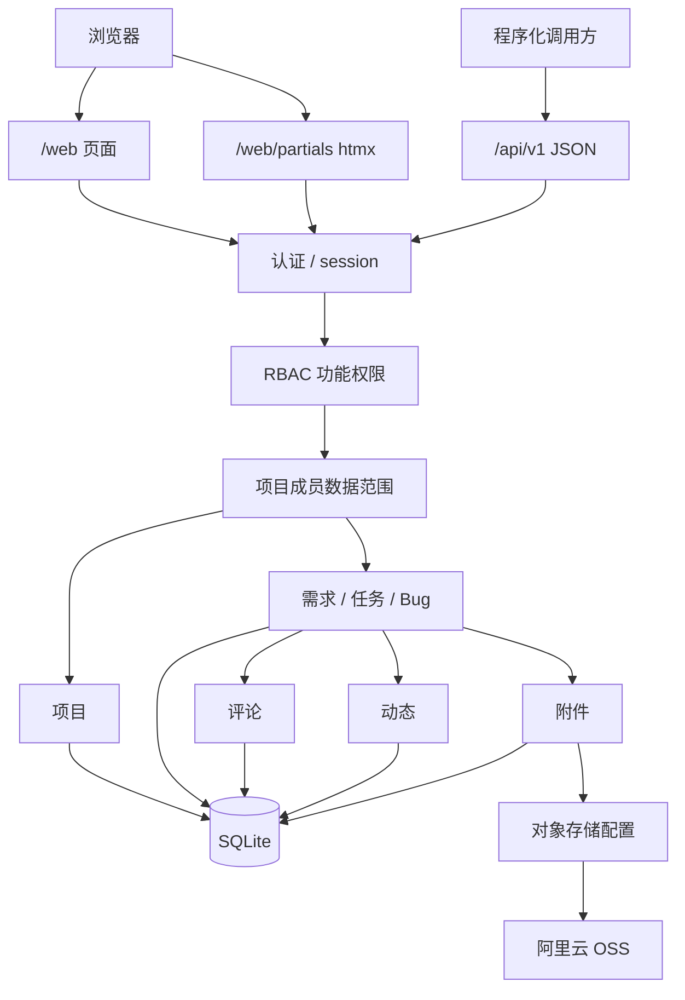
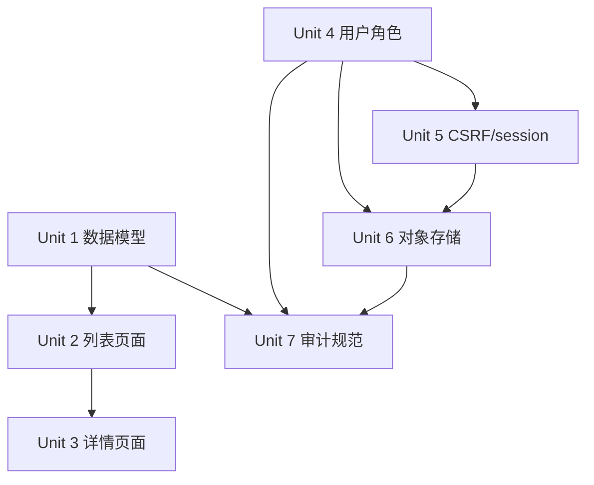

# feat: 设计元策 V1 完整版本

## Overview

元策 V1 是一个单体部署、服务端渲染、轻量 RBAC 驱动的企业项目管理系统。V1 不追求完整复刻禅道，而是先完成企业研发团队最常用的项目协作闭环：

- 登录、首次管理员初始化、开发测试本地超管 seed。
- 统一 `/web` 用户界面，系统管理作为权限菜单嵌入。
- 项目、项目成员、需求、任务、Bug、评论、动态。
- 我的工作台、项目列表、项目详情、工作项列表和详情。
- 系统管理：用户、角色、权限、对象存储、审计。
- `/api` JSON 接口边界，供后续外部集成或程序化调用。
- SQLite 主存储，进程内缓存，不引入 Redis。
- 阿里云 OSS 对象存储配置、探测、签名上传和签名下载底座。

当前仓库已经完成第一阶段架构初始化：`api` crate、Axum 路由、Askama 模板、静态资源嵌入、SQLite 迁移、RBAC core seed、local-admin seed、首次管理员初始化和登录。此计划从当前状态继续设计完整 V1 的剩余系统。

## Problem Frame

元策需要从“可启动的技术骨架”推进到“可用的 V1 产品”。关键不是一次堆满所有高级功能，而是形成可靠的数据模型、页面流和权限边界，让后续功能可以持续增量扩展。

V1 的产品重心是项目协作。系统管理只服务于项目协作的运行：账号、角色、对象存储、审计和基础设置。所有页面都走 `/web`，所有程序化接口都走 `/api`，htmx partial 仍归属 `/web`。

## Requirements Trace

- R1. 项目中心：V1 以项目组织需求、任务、Bug、成员、动态和文件。
- R2. 页面范围：V1 覆盖登录、工作台、项目列表、项目详情、需求、任务、Bug、我的。
- R3-R4. 系统管理：嵌入 `/web/system/*`，由轻量 RBAC 控制菜单、页面和操作。
- R5-R9. 路由边界：`/` 跳 `/web`，无独立 `/admin`，`/api` 只返回 JSON，htmx partial 在 `/web`。
- R10-R12. 部署形态：当前只保留 `api` 模块，Rust 单体服务，页面资源打包进二进制。
- R13-R15. 存储与缓存：SQLite 为唯一真实数据源，内存缓存只做旁路优化，不引入 Redis。
- R16-R19. 对象存储：`/web/system/storage` 维护阿里云 OSS 配置，敏感值加密入库，不明文进入日志和页面。
- R20. 首次初始化：当前已实现一次性首个系统管理员初始化，后续需补 CSRF、审计和更完整错误显示。
- R21. 开发测试 seed：当前已实现 local-admin 环境 guard，后续 demo seed 应复用该边界。

## Scope Boundaries

- V1 不做测试用例、测试计划、发布管理、甘特图、燃尽图、知识库和 DevOps 集成。
- V1 不做复杂数据权限矩阵；项目数据范围由项目成员关系控制，系统功能入口由 RBAC 控制。
- V1 不做多租户、多 portal、多后台用户体系或外部 IAM。
- V1 不做 Redis、MQ、分布式锁、多实例一致性或微服务拆分。
- V1 不做独立前端工程，不引入 React / Vue / Tailwind / Ant Design。
- V1 对象存储只接阿里云 OSS；其他供应商留到后续。
- V1 文件上传先建设统一底座和最小业务入口，不强求所有业务附件场景一次完成。
- V1 API 先服务内部和基础外部调用，不承诺公开开放平台稳定协议。

## Context & Research

### Relevant Code and Patterns

- `api/src/app/*`：CLI 子命令和启动编排。
- `api/src/platform/db.rs`：SQLite pool、WAL、SQLx migrator。
- `api/src/domains/auth.rs`：Argon2 密码、session cookie、登录校验。
- `api/src/domains/bootstrap.rs`：首次初始化状态和首个超管创建。
- `api/src/domains/rbac.rs`：系统角色、权限点、角色授权 seed。
- `api/src/web/router.rs`：`/web`、`/api`、静态资源路由。
- `api/src/web/user/mod.rs`：当前 dashboard、login、bootstrap、system storage 页面 handler。
- `api/templates/layouts/web.html`：统一 Web shell，系统管理菜单按 view model 控制。
- `api/static/app.css`：高密度研发工作台视觉语言。
- `api/tests/bootstrap_flow.rs`：bootstrap、登录、RBAC 和系统页权限集成测试。
- `api/migrations/202606260001_create_core_tables.sql`：用户、RBAC、session、审计、对象存储配置初始表。

### Institutional Learnings

- 当前仓库没有 `docs/solutions/` 经验沉淀文件，暂无可复用本地历史经验。
- 参考项目 qfy-sc 的规范已经进入 `docs/plans/2026-06-26-001-feat-api-module-architecture-plan.md`：迁移显式执行、seed 环境边界、SQL / repository 分层、页面密度、敏感配置治理。

### External References

- Axum：继续使用 Router state、extractor、response 组合实现 `/web` 和 `/api` 分区。
- Askama：继续保持模板编译期检查和 HTML 自动转义。
- SQLx SQLite：继续使用显式 migration、连接池、事务和 raw SQL，不引入 ORM。
- Argon2：继续使用 PHC 字符串存储密码 hash。

## Key Technical Decisions

- **统一工作项模型**：需求、任务、Bug 共用 `work_items` 表，通过 `item_type` 区分。这样 V1 可以复用列表、筛选、评论、动态、附件、权限和“我的工作台”逻辑。
- **项目成员关系控制数据范围**：RBAC 只管功能权限，例如 `project.manage`、`work_item.manage`；项目内查看和操作还要检查 `project_members`。
- **系统角色保持少量内置**：V1 内置 `system_admin`、`member`，后续可以通过系统管理页创建自定义角色。
- **页面优先服务端渲染**：完整页面用 Askama layout，列表筛选、状态流转、评论、详情抽屉用 htmx partial。
- **列表统一服务端分页**：项目、工作项、用户、角色、审计都使用稳定排序和 count 查询；V1 第一批页面可先落 20 条默认分页，再补 page_size。
- **审计作为跨领域基础能力**：登录、初始化、用户启停、角色授权、对象存储配置、工作项关键状态流转都写 `audit_logs` 或业务活动日志。
- **对象存储配置版本化**：`storage_configs` 保存 provider、endpoint、bucket、密钥密文、状态和版本；激活配置只有一份，保存前支持探测。
- **上传不暴露长期密钥**：浏览器只拿短期签名 URL 或通过服务端转发，AccessKey Secret 只加密入库。
- **API 与 htmx 分离**：`/api/v1/*` 返回 JSON envelope；`/web/partials/*` 返回 HTML 片段。

## Open Questions

### Resolved During Planning

- V1 是否拆成产品、项目、测试三中心：否。采用项目中心模型，降低 MVP 复杂度。
- 需求、任务、Bug 是否三套独立表：否。统一 `work_items`，减少重复和后续跨类型看板复杂度。
- 项目权限是否完全放 RBAC：否。RBAC 管功能入口，项目成员关系管数据范围。
- V1 是否需要独立 admin：否。延续统一 `/web`。
- V1 是否要接多个对象存储：否。只接阿里云 OSS。

### Deferred to Implementation

- 工作项状态值最终文案和状态流转按钮顺序：需要页面实现时根据交互体验微调。
- 项目详情页是否第一版显示看板列还是三类列表 tab：实现时优先选择低复杂度方案。
- 对象存储签名采用 OpenDAL presign 还是阿里云 OSS/S3 签名 crate：实现时按实际 crate 能力验证。
- 内存缓存是否先只缓存 session / permission snapshot：实现时根据代码复杂度决定，不强行提前抽象。

## High-Level Technical Design

> This illustrates the intended approach and is directional guidance for review, not implementation specification. The implementing agent should treat it as context, not code to reproduce.



## Data Model V1

核心表按依赖关系分批迁移：

```text
users / roles / permissions / sessions / audit_logs
  已存在

projects
project_members
work_items
work_item_comments
project_activities
file_objects
file_attachments
system_settings
storage_configs / storage_config_versions
```

关键约束：

- `projects.project_key` 全局唯一，作为 URL 和列表展示编号。
- `work_items.item_key` 全局唯一，例如 `YCE-REQ-1`、`YCE-TASK-3`、`YCE-BUG-2`。
- `work_items.item_type` 限定 `requirement`、`task`、`bug`。
- `work_items.parent_work_item_id` 可表达“任务归属需求”。
- `project_members` 对 `(project_id, user_id)` 唯一。
- `file_objects` 记录对象存储 object key、hash、size、content type。
- `file_attachments` 把文件挂到项目、工作项或评论。
- 审计日志记录系统级操作，项目动态记录业务协作行为。

## Web IA and Interaction Model

### 主导航

```text
协作
  工作台
  项目
  需求
  任务
  Bug
  我的

系统管理
  总览
  用户管理
  角色权限
  对象存储
  审计日志
```

### 关键页面

- `/web`：工作台，显示项目统计、项目推进、当前用户待处理快捷入口、风险和最近动态；不再保留独立“我的工作项”区块。
- `/web/projects`：项目列表，支持状态、负责人、关键字筛选。
- `/web/projects/:id`：项目详情，显示概览、成员、需求、任务、Bug、动态、附件。
- `/web/requirements`：跨项目需求列表。
- `/web/tasks`：跨项目任务列表。
- `/web/bugs`：跨项目 Bug 列表。
- `/web/me`：个人资料、账号信息、我的项目和指派给我的工作项。
- `/web/system/users`：用户列表、启停、重置密码、角色绑定。
- `/web/system/roles`：角色列表、角色权限分配。
- `/web/system/storage`：阿里云 OSS 配置、探测、保存、激活。
- `/web/system/audit`：审计日志查询。

### htmx 交互

- 列表筛选：`hx-get` 刷新列表容器。
- 创建 / 编辑：modal 或 drawer partial。
- 状态流转：普通 POST / fetch 提交后返回完整页面或 Toast，不再依赖工作项局部 htmx partial。
- 删除 / 禁用：确认弹窗后局部刷新。
- 表单错误：Web 表单和弹窗拦截 JSON / HTML 错误并以 Toast 或局部错误区提示，避免直接跳转到 JSON。
- 成功跳转：使用 `HX-Redirect`。

## API V1 Surface

V1 API 初始保持内部可用，不承诺长期公开稳定：

```text
GET  /api/healthz
GET  /api/readyz
GET  /api/v1/bootstrap/status
POST /api/v1/bootstrap/init

GET  /api/v1/projects
POST /api/v1/projects
GET  /api/v1/projects/:id
PATCH /api/v1/projects/:id

GET  /api/v1/work-items
POST /api/v1/work-items
GET  /api/v1/work-items/:id
PATCH /api/v1/work-items/:id
POST /api/v1/work-items/:id/comments

GET  /api/v1/system/users
PATCH /api/v1/system/users/:id
GET  /api/v1/system/roles
PATCH /api/v1/system/roles/:id/permissions

GET  /api/v1/storage/config
POST /api/v1/storage/config/probe
PUT  /api/v1/storage/config
POST /api/v1/storage/upload-url
POST /api/v1/storage/download-url
```

## Implementation Units

- [x] **Unit 1: 项目与工作项数据模型**

**Goal:** 建立项目、项目成员、需求、任务、Bug、评论和动态的 SQLite 表，并提供 domain 查询能力。

**Requirements:** R1, R2, R13

**Dependencies:** 当前 core migration 和 RBAC seed。

**Files:**
- Create: `api/migrations/202606260002_create_project_management_tables.sql`
- Create: `api/src/domains/projects.rs`
- Modify: `api/src/domains/mod.rs`
- Modify: `api/src/app/seed.rs`
- Test: `api/tests/project_management_flow.rs`

**Approach:**
- 统一 `work_items` 表承载 requirement/task/bug。
- `project_members` 先支持 owner/maintainer/member/viewer。
- `seed demo` 写入本地演示项目和工作项，只允许 development/test/local。
- dashboard 和列表页逐步从 sample 切到 SQLite。

**Execution note:** Start with integration tests for migration + demo seed + dashboard query.

**Patterns to follow:**
- `api/src/domains/rbac.rs` 的幂等 seed 风格。
- `api/tests/bootstrap_flow.rs` 的真实 SQLite integration 测试。

**Test scenarios:**
- Happy path: 运行迁移后创建项目、成员和三类工作项，查询项目列表返回稳定排序结果。
- Happy path: `seed demo` 在开发环境写入演示项目和工作项，重复执行不重复插入。
- Edge case: 空库没有项目时 dashboard 返回零统计和空列表，不 panic。
- Integration: 登录用户带 session 访问 `/web/projects`，页面展示 SQLite 中的项目。

**Verification:**
- 项目、工作项和动态数据可以从 SQLite 读出并渲染到 `/web` 页面。

- [x] **Unit 2: 工作台、项目列表和工作项列表页面**

**Goal:** 把当前工作台样例数据替换为真实数据库数据，并补齐项目、需求、任务、Bug 列表页。

**Requirements:** R1, R2, R5-R9

**Dependencies:** Unit 1。

**Files:**
- Modify: `api/src/web/router.rs`
- Modify: `api/src/web/user/mod.rs`
- Create: `api/templates/web/projects.html`
- Create: `api/templates/web/work_items/list.html`
- Modify: `api/templates/web/dashboard.html`
- Modify: `api/static/app.css`
- Test: `api/tests/project_management_flow.rs`

**Approach:**
- `/web/projects` 使用项目列表模板。
- `/web/requirements`、`/web/tasks`、`/web/bugs` 复用工作项列表模板，只改 `item_type` 筛选。
- 工作台不再保留独立“我的工作项”partial；项目推进表直接展示当前用户在每个项目内的待处理快捷入口。

**Patterns to follow:**
- 当前 `api/templates/layouts/web.html` 的 shell。
- 当前 `api/templates/web/dashboard.html` 的 panel/table/list 风格。

**Test scenarios:**
- Happy path: 登录用户访问 `/web/projects` 看到 demo project。
- Happy path: 登录用户访问 `/web/tasks` 只看到 task 类型工作项。
- Error path: 未登录访问数据库模式下的 `/web/projects` 重定向 `/web/login`。
- Integration: htmx 请求 `/web/partials/work-items?kind=bug` 返回 Bug partial。

**Verification:**
- 四个列表页面可访问、可渲染真实数据、无独立前端构建链路。

- [x] **Unit 3: 项目详情与工作项详情**

**Goal:** 实现项目详情页和工作项详情抽屉，支持查看项目概览、成员、需求、任务、Bug、评论和动态。

**Requirements:** R1, R2

**Dependencies:** Unit 1, Unit 2。

**Files:**
- Modify: `api/src/web/router.rs`
- Create: `api/templates/web/projects/detail.html`
- Create: `api/templates/web/work_items/detail.html`
- Create: `api/templates/web/partials/work_item_detail.html`
- Modify: `api/src/domains/projects.rs`
- Test: `api/tests/project_management_flow.rs`

**Approach:**
- 项目详情第一版使用 tabs：概览、需求、任务、Bug、成员、动态。
- 工作项详情使用 drawer partial，避免页面跳转过多。
- 评论第一版只做新增和列表展示。

**Test scenarios:**
- Happy path: 打开项目详情能看到项目基本信息和三类工作项数量。
- Happy path: 打开工作项详情 partial 能看到标题、状态、负责人和评论。
- Error path: 访问不存在项目返回 404。
- Permission path: 非项目成员访问项目详情返回 403。

**Verification:**
- 项目详情可以作为团队日常入口，不再只有全局列表。

- [x] **Unit 4: 系统用户、角色和权限管理**

**Goal:** 补齐 `/web/system/users`、`/web/system/roles` 和权限分配页面。

**Requirements:** R3, R4

**Dependencies:** 当前 RBAC core 表和 system page guard。

**Files:**
- Create: `api/src/domains/users.rs`
- Expand: `api/src/domains/rbac.rs`
- Modify: `api/src/web/router.rs`
- Create: `api/templates/web/system/users.html`
- Create: `api/templates/web/system/roles.html`
- Create: `api/templates/web/system/permissions.html`
- Test: `api/tests/system_management_flow.rs`

**Approach:**
- 用户管理先支持列表、创建、启停、重置密码、绑定角色。
- 角色管理先支持列表、创建普通角色、启停、分配权限。
- 系统角色不可删除。
- 权限点只由 core seed 管理，页面不允许新建 permission key。

**Test scenarios:**
- Happy path: 超管创建用户并绑定 member 角色。
- Happy path: 超管创建自定义角色并分配 `project.view`。
- Error path: 普通成员访问系统用户页返回 403。
- Edge case: 禁用用户后其 session 不再可用。
- Integration: 角色权限更新后新登录 session 反映新权限。

**Verification:**
- 系统管理可以闭环维护账号和角色，不需要手动改库。

- [x] **Unit 5: CSRF、退出登录和 session 生命周期**

**Goal:** 补齐 Web 表单 CSRF、防止跨站请求、支持退出登录和 session 失效。

**Requirements:** R3, R20

**Dependencies:** 当前 auth/session。

**Files:**
- Create: `api/src/platform/security/csrf.rs`
- Modify: `api/src/domains/auth.rs`
- Modify: `api/src/web/router.rs`
- Modify: `api/src/web/user/mod.rs`
- Modify: `api/templates/layouts/web.html`
- Modify: `api/templates/layouts/auth.html`
- Test: `api/tests/auth_security_flow.rs`

**Approach:**
- 登录、bootstrap 和所有写操作表单都带 CSRF token。
- htmx 请求通过 header 携带 token。
- logout revoke 当前 session 并清除 cookie。
- 账号禁用和密码重置使相关 session 失效。

**Test scenarios:**
- Happy path: 携带有效 CSRF 的登录和 bootstrap 正常成功。
- Error path: 缺失 CSRF 的 POST 返回 403。
- Happy path: logout 后旧 cookie 访问 `/web` 跳转登录。
- Integration: 禁用用户后其旧 session 访问系统返回未登录或 403。

**Verification:**
- Web 写操作具备基础 CSRF 防护，session 生命周期可控。

- [x] **Unit 6: 对象存储配置和文件底座**

**Goal:** 实现阿里云 OSS 配置加密入库、探测、激活和文件对象元数据。

**Requirements:** R16-R19

**Dependencies:** Unit 4 的系统管理权限，Unit 5 的 CSRF。

**Files:**
- Create: `api/src/platform/crypto.rs`
- Create: `api/src/domains/storage.rs`
- Create: `api/src/domains/files.rs`
- Modify: `api/migrations/*`
- Modify: `api/src/web/router.rs`
- Modify: `api/templates/web/system/storage.html`
- Test: `api/tests/storage_config_flow.rs`

**Approach:**
- 使用 `YUANCE_SECURITY_MASTER_KEY` 派生加密密钥，加密 AccessKey Secret。
- 页面展示 endpoint、region、bucket、AccessKey ID hint，不回显 secret 明文。
- 探测功能不落库或只写审计，不泄露 secret。
- 文件上传第一版先支持生成 object key 和保存元数据，业务挂载后续接入。

**Test scenarios:**
- Happy path: 超管保存 OSS 配置后 DB 中 secret 字段不是明文。
- Error path: 普通成员保存配置返回 403。
- Error path: 缺失 endpoint/bucket 返回表单错误。
- Integration: 激活配置后生成上传签名或 mock 签名响应。

**Verification:**
- 对象存储配置可通过页面维护，敏感值不会明文展示或写入日志。

- [x] **Unit 7: 审计、活动和运行规范**

**Goal:** 完成系统审计页、项目活动页、迁移/seed/runbook 和项目标准文档。

**Requirements:** R17-R19

**Dependencies:** Unit 1-6。

**Files:**
- Create: `api/src/domains/audit.rs`
- Modify: `api/src/domains/projects.rs`
- Create: `api/templates/web/system/audit.html`
- Create: `docs/runbooks/api-migrations.md`
- Create: `docs/standards/sql-repository-convention.md`
- Create: `docs/standards/web-ui-density.md`
- Create: `docs/standards/provider-runtime-config.md`
- Test: `api/tests/audit_flow.rs`

**Approach:**
- 系统审计记录账号、权限、对象存储、登录等管理操作。
- 项目活动记录业务协作事件，例如创建工作项、状态变更、评论。
- 同步参考项目规范但全部改写为元策 Rust + SQLite + htmx 版本。

**Test scenarios:**
- Happy path: bootstrap、登录、对象存储保存写入审计日志。
- Happy path: 创建工作项写入项目活动。
- Error path: 非系统管理员访问审计页返回 403。
- Documentation: runbook 覆盖 migrate up/status、seed core/demo/local-admin 和生产禁用默认账号。

**Verification:**
- 关键操作可追溯，团队后续开发有明确规范文档。

## Completion Evidence

当前 V1 完整设计计划已落地，状态于 2026-07-13 收敛为 `completed`。关键证据：

- 项目与工作项数据模型：`api/migrations/202606260002_create_project_management_tables.sql`、`api/src/domains/projects.rs` 和 `api/tests/project_management_flow.rs` 已覆盖项目、成员、需求、任务、Bug、评论和活动。
- 工作台、项目列表和工作项列表：`api/templates/web/dashboard.html`、`api/templates/web/projects.html`、`api/templates/web/work_items/list.html`、`api/templates/web/partials/work_item_table.html` 已落地真实数据、筛选、统计、分页和创建入口。
- 项目详情与工作项详情：`api/templates/web/projects/detail.html`、`api/templates/web/work_items/detail.html`、`api/templates/web/partials/work_item_detail.html` 已覆盖概览、成员、需求/任务/Bug、动态、附件、讨论、回复和流转。
- 系统用户、角色和权限管理：`api/src/domains/users.rs`、`api/src/domains/rbac.rs`、`api/templates/web/system/users.html`、`api/templates/web/system/roles.html`、`api/templates/web/system/permissions.html`、`api/tests/system_management_flow.rs` 已覆盖页面、权限树、角色授权和会话失效。
- CSRF、退出登录和 session 生命周期：`api/src/platform/security/csrf.rs`、`api/src/domains/auth.rs`、`api/src/web/user/mod.rs`、`api/tests/auth_security_flow.rs`、`api/tests/bootstrap_flow.rs` 已覆盖 Web/API 登录、退出、初始化和写操作保护。
- 对象存储配置和文件底座：`api/src/domains/storage.rs`、`api/src/domains/files.rs`、`api/templates/web/system/storage.html`、`docs/runbooks/aliyun-oss-manual-validation.md`、`docs/runbooks/file-maintenance.md` 已覆盖配置、探测、版本、签名上传/下载、项目/工作项/评论附件和文件夹。
- 审计、活动和运行规范：`api/src/domains/audit.rs`、`api/templates/web/system/audit.html`、`api/tests/audit_flow.rs`、`docs/runbooks/api-migrations.md`、`docs/standards/*` 已覆盖关键系统操作审计、项目活动和运行规范。
- 后续用户提出的 V1 增强也已合入独立完成计划：当前项目上下文、文件上传预览、统一 UI 控件、工作项讨论/右侧操作面板、指派通知、项目个人分析等见 `docs/plans/2026-06-29-*`、`2026-07-09-*`、`2026-07-10-*`、`2026-07-11-*` 的 `completed` 计划。

## Implementation Dependency Graph



## System-Wide Impact

- **Interaction graph:** `/web` pages、`/web/partials`、`/api/v1` 都依赖 auth/session；系统管理还依赖 RBAC；项目数据还依赖 project membership。
- **Error propagation:** Web 页面未登录优先重定向登录；API 未登录返回 401；无权限统一返回 403；htmx 表单错误返回 partial 和合适状态码。
- **State lifecycle risks:** 用户启停、密码重置、角色权限变化必须让 session / permission snapshot 失效；对象存储配置变更必须避免旧 secret 泄露。
- **Data integrity risks:** 工作项状态流转、评论、附件和动态需要事务保证，不允许业务记录成功但活动/审计缺失。
- **API surface parity:** 重要写操作如项目创建、工作项创建、对象存储配置应在 Web 和 API 中复用同一 domain service，不分叉业务规则。
- **Integration coverage:** 需要覆盖从 HTTP request 到 DB 到 template/render 的集成测试，不能只测 service。
- **Unchanged invariants:** 不引入 `/admin`、不引入 Redis、不新增前端构建链路、不把 htmx partial 放进 `/api`。

## Risks & Dependencies

| Risk | Mitigation |
|------|------------|
| V1 范围膨胀导致迟迟不可用 | 以项目/工作项闭环优先，系统管理和对象存储按最小可用切片推进 |
| 权限只隐藏菜单但接口未拦截 | 所有系统页和写操作在 handler/service 层校验权限，测试覆盖普通成员直接访问 |
| SQLite 表结构早期设计不足 | 使用迁移增量演进，V1 避免过度范式化，但保留外键、唯一约束和稳定索引 |
| htmx redirect 和普通 form redirect 行为不同 | 所有写操作明确区分 `HX-Request` 和普通表单响应 |
| OSS 密钥泄露 | 加密入库、页面不回显、日志不打印、测试验证密文不等于明文 |
| Serve 不自动迁移导致本地误用 | README 和 runbook 明确先 `migrate up`，开发 seed 可自动执行迁移但生产发布仍显式迁移 |

## Documentation / Operational Notes

- README 保持最小启动路径：复制 env、执行 migration、启动服务。
- `docs/runbooks/api-migrations.md` 需要说明生产迁移、回滚策略、备份和 migration guard。
- `docs/standards/*` 需要沉淀 SQL/repository、UI 密度、配置治理和敏感信息规则。
- 每个涉及持久数据的实现单元都需要 integration test。
- 生产部署必须确认：
  - `YUANCE_ENV=production`
  - `YUANCE_SECURITY_MASTER_KEY` 为稳定强随机值
  - `seed local-admin` 执行失败
  - SQLite 数据目录可备份

## Sources & References

- Origin document: `docs/brainstorms/yuance-mvp-requirements.md`
- Architecture plan: `docs/plans/2026-06-26-001-feat-api-module-architecture-plan.md`
- Current auth/bootstrap tests: `api/tests/bootstrap_flow.rs`
- Current router: `api/src/web/router.rs`
- Current RBAC seed: `api/src/domains/rbac.rs`
- Current migration: `api/migrations/202606260001_create_core_tables.sql`
