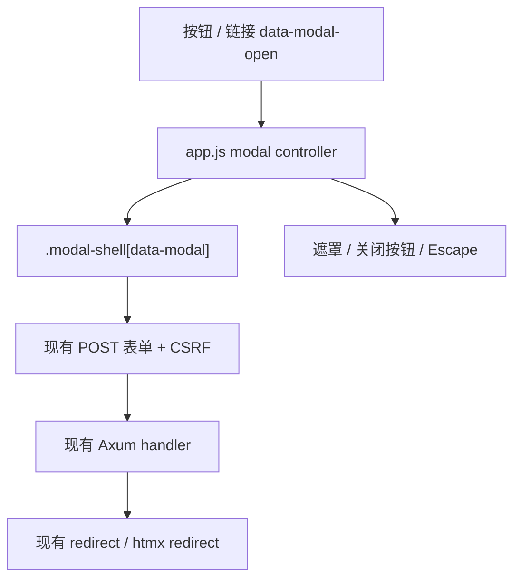

# feat: 全站操作表单弹窗化

## Overview

将 `/web` 内“创建、编辑、配置、重置、添加、登记附件”等动作从页面内表单块收敛为统一弹窗交互。当前页面已经具备完整业务闭环，但多处操作表单直接占据页面主区域或侧栏，导致列表页和详情页密度下降，尤其是角色创建、用户创建、项目创建、工作项创建/编辑、成员添加、附件登记和对象存储配置。

本计划只改变 Web 交互呈现方式，不改变业务路由、权限模型、CSRF、SQLite 持久化和 domain 校验。

## Problem Frame

元策是服务端渲染 + htmx + 少量原生 JS 的单体系统。用户希望“创建或修改等动作要有弹窗风格，封装弹窗组件，不要用页面上的页面块”。这符合 MVP 的企业管理系统密度要求：页面主要区域应优先展示列表、详情和上下文信息，动作表单应按需打开。

该要求延续了 MVP 对统一 `/web`、轻量 RBAC、服务端模板和内置系统管理的边界约定（见 origin: `docs/brainstorms/yuance-mvp-requirements.md`）。

## Requirements Trace

- R1. 所有创建、编辑、配置、重置、添加、登记附件等业务动作使用统一弹窗组件承载，默认不再以页面内大块表单常驻展示。
- R2. 弹窗组件封装在共享 layout / 静态资源中，不能每个页面各写一套弹窗结构和 JS。
- R3. 表单提交继续使用现有 POST 路由、CSRF 字段和服务端重定向，不引入 SPA 状态管理。
- R4. 普通列表筛选、搜索、登录、首次初始化、权限树保存等“页面主任务”可保留页面内表单，不强制弹窗化。
- R5. 弹窗交互需要支持键盘关闭、遮罩关闭、焦点管理、过渡动画和 `prefers-reduced-motion`。
- R6. 改造后必须保持现有权限可见性：没有管理权限的用户不能看到对应弹窗触发器，也不能通过弹窗绕过路由权限。

## Scope Boundaries

- 不改 API JSON 合约。
- 不改 domain 层校验、权限校验和数据库结构。
- 不做 React/Vue/前后端分离弹窗系统。
- 不引入第三方弹窗库。
- 不强制把所有 GET 查询筛选表单改为弹窗。
- 不在本轮实现真正 OSS 签名上传；附件登记仍按现有最小入口。

## Context & Research

### Relevant Code and Patterns

- `api/templates/layouts/web.html`：统一 Web layout，是放置全局弹窗基础结构或约定的合适位置。
- `api/static/app.js`：已有 dropdown、drawer、CSRF header、权限树同步和页面跳转过渡逻辑，可扩展为统一 dialog/modal 控制器。
- `api/static/app.css`：已有 drawer 样式、panel/form 样式、页面过渡和顶部菜单动画，可复用视觉语言实现 modal。
- `api/templates/web/system/roles.html`：角色创建表单目前在左侧角色列表下方常驻，是用户明确点名的问题。
- `api/templates/web/system/users.html`：用户创建是右侧常驻面板；角色维护和重置密码使用 `details.action-menu` 浮层，应该统一为弹窗。
- `api/templates/web/projects.html`：新建项目通过锚点跳转到页面底部表单。
- `api/templates/web/projects/detail.html`：项目内新建工作项、成员添加、项目附件登记都在页面内常驻。
- `api/templates/web/work_items/list.html`：跨项目新建需求/任务/Bug 表单在列表页底部常驻。
- `api/templates/web/work_items/detail.html`：编辑工作项、附件登记、新增评论都在主内容中常驻。
- `api/templates/web/system/storage.html`：对象存储配置是页面主任务，是否弹窗化需要按“配置页主任务”权衡。

### Institutional Learnings

- `docs/standards/web-ui-density.md`：系统管理页面应保持高密度、列表优先、说明简洁；弹窗化可以减少常驻表单占用。
- `docs/plans/2026-06-28-001-feat-yuance-v1-product-blueprint.md`：当前 V1 闭环已完成，下一步应优化交互质量而非扩张功能范围。

### External References

- 未使用外部资料。该改造基于现有服务端模板、原生 JS 和 CSS 模式即可完成。

## Current Function Inventory

### 必须弹窗化

- 角色权限页 `api/templates/web/system/roles.html`
  - 创建角色：从左侧常驻 `role-create-form` 改为“新建角色”按钮打开弹窗。
  - 启用 / 禁用角色：可保留行内小按钮，但建议加确认弹窗或轻量确认流程，避免误操作。
- 用户管理页 `api/templates/web/system/users.html`
  - 创建用户：从右侧常驻创建面板改为“创建用户”弹窗。
  - 修改用户角色：从 `details.action-menu` 改为“调整角色”弹窗。
  - 重置密码：从 `details.action-menu` 改为“重置密码”弹窗。
  - 启用 / 禁用用户：建议确认弹窗。
- 项目列表页 `api/templates/web/projects.html`
  - 新建项目：从页面底部表单改为弹窗。
  - 导入：当前只是锚点指向创建表单，应先禁用或作为后续导入弹窗入口，避免误导。
- 项目详情页 `api/templates/web/projects/detail.html`
  - 新建工作项：从主内容底部表单改为弹窗。
  - 添加项目成员：从侧栏常驻表单改为“添加成员”弹窗。
  - 移除项目成员：建议确认弹窗。
  - 登记项目附件：从侧栏常驻表单改为“登记附件”弹窗。
- 工作项列表页 `api/templates/web/work_items/list.html`
  - 新建需求 / 新建任务 / 新建 Bug：从页面底部表单改为弹窗。
- 工作项详情页 `api/templates/web/work_items/detail.html`
  - 编辑工作项：从主内容常驻表单改为“编辑”弹窗。
  - 登记工作项附件：从主内容常驻表单改为“登记附件”弹窗。
  - 新增评论：建议改为弹窗或折叠式 composer；按用户“创建/修改等等”要求，第一版可以弹窗化以保持一致。

### 可保留页面内

- 登录页 `api/templates/web/login.html`
  - 登录是页面主任务，保留页面内表单。
- 首次初始化页 `api/templates/web/bootstrap.html`
  - 创建首个管理员是页面主任务，保留页面内表单。
- 搜索页 `api/templates/web/search.html`
  - 搜索是页面主任务，保留页面内表单。
- 工作项列表筛选 `api/templates/web/work_items/list.html`
  - GET 筛选是列表主控件，保留页面内。
- 权限树保存 `api/templates/web/system/roles.html` / `api/templates/web/system/permissions.html`
  - 权限树本身是页面主任务，保留页面内编辑和保存，不弹窗化。
- 状态快捷流转 `api/templates/web/work_items/detail.html`
  - “开始处理”“标记完成”是详情页高频快捷动作，可保留行内按钮；后续如需确认再统一接入 confirm modal。

### 需要产品判断后再处理

- 对象存储配置 `api/templates/web/system/storage.html`
  - 它是对象存储页的唯一主任务。若完全弹窗化，页面会只剩当前配置和说明；这符合“配置操作按需打开”的方向，但也可能让配置页显得空。建议第一阶段先将配置表单改为“编辑配置”弹窗，页面主体展示当前配置、风险边界和操作按钮。
- Dashboard 的“导入 / 新建项目”按钮 `api/templates/web/dashboard.html`
  - 当前按钮无实际提交能力。建议接入同一个新建项目弹窗，导入先禁用或后续独立弹窗。

## Key Technical Decisions

- 使用“模板内 modal 容器 + data 属性触发”的方式封装组件。
  - 现有页面是 Askama 服务端渲染，表单内容通常需要当前页面上下文（项目、角色、用户、CSRF、选项列表）。把每个表单内容放入对应页面模板的 modal 容器最直接，统一结构和 JS/CSS 由共享组件负责。
- 第一版不引入 htmx 远程加载 modal。
  - 远程 partial 能减少 HTML 初始体积，但会增加新路由、局部模板和错误处理复杂度。当前页面规模可接受，优先稳定迁移。
- 保留现有 POST action。
  - 服务端 handler、CSRF、权限和测试都已稳定，弹窗化只调整触发和呈现，不改变提交语义。
- 使用原生 `<dialog>` 还是自定义 `div role="dialog"`：建议使用自定义 modal。
  - 现有 drawer 已是自定义实现；自定义 modal 更易复用现有动画、遮罩、z-index 和关闭逻辑，也避免 `<dialog>` 在不同浏览器上的默认样式差异。
- 弹窗关闭不自动清空表单。
  - 用户误关后重新打开应保留已输入内容；页面刷新或提交成功后由服务端重新渲染。

## Open Questions

### Resolved During Planning

- 是否所有表单都强制弹窗化：否。登录、初始化、搜索、列表筛选、权限树保存属于页面主任务或主控件，保留页面内。
- 是否改后端路由：否。第一版不改 POST 路由，不新增 JSON 接口。

### Deferred to Implementation

- 表单提交失败后的错误回显位置：当前多数 POST 通过 redirect 或错误响应处理。实现时需要逐个确认失败路径，决定是否继续整页错误，或引入 modal 内错误提示。
- `autofocus` 精确落点：实现时根据每个弹窗第一个可编辑字段设置。
- Dashboard 的新建项目按钮接入：需要确认是否复用项目创建 modal，或保持当前非功能按钮先隐藏。

## High-Level Technical Design

> *This illustrates the intended approach and is directional guidance for review, not implementation specification. The implementing agent should treat it as context, not code to reproduce.*

## Implementation Units

- [x] **Unit 1: 建立统一 Modal 组件基础**

**Goal:** 提供全站统一弹窗结构、样式和控制逻辑。

**Requirements:** R1, R2, R5

**Dependencies:** None

**Files:**
- Modify: `api/static/app.css`
- Modify: `api/static/app.js`
- Modify: `api/templates/layouts/web.html`
- Test: `api/tests/routing_smoke.rs` 或相关页面渲染测试

**Approach:**
- 在 CSS 中新增 `.modal`、`.modal-backdrop`、`.modal-panel`、`.modal-head`、`.modal-body`、`.modal-actions` 等共享样式。
- 在 JS 中新增 `data-modal-open`、`data-modal-close`、`data-modal` 控制器。
- 支持点击遮罩关闭、Escape 关闭、打开时记录并恢复触发元素焦点。
- 打开 modal 时关闭 dropdown/drawer，避免层叠交互冲突。
- 保留现有 drawer，用于风险详情等“侧边详情”场景；modal 用于操作表单。

**Patterns to follow:**
- `api/static/app.js` 现有 drawer 控制器。
- `api/static/app.css` 现有 `.drawer`、`.panel`、`.field-grid`、`.form-actions`。

**Test scenarios:**
- Happy path: 页面包含 `data-modal-open` 和对应 `data-modal` 时，点击触发器后弹窗变为可见。
- Edge case: 按 Escape 时，打开的 modal 被关闭，drawer/dropdown 也不残留打开态。
- Accessibility: modal 元素具备 `role="dialog"`、`aria-modal="true"` 和标题关联。

**Verification:**
- 任意一个示例页面能打开和关闭弹窗，视觉与现有设计系统一致。

- [x] **Unit 2: 系统管理动作弹窗化**

**Goal:** 先解决用户明确点名的角色创建问题，并统一用户管理的创建/维护动作。

**Requirements:** R1, R2, R3, R6

**Dependencies:** Unit 1

**Files:**
- Modify: `api/templates/web/system/roles.html`
- Modify: `api/templates/web/system/users.html`
- Modify: `api/templates/web/system/storage.html`
- Test: `api/tests/system_management_flow.rs`
- Test: `api/tests/storage_config_flow.rs`

**Approach:**
- `roles.html`：左侧角色列表 header 增加“新建角色”按钮；将创建角色表单移动到 modal。
- `users.html`：页面 header 或列表 header 增加“创建用户”按钮；将创建用户表单移动到 modal。
- `users.html`：替换 `details.action-menu` 为每行“调整角色”“重置密码”两个 modal 触发器，表单放入对应用户的 modal。
- `roles.html` / `users.html`：启用、禁用等高风险状态切换可先保留行内按钮；如时间允许接入确认 modal。
- `storage.html`：建议把对象存储配置表单迁移到“编辑配置”modal，主页面保留当前配置和配置边界。

**Patterns to follow:**
- 现有权限判断 `` 等条件必须包住触发器和 modal 内容。
- 现有 POST action 和隐藏 `_csrf` 字段不变。

**Test scenarios:**
- Happy path: 管理员访问角色页能看到“新建角色”触发器和 modal 表单字段，不再看到常驻 `role-create-form` 页面块。
- Happy path: 管理员访问用户页能看到“创建用户”触发器，创建用户表单在 modal 中。
- Permission path: 普通成员访问系统页仍被拒绝；无权限用户不应看到管理 modal 触发器。
- Regression: 角色创建、用户创建、角色绑定、重置密码、对象存储保存现有 POST 流程测试继续通过。

**Verification:**
- 角色创建不再占用左侧列表底部空间。
- 用户管理页面主体以列表为主，维护动作按需弹出。

- [x] **Unit 3: 项目和工作项创建弹窗化**

**Goal:** 将项目、项目内工作项、跨项目工作项创建从页面底部表单改为弹窗。

**Requirements:** R1, R2, R3

**Dependencies:** Unit 1

**Files:**
- Modify: `api/templates/web/projects.html`
- Modify: `api/templates/web/projects/detail.html`
- Modify: `api/templates/web/work_items/list.html`
- Modify: `api/templates/web/dashboard.html`
- Test: `api/tests/project_management_flow.rs`

**Approach:**
- `projects.html`：新建项目按钮打开 modal；删除底部常驻 `project-create-form` panel。
- `projects/detail.html`：新建工作项按钮打开 modal；保留 hidden `project_key` 和 `redirect_to=project`。
- `work_items/list.html`：新建需求/任务/Bug 按钮打开 modal；保留类型和项目选择逻辑。
- `dashboard.html`：新建项目按钮可接入同一项目创建 modal；“导入”若未实现应禁用或隐藏，避免跳向不存在流程。

**Patterns to follow:**
- 现有 `projects_create` 和 `work_items_create` handler 不改。
- 表单字段和 select options 复用当前模板上下文。

**Test scenarios:**
- Happy path: 项目列表页不再渲染页面内 `id="project-create-form"` 大块表单，而渲染 modal 内项目创建表单。
- Happy path: 项目详情页点击“新建工作项”打开 modal，提交仍回到当前项目详情。
- Happy path: 需求/任务/Bug 列表页点击对应新建按钮打开 modal，提交后列表出现新增项。
- Error path: 无项目可选时，工作项创建 modal 内 select 仍表达“暂无可选项目”，不能提交无效项目绕过后端校验。

**Verification:**
- 项目和工作项列表首屏不再被创建表单拉长。
- 现有项目/工作项创建测试继续通过。

- [x] **Unit 4: 详情页编辑、成员、附件和评论弹窗化**

**Goal:** 清理项目详情和工作项详情的常驻操作表单，让详情页面回归信息浏览。

**Requirements:** R1, R2, R3

**Dependencies:** Unit 1

**Files:**
- Modify: `api/templates/web/projects/detail.html`
- Modify: `api/templates/web/work_items/detail.html`
- Test: `api/tests/project_management_flow.rs`

**Approach:**
- 工作项详情：新增“编辑工作项”按钮打开编辑 modal；移除主内容常驻编辑 panel。
- 工作项详情：附件登记改为“登记附件”modal。
- 工作项详情：新增评论改为“新增评论”modal，或折叠式 composer；第一版按用户要求使用 modal。
- 项目详情：添加成员、登记附件改为 modal；成员移除可加确认 modal 或保留行内按钮。

**Patterns to follow:**
- 现有 `work_item_update`、`work_item_attachment_create`、`work_item_comment_create`、`project_member_add`、`project_attachment_create` POST action 不变。
- 详情页字段展示仍使用 `web/partials/work_item_detail.html`。

**Test scenarios:**
- Happy path: 工作项详情页包含“编辑工作项”触发器，编辑表单在 modal 中，提交后字段更新。
- Happy path: 评论 modal 提交后详情页出现评论。
- Happy path: 项目详情页添加成员 modal 提交后成员列表出现新成员。
- Permission path: 非项目成员仍不能访问或操作项目详情动作。

**Verification:**
- 工作项详情首屏优先展示详情、字段和动态，不再默认展开完整编辑表单。

- [x] **Unit 5: 视觉验证与行为回归**

**Goal:** 确保弹窗组件视觉、可访问性和现有业务闭环稳定。

**Requirements:** R5, R6

**Dependencies:** Unit 2, Unit 3, Unit 4

**Files:**
- Modify: `api/tests/bootstrap_flow.rs`
- Modify: `api/tests/system_management_flow.rs`
- Modify: `api/tests/project_management_flow.rs`
- Modify: `api/tests/storage_config_flow.rs`

**Approach:**
- 更新 HTML 断言：原本断言页面内表单标题的位置，需要改为断言 modal 触发器和 modal 内容。
- 使用浏览器验证至少覆盖：
  - 角色创建 modal。
  - 用户创建 / 重置密码 modal。
  - 项目创建 modal。
  - 工作项编辑 modal。
- 检查移动端断点，modal 宽度应在窄屏接近全宽且不溢出。

**Patterns to follow:**
- 当前项目已经使用 agent-browser 做 UI 验证，继续沿用。

**Test scenarios:**
- Integration: 全量 `cargo test -p yuance-api` 通过。
- Accessibility: Escape / 遮罩 / 关闭按钮均能关闭 modal。
- Regression: 页面跳转动画、顶部下拉、drawer 不被 modal 控制器破坏。

**Verification:**
- 关键页面截图确认无明显布局破损。

## System-Wide Impact

- **Interaction graph:** 触发器按钮 -> JS modal controller -> modal 表单 -> 现有 POST handler -> redirect 后整页重渲染。
- **Error propagation:** 现有服务端错误处理保持不变；如果后续要在 modal 内局部显示错误，需要新增 htmx partial 策略，暂不纳入第一版。
- **State lifecycle risks:** modal 打开/关闭只影响前端类名和焦点；业务状态仍由 SQLite 和现有事务管理。
- **API surface parity:** `/api` 不变；Web POST action 不变。
- **Integration coverage:** 需要覆盖 modal 化后表单仍提交到同一路由、权限仍生效。
- **Unchanged invariants:** CSRF、RBAC、项目成员数据范围、对象存储密钥不明文展示等规则不变。

## Risks & Dependencies

| Risk | Mitigation |
|------|------------|
| 每个页面复制 modal HTML 造成维护困难 | 统一 CSS/JS/data 属性和命名约定；表单内容可在页面内，但结构遵循共享组件 |
| 弹窗内表单提交失败时用户上下文丢失 | 第一版保持现有整页错误/重定向；后续再做 htmx modal 内错误回显 |
| 多个用户/角色行生成大量 modal 导致 HTML 变长 | 当前数据规模较小可接受；后续可引入按需 htmx 加载 modal |
| 焦点和 Escape 与现有 drawer/dropdown 冲突 | modal 打开时关闭其他浮层；Escape 统一关闭最上层 modal |
| 移动端弹窗溢出 | modal panel 使用 `width: min(...)`、`max-height` 和内部滚动 |

## Documentation / Operational Notes

- 更新 `docs/standards/web-ui-density.md`：明确“操作表单默认弹窗化，筛选/搜索/权限树等页面主任务除外”。
- 若后续引入 htmx modal partial，需要再补充 modal partial 路由规范。

## Sources & References

- Origin document: `docs/brainstorms/yuance-mvp-requirements.md`
- Existing UI standards: `docs/standards/web-ui-density.md`
- Existing product blueprint: `docs/plans/2026-06-28-001-feat-yuance-v1-product-blueprint.md`
- Current templates:
  - `api/templates/layouts/web.html`
  - `api/templates/web/system/roles.html`
  - `api/templates/web/system/users.html`
  - `api/templates/web/system/storage.html`
  - `api/templates/web/projects.html`
  - `api/templates/web/projects/detail.html`
  - `api/templates/web/work_items/list.html`
  - `api/templates/web/work_items/detail.html`
  - `api/templates/web/dashboard.html`
