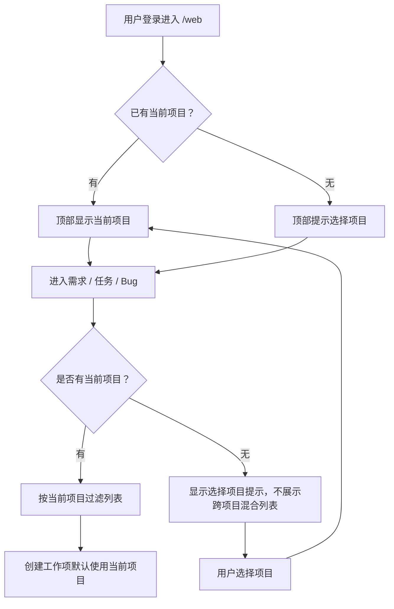

# 当前项目上下文实施计划

## Problem Frame

需求、任务和 Bug 页面目前支持按项目筛选，但默认仍容易形成跨项目混合视图。第一版需要把“当前项目”提升为顶部工作上下文：用户先选定当前项目，再围绕该项目查看和创建工作项。

本计划以 `docs/brainstorms/current-project-context-requirements.md` 为来源。

## Scope

实现：
- 顶部当前项目选择器。
- 当前项目选择的用户级持久化。
- 需求、任务、Bug 页面默认按当前项目过滤。
- 无当前项目时的明确提示。
- 创建工作项默认使用当前项目。

不实现：
- 多项目同时选中。
- 组织空间、产品线、迭代层级。
- 全局搜索强制按当前项目过滤。
- 新的数据权限模型。

## Existing Patterns To Follow

- 布局模板：`api/templates/layouts/web.html`
- 顶部导航和头像下拉样式：`api/static/app.css`
- 页面交互和初始化脚本：`api/static/app.js`
- Web 路由注册：`api/src/web/router.rs`
- 用户页面 handler：`api/src/web/user/mod.rs`
- 项目和工作项查询：`api/src/domains/projects.rs`
- 路由冒烟和页面流测试：
  - `api/tests/routing_smoke.rs`
  - `api/tests/project_management_flow.rs`
  - `api/tests/auth_security_flow.rs`

## Design Decisions

### D1. 当前项目作为用户偏好保存

第一版建议使用 SQLite 中的用户偏好或独立当前项目记录，而不是只存在浏览器 localStorage。

理由：
- 服务端渲染页面需要直接知道当前项目，才能默认过滤列表和渲染提示。
- 用户跨浏览器或刷新后仍应保留上下文。
- 可以复用已有登录用户身份和项目可见性校验。

如果现有表结构没有用户偏好能力，实现时可以新增轻量表保存 `user_id -> current_project_id`。具体表名和迁移细节在实现阶段按现有迁移规范落地。

### D2. 切换项目走 `/web` 表单提交

顶部选择器使用普通表单提交或轻量 htmx 提交，服务端校验项目可见性后保存当前项目。

理由：
- 与当前 SSR + htmx 架构一致。
- 不需要引入前端状态管理。
- 权限校验必须在服务端完成。

### D3. 需求 / 任务 / Bug 页面无当前项目时不展示混合列表

如果用户未选择当前项目，这些页面显示空状态和选择项目提示。

理由：
- 这是本需求的核心约束，避免跨项目混合。
- 项目列表、个人中心和搜索仍保留全局能力，不会丢失全局入口。

## Implementation Units

### Unit 1: 当前项目服务端模型

涉及文件：
- `api/src/domains/projects.rs`
- `api/src/app/migrations` 或现有迁移目录
- `api/src/web/user/mod.rs`

工作内容：
- 增加当前项目偏好的读取、保存、清除能力。
- 保存时校验项目可见性：普通用户只能保存自己参与的项目，系统管理员可保存任意项目。
- 当前项目被删除、归档或用户失去访问权限时，读取逻辑应返回无当前项目或自动清除。

测试：
- 在 `api/tests/project_management_flow.rs` 覆盖：
  - 成员可选择自己参与的项目。
  - 成员不能选择无权限项目。
  - 系统管理员可选择任意项目。
  - 当前项目不可访问后，列表页不再继续使用该项目。

### Unit 2: 顶部当前项目选择器

涉及文件：
- `api/templates/layouts/web.html`
- `api/static/app.css`
- `api/static/app.js`
- `api/src/web/user/mod.rs`
- `api/src/web/router.rs`

工作内容：
- 在顶部区域加入当前项目选择器。
- 每个登录页面上下文提供：
  - 当前项目展示信息。
  - 用户可选择项目列表。
- 新增切换当前项目的 Web handler。
- 切换成功后回到当前页面或 `/web`。

测试：
- 在 `api/tests/routing_smoke.rs` 或 `api/tests/project_management_flow.rs` 覆盖：
  - 登录后页面包含当前项目选择器。
  - 选择项目后页面显示当前项目。
  - 无权限项目提交被拒绝。

### Unit 3: 工作项列表默认项目过滤

涉及文件：
- `api/src/web/user/mod.rs`
- `api/src/domains/projects.rs`
- `api/templates/web/work_items.html` 或对应工作项列表模板

工作内容：
- `requirements_page`、`tasks_page`、`bugs_page` 进入列表时读取当前项目。
- 有当前项目时，默认把 `project_key` 过滤设置为当前项目。
- 无当前项目时，不调用跨项目列表查询，改为渲染选择项目提示。
- 页面内项目筛选控件应与当前项目语义一致：第一版可以禁用跨项目切换，或将筛选改成“当前项目”只读提示。

测试：
- 在 `api/tests/project_management_flow.rs` 覆盖：
  - 未选择当前项目时，需求 / 任务 / Bug 不展示跨项目工作项。
  - 选择当前项目后，只展示该项目工作项。
  - 切换当前项目后，列表内容随之变化。

### Unit 4: 工作项创建默认当前项目

涉及文件：
- `api/src/web/user/mod.rs`
- `api/templates/web/work_items.html`
- `api/templates/web/project_detail.html`

工作内容：
- 从需求 / 任务 / Bug 列表创建工作项时默认使用当前项目。
- 如果无当前项目，创建入口应提示先选择项目。
- 项目详情页内创建仍使用详情页项目，不被顶部当前项目覆盖。

测试：
- 在 `api/tests/project_management_flow.rs` 覆盖：
  - 选择当前项目后，从任务页创建任务落到当前项目。
  - 无当前项目时，列表页创建入口不可误创建到任意项目。
  - 项目详情页创建行为保持原有项目作用域。

### Unit 5: 工作台当前项目区域

涉及文件：
- `api/src/web/user/mod.rs`
- `api/templates/web/dashboard.html`

工作内容：
- 工作台移除重复的“我的工作项”跨项目个人视图，改为项目推进表内的当前用户待处理快捷入口。
- 项目推进、风险队列等项目工作区展示用户可见项目，并在每个项目行内提供个人待处理和个人分析入口。
- 无当前项目时，工作台给出选择当前项目的引导。

测试：
- 在 `api/tests/project_management_flow.rs` 覆盖：
  - 当前项目选择影响工作台项目区域。
  - 工作台不再出现“我的工作项”区块，项目推进表仍可快捷进入当前用户在各项目中的待处理事项。

## User Flow

## Edge Cases

- 用户当前项目被移出成员关系：下次读取时视为无当前项目。
- 当前项目被归档：第一版可继续允许查看，但创建入口应根据现有项目状态规则决定是否开放；如果现有规则未限制，暂不额外新增。
- 系统管理员选择非成员项目：允许，因为管理员具备全局管理视角。
- 用户从项目详情页进入：详情页项目上下文优先于顶部当前项目，不应误过滤到另一个项目。
- API JSON 工作项列表在未显式传 `project_key` 时复用用户当前项目作为默认范围；程序化调用方如果需要跨项目查询，必须显式传入项目条件或后续使用专门的全局接口，避免默认返回跨项目混合列表。

## Verification Plan

运行：
- `cargo fmt --all --check`
- `git diff --check`
- `cargo test -p yuance-api --test project_management_flow`
- `cargo test -p yuance-api --test routing_smoke`
- 必要时跑 `cargo test -p yuance-api`

浏览器验证：
- 登录后顶部当前项目选择器可见。
- 无当前项目进入任务页显示选择提示。
- 选择一个项目后，任务页只展示该项目工作项。
- 切换项目后，需求 / 任务 / Bug 页面随项目变化。
- 顶部搜索和用户头像下拉仍正常。

## Risks

- 顶部区域已经包含导航、搜索框和头像；项目选择器需要克制，避免拥挤。
- 当前项目过滤不能破坏已有项目详情页、个人中心和全局搜索的跨项目能力。
- `/api/v1/work-items` 已选择复用当前项目作为默认范围，需要在接口文档和测试中持续明确该行为，避免调用方误以为未传 `project_key` 会返回跨项目聚合结果。

## Execution Sequence

1. 增加当前项目偏好读写能力和测试。
2. 增加顶部项目选择器和切换 handler。
3. 改造需求 / 任务 / Bug 列表默认过滤。
4. 改造列表页创建工作项默认项目。
5. 收敛工作台项目区域展示。
6. 做浏览器验证和回归测试。
