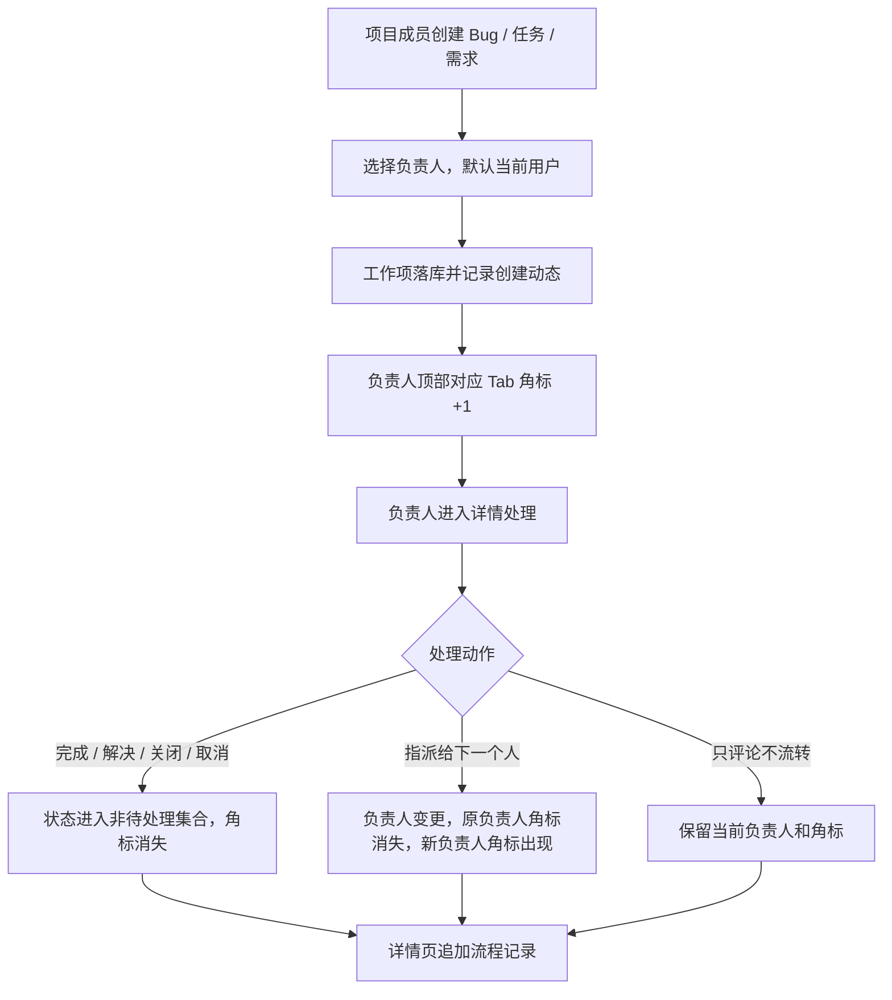

# feat: 工作项指派流转与待处理角标

## Overview

为需求、任务、Bug 增加轻量“指派到人 + 流程记录 + 顶部待处理角标”闭环。用户不需要复杂流程引擎，只需要在工作项推进时明确下一处理人，并像论坛对话一样保留处理记录；被指派人的顶部对应工作项 Tab 显示待处理小角标，数量最多显示 99。

## Problem Frame

当前系统已经有工作项状态机、负责人字段、评论、项目动态和顶部导航，但写入权限偏系统级，普通项目成员提交 Bug 容易被 `work_item.manage` 卡住；工作项详情页可以编辑状态和负责人，但缺少“推进并指派下一人”的明确动作，也缺少让被指派人感知待办的导航角标。

本计划延续 `docs/brainstorms/yuance-mvp-requirements.md` 中“以项目为中心管理需求、任务、Bug、成员和动态”的 MVP 边界，不引入流程引擎、审批流、消息中心或外部通知。

## Requirements Trace

- R1. 项目可写成员可以提交 Bug / 需求 / 任务；只读成员和非成员不能提交。
- R2. 新建工作项时可以选择负责人；默认仍可回落为当前用户。
- R3. 工作项详情页提供“推进/指派”动作，可同时更新状态、负责人和处理说明。
- R4. 流程记录以论坛对话式记录展示在工作项详情中，用户能看到谁在什么时候把状态/负责人改成什么，并看到处理说明。
- R5. 顶部“需求 / 任务 / Bug”Tab 对当前用户待处理数量显示角标，数量大于 99 时仍显示 `99`。
- R6. 角标只统计当前负责人是当前用户、且仍需当前用户处理的待处理 / 进行中 / 待确认工作项；处理完成、关闭或指派给下一个人后角标消失。
- R7. 第一版不实现复杂流程配置、节点定义、审批链、站内通知列表、已读未读表或实时推送。

## Scope Boundaries

- 不做流程引擎。
- 不做可配置状态机。
- 不做 WebSocket、SSE 或实时通知。
- 不做单独消息中心。
- 不改变当前 `/web` + `/api` 的统一入口设计。
- 不改变项目当前上下文过滤规则。
- 不把角标定义为“点击已读”；角标来自当前实际待处理责任。

## Context & Research

### Relevant Code and Patterns

- `api/src/domains/projects.rs`
  - 已有 `work_items.assignee_user_id`、`reporter_user_id`、状态机、评论、项目动态。
  - 已有 `user_can_write_project_content`，项目角色 `owner / maintainer / member` 可写，`viewer` 只读。
  - 已有 `update_work_item` 能更新状态和负责人，但当前更像字段编辑，不是流程动作。
- `api/src/web/user/mod.rs`
  - `web_context_or_redirect` 为所有 `/web` 页面构建顶部上下文。
  - `SystemNav` 已被所有页面模板透传，适合承载顶部导航角标，避免给所有 Askama 模板重复加字段。
  - 当前 `work_items_create`、`work_item_update`、`work_item_status_update` 等写入路径仍先校验 `work_item.manage`。
- `api/src/web/api/mod.rs`
  - API 创建、更新、评论、附件等路径也先校验 `work_item.manage`，需要与 Web 侧保持同一权限语义。
- `api/templates/layouts/web.html`
  - 顶部导航中已有“需求 / 任务 / Bug”Tab，适合加 badge。
- `api/templates/web/work_items/list.html`
  - 新建 Bug 入口已支持图片与说明分组上传，创建表单需要补负责人选择。
- `api/templates/web/work_items/detail.html`
  - 已有编辑、评论、附件和快捷状态按钮，可新增“推进并指派”弹窗。
- `api/templates/web/partials/work_item_detail.html`
  - 评论区是现有“论坛对话”承载区，适合扩展展示流程记录。
- `api/tests/project_management_flow.rs`
  - 已覆盖项目成员权限、状态机、工作项创建、评论、附件等核心流程，应继续扩展。
- `api/tests/routing_smoke.rs`
  - 适合补顶部 badge 渲染冒烟验证。

### Institutional Learnings

- `docs/plans/2026-06-29-001-feat-current-project-context-plan.md` 已明确顶部当前项目和需求 / 任务 / Bug 页面默认按当前项目工作，本功能应遵守该上下文。
- `docs/plans/2026-06-28-002-feat-web-modal-action-forms-plan.md` 已确立创建、编辑等动作使用弹窗，本功能的“推进并指派”也应走弹窗组件。

### External References

- 未使用外部资料。本功能基于现有 Rust / Askama / SQLite / htmx 架构和本仓库已有模式即可完成。

## Key Technical Decisions

- 角标使用“责任型待处理”而不是“消息未读”。
  - 理由：用户描述的消失条件是处理、关闭或指派给下一个人，而不是查看详情后已读。使用实时查询当前分配责任可以避免新增已读表和状态同步问题。
- 角标统计口径第一版定义为：`assignee_user_id = 当前用户` 且状态不在完成态 / 关闭态 / 取消态内。
  - 完成态包括当前系统已有的 `done / resolved / verified / closed / cancelled`。这样任务标记完成、Bug 标记解决或关闭后角标自然消失。
- 流程记录优先复用评论式展示。
  - 理由：用户明确希望“跟论坛对话一样”。第一版可以新增带类型的工作项流程记录，或在现有评论表上加系统记录能力；实现阶段应选择对迁移和展示影响最小的方式。
- “推进并指派”是独立业务动作，不等同于通用编辑。
  - 理由：通用编辑可继续用于标题、描述、优先级等字段；流程动作应强调状态、下一处理人、处理说明，并生成清晰记录。
- 项目写入权限应以项目成员角色为主。
  - 理由：RBAC 管功能入口，项目成员关系管项目内数据范围。普通项目成员提交 Bug 是项目管理系统的基础能力，不应依赖系统级 `work_item.manage`。
- 不新增复杂流程定义表。
  - 理由：当前 MVP 只需要明确“谁处理、处理到什么状态、下一个人是谁”，现有工作项状态机已经足够。

## Open Questions

### Resolved During Planning

- 是否需要复杂流程引擎：不需要。
- 角标是否点击详情即消失：不消失；只有实际处理完成、关闭或改派后消失。
- 角标最多显示多少：最多显示 99，超过仍以 `99` 展示。
- 流程记录展示形态：采用工作项详情内的评论式时间线，不做独立流程页面。

### Deferred to Implementation

- 流程记录落库方式：实现阶段在“扩展评论表”和“新增轻量工作项流程记录表”之间选最小可维护方案，但必须保证历史评论兼容。
- “处理完成”的精确状态映射：实现阶段按当前状态机和文案校准任务、需求、Bug 的按钮文案，底层状态码不新增。
- 快捷状态按钮是否全部替换为“推进并指派”：第一版可保留快捷按钮，同时提供显式弹窗；实现时根据页面拥挤程度决定是否减少按钮。

## High-Level Technical Design

> This illustrates the intended approach and is directional guidance for review, not implementation specification. The implementing agent should treat it as context, not code to reproduce.

## Implementation Units

- [x] **Unit 1: 调整工作项写入权限口径**

**Goal:** 让普通项目可写成员可以提交 Bug / 需求 / 任务，并继续阻止 viewer 和非项目成员写入。

**Requirements:** R1

**Dependencies:** None

**Files:**
- Modify: `api/src/web/user/mod.rs`
- Modify: `api/src/web/api/mod.rs`
- Modify: `api/src/domains/projects.rs`
- Test: `api/tests/project_management_flow.rs`

**Approach:**
- 将项目内工作项创建、评论、附件登记、状态推进等写入路径改为“登录用户 + 项目访问 + 项目内容写权限”。
- 系统级 `work_item.manage` 保留用于系统级管理能力，例如历史工作项恢复或未来批量维护；当前页面和 API 不再提供工作项删除入口。
- Web 列表页和详情页的创建/处理按钮显示条件从单纯 `work_item.manage` 改为项目内容写权限。
- API 和 Web 权限结果保持一致，避免页面能做但 API 不能做，或反向绕过。

**Patterns to follow:**
- `projects::user_can_write_project_content`
- `ensure_project_content_write_access`
- `ensure_api_project_content_write_access`

**Test scenarios:**
- Happy path: 普通系统角色 `member` 且项目角色 `member` 的用户可以在 `/web/bugs` 提交 Bug。
- Happy path: 同一用户可以通过 `/api/v1/work-items` 创建 Bug。
- Error path: 项目角色 `viewer` 提交 Bug 返回 Forbidden。
- Error path: 非项目成员提交当前项目 Bug 返回 Forbidden。
- Regression: 超级管理员仍可创建工作项。

**Verification:**
- 普通项目成员能看到 Bug 新建入口并成功提交。
- viewer 看不到新建入口，直接 POST 也不能绕过。

- [x] **Unit 2: 新建工作项支持负责人选择**

**Goal:** 创建需求、任务、Bug 时可以指定负责人，未指定时默认当前用户。

**Requirements:** R2

**Dependencies:** Unit 1

**Files:**
- Modify: `api/src/domains/projects.rs`
- Modify: `api/src/web/user/mod.rs`
- Modify: `api/src/web/api/mod.rs`
- Modify: `api/templates/web/work_items/list.html`
- Modify: `api/templates/web/projects/detail.html`
- Modify: `api/static/app.js`
- Test: `api/tests/project_management_flow.rs`

**Approach:**
- 创建输入增加可选负责人用户名。
- 负责人必须是当前项目的启用成员；为空时使用当前用户作为负责人。
- 列表页创建弹窗和项目详情创建弹窗增加“负责人”选择项。
- Bug 图片分组直传流程使用已有表单数据创建工作项时同步提交负责人。

**Patterns to follow:**
- `update_work_item` 中负责人校验逻辑。
- `load_project_member_options` 提供的项目成员选择。

**Test scenarios:**
- Happy path: 创建 Bug 时指定项目成员 `dev_a`，新 Bug 的负责人为 `dev_a`。
- Happy path: 创建任务未指定负责人时，负责人为当前用户。
- Error path: 指定非项目成员作为负责人返回 BadRequest。
- Integration: Bug 图片分组创建仍能创建评论和附件，并保留指定负责人。

**Verification:**
- 新建弹窗可以选择项目成员。
- 详情页字段区显示创建时指定的负责人。

- [x] **Unit 3: 增加推进并指派动作和流程记录**

**Goal:** 用户可以在详情页用一个弹窗完成状态修改、下一处理人指派和处理说明记录。

**Requirements:** R3, R4, R6

**Dependencies:** Unit 1, Unit 2

**Files:**
- Modify: `api/src/domains/projects.rs`
- Modify: `api/src/web/user/mod.rs`
- Modify: `api/src/web/api/mod.rs`
- Modify: `api/src/web/router.rs`
- Modify: `api/templates/web/work_items/detail.html`
- Modify: `api/templates/web/partials/work_item_detail.html`
- Test: `api/tests/project_management_flow.rs`

**Approach:**
- 新增一个领域动作，语义为“推进工作项”：输入包含目标状态、下一负责人、处理说明。
- 继续复用现有状态机校验，禁止非法状态跳转。
- 下一负责人为空时可保留当前负责人；若传入负责人则校验必须为项目成员。
- 处理说明不能为空或至少在发生状态/负责人变化时生成系统说明，确保详情有可读记录。
- 流程记录在详情评论区以时间线方式展示，区分普通评论和系统流程记录。
- 项目动态继续记录摘要，方便项目详情动态 Tab 看到变更。

**Patterns to follow:**
- `update_work_item_status`
- `update_work_item`
- `add_work_item_comment`
- `project_activities` 写入模式

**Test scenarios:**
- Happy path: 当前负责人将 Bug 从 `open` 推进到 `in_progress` 并指派给 `dev_b`，状态和负责人同时更新，详情出现流程记录。
- Happy path: 任务从 `in_progress` 推进到 `done`，即使负责人不变，也生成流程记录。
- Error path: 从 `open` 直接推进到 `closed` 被状态机拒绝。
- Error path: 指派给非项目成员返回 BadRequest。
- Permission path: viewer 不能推进或指派。
- Integration: 项目动态包含工作项推进摘要。

**Verification:**
- 工作项详情页能看到“推进并指派”弹窗。
- 提交后页面返回详情，状态、负责人、评论式流程记录同步更新。

- [x] **Unit 4: 顶部工作项 Tab 待处理角标**

**Goal:** 顶部“需求 / 任务 / Bug”按当前用户待处理数量显示小角标，最多显示 99。

**Requirements:** R5, R6

**Dependencies:** Unit 1, Unit 3

**Files:**
- Modify: `api/src/domains/projects.rs`
- Modify: `api/src/web/user/mod.rs`
- Modify: `api/templates/layouts/web.html`
- Modify: `api/static/app.css`
- Test: `api/tests/project_management_flow.rs`
- Test: `api/tests/routing_smoke.rs`

**Approach:**
- 在 domain 层新增当前用户待处理工作项计数查询，按 `requirement / task / bug` 分组。
- 计数口径：当前负责人为当前用户，工作项未删除，状态仍在待处理集合，项目对当前用户可见。
- 将计数挂到 `SystemNav` 或新增通用顶部上下文结构中，优先选择修改面最小且不需要所有模板重复加字段的方案。
- 布局模板给需求、任务、Bug 链接追加 badge；0 不显示，1-99 显示数字，超过仍显示 `99`。
- CSS 保持克制，使用小圆角或圆点数字，不挤压顶部导航。

**Patterns to follow:**
- `build_system_nav`
- `list_work_item_summaries_assigned_to_user`
- `api/templates/layouts/web.html` 顶部导航结构

**Test scenarios:**
- Happy path: 用户有 1 个待处理 Bug，顶部 Bug Tab 显示 `1`。
- Happy path: 用户有 2 个任务和 0 个需求，任务显示 `2`，需求不显示。
- Edge case: 用户有 120 个待处理 Bug，顶部显示 `99`。
- Integration: Bug 被指派给下一个人后，原用户 Bug 角标消失，新用户 Bug 角标出现。
- Integration: Bug 被标记为 `resolved` 或 `closed` 后，负责人顶部 Bug 角标消失。
- Permission path: 用户不具备项目访问权限的工作项不计入角标。

**Verification:**
- 任意 `/web` 页面顶部都能展示一致角标。
- 切换页面、刷新页面后角标来自服务端最新数据。

- [x] **Unit 5: 补齐页面体验与回归覆盖**

**Goal:** 保证新流程和现有 Bug 图片上传、评论附件、当前项目上下文、暗色主题等 UI 不冲突。

**Requirements:** R2, R3, R4, R5, R6

**Dependencies:** Unit 1-4

**Files:**
- Modify: `api/static/app.css`
- Modify: `api/static/app.js`
- Modify: `api/templates/web/work_items/list.html`
- Modify: `api/templates/web/work_items/detail.html`
- Test: `api/tests/project_management_flow.rs`
- Test: `api/tests/routing_smoke.rs`

**Approach:**
- 创建弹窗、推进弹窗、Bug 图片说明分组共存时，不新增重复控件样式。
- 暗色主题下 badge、流程记录、负责人选择需要保持可读。
- 流程记录文案保持简短，避免把 JSON metadata 直接暴露给用户。
- 若保留快捷状态按钮，按钮文案和“推进并指派”不要形成明显冲突。

**Patterns to follow:**
- 现有 modal 样式和 `data-modal-open` 交互。
- 现有评论附件上传样式。

**Test scenarios:**
- Regression: Bug 图片说明分组上传流程仍成功。
- Regression: 工作项普通评论仍可新增、编辑；页面和 API 不提供评论删除入口。
- Regression: 工作项附件和评论附件上传流程仍可走 OSS 前端直传。
- Visual smoke: 顶部 badge 不影响项目选择器、全局搜索、头像菜单布局。

**Verification:**
- 页面交互闭环正常，无明显布局挤压。
- 相关 Rust 测试、JS 语法检查和格式检查通过。

## System-Wide Impact

- **权限边界：** 工作项写入会从系统级 `work_item.manage` 放宽到项目内容写权限，必须确保 viewer 和非成员仍被阻止。
- **API / Web parity：** Web 表单、API JSON、Bug 图片分组直传都要使用一致的创建和指派语义。
- **状态生命周期：** 角标由当前状态和当前负责人计算，不需要清理任务；但状态集合必须和工作项状态机保持一致。
- **模板影响：** 顶部角标最好挂在所有页面已有的共享上下文字段中，避免所有 Askama 模板结构重复扩散。
- **数据一致性：** 推进动作应在一个事务里更新状态、负责人、流程记录和项目动态，避免出现状态变了但记录没写的情况。

## Risks & Dependencies

- 权限放宽风险：
  - 缓解：只放宽项目内内容写入；历史工作项恢复等高风险动作可继续保持更严格权限，测试覆盖 viewer 和非成员。
- 角标口径误解：
  - 缓解：明确角标是“待我处理”而非“未读消息”，不因打开页面自动清零。
- 流程记录和普通评论混淆：
  - 缓解：UI 上给流程记录使用轻量标签，例如“流程”，并自动生成状态/负责人摘要。
- 顶部导航拥挤：
  - 缓解：badge 只在数量大于 0 时显示，尺寸控制在导航 item 内，不额外占用菜单栏高度。
- 数据迁移风险：
  - 缓解：如需新增字段或表，使用新增 migration，不修改历史 migration；历史评论和工作项必须兼容。

## Documentation / Operational Notes

- 更新或补充开发规范中关于“工作项写入权限 = RBAC 功能入口 + 项目成员数据范围”的说明。
- 后续如果要做站内通知，可以在本功能基础上新增通知表，但不应倒逼本轮实现已读未读模型。
- 生产部署前需要跑完整 `cargo test -p yuance-api`，因为权限口径变更会影响多条路径。

## Sources & References

- Origin document: `docs/brainstorms/yuance-mvp-requirements.md`
- Related plan: `docs/plans/2026-06-29-001-feat-current-project-context-plan.md`
- Related plan: `docs/plans/2026-06-28-002-feat-web-modal-action-forms-plan.md`
- Related code: `api/src/domains/projects.rs`
- Related code: `api/src/web/user/mod.rs`
- Related code: `api/src/web/api/mod.rs`
- Related code: `api/templates/layouts/web.html`
- Related code: `api/templates/web/work_items/list.html`
- Related code: `api/templates/web/work_items/detail.html`
- Related tests: `api/tests/project_management_flow.rs`
- Related tests: `api/tests/routing_smoke.rs`
