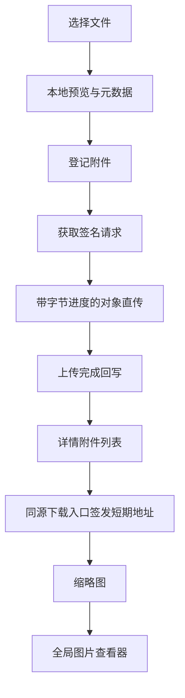

# feat: 完善文件上传与图片预览

## 概览

在不改变现有附件、权限和签名直传 API 的前提下，为项目、工作项、评论和 Bug 图片分组补足本地预览、真实上传百分比、已上传图片缩略图和统一查看器。重点是让截图型 Bug 能从选择文件到排查详情形成完整可视化闭环。

## 问题范围

现有直传流程已能安全地登记附件、获取签名请求并回写上传结果，但上传控件只显示文本状态，详情页把截图当作普通下载附件。该计划落实来源文档中的 R1-R6，并保留非图片附件和 pending/deleted 状态的既有行为。

## 需求追踪

- R1. 所有既有上传入口在选择图片后显示本地预览、文件名和大小。
- R2. 对象存储上传显示真实字节百分比、阶段和失败后的重试状态。
- R3. 不改变签名直传、权限校验、文件限制或对象存储数据模型。
- R4. 已上传图片附件在项目、工作项和评论中显示可点击缩略图。
- R5. 图片按需经现有受鉴权下载入口取得短期可访问地址，并显示加载或失败状态。
- R6. 全局查看器支持适屏、缩放、旋转、重置、Escape 关闭及同组图片切换。

## 范围边界

- 不新增迁移、服务端图片处理、持久缩略图、裁剪标注或视频预览。
- 不修改 `/api/v1` 公开附件契约，也不在 HTML 中输出长期对象存储地址。
- 不改变 non-image 附件、删除附件或未上传附件的下载与删除语义。

## 上下文与调研

### 相关代码与模式

- `api/static/app.js` 已集中处理 modal、CSRF、直传、Bug 图片分组和页面跳转，应继续作为无框架 UI 行为入口。
- `api/static/app.css` 已有 `upload-picker`、`upload-status`、`modal` 和附件列表的视觉语言，应扩展这些组件而非引入第二套主题。
- `api/src/web/user/mod.rs` 的 `AttachmentView` 已提供 MIME、状态和文件元数据，可添加仅供模板判断的图片预览标识。
- `api/templates/web/work_items/detail.html`、`api/templates/web/partials/work_item_detail.html`、`api/templates/web/projects/detail.html` 是三类已上传附件的渲染入口。
- `api/src/web/user/mod.rs` 的 Web 下载 handler 会完成权限校验并重定向到短期签名地址，可作为图片加载器的同源来源。
- `api/tests/project_management_flow.rs` 已覆盖附件直传生命周期和详情页渲染；`scripts/browser-smoke.sh` 已覆盖真实浏览器文件上传。

### 既有经验

- 未发现 `docs/solutions/` 中与上传或图片预览相关的既有经验沉淀。

### 外部参考

- 未进行外部调研：仓库已有签名直传、modal、动态 DOM 与浏览器冒烟的直接实现模式，足以支撑本次改动。

## 关键技术决策

- **使用 XHR 承载对象存储 PUT：** 保留 API 元数据登记、签名和完成回写的 fetch 流程，仅替换无法报告上传字节进度的实际对象上传步骤。
- **按文件复用 pending 附件：** 附件登记成功后立即在页面状态中保存附件 ID；同一文件在签名、上传或完成回写失败后复用该 pending 记录，更换文件则重新登记，避免元数据错配。
- **本地预览采用 object URL：** 只在浏览器内存中保存选中文件，不向应用服务传输本地文件。
- **已上传图片使用 Web 下载入口：** 图片组件把同源 `/web/.../download` 作为加载源，由服务端按请求签发临时对象地址；这保持现有鉴权与短期 URL 模型。
- **使用单一图片查看器：** layout 提供一个可复用 modal，附件缩略图仅携带图片源、标题和图库标识，避免评论列表中重复渲染复杂弹窗。
- **仅显示安全的可预览位图：** MIME 为常见 raster image 的附件显示缩略图；其他内容类型继续作为文件附件，避免把不适合内嵌显示的内容误作图片。

## 待决问题

### 规划阶段已确认

- 浏览器如何取得临时图片地址：使用已有受鉴权 Web 下载重定向，不增加 API 字段或模板中的 OSS URL。
- 如何提供真实百分比：仅对对象存储 PUT 使用浏览器上传进度事件，不模拟传输进度。

### 留待实施确认

- 不可计算传输长度时的精确文案与环形状态由实现时按现有浏览器行为决定，但不得伪造百分比。
- 图片查看器的缩放步长和最大值由实现时通过浏览器验证确定。

## 总体技术设计

> 本图说明目标实现方向，供审查参考而非实施规格；实施时应将其作为上下文，而不是机械复写代码。

## 实施单元

- [x] **单元 1：建立图片附件呈现语义**

**目标：** 让三类详情附件能够可靠区分可预览图片与普通文件，并为共享图片加载器提供受权限保护的来源和图库上下文。

**需求：** R4、R5、R6

**依赖：** 无。

**文件：**
- 修改：`api/src/web/user/mod.rs`
- 修改：`api/templates/web/projects/detail.html`
- 修改：`api/templates/web/work_items/detail.html`
- 修改：`api/templates/web/partials/work_item_detail.html`
- 测试：`api/tests/project_management_flow.rs`

**实现方式：**
- 在 Web attachment view model 中集中判定可预览的 raster MIME，模板不自行解析 MIME 字符串。
- 对 uploaded 图片渲染缩略图占位、加载状态、同源 Web 下载来源和同一页面的图库标识；普通、pending 和 deleted 附件继续走现有行式信息与动作。
- 保留下载、删除和 pending 继续上传入口，不把预览控件当作权限边界。

**遵循模式：**
- `attachment_from_summary` 的 view model 映射。
- 工作项、评论和项目附件现有的 status/action 分支。
- `attachment_download_redirect` 的鉴权和签名地址行为。

**测试场景：**
- 正常路径：已上传 PNG Bug 评论附件的详情 HTML 含图片预览标识和正确的同源下载来源。
- 正常路径：已上传项目和工作项图片附件均输出同一预览语义。
- 边界：PDF、SVG、pending 和 deleted 附件不输出内嵌图片预览，仍保留原有状态与动作。
- 权限：非项目成员无法通过详情页获得图片预览来源，保持现有访问拒绝。

**验证：**
- 三个附件区域对图片呈现一致，普通文件与状态分支没有视觉或行为回归。

- [x] **单元 2：升级上传控件与真实传输进度**

**目标：** 把现有直传和 Bug 图片分组升级为可复用的本地文件预览、阶段状态和环形进度体验。

**需求：** R1、R2、R3

**依赖：** 无。

**文件：**
- 修改：`api/static/app.js`
- 修改：`api/static/app.css`
- 修改：`api/templates/web/work_items/list.html`
- 测试：`api/tests/project_management_flow.rs`
- 测试：`scripts/browser-smoke.sh`

**实现方式：**
- 提取文件选择展示和上传状态更新的共享前端组件，复用于 modal 内附件表单、pending 附件继续上传和 Bug 图片分组。
- 对图片使用 object URL 渲染临时缩略图并在替换、移除或页面卸载时释放；非图片显示文件元数据占位。
- API 调用继续复用现有 JSON/CSRF helper；对象 PUT 改用支持上传进度事件的请求，依据可计算字节数更新固定尺寸环形百分比。
- 让新建附件在登记成功后保存 pending ID；失败后保留选择文件和该 ID，同一文件可直接重试，更换文件会重新登记。Bug 分组在当前页面内保留已创建工作项、评论和附件的进度，并锁定已落库字段，避免重复创建或静默丢失修改。

**遵循模式：**
- `syncAttachmentFileFields`、`uploadAttachmentFile`、`submitDirectUpload`。
- `submitBugReport` 的顺序创建和直传处理。
- 既有 `upload-status`、modal busy state 与 reduced motion 约定。

**测试场景：**
- 正常路径：选择图片后显示本地缩略图、文件名和大小，上传期间环形百分比递增并在完成后显示完成状态。
- 正常路径：普通文档显示文件信息但不渲染图片缩略图。
- 异常路径：获取签名、对象 PUT 或完成回写失败时表单保留所选文件和 pending 附件 ID，重新提交不重复登记附件。
- 集成：新建 Bug 的多组图片说明按组显示上传状态，已完成组不会在同页重试时重复上传或重复创建评论。
- 边界：不可计算上传长度时显示传输状态而非伪造百分比。

**验证：**
- 现有签名直传 API 仍被调用，浏览器中能观察到真实上传进度与可用重试状态。

- [x] **单元 3：实现图片加载器与全局查看器**

**目标：** 让已上传图片以按需缩略图展示，并提供适配现有 modal 交互的图片查看、缩放和旋转能力。

**需求：** R4、R5、R6

**依赖：** 单元 1。

**文件：**
- 修改：`api/templates/layouts/web.html`
- 修改：`api/static/app.js`
- 修改：`api/static/app.css`
- 测试：`api/tests/routing_smoke.rs`
- 测试：`scripts/browser-smoke.sh`

**实现方式：**
- 在全局 layout 中添加一个无业务数据耦合的图片查看器 modal，复用既有 focus trap、关闭和 reduced motion 机制。
- 前端图片加载器使用 IntersectionObserver 延迟设置图片来源，维护 loading/ready/error 状态，并在首次失败时允许重新请求同源下载入口以得到新的临时 URL。
- 点击缩略图打开查看器；查看器依据图库标识在当前页面收集相邻图片，提供前后切换、适屏、缩放、旋转、重置和 Escape 关闭。
- 所有文本、按钮、焦点和失败状态具备可访问名称，不将跨域对象 URL 写入 HTML 或 localStorage。

**遵循模式：**
- `openModal`、`closeModal`、keyboard/focus 管理。
- `fetchJson` 的未授权跳转行为和页面级事件委托。
- `web-ui-density.md` 的高密度附件信息与 modal 约定。

**测试场景：**
- 正常路径：已上传 Bug 截图在详情中按需加载，点击后查看器显示原图并支持缩放、旋转和重置。
- 正常路径：同一详情中有多张图片时，可在查看器中切换相邻图片。
- 异常路径：图片加载失败显示可重试状态，不影响下载或其他附件操作。
- 无障碍：Escape 关闭查看器并将焦点恢复到触发缩略图；控制按钮具有明确标签。
- 回归：现有确认 modal、编辑 modal 和 htmx partial 不被查看器的全局事件干扰。

**验证：**
- 已上传图片不再需要先下载即可审阅，查看器在宽屏与窄屏下均不遮挡或溢出关键控制。

## 全局影响

- **交互图：** 项目、工作项、评论和 Bug 创建共用 `app.js` 上传控制器；查看器由 layout 承载，详情模板只声明数据属性。
- **错误传播：** API 登记/签名/回写错误继续通过现有 JSON error envelope 进入状态组件；对象存储 PUT 错误转换为用户可重试的文本状态。
- **状态生命周期：** object URL 只保留在页面内；pending 附件 ID 仅在同一文件的当前表单生命周期内复用，刷新后仍由既有 pending 继续上传入口接管。
- **API surface parity：** 不增加或改变 API endpoint；Web 图片加载继续经既有权限校验和临时签名逻辑。
- **未变更约束：** 文件大小、内容类型、项目权限、CSRF、软删除、下载动作和对象存储凭据边界保持不变。

## 风险与依赖

- **浏览器进度事件不可计算：** 显示确定的“传输中”状态，不伪造百分比。
- **短期对象 URL 过期或对象读取失败：** 每次缩略图加载走同源下载入口，失败后提供一次显式重试。
- **Bug 分组中途失败：** 仅在当前页面保存已完成的工作项/评论/附件状态，并锁定已持久化字段以避免重复创建或静默忽略修改；刷新后维持已有服务端 pending 恢复机制。
- **大量图片影响详情首屏：** 通过懒加载只在缩略图进入视口或用户打开查看器时请求图片。
- **未受信任图片内容：** 仅内嵌允许的 raster image MIME，并使用 `img` 元素而非 HTML 嵌入容器。

## 文档与运维说明

- 更新 `docs/runbooks/browser-smoke.md` 的浏览器验证范围，覆盖本地预览、进度环、图片缩略图和查看器操作。
- 不需要迁移、部署配置或对象存储权限变更；上线后需要在真实 OSS 环境验证 PUT 进度与图片 GET 重定向。

## 来源与参考

- 来源文档：`docs/brainstorms/2026-07-10-file-upload-image-preview-requirements.md`
- 相关代码：`api/static/app.js`
- 相关代码：`api/static/app.css`
- 相关代码：`api/src/web/user/mod.rs`
- 相关测试：`api/tests/project_management_flow.rs`
- 相关运行手册：`docs/runbooks/browser-smoke.md`
