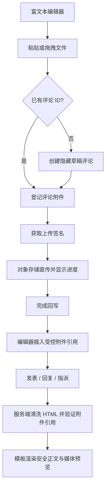

# feat: 改造工作项讨论富文本上传

## Overview

把工作项评论、回复和评论编辑从“纯文本 + 独立附件选择”改成轻量富文本编辑器。用户可以在正文中直接粘贴剪贴板截图，也可以拖拽图片或文件到编辑器，系统在当前位置显示上传状态，成功后变成正文内图片、视频入口或文件卡片。第一期只覆盖工作项讨论区，不扩展到新建 / 编辑需求、任务、Bug 主描述。

## Problem Frame

来源文档 `docs/brainstorms/2026-07-13-rich-text-discussion-requirements.md` 明确指出，测试人员最常用的是截图说明问题，而截图通常已经在剪贴板中。现有流程要求“截图保存成本地文件 -> 点击添加附件 -> 选择文件 -> 发表”，且附件脱离正文上下文，协作阅读效率低。新方案应让用户把截图或文件直接放进正文，同时保持现有权限、对象存储直传、评论回复、指派和历史附件兼容。

## Requirements Trace

- R1. 评论、回复、评论编辑输入框改为富文本编辑器，支持基础排版、图片和文件卡片。
- R2. 评论正文展示安全富文本，历史纯文本评论继续正常显示。
- R3. 编辑评论保留已有富文本和内联媒体，并继续显示发表 / 编辑时间。
- R4. 粘贴剪贴板截图、图片或文件后立即在正文中创建占位并上传。
- R5. 拖拽本地图片或文件到编辑器后立即在正文中创建占位并上传。
- R6. 粘贴与拖拽共用上传队列、进度、失败、重试和移除交互。
- R7. 上传中、成功和失败状态都显示在编辑器正文位置。
- R8. 上传失败不能丢失已输入文字，失败项可重试或移除。
- R9. 发表、回复、发表并指派、回复并指派行为保持不变。
- R10. 评论 / 回复区域移除新增附件选择控件。
- R11. 历史评论附件继续保留展示、下载和预览能力。
- R12. 服务端对富文本 HTML 做白名单过滤。
- R13. 富文本媒体引用必须经过现有权限校验，不允许不受控脚本、事件属性或危险协议。
- R14. 通知摘要、列表摘要和搜索摘要从富文本中提取纯文本。

## Scope Boundaries

- 不在第一期改造新建 / 编辑需求、任务、Bug 主描述。
- 不引入复杂协同编辑、@提及、表情反应、图片标注、裁剪或服务端转码。
- 不删除历史附件数据结构，不隐藏已存在的评论附件展示。
- 不把对象存储长期 URL、剪贴板 blob URL 或外部图片 URL 持久化到正文。
- 不改变工作项权限、项目权限、CSRF、文件大小和内容类型限制。

## Context & Research

### Relevant Code and Patterns

- `api/templates/web/partials/work_item_detail.html` 当前评论主输入、回复输入和编辑弹窗都是 `textarea`，并带有 `data-discussion-files` 附件选择入口。
- `api/static/app.js` 已有 `uploadAttachmentFile`、`uploadSignedFile`、`setUploadTransfer`、`submitDiscussion`、图片查看器和事件委托，可复用签名直传、真实上传进度和预览弹窗。
- `api/static/app.css` 已有讨论区、上传进度环、附件卡片、图片查看器和 modal 样式，应在同一视觉体系内扩展富文本编辑器。
- `api/src/domains/projects.rs` 当前只保存纯文本 `work_item_comments.body`，并通过 `ensure_plain_work_item_comment_body` 防止系统流程前缀伪造。
- `api/src/web/api/mod.rs` 的评论 API 与评论附件 API 已覆盖创建评论、编辑评论、附件登记、签名、完成回写和下载 URL。
- `api/src/web/user/mod.rs` 当前为模板构造 `WorkItemComment.body` 和附件列表；历史附件通过 `files::list_attachments(pool, "comment", comment.id)` 加载。
- `scripts/browser-smoke.sh` 当前覆盖评论附件上传、失败重试、图片预览；本次改造后必须改成粘贴 / 拖拽富文本上传验证。
- `scripts/test-discussion-js.mjs` 当前直接测试 `submitDiscussion` 的 JSON 提交流程，需要补富文本序列化、草稿评论和上传失败分支。
- `api/tests/routing_smoke.rs` 当前断言旧附件按钮样式和讨论 JS 片段，改造后要同步替换为富文本编辑器断言。

### Institutional Learnings

- `docs/solutions/` 当前只有 `.gitkeep`，没有可复用的上传、富文本或 XSS 经验文档。

### External References

- Ammonia 4.1.2 文档：`ammonia::clean` 和 `Builder` 提供白名单 HTML 清洗、允许标签 / 属性 / URL scheme 配置，并默认处理危险标签、属性和链接关系。
- Askama 文档：HTML 模板默认转义变量；`safe` 过滤器会跳过转义，只能用于已经服务端清洗并受控生成的 HTML。

## Key Technical Decisions

- **使用轻量 contenteditable 富文本，而不是引入完整前端编辑器包。** 当前项目没有 Node 构建链，前端是单个 `api/static/app.js` 的无框架事件委托。第一期只需要基础排版、粘贴 / 拖拽上传和内联媒体，占用完整编辑器依赖会增加打包、样式和维护成本。
- **新增评论正文格式字段，历史纯文本不直接 `safe` 渲染。** `work_item_comments.body` 继续保留，但增加正文格式标记；旧数据默认 plain，新富文本保存为 html。模板渲染使用服务端构造的 `body_html`，plain 先转义和换行转换，html 先白名单清洗，再进入唯一受控 `safe` 渲染点。
- **即时上传通过隐藏草稿评论承载附件。** 评论附件 API 需要 comment id。粘贴 / 拖拽时如果当前编辑器没有评论 ID，前端先创建不进入列表、不发通知、不写普通活动的草稿评论，再复用现有 comment attachment API 上传。用户发表时把草稿发布为正式评论；无媒体的纯文字评论仍可直接创建正式评论。
- **富文本正文只保存受控附件引用，不保存 blob URL、签名 URL 或任意外部媒体 URL。** 上传成功后编辑器插入带附件 ID 的媒体 / 文件节点；发布时服务端验证这些附件属于当前评论或当前用户草稿、状态为 uploaded，再生成展示 HTML。
- **历史评论附件继续展示。** 新增入口移除“添加附件”，但旧评论附件仍在正文下方展示；富文本内联媒体和历史附件列表可以同时存在，避免旧数据不可见。
- **通知和摘要使用纯文本提取。** 新评论、回复通知和列表摘要不直接使用 HTML，避免消息下拉和其他文本位置出现标签或潜在注入。

## Open Questions

### Resolved During Planning

- 富文本编辑器依赖选择：采用轻量 contenteditable + 项目现有 JS/CSS，不引入新的前端构建链。
- 粘贴 / 拖拽如何“立即上传”：通过隐藏草稿评论获得 comment id，然后复用现有评论附件直传链路。
- HTML 安全边界：服务端用白名单 sanitizer 清洗，模板只在已清洗的 `body_html` 上使用 Askama `safe`。

### Deferred to Implementation

- 允许的最终 HTML 标签、属性和工具栏按钮清单：实现时根据第一期 UX 取最小集合，但必须覆盖段落、换行、链接、列表、加粗 / 斜体和受控附件节点。
- 草稿评论的清理策略：第一期至少保证草稿不显示、不通知、不能被他人访问；是否增加定期清理或页面卸载清理由实现时按改动量决定。
- 富文本纯文本摘要的截断长度和换行处理：按现有通知、列表和活动摘要文案实际展示调整。

## High-Level Technical Design

> *This illustrates the intended approach and is directional guidance for review, not implementation specification. The implementing agent should treat it as context, not code to reproduce.*

## Implementation Units

- [ ] **Unit 1: 评论正文格式、安全清洗与纯文本摘要**

**Goal:** 为评论正文建立 plain/html 兼容模型，确保历史文本安全显示、新富文本可清洗保存，通知和摘要不直接使用 HTML。

**Requirements:** R1、R2、R3、R12、R14

**Dependencies:** 无。

**Files:**
- Modify: `api/Cargo.toml`
- Create: `api/migrations/202607130001_add_work_item_comment_rich_text_fields.sql`
- Modify: `api/src/domains/projects.rs`
- Modify: `api/src/web/api/mod.rs`
- Modify: `api/src/web/user/mod.rs`
- Test: `api/tests/project_management_flow.rs`
- Test: `api/tests/routing_smoke.rs`

**Approach:**
- 增加评论正文格式字段，旧评论默认 plain；系统流程评论保持 plain，不允许带富文本格式。
- 在领域层集中提供“保存前清洗”“展示 HTML 构造”“纯文本摘要提取”能力，避免模板、API handler 和通知各自处理 HTML。
- 引入 Rust 侧白名单 sanitizer；默认不信任浏览器传来的 HTML。
- API 新增可选正文格式字段，缺省继续按 plain 处理，保持现有 API 调用兼容。
- Askama 模板只在服务端构造的安全 HTML 字段上使用 `safe`，不对原始请求正文使用 `safe`。

**Patterns to follow:**
- `ensure_plain_work_item_comment_body` 的系统流程前缀保护。
- `work_item_comment_body_for_display` 的流程评论显示转换。
- `fallback_text` 和通知 payload 的文本降级模式。

**Test scenarios:**
- Happy path：旧 plain 评论包含换行时，详情页保持换行显示，不把文本中的 `<b>` 当 HTML 渲染。
- Happy path：新 html 评论保存后，允许的段落、链接、加粗和列表能在详情页按富文本显示。
- Error path：提交包含 `<script>`、事件属性、`javascript:` 链接或不允许标签的 HTML，服务端清洗后详情页不包含危险内容。
- Edge case：纯空标签、只有图片占位但没有文本的富文本仍可作为有效评论；完全空正文继续拒绝。
- Integration：回复通知 body 使用纯文本摘要，不出现 HTML 标签。
- Regression：系统流程记录仍不能被伪造为普通评论，也不能编辑为富文本。

**Verification:**
- 历史文本、新富文本、流程记录和通知摘要都有明确的安全输出路径。

- [ ] **Unit 2: 隐藏草稿评论与即时附件上传生命周期**

**Goal:** 让粘贴 / 拖拽文件可以在正式发表前立即上传，同时不让未发表内容进入讨论列表、通知或项目动态。

**Requirements:** R4、R5、R6、R7、R8、R9、R13

**Dependencies:** Unit 1。

**Files:**
- Modify: `api/migrations/202607130001_add_work_item_comment_rich_text_fields.sql`
- Modify: `api/src/domains/projects.rs`
- Modify: `api/src/web/router.rs`
- Modify: `api/src/web/api/mod.rs`
- Modify: `api/src/web/user/mod.rs`
- Test: `api/tests/project_management_flow.rs`
- Test: `api/tests/auth_security_flow.rs`

**Approach:**
- 在评论表增加草稿标记；普通评论列表、消息跳转和 Web 详情默认排除草稿。
- 新增草稿创建 / 发布的 API 或等价语义：草稿创建只做权限和父评论校验，不发通知、不写普通评论活动；发布草稿时才写正式评论活动、回复通知和后续指派来源。
- 评论附件登记、签名、完成回写允许当前作者对自己的草稿评论操作；其他用户不能读取、上传或下载草稿附件。
- 发布时验证正文中的内联附件引用：附件必须属于该评论、状态 uploaded、未越权引用其他评论或其他工作项附件。
- 上传失败时草稿和已输入正文留在页面状态中，前端可重试；删除失败占位只移除正文引用，不物理删除历史记录。

**Patterns to follow:**
- `require_api_comment_context` / `load_comment_attachment_context` 的权限与 comment target 校验。
- `create_work_item_comment_attachment`、`work_item_comment_attachment_upload_url`、`work_item_comment_attachment_mark_uploaded` 的现有直传生命周期。
- `projects::add_work_item_comment_reply` 当前的回复通知与项目活动事务边界。

**Test scenarios:**
- Happy path：首次粘贴图片时创建草稿评论，草稿不出现在 `list_work_item_comments` 和详情 HTML 中。
- Happy path：草稿附件上传完成后发布评论，评论正式出现在详情页并保留附件引用。
- Happy path：回复表单创建的草稿保留父评论关系，发布后通知原评论作者。
- Error path：用户尝试发布引用其他评论、其他工作项或未 uploaded 的附件，服务端拒绝。
- Error path：非作者访问、上传或下载草稿评论附件被拒绝。
- Integration：发表并指派 / 回复并指派使用发布后的评论 ID 作为 `source_comment_id`。
- Regression：普通无附件评论不需要草稿即可创建，现有 API 缺省 plain 行为仍可用。

**Verification:**
- 粘贴 / 拖拽能立即上传，但未发表草稿不会污染讨论串、通知、项目动态或其他用户可见数据。

- [ ] **Unit 3: 富文本编辑器 UI、粘贴与拖拽交互**

**Goal:** 用统一组件替换评论、回复和编辑弹窗的 textarea 与附件按钮，提供粘贴 / 拖拽上传、正文内状态和失败重试。

**Requirements:** R1、R3、R4、R5、R6、R7、R8、R10

**Dependencies:** Unit 1、Unit 2。

**Files:**
- Modify: `api/templates/web/partials/work_item_detail.html`
- Modify: `api/static/app.js`
- Modify: `api/static/app.css`
- Test: `scripts/test-discussion-js.mjs`
- Test: `api/tests/routing_smoke.rs`

**Approach:**
- 封装 `data-rich-text-editor` 组件：contenteditable 作为可视编辑区，隐藏字段承载序列化后的正文和格式。
- 评论主输入、回复输入和编辑评论弹窗复用同一组件；移除 `data-discussion-files` 和“添加附件”入口。
- 监听 paste、dragenter、dragover、drop：只在编辑器范围内接管文件；普通文本粘贴保留为安全文本 / 最小 HTML。
- 文件占位插入到光标位置，显示文件名、类型、进度环、成功、失败、重试和移除按钮；图片和视频可显示本地预览。
- 提交按钮在存在未完成上传时禁用或给出明确提示，避免正文保存不可用引用。
- 保留 `发表并指派`、`回复并指派` 的状态下拉与 busy / retry 状态。

**Patterns to follow:**
- `submitDiscussion` 的表单 busy、失败重试和指派状态锁定逻辑。
- `setUploadTransfer` 的环形百分比 UI，但状态要嵌入正文占位而不是表单底部。
- 图片查看器的 `data-local-image-preview` / `data-media-preview` 事件委托模式。
- 全站按钮、输入框、modal 和圆形图标居中规范。

**Test scenarios:**
- Happy path：在主评论框粘贴 PNG，编辑器当前位置出现图片占位并开始上传，进度从 0 到 100。
- Happy path：拖拽 PDF 到回复框，正文中出现文件卡片，上传完成后可随回复一起发表。
- Happy path：编辑已有富文本评论，保留原图片引用并可新增粘贴图片。
- Error path：对象存储上传失败时，占位显示失败、可重试、正文文字不丢失。
- Error path：存在未完成上传时点击发表，用户看到明确提示且不会提交不可用引用。
- Edge case：粘贴普通文本不会触发上传；拖拽到编辑器外不会污染页面。
- Regression：旧附件按钮不再出现在评论 / 回复 composer 中。

**Verification:**
- 用户可以只用复制粘贴或拖拽完成截图 / 文件插入，不再需要先保存并选择附件。

- [ ] **Unit 4: 安全富文本展示、内联媒体与历史附件兼容**

**Goal:** 把富文本正文渲染成好看的讨论内容，内联图片 / 视频可复用现有预览弹窗，历史附件继续保留在正文下方。

**Requirements:** R2、R7、R11、R12、R13

**Dependencies:** Unit 1、Unit 2、Unit 3。

**Files:**
- Modify: `api/src/web/user/mod.rs`
- Modify: `api/templates/web/partials/work_item_detail.html`
- Modify: `api/static/app.js`
- Modify: `api/static/app.css`
- Test: `api/tests/project_management_flow.rs`
- Test: `scripts/browser-smoke.sh`

**Approach:**
- 为 `WorkItemComment` 增加展示用安全 HTML 和纯文本摘要字段；模板渲染正文使用 `body_html|safe`。
- 服务端把受控附件引用转换为同源下载 / 预览入口，图片和视频进入现有媒体查看器，普通文件显示文件卡片和下载按钮。
- 保持历史 `comment.attachments` 列表渲染；对于富文本已经引用的附件，是否去重由实现时结合视觉决定，但不能让旧附件消失。
- 富文本正文样式使用 `.discussion-rich-body`，保证宽度、换行、图片最大宽度、文件卡片、引用和列表都与讨论卡片对齐。
- 图片加载继续走 `/web/work-items/{item_key}/comments/{comment_id}/attachments/{attachment_id}/download`，不输出对象存储长期地址。

**Patterns to follow:**
- 当前 `discussion-attachments` 图片 / 视频 / 文件三分支。
- `openAttachmentImagePreview`、`imageViewerEntriesFor` 和全局图片查看器。
- `work_item_flow_title` 和流程记录卡片与普通评论分离的渲染方式。

**Test scenarios:**
- Happy path：富文本评论中的 uploaded 图片在正文位置显示，点击打开现有预览弹窗并支持放大 / 旋转。
- Happy path：富文本文件卡片显示文件名、大小、上传人和下载入口。
- Happy path：历史普通评论附件仍显示在正文下方，图片仍能预览。
- Error path：正文引用不存在、未 uploaded 或无权限附件时，不渲染可点击下载入口，并显示安全降级状态。
- Security：详情 HTML 不包含用户提交的事件属性、脚本标签、危险 URL 或未清洗 class/style。
- Responsive：移动端富文本图片和文件卡片不横向溢出，回复输入和正文宽度保持一致。

**Verification:**
- 富文本正文成为主要阅读界面，旧附件展示不回归，所有媒体仍经过现有权限下载入口。

- [ ] **Unit 5: 回归测试、浏览器冒烟与文档同步**

**Goal:** 更新自动化验证覆盖新富文本流程，并移除旧评论附件上传断言。

**Requirements:** 全部。

**Dependencies:** Unit 1、Unit 2、Unit 3、Unit 4。

**Files:**
- Modify: `scripts/browser-smoke.sh`
- Modify: `scripts/test-discussion-js.mjs`
- Modify: `api/tests/routing_smoke.rs`
- Modify: `api/tests/project_management_flow.rs`
- Modify: `docs/runbooks/browser-smoke.md`

**Approach:**
- 浏览器冒烟从“选择评论附件 input”改为“粘贴图片”和“拖拽文件”两条路径。
- JS 单测覆盖富文本序列化、草稿评论创建、内联上传进度、失败重试、未完成上传阻止提交、发表并指派。
- Rust 集成测试覆盖 plain/html 兼容、XSS 清洗、草稿隐藏、权限边界、附件引用验证、通知纯文本摘要。
- 更新 runbook，让后续部署前验证步骤与新交互一致。

**Patterns to follow:**
- `scripts/browser-smoke.sh` 当前对 XHR 上传失败、重试和图片查看器的验证方式。
- `scripts/test-discussion-js.mjs` 的 DOM stub 和 `__YUANCE_TEST_HOOKS__` 模式。
- `api/tests/project_management_flow.rs` 对项目、工作项、评论和附件生命周期的集成测试风格。

**Test scenarios:**
- Happy path：浏览器中粘贴截图，上传完成，发表后详情页正文显示图片并可预览。
- Happy path：浏览器中拖拽普通文件到回复，上传完成，回复发表后文件卡片可下载。
- Error path：模拟对象存储 PUT 失败，占位进入失败状态，重试后成功发布。
- Error path：模拟恶意 HTML 粘贴，发布后页面源码不含危险标签和属性。
- Integration：回复并指派在富文本发布成功后仍完成状态和处理人变更。
- Regression：旧历史附件展示、消息跳转到评论、评论编辑和移动端布局不回归。

**Verification:**
- 新旧讨论数据都能通过自动化和浏览器冒烟验证，测试说明不再引用旧附件按钮。

## System-Wide Impact

- **Interaction graph:** 工作项详情模板、Web API、领域评论模型、附件 API、通知、图片查看器和浏览器冒烟都会受影响。
- **Error propagation:** 文件上传失败留在编辑器内联占位；评论发布失败保留草稿和正文；认证失效继续走现有登录跳转。
- **State lifecycle risks:** 草稿评论、pending/uploaded 附件、正文引用和发布事务需要保持一致；发布成功前不能发通知或展示给其他用户。
- **API surface parity:** 现有评论创建 API 缺省 plain 行为不变；新增 html / draft 能力只扩展字段和端点，不破坏旧调用。
- **Integration coverage:** 必须覆盖“创建草稿 -> 上传附件 -> 发布评论 -> 发送回复通知 -> 可预览媒体”的跨层链路。
- **Unchanged invariants:** 文件大小、文件类型、项目权限、工作项写入状态、CSRF、对象存储签名和历史附件下载权限保持不变。

## Risks & Dependencies

| Risk | Mitigation |
|------|------------|
| 富文本 XSS 注入 | 服务端白名单清洗、危险协议过滤、模板唯一受控 `safe` 渲染点、测试覆盖脚本和事件属性。 |
| 草稿评论泄露 | 列表查询默认排除草稿，草稿附件只允许作者操作，发布前不发通知和动态。 |
| 上传完成但用户放弃发表造成孤儿草稿 | 第一期至少隐藏且不可跨用户访问；实现时优先加可重用 / 清理策略，后续可补定期清理。 |
| 引用其他评论附件造成越权展示 | 发布时按评论、工作项、作者和 uploaded 状态验证附件引用。 |
| contenteditable 浏览器行为不一致 | 限制第一期格式能力，序列化时只保留白名单结构，浏览器冒烟覆盖粘贴和拖拽主路径。 |
| 旧 API / 测试依赖纯文本 | API 缺省 plain，新增字段向后兼容；旧纯文本测试保留，新富文本测试增量覆盖。 |
| 大图片影响详情性能 | 正文图片使用受控尺寸和现有懒加载 / 查看器模式，不持久化 base64。 |

## Documentation / Operational Notes

- 更新 `docs/runbooks/browser-smoke.md`，部署前验证从评论附件按钮改为富文本粘贴和拖拽。
- 正式环境部署前需要跑迁移；迁移只增加字段，不应重写历史评论正文。
- 上线后重点观察评论创建、评论附件上传、消息通知和详情页渲染错误日志。

## Sources & References

- Origin document: `docs/brainstorms/2026-07-13-rich-text-discussion-requirements.md`
- Related requirements: `docs/brainstorms/2026-07-11-work-item-discussion-and-action-layout-requirements.md`
- Related requirements: `docs/brainstorms/2026-07-10-file-upload-image-preview-requirements.md`
- Related code: `api/templates/web/partials/work_item_detail.html`
- Related code: `api/static/app.js`
- Related code: `api/static/app.css`
- Related code: `api/src/domains/projects.rs`
- Related code: `api/src/web/api/mod.rs`
- Related code: `api/src/web/user/mod.rs`
- External docs: Ammonia 4.1.2 on docs.rs
- External docs: Askama `safe` filter and HTML escaping documentation
