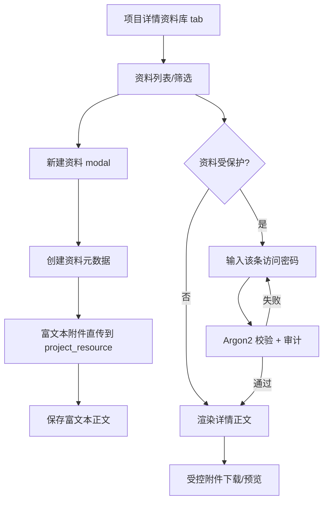

# feat: 新增项目资料库与单条访问密码

## Overview

项目详情页新增“资料库”tab，用资料条目承载项目级文档、参数、客户资料和会议纪要。资料正文复用现有富文本体验，正文附件继续走受控附件上传/下载链路；每条资料可选设置访问密码，密码只保存哈希，受保护资料查看详情前必须验证该条密码。

## Problem Frame

需求、任务、Bug 之外的项目资料需要长期沉淀，但旧“文件”入口只能表达文件列表，无法保存说明上下文。资料库需要成为项目维度知识沉淀入口，并继承当前工作项讨论区的富文本、粘贴截图、拖拽上传和媒体预览体验。（see origin: `docs/brainstorms/2026-07-13-project-resource-library-requirements.md`）

## Requirements Trace

- R1-R5：项目详情新增资料库 tab，提供资料列表、关键词搜索、分类筛选和归档筛选。
- R6-R10：支持新建、编辑、归档资料；正文使用富文本；保留创建/编辑元信息。
- R11-R13：详情以富文本正文为主，正文附件使用受控下载/预览入口。
- R14：项目成员可查看；写入权限沿用现有项目内容写权限。
- R15-R18：资料可选单条访问密码，受保护详情查看前校验，密码只保存哈希。
- R19：创建、编辑、归档、受保护访问尝试进入项目动态或审计。
- R20-R21：富文本初始化和上传逻辑复用现有组件约定，避免新建割裂编辑器。

## Scope Boundaries

- 第一阶段做“访问密码保护详情读取”，不做正文加密、项目级保险箱、密码轮换或共享密码管理。
- 不恢复旧文件 tab；文件作为资料正文内联附件存在。
- 不做全文版本对比；仅记录创建/编辑/归档动态和审计。
- 不新增资料专属 RBAC 权限点，沿用项目查看与项目内容写权限。

## Context & Research

### Relevant Code and Patterns

- `api/src/web/user/mod.rs`：项目详情页、成员管理、工作项创建、附件 Web 下载、权限 helper、审计记录。
- `api/src/web/api/mod.rs`：工作项/评论/附件 JSON API，前端直传依赖这些端点。
- `api/src/domains/projects.rs`：项目成员、工作项、评论、动态和 HTML 正文清洗相关模式。
- `api/src/domains/files.rs`：附件目标类型、附件创建、上传完成、受控下载和项目动态记录。
- `api/static/app.js`：`data-rich-text-editor` 富文本初始化、粘贴/拖拽附件、直传、序列化、右键菜单和图片预览。
- `api/templates/web/projects/detail.html`：项目详情胶囊 tab、成员表格、新建工作项富文本 modal。

### Institutional Learnings

- 项目 `AGENTS.md` 要求默认在 `main` 上开发、每轮提交前查看状态、只暂存本轮相关文件。
- `docs/standards/git-workflow.md` 要求提交前至少执行 `git diff --check` 并查看 staged diff。
- 历史 UI 计划强调统一组件风格和富文本复用，资料库不应新建独立上传体验。

### External References

- 不需要外部资料；现有 Axum、SQLx、Askama、Argon2 和前端直传模式已足够，优先遵循仓库本地实现。

## Key Technical Decisions

- **新增 `project_resources` 表而不是复用附件表**：资料是“标题 + 分类 + 富文本正文 + 状态 + 元信息”的业务对象，附件只是正文里的组成部分。
- **访问密码保存 Argon2 哈希**：复用 `auth::hash_password` / `auth::verify_password`，不保存明文；访问密码规则单独放宽为 4-128 字符，符合资料级口令的轻量使用场景。
- **受保护详情采用 POST 验证后渲染**：不把密码放在 URL，不做长期解锁态；详情页初始只显示验证表单，验证成功的同次响应渲染正文和编辑入口。
- **附件目标类型扩展为 `project_resource`**：资料正文中的文件需要绑定资料 ID；下载端点必须校验项目访问和资料保护状态。
- **创建流程先落资料草稿再上传附件再补正文**：与工作项新建富文本相同，前端先创建资料元数据，再把粘贴/拖拽的附件上传到资料，最后保存包含附件下载 URL 的富文本正文。

## Open Questions

### Resolved During Planning

- 资料写权限：沿用 `user_can_write_project_content_for_context` 与项目生命周期写入校验，不新增 RBAC。
- 编辑历史：第一期只记录动态和审计，不提供可视化历史版本。
- 访问密码强度：资料访问密码采用 4-128 字符，区别于登录密码的 10-128 字符要求。

### Deferred to Implementation

- 现有富文本函数的最小改造边界：实现时根据 `app.js` 当前函数耦合情况决定抽通用配置还是只增加资源场景分支。
- 资料详情采用独立页面还是局部弹窗：优先以独立详情页保证密码验证、附件下载和回退体验稳定；列表中可用 modal 形式承载创建/编辑。

## High-Level Technical Design

> *This illustrates the intended approach and is directional guidance for review, not implementation specification. The implementing agent should treat it as context, not code to reproduce.*

## Implementation Units

- [x] **Unit 1: 资料数据模型与领域服务**

**Goal:** 建立资料条目的持久化模型、校验、列表、详情、创建、编辑、归档和访问密码验证。

**Requirements:** R1-R10, R14-R19

**Dependencies:** 无

**Files:**
- Create: `api/migrations/202607130002_create_project_resources.sql`
- Create: `api/src/domains/project_resources.rs`
- Modify: `api/src/domains/mod.rs`
- Modify: `api/src/domains/files.rs`
- Test: `api/tests/project_management_flow.rs`

**Approach:**
- 新表保存项目 ID、标题、分类、正文、正文格式、状态、访问密码哈希、创建/更新/归档元信息。
- `file_attachments.target_type` CHECK 扩展支持 `project_resource`。
- 领域服务负责输入校验、HTML 清洗、资料摘要、分类枚举、归档状态和访问密码哈希/验证。
- 创建/编辑/归档记录项目动态；受保护访问成功/失败进入审计。

**Patterns to follow:**
- `api/src/domains/projects.rs` 的工作项/评论输入校验和动态记录。
- `api/src/domains/files.rs` 的附件目标类型校验。

**Test scenarios:**
- Happy path：项目成员创建未加密资料 -> 列表可见 -> 详情无需密码可读正文。
- Happy path：创建带访问密码资料 -> 列表显示受保护 -> 正确密码验证后返回详情。
- Error path：错误访问密码不能返回正文，并记录失败审计。
- Error path：只读成员不能创建/编辑/归档资料。
- Edge case：归档资料默认列表不显示，归档筛选可显示。
- Integration：资料正文附件绑定到 `project_resource` 后可通过受控入口下载。

**Verification:**
- 资料 CRUD、密码校验、附件目标类型和审计动态行为均可通过集成测试验证。

- [x] **Unit 2: Web/API 路由与模板接入**

**Goal:** 把资料库接入项目详情、资料详情、资料创建/编辑/归档和附件上传/下载。

**Requirements:** R1-R19

**Dependencies:** Unit 1

**Files:**
- Modify: `api/src/web/router.rs`
- Modify: `api/src/web/user/mod.rs`
- Modify: `api/src/web/api/mod.rs`
- Modify: `api/templates/web/projects/detail.html`
- Create: `api/templates/web/projects/resource_detail.html`
- Test: `api/tests/routing_smoke.rs`
- Test: `api/tests/project_management_flow.rs`

**Approach:**
- 项目详情 `tab=library` 加载资料列表、分类选项和筛选状态。
- Web 详情页对受保护资料先展示密码表单；POST 验证成功后渲染正文。
- JSON API 提供资料创建、更新正文/元信息、归档、附件创建/上传完成/下载签名端点，供富文本直传复用。
- Web 下载入口对受保护资料要求已验证访问；第一期通过详情页渲染后的受控下载 URL 访问，不暴露对象存储长期地址。

**Patterns to follow:**
- `project_detail_page`、`work_items_create`、`project_attachment_download`。
- `api/src/web/api/mod.rs` 的工作项评论附件 API。

**Test scenarios:**
- Happy path：`/web/projects/{key}?tab=library` 渲染资料库 tab。
- Happy path：未加密资料详情 GET 直接显示正文。
- Error path：加密资料详情 GET 不显示正文，错误密码 POST 提示错误。
- Integration：API 创建资料后可 PATCH 正文并在 Web 列表看到更新时间。

**Verification:**
- 路由冒烟测试覆盖新增 Web 和 API 路径，模板渲染无 Askama 编译错误。

- [x] **Unit 3: 富文本资源场景复用与 UI**

**Goal:** 资料新建/编辑复用现有富文本交互，列表和详情 UI 与项目整体风格一致。

**Requirements:** R2-R13, R20-R21

**Dependencies:** Unit 2

**Files:**
- Modify: `api/static/app.js`
- Modify: `api/static/app.css`
- Modify: `api/templates/web/projects/detail.html`
- Modify: `api/templates/web/projects/resource_detail.html`
- Test: `scripts/test-discussion-js.mjs`

**Approach:**
- 扩展 `data-rich-text-editor` 附件上传配置，支持资料场景的创建 URL、上传 URL、完成 URL 和下载 URL。
- 新增资料表单提交逻辑：创建资料 -> 上传富文本附件 -> 保存富文本正文 -> 跳转详情或返回列表。
- 列表使用项目现有卡片/表格视觉语言：分类 tag、受保护 badge、更新时间、创建人、摘要和操作按钮。
- 详情正文使用现有 `.rich-content`/附件预览样式，图片/视频右键菜单和预览弹窗继续由全局组件处理。

**Patterns to follow:**
- 工作项新建富文本 modal 和讨论区 `data-rich-text-editor`。
- 现有 `.content-tabs`、`.data-table`、`.status`、`.rich-text-*` 样式。

**Test scenarios:**
- Happy path：粘贴图片后资料创建，上传态显示在图片蒙版中，提交后正文包含图片。
- Happy path：普通文件以文件卡片/链接显示并支持右键复制、预览（可预览时）、下载。
- Error path：附件上传失败时表单保留当前资料和可重试状态。
- Visual：资料库 tab、空状态、新建 modal、受保护详情页与现有 UI 风格一致。

**Verification:**
- JS 单测覆盖富文本序列化或关键函数；浏览器冒烟截图无明显布局问题。

## System-Wide Impact

- **Interaction graph:** 项目详情页、资料详情页、JSON API、附件服务、审计日志和项目动态会新增资料路径。
- **Error propagation:** Web 表单错误应通过页面提示或 toast 回到原页面；API 错误保持 JSON envelope。
- **State lifecycle risks:** 创建资料后附件上传失败可能留下正文为空的资料；前端需保留资料 ID 并允许重试/编辑补写。
- **API surface parity:** Web 与 API 都需要项目访问校验；附件下载必须校验资料所属项目。
- **Integration coverage:** 至少覆盖“资料创建 -> 富文本附件上传 -> 正文保存 -> 详情展示/下载”的跨层链路。
- **Unchanged invariants:** 工作项、评论和项目附件现有上传路径不改变；只扩展富文本和附件目标类型。

## Risks & Dependencies

- SQLite CHECK 约束扩展需要重建 `file_attachments` 表；迁移必须保留既有数据和索引。
- 受保护资料如果附件下载绕过密码验证，会破坏保险箱体验；下载端点必须识别资料保护状态。
- 前端富文本已有工作项/评论耦合，扩展时不能破坏工作项新建和讨论区上传。
- 资料访问密码是“访问门禁”不是内容加密；需要在 UI 文案中避免暗示正文已加密存储。

## Documentation / Operational Notes

- 新增迁移随正式部署执行。
- 上线后重点观察 `project_resource.*`、`file.attach.project_resource` 和 `project_resource.unlock.*` 审计动作。
- 若有半完成资料（正文为空但已创建），可通过编辑资料补正文或归档处理。

## Sources & References

- **Origin document:** `docs/brainstorms/2026-07-13-project-resource-library-requirements.md`
- Related code: `api/src/web/user/mod.rs`
- Related code: `api/src/web/api/mod.rs`
- Related code: `api/src/domains/files.rs`
- Related code: `api/static/app.js`
- Related code: `api/templates/web/projects/detail.html`
