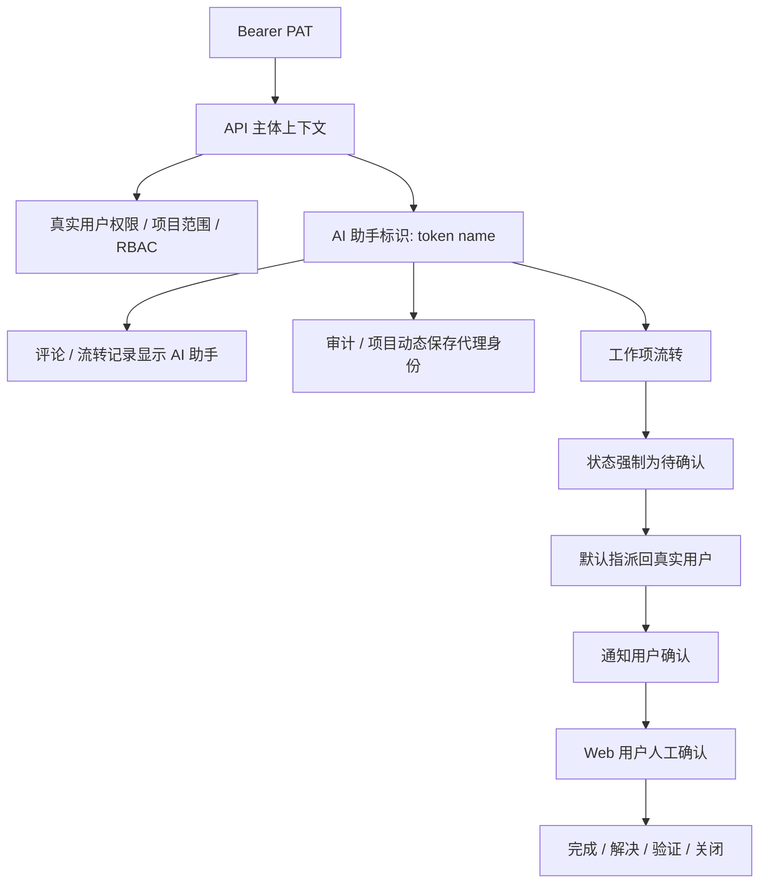

# feat: AI 助手 Token 身份与待确认流转

## Overview

在现有 OpenAPI / MCP / PAT 基础上补齐“用户授权的 AI 助手代理身份”与“AI 结果必须人工确认”的闭环。Token 继续绑定真实用户并继承其权限边界，但 OpenAPI Bearer Token 调用需要保留 token 名称作为 AI 助手身份；AI 对需求、任务、Bug 的处理结果只能提交到“待确认”，最终完成、验证或关闭仍由真实用户确认。

## Problem Frame

现有 PAT 已经按 `user_id`、scope、项目范围进行隔离，但 API handler 只拿到真实用户 `AuthUser`，无法区分“用户本人”与“该用户创建的 AI 助手 token”。同时工作项状态缺少“待确认”，Bearer Token 可以通过 OpenAPI 直接写入终态，和“AI 做完后由用户确认”的产品边界不一致。需要把 AI 作为用户授权的子身份纳入审计、评论、通知和 MCP 工具语义，同时避免 AI 直接关闭需求、任务或 Bug。

## Requirements Trace

- R1. Token 必须继续绑定创建用户；API 权限不得超过该用户自身权限、项目成员范围和 token 项目 scope。
- R2. Token 名称作为当前用户的 AI 助手标识；AI 操作在评论、流转、审计或通知中应能和用户本人操作区分。
- R3. 工作项新增“待确认”状态，属于非终态开放状态，纳入待处理统计、角标和列表。
- R4. Bearer Token / MCP 对工作项的状态变更只能提交到“待确认”，不得直接进入完成、解决、验证或关闭等终态。
- R5. AI 提交待确认后，默认指派回 token 所属真实用户，方便用户收到消息并最终确认。
- R6. Web 用户本人仍保留正常状态流转能力，可以从待确认确认到完成 / 解决 / 验证 / 关闭，或打回进行中。
- R7. OpenAPI 契约、MCP 工具和 MCP 初始化文档要明确上述隔离和确认规则。

## Scope Boundaries

- 不创建真实 `users` 表虚拟用户；AI 助手是 token 代理身份，不进入成员列表和系统用户管理。
- 不让 AI 绕过 RBAC、项目成员、项目范围或资料库密码保护。
- 不改变 Cookie session 的人工 Web 操作语义；限制只针对 Bearer Token 认证的 OpenAPI/MCP 调用。
- 不引入复杂审批流或多级验收；本次只新增一个“待确认”状态。
- 不要求 MCP 发布 npm；仍沿用仓库内置 Node.js 脚本分发方式。

## Context & Research

### Relevant Code and Patterns

- `api/src/domains/api_tokens.rs` 负责 PAT 创建、列表、撤销、scope 和项目范围校验。
- `api/src/web/api/mod.rs` 的 `require_api_user` 当前把 Bearer Token 解析成真实用户，未保留 token 上下文。
- `api/src/domains/projects.rs` 负责工作项状态校验、状态流转、评论、通知和项目动态。
- `api/src/web/user/mod.rs` 和 `api/templates/web/work_items/list.html` 负责 Web 详情、列表、状态选项和统计展示。
- `mcp/yuance-mcp/yuance-mcp-server.mjs` 当前暴露 `yuance_handoff_work_item`，允许传任意状态。
- `docs/openapi/yuance.openapi.json` 和 `docs/mcp/ai-mcp-setup.md` 是对外契约和 MCP 初始化文档。
- `api/tests/auth_security_flow.rs` 已覆盖 PAT UI、创建和 scope 基础逻辑。
- `api/tests/project_management_flow.rs` 已覆盖工作项、评论、富文本、通知和流转相关行为。

### Institutional Learnings

- 当前仓库未发现 `docs/solutions/` 中与 PAT / MCP / 状态机直接相关的历史经验文档。

### External References

- 本次改动主要沿用仓库已有 Axum、sqlx、Askama、MCP SDK 使用模式；无需额外外部研究。

## Key Technical Decisions

- **AI 助手采用 token 代理身份，不创建虚拟用户。** 权限、项目范围和数据隔离继续归真实用户；展示和审计额外携带 token 名称，避免污染用户表、成员列表和权限模型。
- **在 API 层引入认证主体上下文。** Bearer Token 调用需要返回真实用户、token id、token 名称和派生显示名；Cookie session 继续返回普通用户主体。
- **AI 写入只允许待确认。** OpenAPI Bearer Token 对 `update_work_item`、`handoff_work_item` 等会改变状态的入口，必须把目标状态限制为 `pending_confirmation`；如 MCP 工具未传状态，可由工具或后端默认提交待确认。
- **待确认是开放非终态。** 统计、角标、列表的“全部开放项 / 待处理”应包含待确认；`completed_at` 不能因为待确认而写入。
- **AI 提交后默认指派给 token owner。** 若 Bearer Token 调用流转接口未显式指定处理人，后端应指派回真实用户；显式指定处理人时仍需校验项目成员，但状态仍只能是待确认。
- **历史记录保留 AI 快照。** 评论和流程记录需要保存 token 名称快照，避免 token 改名或撤销后历史记录展示丢失语义。

## Open Questions

### Resolved During Planning

- **是否创建真实虚拟用户：** 不创建。采用 token 代理身份，避免污染权限、成员和用户管理模型。
- **AI 是否允许直接关闭工作项：** 不允许。只能提交待确认。
- **AI 提交待确认后默认指派给谁：** 默认指派回 token 所属真实用户，方便用户确认。
- **待确认是否算完成：** 不算完成；它是开放状态。

### Deferred to Implementation

- **AI 身份快照的最小落库字段：** 实现时根据现有表结构选择在 `work_item_comments`、`project_activities`、`notifications` 中新增 agent 字段，或采用兼容性最好的快照字段命名。
- **状态转移细节：** 需要在实现时对现有测试和 UI 选项做一次回归，确认 `pending_confirmation` 对需求、任务、Bug 的下拉项展示都符合预期。
- **OpenAPI PATCH 工作项对非状态字段的处理：** 实现时确认是否允许 AI 编辑标题/描述/优先级；若保留，需要保证只要 Bearer Token 请求包含状态字段就只能是待确认。

## High-Level Technical Design

> *This illustrates the intended approach and is directional guidance for review, not implementation specification. The implementing agent should treat it as context, not code to reproduce.*

## Implementation Units

- [x] **Unit 1: API Token 代理身份上下文**

**Goal:** 让 OpenAPI handler 能区分 Cookie session 用户与 Bearer Token AI 助手，并拿到 token id、token 名称和代理显示名。

**Requirements:** R1, R2

**Dependencies:** None

**Files:**
- Modify: `api/src/domains/api_tokens.rs`
- Modify: `api/src/web/api/mod.rs`
- Test: `api/tests/auth_security_flow.rs`

**Approach:**
- 扩展 PAT 查询结果，在认证 Bearer Token 时返回 token id、token name、真实用户信息和显示名快照。
- 在 `api/src/web/api/mod.rs` 内建立轻量 `ApiPrincipal` 或等价上下文，替换只返回 `AuthUser` 的内部 helper。
- Cookie session 路径继续保持无 token 上下文，CSRF 规则不变。
- token 名称校验沿用现有 1-80 字符规则。

**Patterns to follow:**
- `api_tokens::user_from_bearer_token` 的 token 哈希查找和 `last_used_at` 更新模式。
- `auth::AuthUser` 的最小认证用户结构。

**Test scenarios:**
- Happy path: Bearer Token 调用 `/api/v1/me` 或项目读取时仍以真实用户权限通过。
- Happy path: token 使用后 `last_used_at` 更新，token 元信息可被 handler 读取。
- Error path: 撤销 token、过期 token、无效 token 仍返回 401。
- Integration: Cookie session 写请求缺少 CSRF 仍失败，Bearer Token 写请求仍跳过 CSRF。

**Verification:**
- 所有 OpenAPI 入口仍能通过真实用户权限校验，且 Bearer Token 路径可获得 token 名称。

- [x] **Unit 2: 待确认状态与 Web 状态机**

**Goal:** 给需求、任务、Bug 新增 `pending_confirmation` 状态，并保证 Web 列表、统计、角标、标签和状态下拉都正确展示。

**Requirements:** R3, R6

**Dependencies:** None

**Files:**
- Modify: `api/src/domains/projects.rs`
- Modify: `api/src/web/user/mod.rs`
- Modify: `api/templates/web/work_items/list.html`
- Modify: `docs/openapi/yuance.openapi.json`
- Test: `api/tests/project_management_flow.rs`

**Approach:**
- 扩展工作项状态校验、状态标签、状态转移、筛选统计中的开放状态判断。
- `pending_confirmation` 不写入 `completed_at`。
- 对需求/任务/bug 状态选项展示“待确认”，并允许人工确认到合适终态或打回进行中。
- 保持历史 `cancelled` 兼容行为。

**Patterns to follow:**
- `projects::validate_work_item_status`、`allowed_work_item_status_transitions`、`work_item_status_label`。
- `work_item_status_options` 和 `work_item_labels` 的 UI 文案映射。

**Test scenarios:**
- Happy path: 工作项从进行中流转到待确认后，详情和列表显示“待确认”。
- Happy path: 待确认仍被 `status=pending` 统计为开放项。
- Happy path: Web 人工可从待确认流转到进行中、已完成/已解决/已验证或已关闭。
- Error path: 非法状态仍返回业务错误，错误文案包含待确认枚举。
- Integration: 待确认不设置 `completed_at`，待处理角标和项目统计仍包含该项。

**Verification:**
- UI 和 API 返回的状态码、状态文案、状态 tone 一致。

- [x] **Unit 3: AI 助手流转约束与默认指派**

**Goal:** 对 Bearer Token 发起的工作项状态变更强制“待确认”，默认指派回 token owner，并记录 AI 助手身份。

**Requirements:** R2, R4, R5

**Dependencies:** Unit 1, Unit 2

**Files:**
- Modify: `api/src/web/api/mod.rs`
- Modify: `api/src/domains/projects.rs`
- Test: `api/tests/project_management_flow.rs`
- Test: `api/tests/auth_security_flow.rs`

**Approach:**
- Bearer Token 调用 `handoff_work_item` 时，目标状态只能是 `pending_confirmation`；如果处理人为空，默认使用 token owner username。
- Bearer Token 调用 `update_work_item` 时，如果请求包含状态字段，只能是 `pending_confirmation`；如果不包含状态字段，保留现有状态，不额外完成确认。
- 需要改变状态、流转、评论或审计时，传入代理显示名快照，供流程记录和通知展示。
- 人工 Cookie session 不受 AI 状态限制。

**Patterns to follow:**
- `projects::handoff_work_item` 的事务、通知、流程评论和项目动态创建逻辑。
- `api::ensure_api_token_scope` 和项目写权限校验顺序。

**Test scenarios:**
- Happy path: AI token 调用 handoff 不传处理人时，状态变成待确认，处理人变成 token owner。
- Happy path: 流程记录作者显示为“用户 的 AI助手「token 名称」”或等价文案。
- Happy path: 被指派回的真实用户收到消息，消息 actor 是 AI 助手标识。
- Error path: AI token 尝试把状态改为 `closed`、`done`、`resolved` 或 `verified` 返回 400/403。
- Integration: Cookie session 用户仍可从待确认确认到终态。

**Verification:**
- MCP 通过 OpenAPI 处理工作项时只能留下待确认记录，不能直接关闭。

- [x] **Unit 4: 持久化 AI 助手展示与历史快照**

**Goal:** 在评论、流转、项目动态、通知等用户可见历史中稳定展示 AI 助手身份。

**Requirements:** R2, R5

**Dependencies:** Unit 1, Unit 3

**Files:**
- Create: `api/migrations/202607140002_add_api_token_actor_snapshots.sql`
- Modify: `api/src/domains/projects.rs`
- Modify: `api/src/domains/notifications.rs`
- Modify: `api/src/web/api/mod.rs`
- Modify: `api/src/web/user/mod.rs`
- Modify: `api/templates/web/partials/work_item_detail.html`
- Test: `api/tests/project_management_flow.rs`

**Approach:**
- 为需要展示历史作者的表增加可空 actor 快照字段，至少覆盖工作项评论；通知和项目动态如已有 actor join 逻辑，也要能优先使用快照。
- Cookie session 继续使用真实用户显示名。
- Bearer Token 创建评论、流转或通知时写入快照，避免 token 后续改名或撤销影响历史显示。
- 快照文案应简洁、可读，并带出真实用户归属。

**Patterns to follow:**
- `work_item_comments` 查询中的 `COALESCE(u.display_name, '系统')` 模式。
- `notifications::create_in_transaction` 与 `list_for_user` 的 actor 展示模式。

**Test scenarios:**
- Happy path: AI token 发表评论后，评论作者显示 AI 助手名，而不是只显示真实用户。
- Happy path: AI 流转记录和通知列表 actor 均展示 AI 助手名。
- Edge case: token 撤销后，历史评论仍显示原 AI 助手快照。
- Integration: 普通用户评论不写 AI 快照，展示保持原样。

**Verification:**
- 用户可以清楚分辨“本人操作”和“本人授权的 AI 助手操作”。

- [x] **Unit 5: MCP 工具和 OpenAPI 文档收紧**

**Goal:** 更新 MCP 工具、OpenAPI 契约和初始化说明，明确 AI 只能提交待确认，并提供更安全的工具语义。

**Requirements:** R4, R7

**Dependencies:** Unit 2, Unit 3

**Files:**
- Modify: `mcp/yuance-mcp/yuance-mcp-server.mjs`
- Modify: `mcp/yuance-mcp/README.md`
- Modify: `docs/mcp/ai-mcp-setup.md`
- Modify: `docs/openapi/yuance.openapi.json`
- Test: `mcp/yuance-mcp/yuance-mcp-server.mjs`
- Test: `api/tests/routing_smoke.rs`

**Approach:**
- 将 MCP 流转工具描述改为“提交待确认”，工具内部默认传 `pending_confirmation`，不再要求 AI 自由填写状态。
- OpenAPI schema 中补充工作项状态枚举和 Bearer Token 的状态限制说明。
- 文档说明 token 名称就是 AI 助手名称，AI 写入只会进入待确认，最终确认由用户完成。

**Patterns to follow:**
- 现有 MCP `registerTool` 风格和错误处理。
- `docs/mcp/ai-mcp-setup.md` 当前面向 AI 的分步说明风格。

**Test scenarios:**
- Happy path: `node --check mcp/yuance-mcp/yuance-mcp-server.mjs` 通过。
- Happy path: OpenAPI JSON 可解析，包含 `pending_confirmation` 和 AI token 说明。
- Error path: MCP 工具输入 schema 不再诱导模型填写任意终态。

**Verification:**
- AI Agent 看到工具说明后会走“提交待确认”，而不是“关闭工作项”。

## System-Wide Impact

- **Interaction graph:** API 认证、PAT、工作项状态机、评论、通知、项目动态、OpenAPI 文档和 MCP 工具都会受影响。
- **Error propagation:** AI 尝试终态写入时应返回统一 JSON error envelope；Web 人工确认失败仍沿用现有业务错误。
- **State lifecycle risks:** 待确认不是终态，不能触发 `completed_at`；否则统计会提前把 AI 处理项算完成。
- **API surface parity:** Cookie session 和 Bearer Token 共用 `/api/v1` 路由，但状态能力不同；文档必须明确。
- **Integration coverage:** 需要端到端覆盖 token -> handoff -> comment/notification -> Web 人工确认的链路。
- **Unchanged invariants:** token 仍不存明文；项目 scope、RBAC、资料库保护和 CSRF 语义不放宽。

## Risks & Dependencies

| Risk | Mitigation |
|------|------------|
| AI 身份落库字段设计过重 | 使用快照字段和 token id 引用，避免真实虚拟用户模型 |
| 待确认被错误算作完成 | 明确排除 `completed_at`，并补统计测试 |
| OpenAPI 和 Web 状态能力不一致 | 后端按认证主体强制限制，文档只描述对外承诺 |
| MCP 旧工具名称引导 AI 误操作 | 工具描述改为提交待确认，默认状态由脚本固定 |
| 迁移影响历史数据 | 新字段可空，新状态只新增枚举逻辑，不回填历史状态 |

## Documentation / Operational Notes

- 需要更新 `/api/openapi.json` 暴露的 schema 和说明。
- 需要更新 `docs/mcp/ai-mcp-setup.md`，指导用户用 token name 命名 AI 助手。
- 部署时需要运行新迁移；发布后检查迁移状态、OpenAPI JSON、MCP 语法检查和一个 AI token 待确认流转场景。

## Sources & References

- Related plan: `docs/plans/2026-07-14-001-feat-openapi-mcp-ai-integration-plan.md`
- Related code: `api/src/domains/api_tokens.rs`
- Related code: `api/src/web/api/mod.rs`
- Related code: `api/src/domains/projects.rs`
- Related code: `mcp/yuance-mcp/yuance-mcp-server.mjs`
- Related docs: `docs/mcp/ai-mcp-setup.md`
