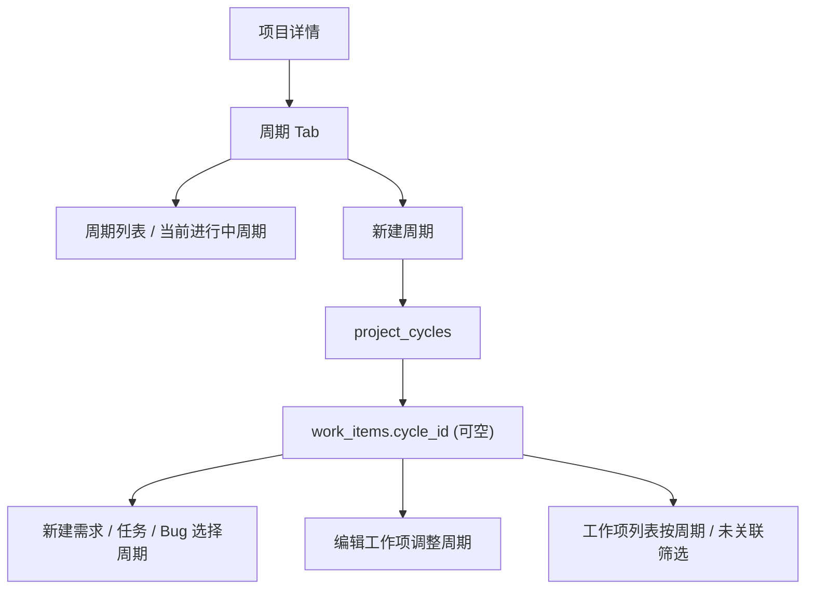

# feat: 新增项目周期与工作项可选归属

## Overview

在项目详情页新增“周期”tab，把项目内多阶段、多轮迭代或专项周期抽象为独立管理对象。周期必须具备开始日期和结束日期，用于约束时间范围、承载阶段目标，并为需求 / 任务 / Bug 提供可选归属；历史遗留问题允许不关联任何周期。

## Problem Frame

当前系统只有“项目 -> 需求 / 任务 / Bug / 资料 / 动态”这一层，没有可表达“某一轮迭代、版本周期、专项推进窗口”的结构。项目时间本身不是必填，无法满足“通过明确时间段把控项目进度”的管理需求；同时部分 Bug 属于历史功能或横向问题，不应被强制塞进某个迭代容器。因此需要新增独立的周期模型，并保持与工作项的关联可选。

## Requirements Trace

- R1：项目详情页 tab 顺序调整为“详情 / 周期 / 成员 / 资料库 / 动态”。
- R2：周期是项目下独立功能，不并入需求 / 任务 / Bug 类型体系。
- R3：周期名称必填。
- R4：周期开始日期、结束日期必填。
- R5：周期可填写目标或说明，但不是必填。
- R6：周期与需求 / 任务 / Bug 的关联是可选，不强制。
- R7：工作项允许处于“未关联周期”状态，适配历史遗留 Bug / 运维问题 / 临时插单。
- R8：项目详情周期 tab 至少能查看周期列表、创建周期、编辑周期、归档或关闭周期。
- R9：周期页需要展示基础进度统计：关联需求数、任务数、Bug 数、待处理数。
- R10：工作项创建 / 编辑时可选择所属周期。
- R11：工作项列表和项目详情内工作项入口支持按周期筛选，并支持“未关联周期”筛选。
- R12：周期的时间信息必须参与状态表达，便于直观看当前是否未开始 / 进行中 / 已结束。

## Scope Boundaries

- 第一阶段只做“一个工作项最多归属一个当前周期”，不做多周期同时关联。
- 不做甘特图、燃尽图、依赖图、里程碑图等高级排期可视化。
- 不做周期模板、批量复制周期、跨项目周期复用。
- 不在 OpenAPI / MCP 第一阶段暴露周期写接口，先确保 Web 与 domain 模型稳定。
- 不改项目本身的日期是否必填规则；仅新增周期的强制时间约束。

## Context & Research

### Relevant Code and Patterns

- `api/src/domains/projects.rs`：已集中承载项目、成员、工作项、评论、动态查询与写入，是周期和工作项关联最直接的 domain 落点。
- `api/src/web/user/mod.rs`：项目详情页 tab、项目成员、资料库、工作项创建与编辑表单都在这里拼装。
- `api/templates/web/projects/detail.html`：项目详情胶囊 tab、成员表格、资料库卡片和 modal 入口都已成型，周期 tab 可直接复用。
- `api/templates/web/work_items/list.html`、`api/templates/web/work_items/detail.html`：工作项列表 / 创建 / 编辑入口后续需要接入周期选择。
- `api/static/app.css`：已有 `.content-tabs`、`.project-tab-section`、`.table-wrap`、`.status`、`.metric` 等样式，可直接承接周期 UI。
- `api/tests/project_management_flow.rs`：项目、成员、工作项、评论、资料库等集成测试已经集中在这里，周期功能应继续扩展该测试。

### Institutional Learnings

- 项目 `AGENTS.md` 规定跨模块功能先规划再执行，计划文档落在 `docs/plans/`。
- 提交前至少执行 `git diff --check`；只暂存本轮相关文件，不混入无关脏改动。
- 当前项目工作项、资料库、消息等能力均围绕“项目成员关系控制数据范围”的模型构建，周期不应新增独立 RBAC 权限点。

### External References

- 本次不依赖外部框架或资料；现有 Axum + SQLx + Askama + 原生 JS 足以完成。

## Key Technical Decisions

- **命名统一为“周期”，不使用“阶段”。** “阶段”更像流程节点，容易把模型锁死；“周期”能覆盖迭代、版本窗口、专项推进等多种场景。
- **周期独立建表，工作项仅保留可空外键。** 避免把时间管理语义塞进工作项本体，同时保留历史遗留问题的空归属能力。
- **周期状态以日期和关闭态共同决定。** 数据库存 `closed_at`，展示层按“关闭 > 未开始 > 进行中 > 已结束”推导状态，减少人工维护错误。
- **第一期不记录多对多历史归属，只记录当前归属。** 如果后续需要追溯“曾属于哪个周期”，再追加迁移历史表；当前先保证主链路简单稳定。
- **周期统计走聚合查询，不做冗余缓存。** 工作项数量、待处理数量等按周期实时统计，避免迁移初期引入额外一致性成本。
- **项目详情先落地周期 tab，工作项列表再补筛选。** 优先让周期模型可见、可建、可用，再把它接入全局工作项入口。

## Open Questions

### Resolved During Planning

- 周期时间是否必填：是，开始日期与结束日期均必填。
- 工作项是否必须关联周期：否，允许空值。
- 模块位置：放在项目详情 tab 中，位于“详情”之后。
- 周期名称是否允许自由命名：允许，用户自行输入如“v2.3.0 版本周期”“支付专项修复期”等。

### Deferred to Implementation

- 是否在工作项详情右侧字段区直接显示周期 badge：第一阶段建议显示，具体位置在实现时决定。
- 周期关闭的交互是“关闭”还是“归档”：实现阶段根据现有按钮语言统一到项目风格。

## High-Level Technical Design

## Implementation Units

- [ ] **Unit 1: 周期数据模型与迁移**

**Goal:** 新增项目周期表和工作项可空关联字段，提供基础校验与查询模型。

**Requirements:** R2-R7, R12

**Dependencies:** 无

**Files:**
- Create: `api/migrations/202607210001_create_project_cycles.sql`
- Modify: `api/src/domains/projects.rs`
- Test: `api/tests/project_management_flow.rs`

**Approach:**
- 新增 `project_cycles` 表，字段包含：`id`、`project_id`、`name`、`goal`、`description`、`owner_user_id`、`start_date`、`end_date`、`sort_order`、`closed_at`、`created_at`、`updated_at`。
- 给 `work_items` 增加可空 `cycle_id` 外键。
- 在 domain 层新增周期 summary / detail / stats 结构，以及创建、更新、列出、关闭相关函数。
- 校验 `start_date <= end_date`，并保证周期名称非空。

**Patterns to follow:**
- `projects.rs` 中项目与资料的校验、时间字段处理和 summary/detail 结构。
- 现有迁移文件的 SQLite 风格与索引命名。

**Test scenarios:**
- Happy path：成功创建一个有起止日期的周期。
- Error path：开始日期晚于结束日期时拒绝创建。
- Happy path：工作项可不关联周期。
- Happy path：工作项可关联指定项目下的周期。
- Error path：跨项目周期不能被关联到工作项。

**Verification:**
- 迁移可执行，domain 查询/写入在集成测试中通过。

- [ ] **Unit 2: 项目详情周期 tab 与管理界面**

**Goal:** 在项目详情页新增周期 tab，支持周期列表展示和基本管理操作。

**Requirements:** R1, R3-R5, R8-R9, R12

**Dependencies:** Unit 1

**Files:**
- Modify: `api/src/web/user/mod.rs`
- Modify: `api/src/web/router.rs`
- Modify: `api/templates/web/projects/detail.html`
- Modify: `api/static/app.css`
- Test: `api/tests/routing_smoke.rs`

**Approach:**
- 扩展 `ProjectDetailTemplate`，注入周期列表、当前周期摘要、创建/编辑所需选项。
- tab 导航增加 `cycles`，位置在 `info` 之后。
- 周期列表优先采用表格 + 当前进行中周期卡片的组合。
- 提供新建周期 modal 和编辑周期 modal；关闭/归档使用确认按钮。
- 页面内展示周期状态 badge、时间范围、负责人、关联工作项统计。

**Patterns to follow:**
- `project-tab-library`、`project-tab-members` 的 tab 结构。
- 现有 `.table-wrap`、`.data-table`、`.status`、`.metric` 样式系统。

**Test scenarios:**
- Happy path：访问 `/web/projects/{key}?tab=cycles` 能渲染周期页。
- Happy path：有权限成员能看到新建周期入口。
- Permission path：无项目写权限成员看不到新建/编辑周期入口。
- Visual：周期 tab 与现有项目 tab 高度、滑块和内容布局保持一致。

**Verification:**
- Askama 模板编译通过；路由和页面渲染测试通过。

- [ ] **Unit 3: 工作项与周期可选关联**

**Goal:** 在需求 / 任务 / Bug 新建与编辑流程中接入周期选择，并在详情中显示当前周期。

**Requirements:** R6-R7, R10

**Dependencies:** Unit 1

**Files:**
- Modify: `api/src/web/user/mod.rs`
- Modify: `api/src/domains/projects.rs`
- Modify: `api/templates/web/projects/detail.html`
- Modify: `api/templates/web/work_items/list.html`
- Modify: `api/templates/web/work_items/detail.html`
- Test: `api/tests/project_management_flow.rs`

**Approach:**
- 新建 / 编辑工作项表单增加“周期”下拉，第一项为“不关联周期”。
- 项目详情页的新建工作项 modal 也同步增加周期选择。
- 工作项详情页显示当前周期 badge 或字段项。
- create/update domain 校验传入的周期必须属于同项目。

**Patterns to follow:**
- 现有处理人 / 父需求 searchable select 的接入方式。
- 工作项创建与编辑的表单流转逻辑。

**Test scenarios:**
- Happy path：创建任务时选择周期，详情页可看到关联周期。
- Happy path：Bug 不选择周期也能正常创建。
- Error path：传入其他项目的周期 ID 返回 BadRequest。

**Verification:**
- 工作项创建、编辑和详情页展示链路在集成测试中通过。

- [ ] **Unit 4: 周期筛选与基础统计**

**Goal:** 让项目内和全局工作项入口能按周期查看数据，并支持未关联周期筛选。

**Requirements:** R9, R11

**Dependencies:** Unit 3

**Files:**
- Modify: `api/src/domains/projects.rs`
- Modify: `api/src/web/user/mod.rs`
- Modify: `api/templates/web/work_items/list.html`
- Modify: `api/templates/web/projects/detail.html`
- Test: `api/tests/project_management_flow.rs`

**Approach:**
- 工作项列表 query 增加 `cycle` 参数，支持具体周期 ID / `none` / 空。
- 项目详情周期列表展示统计：需求数、任务数、Bug 数、待处理数。
- 周期详情（若第一期不做独立详情页）至少提供“查看该周期工作项”的快捷入口。

**Patterns to follow:**
- 资料库的 query 筛选模式。
- 现有分页和表格局部刷新方案。

**Test scenarios:**
- Happy path：筛选某周期仅返回该周期工作项。
- Happy path：筛选 `none` 返回未关联周期工作项。
- Integration：周期统计与工作项数量一致。

**Verification:**
- query 条件、列表和统计在集成测试中一致。

## System-Wide Impact

- **Interaction graph:** 项目详情页、新建工作项 modal、工作项列表、工作项详情页都会新增周期语义。
- **Data integrity risks:** `work_items.cycle_id` 必须校验所属项目，避免跨项目脏关联。
- **State lifecycle:** 周期状态主要由日期推导，关闭态由显式操作控制；不能出现“结束后仍展示进行中”的混乱文案。
- **Permission model:** 周期查看沿用项目可见范围；周期写入沿用项目内容写权限或项目管理权限，不新增独立 RBAC。
- **OpenAPI parity:** 第一阶段暂不要求 API 对外暴露周期写接口，但内部设计需避免未来扩展受阻。

## Risks & Dependencies

- 给 `work_items` 增加外键后，创建与更新逻辑都要补校验，否则容易引入跨项目引用。
- 当前项目详情页已经较重，周期 tab 需要控制信息密度，避免再次堆白屏。
- 如果第一阶段就同时做工作项列表筛选、详情展示、周期管理，改动面会跨 template / domain / tests 多处，需要分 unit 控制提交粒度。

## Documentation / Operational Notes

- 周期功能上线后，项目经理可先建周期，再逐步把新工作项归属进去；历史工作项不需要一次性回填。
- 后续如果需要“周期流转历史”，建议新增单独表，不要在第一阶段过早复杂化。

## Sources & References

- Related code: `api/src/domains/projects.rs`
- Related code: `api/src/web/user/mod.rs`
- Related code: `api/templates/web/projects/detail.html`
- Related code: `api/templates/web/work_items/list.html`
- Related code: `api/templates/web/work_items/detail.html`
