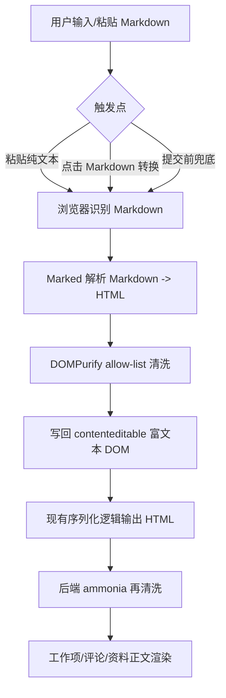

# feat: 富文本编辑器支持代码块与 Markdown 自动转换

## 概览

当前元策的富文本编辑器以浏览器 `contenteditable` + HTML 白名单存储为核心，已支持基础格式、链接、对齐、图片/视频/文件附件，但不支持代码块，也不会把用户输入的 Markdown 语法转换为最终可渲染的富文本 HTML。本次改造目标是在不扩大后端 `body_format` 协议范围的前提下，让浏览器编辑器同时具备“代码块编辑能力”和“Markdown 转富文本能力”，覆盖工作项主内容、评论回复、新建工作项和项目资料正文等现有富文本场景。

## 问题范围

- 富文本工具栏没有代码块能力，用户无法直接表达带换行和等宽格式的技术内容。
- 用户输入或粘贴 Markdown 时，当前只会当普通文本处理，渲染后仍然是 `#`、`**`、````` 等原始字符。
- 工作项正文、评论正文、资料正文共用同一套富文本链路，任何能力补充都需要统一落到编辑器、序列化、清洗和展示样式上。

## 需求追踪

- R1. 富文本编辑器需要支持插入和展示代码块。
- R2. 用户粘贴 Markdown 文本时，应能转换为富文本 HTML，而不是原样文本落库。
- R3. 用户直接输入 Markdown 文本后提交时，也应能自动转换为富文本 HTML。
- R4. Markdown 转换后的 HTML 必须经过前端与后端双重安全收敛，不能把不受控 HTML 或危险链接注入编辑器与展示页。
- R5. 工作项主内容、评论/回复、资料正文、新建工作项说明内容都要共享这套能力。
- R6. 现有附件内联、图片/视频预览、右键菜单、对齐能力不能被破坏。

## 范围边界

- 不新增数据库字段，也不把 `body_format` 扩展为 `markdown`；后端继续统一存储 `html`。
- 不实现完整的富文本代码高亮系统，本轮先支持代码块结构与基础样式，不引入语言高亮。
- 不改 OpenAPI 契约为 `markdown`；API 仍使用现有 `plain/html` 语义。
- 不重做整个富文本编辑器，仅在现有 `contenteditable` 方案上增强。

## 上下文与调研

### 相关代码与模式

- `api/static/app.js` 已集中实现富文本编辑器初始化、粘贴/拖拽上传、附件节点序列化、评论/资料/工作项提交同步，是本次前端能力扩展的主入口。
- `api/static/app.css` 已定义编辑器容器、工具栏、正文列表/表格/附件卡片样式，可继续扩展 `pre/code/blockquote` 等 Markdown 产物样式。
- `api/templates/web/partials/work_item_detail.html`、`api/templates/web/work_items/list.html`、`api/templates/web/projects/detail.html`、`api/templates/web/projects/resource_detail.html` 中的工具栏按钮当前是重复模板片段，需要统一新增“代码块 / Markdown 转换”能力。
- `api/src/domains/projects.rs` 和 `api/src/domains/project_resources.rs` 当前仅支持 `plain/html` 两种正文格式，且 `html` 会走 `ammonia` 白名单清洗。
- 工作项正文、评论正文、资料正文展示时最终都渲染为 `body_html|safe`，因此服务端白名单必须允许代码块相关标签。

### 外部参考

- Marked 官方浏览器文档说明：无 bundler 场景可直接使用浏览器构建并通过 `marked.parse()` 将 Markdown 转为 HTML；同时官方明确指出它**不负责输出净化**。
- DOMPurify 官方文档说明：浏览器中可直接通过 `DOMPurify.sanitize()` 对 HTML 执行 allow-list 清洗，并支持显式定义允许的标签和属性，适合 Markdown/评论场景。

## 关键技术决策

- **继续以 HTML 为唯一落库存储：** Markdown 只在浏览器输入阶段被转换为受控 HTML，避免扩大后端协议与 API 契约面。
- **Markdown 转换放在浏览器侧完成：**
  - 粘贴纯 Markdown 时立即转为富文本节点；
  - 用户直接输入 Markdown 后若未主动转换，则在提交前进行一次自动检测与转换。
- **前端净化 + 后端净化双保险：** Markdown 转换结果先用 DOMPurify 收敛，再交由现有 `ammonia` 白名单落库和展示。
- **代码块使用标准 `pre > code` 结构：** 这与 Markdown fenced code block 的输出结构一致，可复用同一套样式和白名单。
- **工具栏新增显式操作：**
  - 插入代码块；
  - Markdown 转换按钮；
  - 保留粘贴自动转换和提交前自动转换作为兜底。

## 总体技术设计



## 实施单元

- [x] **单元 1：编辑器前端 Markdown/代码块能力**

  目标：在现有编辑器中增加代码块插入、Markdown 转 HTML、粘贴自动转换和提交前兜底转换。

  文件：
  - 修改：`api/static/app.js`
  - 修改：`api/templates/web/partials/work_item_detail.html`
  - 修改：`api/templates/web/work_items/list.html`
  - 修改：`api/templates/web/projects/detail.html`
  - 修改：`api/templates/web/projects/resource_detail.html`
  - 新增：`api/static/vendor/marked/*`
  - 新增：`api/static/vendor/dompurify/*`

  执行说明：
  - 以现有 `data-rich-command` 工具栏机制扩展自定义命令，不重写编辑器架构。

  验证：
  - 粘贴 Markdown 标题/列表/链接/代码块后，编辑器内立即显示转换后的富文本结构。
  - 直接输入 Markdown 文本但不手动转换，提交后仍按富文本结构展示。
  - 插入空代码块或选中文本转代码块后，可继续编辑并正常保存。

- [x] **单元 2：服务端 HTML 白名单与展示样式升级**

  目标：允许 `pre/code/blockquote/hr` 等 Markdown 产物安全通过，并给讨论/正文/资料详情统一补充代码块样式。

  文件：
  - 修改：`api/src/domains/projects.rs`
  - 修改：`api/src/domains/project_resources.rs`
  - 修改：`api/static/app.css`

  执行说明：
  - 仅开放本轮实际需要的标签和属性，避免无边界放宽 HTML 白名单。

  验证：
  - 评论正文、工作项主内容、资料正文中的代码块样式一致。
  - Markdown 转换后的块引用、分割线、行内代码可正常展示。
  - 不受控的 `javascript:` 链接、事件属性或原始危险 HTML 不会被保留。

- [x] **单元 3：测试与回归校验**

  目标：补充 Markdown/代码块渲染与白名单行为测试，避免破坏既有附件和 HTML 富文本能力。

  文件：
  - 修改：`api/src/domains/projects.rs`（现有测试模块）
  - 修改：`api/src/domains/project_resources.rs`（现有测试模块）
  - 如有必要新增：`api/tests/*`

  执行说明：
  - 优先在已有单测模块中补覆盖，保持测试就近。

  验证：
  - `html` 正文中的 `pre/code`、块引用、链接白名单通过测试。
  - 非法协议与非法标签被清洗。
  - 原有附件 dataset 属性、附件下载链接、媒体节点不回归。

## 风险与依赖

- **浏览器注入风险：** Markdown 解析结果如果直接插入 DOM 会放大 XSS 风险，因此前端净化不能省略。
- **重复模板片段易漏改：** 当前多个页面重复定义工具栏，需要系统性同步新增按钮，避免不同页面行为不一致。
- **Markdown 自动检测误判：** 提交前自动转换要尽量只在“明显 Markdown 文本、且尚未是富文本结构”时触发，避免误伤普通文本内容。
- **代码块与附件共存：** 需要确保序列化、附件节点替换和对齐能力不会污染 `pre/code` 结构。

## 验证策略

- Rust 单测：
  - 评论正文 HTML 清洗覆盖 `pre/code/blockquote` 与危险协议过滤；
  - 资料正文 HTML 清洗覆盖相同标签与附件 dataset 保留。
- 手工验证：
  - 新建任务/需求/Bug 主内容输入 Markdown；
  - 工作项讨论中粘贴 Markdown；
  - 回复中插入代码块；
  - 资料正文中粘贴 Markdown + 附件混排；
  - 编辑已有正文，确认代码块/附件都可继续保存。

## 实施后监控与验收

- 重点观察正文发布和编辑接口是否出现新增 400（HTML 白名单/正文校验）错误。
- 重点回归：
  - 工作项详情正文；
  - 评论列表；
  - 资料详情正文；
  - 编辑弹窗中的富文本回填。
