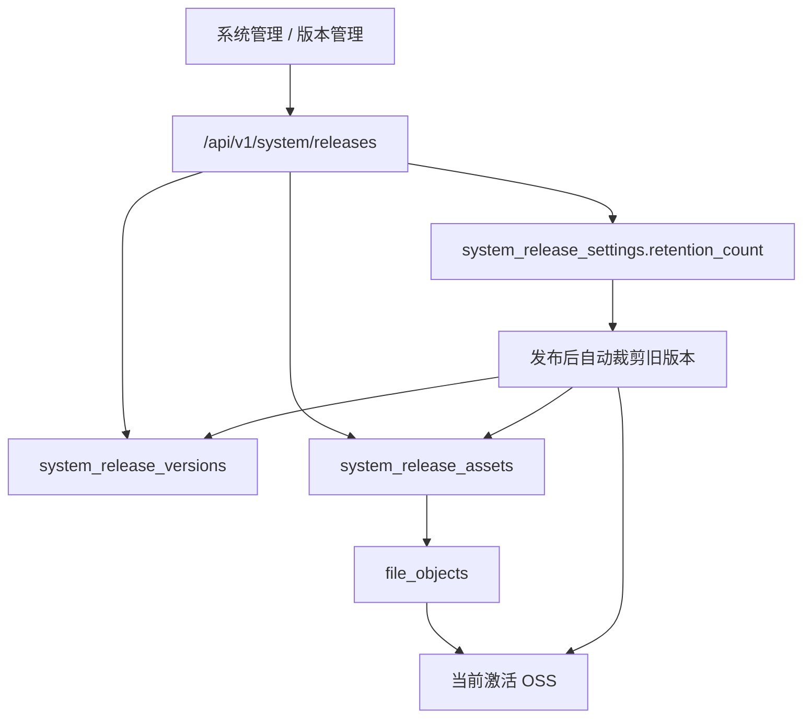

# feat: 系统版本管理与 OSS 分发第一阶段

## Overview

在系统管理中新增“版本管理”功能，用于维护桌面端 / 移动端安装包版本。第一阶段提供系统页面、系统 JSON API、OSS 直传上传、版本列表、版本编辑、平台包管理和“保留最近 N 个已发布版本”的自动清理能力。默认保留数为 5，并允许在版本管理页调整。

## Problem Frame

当前系统已有对象存储配置、文件直传和版本弹窗等基础，但没有专门的“应用版本管理”模型。后续 `app/` Flutter 模块会输出 Windows / macOS / Linux / Android / iOS 多平台产物，如果没有统一的版本管理页面与数据模型，就无法稳定承接 GitHub Actions 产物、私有化 OSS 分发和后续 app 版本检查接口。

## Requirements Trace

- R1：系统管理新增“版本管理”入口与页面。
- R2：版本记录支持新增、编辑、查询。
- R3：版本包上传到当前系统已激活的 OSS。
- R4：一个版本可关联多平台产物，至少覆盖 `windows / macos / linux / android / ios`。
- R5：系统自动只保留最近 N 个已发布版本，默认 `5`，可在页面配置。
- R6：旧版本的 OSS 对象与数据库记录由系统自动清理，不提供手工删除入口。
- R7：第一阶段先实现版本管理本体，不实现“系统 OpenAPI Token 管理”。

## Scope Boundaries

- 第一阶段不实现独立的 system OpenAPI 文档和 system token 管理。
- 第一阶段不实现 GitHub Actions 自动回写版本管理；先把系统承载能力做好。
- 第一阶段不实现桌面端自动更新协议、差分包、灰度渠道、强更策略。
- 第一阶段不做复杂版本审批流，只区分 `draft / published`。
- 第一阶段不把当前 Web 应用的 `YUANCE_RELEASE_VERSION` 弹窗机制改造成依赖本功能。

## Context & Research

### Relevant Code and Patterns

- `api/src/domains/storage.rs`：已有 OSS 配置、上传签名、下载签名、对象校验与删除能力。
- `api/src/domains/files.rs`：已有 `file_objects` 基础模型，可直接复用对象键生成、上传完成标记和删除状态流转。
- `api/src/web/api/mod.rs`：已有系统管理 JSON API（对象存储、数据库统计、角色权限等）模式，可直接扩展 `/api/v1/system/*`。
- `api/src/web/user/mod.rs`：已有系统管理页面、模板拼装、权限校验、消息提示与分页工具。
- `api/static/app.js`：已有 OSS 直传、上传进度、附件删除、toast 提示等前端能力，可提炼为版本资产上传交互。
- `api/tests/system_management_flow.rs`：已有系统页与系统 API 的集成测试承载位。

### External References

- Flutter 官方文档给出多平台发布命令，可作为后续版本包命名与平台枚举的基础来源。
- GitHub Actions 官方文档建议通过矩阵构建和 artifact 汇总管理多平台产物；本功能后续可作为 artifact 的接收方。

## Key Technical Decisions

- **版本管理使用独立系统表，不复用项目 / 工作项附件 target。** 版本包属于系统级资源，不应挂在项目业务模型下。
- **底层对象仍复用 `file_objects` 与 OSS 能力。** 这样可以直接复用对象键生成、上传签名、上传完成校验和 OSS 删除逻辑。
- **版本记录区分 `draft / published`。** 新建和编辑时允许草稿；只有 `published` 版本参与“保留最近 N 个版本”的裁剪和未来 app 升级查询。
- **保留策略按“已发布时间倒序”裁剪。** 避免草稿误伤正式版本，也避免 semver 解析成为第一阶段阻塞点。
- **一个版本允许多个平台资产。** 每个资产带 `platform` 标签，文件类型由文件名 / Content-Type 辅助展示，不在第一阶段强制限定一平台只能有一个文件。
- **自动清理同时删除 OSS 对象和 DB 记录。** 旧版本超过保留数后，不仅逻辑隐藏，还要释放 OSS 存储空间。

## High-Level Design

## Implementation Units

- [x] **Unit 1: 数据模型、迁移与保留策略**

**Goal:** 新增系统版本与版本资产模型，支持已发布版本按保留数自动裁剪。

**Files:**
- Create: `api/migrations/202607230002_create_system_release_management.sql`
- Create: `api/src/domains/system_releases.rs`
- Modify: `api/src/domains/mod.rs`
- Modify: `api/src/domains/rbac.rs`
- Test: `api/tests/system_management_flow.rs`

**Approach:**
- 新增 `system_release_settings` 单例表，存储 `retention_count`。
- 新增 `system_release_versions` 表，字段至少包含：`version_name`、`title`、`notes`、`status`、`published_at`、`created_by_user_id`、`updated_by_user_id`。
- 新增 `system_release_assets` 表，字段至少包含：`release_id`、`file_object_id`、`platform`、`created_at`。
- domain 提供：创建草稿、更新版本、发布版本、查询列表、查询详情、创建资产占位、标记上传完成、删除资产、更新保留数、发布后自动裁剪。
- 裁剪时调用 `storage::delete_object_if_exists` 删除 OSS 对象，并清理 `system_release_assets`、`file_objects`、`system_release_versions` 旧数据。

**Verification:**
- 迁移可执行；domain 测试覆盖发布、裁剪与对象清理。

- [x] **Unit 2: 系统权限、导航、页面模板**

**Goal:** 在系统管理中新增版本管理入口、列表页和创建/编辑弹窗。

**Files:**
- Modify: `api/src/web/user/mod.rs`
- Modify: `api/src/web/router.rs`
- Create: `api/templates/web/system/releases.html`
- Modify: `api/templates/web/system/dashboard.html`
- Modify: `api/static/app.css`
- Test: `api/tests/system_management_flow.rs`

**Approach:**
- 新增权限：
  - `system.releases.view`
  - `system.releases.manage`
- 系统总览增加“版本管理”卡片。
- 新增 `/web/system/releases` 页面。
- 页面展示：
  - 保留策略卡片
  - 版本列表 table
  - 新建/编辑版本 modal
  - 版本资产上传区与资产列表
- 保持现有系统页面统一的 panel / modal / pagination 风格。

**Verification:**
- 管理员可见页面和操作入口；无权限用户不可访问。

- [x] **Unit 3: 系统 JSON API 与 OSS 直传**

**Goal:** 复用现有 OSS 直传链路，为系统版本资产提供创建、上传、完成、删除接口。

**Files:**
- Modify: `api/src/web/api/mod.rs`
- Modify: `api/src/web/router.rs`
- Modify: `api/src/domains/files.rs`（如需补 file_object 级辅助函数）
- Modify: `api/static/app.js`
- Test: `api/tests/system_management_flow.rs`

**Approach:**
- 新增 `/api/v1/system/releases*` 系列接口：
  - 列表 / 详情
  - 创建 / 更新 / 发布
  - 更新保留数
  - 创建资产占位
  - 资产上传签名
  - 资产上传完成
  - 资产删除
- 前端上传流程直接复用现有 `uploadSignedFile`、进度 ring、toast 和删除逻辑。
- 版本资产上传时如果当前表单还没有 release id，先创建草稿，再继续上传。

**Verification:**
- 版本资产可成功创建、上传、确认、删除；失败时能回显明确错误。

- [x] **Unit 4: 查询、下载与列表体验收口**

**Goal:** 完成版本列表、详情编辑、资产下载和裁剪后的展示一致性。

**Files:**
- Modify: `api/src/web/user/mod.rs`
- Modify: `api/src/web/router.rs`
- Modify: `api/templates/web/system/releases.html`
- Modify: `api/static/app.js`
- Test: `api/tests/system_management_flow.rs`

**Approach:**
- 列表按 `published_at DESC, id DESC` / `created_at DESC, id DESC` 显示。
- 版本行展示：版本号、状态、平台数、资产数、发布信息、更新时间。
- 提供系统侧下载入口，通过服务端申请临时签名 URL 后跳转，不把长期链接写死在模板中。
- 页面提示旧版本自动裁剪规则和当前保留数。

**Verification:**
- 上传后的版本资产可下载；发布新版本后超限旧版本被自动裁剪。

## Risks & Dependencies

- 当前对象存储配置若未激活，版本资产上传必须明确报错并阻止继续。
- 自动裁剪涉及 OSS 删除与 DB 删除，需要确保事务边界和错误提示可追踪。
- 版本资产如果允许草稿上传但长期不发布，可能留下草稿资产；第一阶段接受该风险，后续可增加草稿清理任务。

## Verification

- `cargo fmt --all`
- `cargo test -p yuance-api system_management_flow`
- `git diff --check`

## Notes

- 后续“系统 OpenAPI + system token 管理”应以本次 `system_releases` domain 与 `/api/v1/system/releases*` 路由为基础继续抽象。
- 后续 GitHub Actions 只需把构建产物与平台标签写入本功能即可，不必重新设计版本表。
