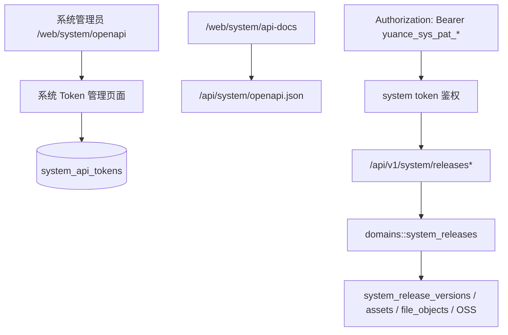

# feat: 系统 OpenAPI 与系统 Token 管理第一阶段

## Overview

在现有普通业务 OpenAPI / PAT 之外，补一套系统级 OpenAPI 与系统 Token 管理能力。第一阶段聚焦“版本管理”系统接口：提供独立 system OpenAPI 文档、系统管理页中的 token 列表/创建/编辑/删除，以及 Bearer system token 对版本列表、详情、创建、编辑、资产上传链路的访问能力。

## Problem Frame

当前仓库已经有普通用户 PAT、普通业务 OpenAPI、系统版本管理页面与 `/api/v1/system/releases*` 系列接口，但系统接口仍主要依赖管理员网页登录态。后续 GitHub Actions、桌面端发布流程或其它系统集成若要自动写入版本信息、上传安装包，需要一套独立于普通 PAT 的 system token；同时这套 token 不应直接复用普通用户 PAT 的项目范围与业务 scope 语义，也不应把版本保留策略等高风险系统设置直接开放给外部自动化。

## Requirements Trace

- R1：系统管理新增独立入口，集中展示 system OpenAPI 与系统 token 管理。
- R2：系统 token 独立于普通用户 PAT，不复用 `api_tokens` 主表。
- R3：系统 token 支持名称、接口范围、列表、创建、编辑、删除。
- R4：系统 OpenAPI 独立于普通业务 OpenAPI，提供单独 JSON 与 Scalar 文档页。
- R5：第一阶段 system token 只覆盖“版本管理”相关系统接口。
- R6：版本保留策略等高风险系统设置不暴露到 system OpenAPI，也不允许 system token 调用。
- R7：系统 token Bearer 调用系统版本接口时，不依赖 Cookie / CSRF。

## Scope Boundaries

- 第一阶段不让 system token 访问用户管理、角色权限、对象存储、数据库统计、审计日志等其它系统接口。
- 第一阶段不把系统 token CRUD 自身开放到 system OpenAPI，token 管理由系统管理页完成。
- 第一阶段不改普通用户 PAT 的数据结构、项目范围或普通业务 OpenAPI 契约。
- 第一阶段不扩展工作项 / 资料库等业务接口去接受 system token。
- 第一阶段不新增 token 过期时间、刷新机制或禁用状态；删除即失效。

## Context & Research

### Relevant Code and Patterns

- `api/src/domains/api_tokens.rs`：已有普通 PAT 的随机值生成、哈希、密文保存和列表/更新/删除逻辑，可作为 system token 的基础模式参考。
- `api/src/web/api/mod.rs`：当前系统版本管理 API 已存在，后续只需为这组 handler 增加 system token Bearer 鉴权入口。
- `api/src/web/router.rs`：当前普通 OpenAPI 文档通过静态 JSON + Scalar 路由提供，可直接复用到 system OpenAPI。
- `api/src/web/user/mod.rs` 与 `api/templates/web/system/releases.html`：系统管理页、modal、表格、分页和系统导航已有成熟 UI 组织方式。
- `api/src/domains/rbac.rs`：系统页面导航权限由独立 permission 控制，新增 system OpenAPI 页面可沿用同一模型。

### Institutional Learnings

- 未检索到与 system token / system OpenAPI 强相关的既有 `docs/solutions/` 沉淀。
- `docs/solutions/patterns/critical-patterns.md` 当前仓库不存在，因此本次仅依赖现有代码模式。

### External References

- 本次不做外部资料研究。现有普通 PAT、系统版本管理、静态 OpenAPI 文档和系统页模式已足够支撑第一阶段实现。

## Key Technical Decisions

- **系统 token 使用独立表 `system_api_tokens`。** 不与普通 `api_tokens` 混表，避免把项目范围、普通业务 scope、用户级 Bearer 语义强耦合到系统自动化。
- **系统 token 第一阶段只定义版本管理 scope。** 先提供 `system_release:read` 与 `system_release:write` 两个 scope，覆盖版本列表/详情与写入链路；其它系统能力后续按需扩展。
- **系统 token 只作为系统接口的 Bearer 凭证，不进入普通业务 API。** 普通业务接口继续使用用户 session 或普通 PAT。
- **系统 OpenAPI 独立成新的静态契约文件。** 新增 `docs/openapi/yuance-system.openapi.json`，并通过新的 JSON 路由与 Scalar 页面暴露。
- **版本保留策略仍只允许网页登录态管理员操作。** 即便对应 API 仍存在，也不接受 system token Bearer。
- **系统 token 明文继续加密保存，允许后续再次复制。** 沿用普通 PAT 的“哈希校验 + 密文恢复 + 点击复制”体验，降低运维脚本丢 token 后只能重建的成本。

## High-Level Design

## Implementation Units

- [ ] **Unit 1: system token 数据模型与领域逻辑**

**Goal:** 增加独立系统 token 表、scope 校验与 Bearer 认证基础能力。

**Files:**
- Create: `api/migrations/202607230003_create_system_api_tokens.sql`
- Create: `api/src/domains/system_api_tokens.rs`
- Modify: `api/src/domains/mod.rs`
- Modify: `api/src/domains/rbac.rs`
- Test: `api/tests/system_management_flow.rs`

**Approach:**
- 新增 `system_api_tokens` 表，字段至少包含：`name`、`token_hash`、`token_suffix`、`token_ciphertext`、`scopes`、`created_by_user_id`、`updated_by_user_id`、`last_used_at`、时间戳。
- 约束：最多 100 个有效 system token；支持名称校验、scope 去重、物理删除。
- domain 提供：创建、列表、列表带明文、更新、删除、Bearer 认证、scope 校验。
- 新增系统权限：
  - `system.api_tokens.view`
  - `system.api_tokens.manage`

**Verification:**
- migration 可执行；domain 覆盖 scope 校验、鉴权成功/失败、更新和删除。

- [ ] **Unit 2: 系统版本管理 API 接入 system token**

**Goal:** 让 system token 可调用版本管理系统 API，同时保持其它系统接口继续受网页登录态管理员控制。

**Files:**
- Modify: `api/src/web/api/mod.rs`
- Test: `api/tests/system_management_flow.rs`

**Approach:**
- 新增 `SystemApiPrincipal` 或等价 helper，专门处理 system token Bearer。
- 仅在以下接口接入 system token：
  - `GET /api/v1/system/releases`
  - `POST /api/v1/system/releases`
  - `GET /api/v1/system/releases/{release_id}`
  - `PATCH /api/v1/system/releases/{release_id}`
  - `POST /api/v1/system/releases/{release_id}/assets`
  - `GET /api/v1/system/releases/{release_id}/assets/{asset_id}/upload-url`
  - `POST /api/v1/system/releases/{release_id}/assets/{asset_id}/uploaded`
  - `DELETE /api/v1/system/releases/{release_id}/assets/{asset_id}`
- `system_release:read` 只允许读取列表/详情；`system_release:write` 允许写入、上传链路和发布。
- `GET/PATCH /api/v1/system/releases/settings` 保持 session-only 管理，不接受 system token。

**Verification:**
- Bearer system token 可完成版本创建、更新、上传签名和上传确认。
- 缺少 scope 时返回 403。
- system token 访问 settings 或其它系统接口失败。

- [ ] **Unit 3: 系统管理页中的 system OpenAPI 与 token 管理**

**Goal:** 在系统管理中提供统一入口，支持查看文档、创建 token、复制 token、编辑范围、删除 token。

**Files:**
- Modify: `api/src/web/user/mod.rs`
- Modify: `api/src/web/router.rs`
- Modify: `api/templates/layouts/web.html`
- Modify: `api/templates/web/system/dashboard.html`
- Create: `api/templates/web/system/openapi.html`
- Modify: `api/static/app.css`
- Test: `api/tests/system_management_flow.rs`

**Approach:**
- 新增 `/web/system/openapi` 页面，包含：
  - system OpenAPI 说明
  - `/api/system/openapi.json` 下载入口
  - `/web/system/api-docs` 在线文档入口
  - system token 列表与创建/编辑 modal
- UI 尽量复用个人中心 token 表格、复制按钮和多选 scope 样式。
- 删除按钮沿用确认弹窗。
- 系统导航与总览页增加“系统 OpenAPI”入口。

**Verification:**
- 有权限用户可见入口并正常管理 token。
- 无权限用户不可访问。
- 新建 token 后可再次复制。

- [ ] **Unit 4: 独立 system OpenAPI 文档**

**Goal:** 输出只描述系统版本管理能力的独立 OpenAPI 契约和在线文档。

**Files:**
- Create: `docs/openapi/yuance-system.openapi.json`
- Modify: `api/src/web/router.rs`
- Test: `api/tests/system_management_flow.rs`

**Approach:**
- 新增 `GET /api/system/openapi.json` 返回静态 JSON。
- 新增 `GET /web/system/api-docs` 渲染 Scalar，并引用 system JSON。
- system OpenAPI 只描述 Bearer system token 认证与版本管理接口，不描述 token 管理、保留策略设置、其它系统接口。

**Verification:**
- JSON 返回 200 且包含 `"/api/v1/system/releases"`。
- Scalar 页面正确引用 `/api/system/openapi.json`。

## Risks & Dependencies

- system token 与普通 PAT 共存，必须确保 Bearer 前缀与鉴权顺序清晰，避免普通业务 PAT 误入系统接口或 system token 误入普通业务接口。
- 版本资产上传依赖现有 OSS 直传链路；system token 只负责申请签名和确认上传，不应放宽对象存储校验。
- system token 删除后应立即失效，避免缓存旧鉴权结果。
- 若后续需要把系统 token 身份显式写入审计展示，可能需要单独扩展 audit snapshot 字段；本阶段先保证权限与调用闭环。

## Verification

- `cargo fmt --all`
- `cargo test -p yuance-api system_management_flow`
- `cargo test -p yuance-api auth_security_flow`
- `git diff --check`

## Notes

- 该计划基于 `docs/plans/2026-07-23-003-feat-system-release-management-plan.md` 已完成的版本管理能力继续扩展。
- 后续如果要开放更多系统级自动化能力，可继续在 `system_api_tokens` 上追加更细粒度 scope，并扩展独立 system OpenAPI 契约。
