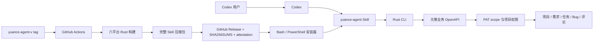

# feat: Codex Skill 与 Rust OpenAPI CLI 分发

## Goal Capsule

- **目标：** 让其他项目中的 Codex 通过一次安装获得元策需求、任务和 Bug 的稳定读写能力，不依赖 Node.js、npm 或 MCP。
- **权威顺序：** 本计划的 Product Contract > `docs/openapi/yuance.openapi.json` > 当前 `/api/v1` 运行行为 > 现有 AI/MCP 文档。
- **停止条件：** Rust CLI、Skill、安装器和六平台发布链路形成可回放闭环；现有 MCP 运行实现及现行说明被移除；聚焦验证全部通过。
- **执行方式：** 按 U1-U7 顺序完成小而可验证的提交；跨平台发布配置必须在合并前完成静态复核，在首个标签发布后完成真实资产验证。
- **尾项归属：** Windows Authenticode、macOS Developer ID/notarization 和非 Codex 客户端支持不阻塞首版，后续单独规划。

---

## Product Contract

### Summary

提供一个可独立安装的 `yuance-agent` Codex Skill。Skill 自带预编译 Rust CLI，通过元策 OpenAPI 操作项目、需求、任务、Bug 和评论。用户只需运行对应平台的安装脚本并配置访问 Token，不需要克隆仓库、安装 Rust、Node.js、npm 或配置 MCP server。

### Problem Frame

现有 `skills/yuance-agent/SKILL.md` 只是以 MCP 为前置条件的行为说明。它引用仓库内文档，并依赖 `mcp/yuance-mcp/` 提供真实工具。外部项目无法只安装 Skill 后直接工作；当前 MCP 还没有覆盖工作项创建和更新，且 Node.js/npm 前置条件对通过 Homebrew 或原生安装 Codex 的机器不友好。

### Actors

- A1. **Codex 使用者：** 在任意项目中要求 Codex 分析或操作元策工作项。
- A2. **Codex Agent：** 根据 Skill 规则读取上下文，并通过捆绑 CLI 执行 OpenAPI 请求。
- A3. **发布维护者：** 创建版本标签并通过 GitHub Actions 发布六个平台资产。

### Requirements

#### Runtime And Workflow

- R1. Skill 必须在外部项目中独立工作，不依赖元策仓库内的文件、MCP、Node.js、npm、Rust toolchain 或 `jq`。
- R2. Rust CLI 必须支持项目列表和详情，以及需求、任务、Bug 的列表、详情、创建、更新、流转和指派。
- R3. Rust CLI 必须支持工作项评论列表、发表评论和回复评论。
- R4. CLI 必须使用 `YUANCE_BASE_URL` 和 `YUANCE_API_TOKEN` 调用业务 OpenAPI，并保持现有 PAT scope、项目范围和业务权限语义。
- R5. CLI 业务命令和 doctor 的成功输出必须是稳定 JSON；失败必须向 stderr 输出结构化错误并返回非零退出码，且不得输出 Token。标准 `--help` 和 `--version` 保持人类可读文本。
- R6. Skill 必须规定先读后写、项目范围收敛、状态机校验、评论上下文读取和禁止猜测标识等行为边界。

#### Distribution

- R7. macOS 和 Linux 必须提供 Bash 一键安装器；Windows 必须提供 PowerShell 一键安装器。
- R8. 安装器必须识别操作系统和 CPU 架构，下载固定版本资产，校验 SHA-256，并以可回滚方式更新用户级 Skill。
- R9. GitHub Actions 必须构建 macOS、Linux、Windows 的 x64 和 ARM64 共六类资产，并发布到独立的 `yuance-agent-v<semver>` GitHub Release。
- R10. 发布资产必须包含同版本的 `SKILL.md`、references 和平台二进制；编译产物不得提交到 Git 历史。

#### Migration

- R11. 现有 `mcp/yuance-mcp/`、MCP 配置示例和当前 MCP 开发/安装文档必须移除；在线 API 文档、OpenAPI 描述和既有用户迁移说明必须切换到 Skill + CLI 口径。
- R12. 历史计划保留原始记录，不因本次架构替换而追溯改写。

### Key Flows

- F1. A1 在 macOS/Linux 运行 Bash 安装命令，或在 Windows 运行 PowerShell 安装命令；安装器选择资产、校验、安装并执行离线自检。
- F2. A1 配置元策地址和 PAT 后要求分析工作项；A2 加载 Skill，读取项目或工作项上下文，再调用 CLI 返回 JSON 结果。
- F3. A1 明确要求创建、更新、评论、回复、流转或指派；A2 按 Skill 完成前置读取和参数确认，再调用对应写命令并报告结果。
- F4. A3 更新版本并推送 `yuance-agent-v<semver>` 标签；CI 校验版本、构建六平台包、生成校验和与构建证明，再创建 GitHub Release。

### Acceptance Examples

- AE1. **Given** 一台只有原生 Codex、shell 和 `curl` 的 macOS/Linux 机器，**when** 用户运行安装命令，**then** Skill 和匹配架构的 CLI 被安装，无需 Node.js 或 Rust。
- AE2. **Given** 一台 Windows x64 机器，**when** 用户在 PowerShell 运行安装命令，**then** `.zip` 被校验并解压到用户级 Skill 目录，`yuance-agent.exe doctor --installation` 成功。
- AE3. **Given** Windows ARM64 发布任务，**when** 发布工作流执行，**then** 生成 ARM64 `.exe` 和完整 Skill 包；首版至少完成编译与 `--version` 冒烟验证。
- AE4. **Given** 有效 PAT 和项目范围，**when** Codex 创建一个 Bug，**then** CLI 向 stdout 返回包含新工作项编号的 JSON，Skill 报告实际创建结果。
- AE5. **Given** PAT 缺失、过期或 scope 不足，**when** CLI 调用 API，**then** 不泄露 Token，返回可区分配置错误、`401` 和 `403` 的结构化错误及非零退出码。
- AE6. **Given** 已安装旧版本，**when** 新版本下载、校验或离线自检失败，**then** 安装器保留或恢复旧版本，不留下半安装目录。
- AE7. **Given** Codex 被要求处理一个工作项但缺少项目、目标状态或处理人，**when** Skill 执行前置检查，**then** Codex 先补充读取或询问，不猜测后直接写入。
- AE8. **Given** 用户以前安装了 `~/.yuance-mcp` 并在 Codex 配置中注册了 `mcp_servers.yuance`，**when** 用户迁移到新 Skill，**then** 新指南帮助其识别并移除旧配置，且安装器不擅自覆盖其他 Codex 配置。

### Success Criteria

- 六个平台产物使用一致命名并包含完整、自洽的 Skill 包。
- 全新机器只需平台安装命令和 PAT 配置即可从任意项目调用元策工作项能力。
- CLI 的核心命令、错误映射和 OpenAPI 路径具有自动化测试。
- 仓库现行代码、测试、在线页面和接入文档不再要求或推荐 MCP。
- 首个 `yuance-agent-v0.1.0` 发布可由安装器固定版本安装并通过离线自检。

### Scope Boundaries

**首版包含：**

- Codex 用户级 Skill。
- 项目、工作项和评论的核心 OpenAPI 操作。
- macOS、Linux、Windows 的 x64/ARM64 发布与安装。
- PAT 鉴权、结构化输出、安装自检、校验和和构建证明。

**首版不包含：**

- 项目资料库、通知、附件上传下载、工作项恢复和 system OpenAPI。
- MCP 兼容层或远程 MCP server。
- npm、Homebrew、Chocolatey、WinGet、Cargo crates.io 或 Codex plugin marketplace 发布。
- Windows Authenticode、macOS Developer ID/notarization 和 Linux 包签名。
- 自动创建 PAT、在安装脚本命令行中传递 Token，或把 Token 写入 Skill 文件。
- Claude Code、ChatGPT、IDE 专用安装体验及其他 AI 客户端适配。

### Dependencies

- GitHub Releases 和 GitHub-hosted runner 可用。
- 接入机器可访问 GitHub Raw、GitHub Releases 和元策服务。
- 用户已在元策个人中心创建具备必要 scope 和项目范围的 PAT。
- Windows ARM64 runner 的长期可用性受 GitHub runner 策略约束。

### Product Contract Preservation

Product Contract 由本轮会话直接建立，无独立上游 requirements-only 文档。

---

## Planning Contract

### Key Technical Decisions

- KTD1. **使用 Rust 编写确定性 OpenAPI CLI。** `(session-settled: user-approved — chosen over Node.js scripts: 预编译产物避免外部机器安装 Node.js 和 npm。)` CLI 作为 workspace 独立 binary crate，复用仓库已有 `clap`、`reqwest`、`serde`、`tokio` 和 rustls 技术栈。
- KTD2. **移除现有 MCP，不保留兼容路径。** `(session-settled: user-directed — chosen over retaining MCP as an optional compatibility layer: Skill + CLI 形成唯一外部 AI 接入口径。)` 历史计划继续保留，运行实现和现行说明全部迁移。
- KTD3. **源码进入 Git，二进制进入 GitHub Releases。** `(session-settled: user-approved — chosen over committing compiled binaries: Release 资产可按版本回滚且不会持续膨胀 Git 历史。)`
- KTD4. **发布包是完整且不可拆分的 Skill 快照。** 每个平台压缩包同时包含 `SKILL.md`、`agents/openai.yaml`、references 和 `scripts/yuance-agent[.exe]`，避免安装时从 `main` 混入不同版本文件。
- KTD5. **采用 Codex 用户级 Skill 目录。** 默认安装到 `~/.codex/skills/yuance-agent`；设置 `CODEX_HOME` 时使用其 `skills/yuance-agent`；安装器另提供显式目录覆盖。单次安装只写一个位置，避免同名 Skill 重复出现。`v0.1.1` 修正了首版误用 `~/.agents/skills` 导致当前 Codex 无法发现 Skill 的问题。
- KTD6. **CLI 保持领域命令而非开放任意 HTTP 请求。** 命令层只暴露计划内项目、工作项和评论操作，防止 Skill 绕过行为边界调用未审查端点。
- KTD7. **业务命令机器输出保持 API envelope。** 业务命令和 doctor 的 stdout 只输出 JSON 成功 envelope；失败时 stderr 只输出 JSON 错误 envelope 和必要诊断。标准 `--help` 和 `--version` 保持文本输出。日志不得包含 Authorization header、Token 或完整请求体中的敏感字段。
- KTD8. **发布矩阵沿用仓库已有原生 runner。** macOS Intel/ARM64、Linux x64/ARM64、Windows x64/ARM64 分别在对应 runner 构建。Windows x64 完成完整运行验证；Windows ARM64 首版至少完成编译和 `--version` 冒烟验证。
- KTD9. **安装器固定默认稳定版本。** 两个安装器内的默认版本必须与 CLI package version 和发布标签一致，也允许通过环境变量指定历史版本。发布前置校验阻止三者漂移。
- KTD10. **凭证由运行环境提供。** `YUANCE_API_TOKEN` 必填且只从环境读取；`YUANCE_BASE_URL` 默认使用 OpenAPI 声明的正式环境 `https://yuance.quanxinfu.com`，并支持环境覆盖。安装自检不要求 Token，联网自检单独执行，避免一键安装被凭证配置阻断。
- KTD11. **公开安装命令固定到已发布标签。** 正式页面和 runbook 使用 `yuance-agent-v<semver>` 对应的 Raw 安装脚本，避免直接执行 `main` 上可变脚本；`main` 地址只作为明确标注的开发通道。

### High-Level Technical Design



### CLI Surface

```text
yuance-agent doctor [--installation]
yuance-agent projects list|get
yuance-agent work-items list|get|create|update|handoff
yuance-agent comments list|create
```

- 查询命令使用显式筛选参数和分页参数。
- 创建和更新命令使用领域参数；长正文支持从文件或 stdin 读取，避免复杂 HTML 被 shell 转义破坏。
- `comments create` 同时支持顶层评论和 `parent_comment_id` 回复。
- `doctor --installation` 只验证版本、平台、Skill 文件和可执行权限；`doctor` 额外检查运行环境和元策连通性。

### Release Asset Contract

| 平台 | Rust target | Runner | 资产格式 |
|---|---|---|---|
| macOS Intel | `x86_64-apple-darwin` | `macos-15-intel` | `.tar.gz` |
| macOS Apple Silicon | `aarch64-apple-darwin` | `macos-latest` | `.tar.gz` |
| Linux x64 | `x86_64-unknown-linux-musl` | `ubuntu-latest` | `.tar.gz` |
| Linux ARM64 | `aarch64-unknown-linux-musl` | `ubuntu-24.04-arm` | `.tar.gz` |
| Windows x64 | `x86_64-pc-windows-msvc` | `windows-latest` | `.zip` |
| Windows ARM64 | `aarch64-pc-windows-msvc` | `windows-11-arm` | `.zip` |

资产命名使用 `yuance-agent-v<version>-<target>.<ext>`。每个压缩包解压后只有一个 `yuance-agent/` 根目录。Release 同时提供 `SHA256SUMS`，并为压缩包生成 GitHub artifact attestation。

### Error And Safety Contract

- 参数或本地配置错误使用独立退出码，不发起网络请求。
- HTTP 错误保留状态码、服务端 `error.code` 和 `error.message`。
- 非 JSON 响应只保留截断后的安全摘要，不输出 HTML 错误页全文。
- 网络超时、DNS、TLS 和响应解析错误必须可区分。
- 写命令不在 CLI 内增加交互提示；是否执行写入由 Skill 根据用户意图和前置读取控制，保证 Codex 非交互调用稳定。
- 安装器只替换自己拥有的 `yuance-agent` 目录。校验或自检失败时恢复旧目录。

### System-Wide Impact

- 根 Cargo workspace 增加一个可独立发布的 binary crate，并更新 `Cargo.lock`。
- AI 接入从 OpenAPI + MCP + Skill 三层收敛为 OpenAPI + Skill/CLI 两层。
- `/web/api-docs` 的介绍、链接和路由 smoke test 改为一键安装 Skill。
- `docs/mcp/` 与 `mcp/yuance-mcp/` 不再作为现行维护面；有长期价值的操作规则迁入 Skill references 或新的 runbook。
- GitHub Release 中桌面端标签与 Agent 标签并存，安装器不得使用仓库级 `releases/latest`，必须按 `yuance-agent` 固定版本构造下载地址。

### Risks And Mitigations

- **未签名二进制可能触发系统信誉提示。** 首版明确记录该限制，以 SHA-256、HTTPS 和 GitHub attestation 提供来源与完整性证据；代码签名单独规划。
- **ARM runner 可用性变化。** 六个平台保持独立矩阵项和明确失败，不静默退回错误架构。
- **OpenAPI 与手写 CLI 类型漂移。** 增加契约测试，检查每个 CLI 操作对应的 path、method、关键 schema 和状态枚举。
- **安装器与 Release 版本漂移。** 标签校验任务同时核对 crate 版本、安装器默认版本和资产前缀。
- **更新中断破坏现有 Skill。** 下载和解压在临时目录完成，校验和离线自检成功后才原子替换，并保留回滚目录直到安装完成。
- **Skill 过长导致上下文浪费。** `SKILL.md` 只保留触发条件、核心流程和安全边界；命令参数、API 字段和示例按需放入一层 references。
- **一键脚本本身属于远程代码执行边界。** 正式入口固定到不可变标签；安装脚本不读取 API Token，只执行下载、校验、文件替换和离线自检。

### Sources

- `Cargo.toml`：当前 workspace 只有 `api` 成员。
- `api/Cargo.toml`：现有 Rust 版本和 `clap`、`reqwest`、`serde`、`tokio` 依赖基线。
- `mcp/yuance-mcp/yuance-mcp-server.mjs`：现有 HTTP envelope、过滤参数和错误映射行为参考；实现完成后删除。
- `skills/yuance-agent/SKILL.md`：现有先读后写、项目范围和状态机行为规则来源。
- `docs/openapi/yuance.openapi.json`：CLI 业务契约来源。
- `.github/workflows/release-desktop.yml`：六平台 runner、artifact 汇总和 GitHub Release 发布模式。
- [OpenAI Codex Build skills](https://learn.chatgpt.com/docs/build-skills.md)：Skill 目录、渐进披露、用户级位置和可选 scripts/references 约定。
- [clap derive documentation](https://github.com/clap-rs/clap/tree/master/examples/tutorial_derive)：嵌套 subcommand、环境参数、枚举和命令定义自检模式。
- [GitHub artifact attestations](https://docs.github.com/en/actions/security-for-github-actions/using-artifact-attestations/using-artifact-attestations-to-establish-provenance-for-builds)：Release 构建来源证明依据。

---

## Implementation Units

### U1. 建立 Rust CLI 骨架与 HTTP 契约

**Goal:** 创建独立、可测试、只依赖预编译二进制运行的 `yuance-agent` CLI 基础。

**Requirements:** R1, R4, R5

**Dependencies:** None

**Files:**

- Modify: `Cargo.toml`
- Modify: `Cargo.lock`
- Create: `tools/yuance-agent-cli/Cargo.toml`
- Create: `tools/yuance-agent-cli/src/main.rs`
- Create: `tools/yuance-agent-cli/src/cli.rs`
- Create: `tools/yuance-agent-cli/src/client.rs`
- Create: `tools/yuance-agent-cli/src/error.rs`
- Create: `tools/yuance-agent-cli/src/output.rs`
- Create: `tools/yuance-agent-cli/src/models.rs`
- Create: `tools/yuance-agent-cli/tests/api_client.rs`
- Create: `tools/yuance-agent-cli/tests/cli_contract.rs`

**Approach:**

- 将 package 命名为 `yuance-agent`，使用 edition 2024 和仓库当前 MSRV。
- 使用 rustls HTTP client，统一设置 Bearer header、Accept、Content-Type、User-Agent 和请求超时。
- 将成功 envelope、服务端错误、网络错误、配置错误和解析错误统一映射到结构化输出与稳定退出码。
- Token 只从环境读取，不进入 debug 输出、错误链或命令历史。
- 建立 `doctor --installation` 与完整 `doctor` 两级检查。

**Test Scenarios:**

- 有效 JSON envelope 被原样输出到 stdout。
- `401`、`403`、`404` 和 `422` 保留状态码与服务端错误字段。
- 超时、断连、无效 JSON 和非 JSON 错误响应返回不同错误类别。
- 缺少 Token 时不发送 HTTP 请求，stderr 不包含敏感值。
- clap command 定义通过 `debug_assert`，`--help` 和 `--version` 可用。

**Verification:**

- `cargo test -p yuance-agent --test api_client`
- `cargo test -p yuance-agent --test cli_contract`
- `cargo clippy -p yuance-agent --all-targets -- -D warnings`

### U2. 实现项目、工作项和评论命令

**Goal:** 覆盖需求、任务和 Bug 的首版完整读写闭环。

**Requirements:** R2, R3, R4, R5

**Dependencies:** U1

**Files:**

- Modify: `tools/yuance-agent-cli/src/cli.rs`
- Modify: `tools/yuance-agent-cli/src/client.rs`
- Modify: `tools/yuance-agent-cli/src/models.rs`
- Create: `tools/yuance-agent-cli/src/commands/mod.rs`
- Create: `tools/yuance-agent-cli/src/commands/projects.rs`
- Create: `tools/yuance-agent-cli/src/commands/work_items.rs`
- Create: `tools/yuance-agent-cli/src/commands/comments.rs`
- Create: `tools/yuance-agent-cli/tests/command_flow.rs`
- Create: `tools/yuance-agent-cli/tests/openapi_contract.rs`

**Approach:**

- 实现 `projects list|get`、`work-items list|get|create|update|handoff` 和 `comments list|create`。
- 对类型、优先级和状态使用明确枚举；服务端状态机仍是最终权威。
- 列表命令暴露项目、类型、状态、优先级、处理人、关键词和分页筛选。
- `work-items update` 只修改标题、描述、优先级、截止日期和父工作项等元数据；状态变化和处理人变化统一通过 `work-items handoff`，避免两套协作语义漂移。
- 长正文允许从文件或 stdin 读取；评论回复通过 `parent_comment_id` 表达。
- 契约测试解析仓库 OpenAPI JSON，校验 CLI 覆盖的 path、method、请求字段和枚举。

**Test Scenarios:**

- 项目和工作项列表正确编码筛选条件，空参数不进入 query。
- 工作项编号和项目编号中的特殊字符经过路径编码。
- 创建 requirement/task/bug 发送正确 payload，并返回创建结果。
- 更新只发送用户明确提供的元数据字段，不用默认值覆盖现有值，也不接受状态或处理人参数。
- handoff 保留目标状态、处理人、说明和来源评论字段。
- 顶层评论与回复评论发送不同的 `parent_comment_id`。
- 当前 OpenAPI 缺少或修改任一受支持操作时契约测试失败。

**Verification:**

- `cargo test -p yuance-agent --test command_flow`
- `cargo test -p yuance-agent --test openapi_contract`

### U3. 重构为自包含 Codex Skill

**Goal:** 让 Codex 能准确触发 Skill，并稳定地通过捆绑 CLI 执行先读后写流程。

**Requirements:** R1, R6, R10

**Dependencies:** U2

**Files:**

- Modify: `skills/yuance-agent/SKILL.md`
- Create: `skills/yuance-agent/agents/openai.yaml`
- Create: `skills/yuance-agent/references/commands.md`
- Create: `skills/yuance-agent/references/workflows.md`
- Create: `skills/yuance-agent/references/errors.md`
- Create: `tools/yuance-agent-cli/tests/skill_package.rs`

**Approach:**

- 收紧 description，覆盖项目、需求、任务、Bug、评论、流转和指派触发词，不再声明 MCP 或首版范围外能力。
- `SKILL.md` 保留核心步骤、写前检查、CLI 定位方式和输出规则，详细命令及字段放入一层 references。
- `agents/openai.yaml` 只声明准确的界面元数据，不声明 MCP dependency。
- Skill 使用自身目录下的 `scripts/yuance-agent[.exe]`，同时处理 POSIX 和 Windows 路径。
- 增加 package 测试，检查 frontmatter、references 引用、禁止的 MCP 文案和发行目录结构。

**Test Scenarios:**

- “分析 YCE 项目 Bug”会触发项目与工作项读取流程。
- “创建一个任务”在项目或标题缺失时先询问，不直接调用写命令。
- “把 YCE-BUG-12 指派给 alice 并进入处理中”先读取详情和评论，再执行 handoff。
- “查看通知”或“解锁资料”不会伪装成首版已支持能力。
- Skill 在安装目录外的任意项目中不引用元策源码仓库路径。

**Verification:**

- `cargo test -p yuance-agent --test skill_package`
- 使用全新 Codex 会话执行直接触发、隐式触发、缺参、误触发和错误处理五类行为检查。

### U4. 实现 Bash 与 PowerShell 安装器

**Goal:** 在无 Node.js 和 Rust toolchain 的机器上可靠安装、更新和回滚 Skill。

**Requirements:** R7, R8, R10

**Dependencies:** U3

**Files:**

- Create: `scripts/install-codex-skill.sh`
- Create: `scripts/install-codex-skill.ps1`
- Create: `scripts/test-install-codex-skill.sh`
- Create: `scripts/test-install-codex-skill.ps1`
- Create: `scripts/fixtures/yuance-agent-release/README.md`

**Approach:**

- Bash 安装器识别 Darwin/Linux 与 x86_64/aarch64，使用 `curl`、`tar` 和平台可用 SHA-256 工具。
- PowerShell 安装器识别 AMD64/ARM64，使用 `Invoke-WebRequest`、`Expand-Archive` 和 `Get-FileHash`。
- 默认位置遵循 KTD5，并支持显式安装目录和版本覆盖。
- 正式安装示例使用已发布标签的 Raw URL；测试或开发通道必须在输出中明确标记为非稳定来源。
- 下载、校验、解压和离线自检均在临时目录完成；替换失败时恢复旧目录。
- 测试入口允许使用本地 fixture 资产，不依赖真实 GitHub Release，也不放宽生产校验。

**Test Scenarios:**

- 六个平台标识映射到正确 target 和扩展名。
- 校验和匹配时完成首次安装和覆盖升级。
- 校验和错误、压缩包缺文件、二进制自检失败时不破坏旧版本。
- 显式版本和安装目录覆盖生效。
- 路径包含空格时 Bash 与 PowerShell 均正确处理。
- 未配置 Token 时离线安装成功，并输出后续配置说明而不回显 Token。

**Verification:**

- `bash scripts/test-install-codex-skill.sh`
- `pwsh -NoProfile -File scripts/test-install-codex-skill.ps1`

### U5. 建立六平台 GitHub Release 工作流

**Goal:** 通过标签自动产出可安装、可校验、可追溯的跨平台 Skill 包。

**Requirements:** R8, R9, R10

**Dependencies:** U2, U3, U4

**Files:**

- Create: `.github/workflows/release-yuance-agent.yml`
- Create: `scripts/validate-yuance-agent-release.sh`
- Modify: `scripts/install-codex-skill.sh`
- Modify: `scripts/install-codex-skill.ps1`

**Approach:**

- 以 `yuance-agent-v*.*.*` 标签触发，先验证 semver、crate version 和两个安装器默认版本一致。
- 独立 quality job 执行格式、Clippy、单元测试、Skill package 测试和 Bash 安装器测试。
- 六平台 build matrix 使用 KTD8 runner；Linux 安装对应 musl 工具链并构建静态链接资产。
- 每个 build job 运行 `--version`，组装完整 Skill 目录并上传唯一 artifact。
- publish job 汇总资产、检查六项完整性、生成 `SHA256SUMS`、生成 artifact attestation，再创建或更新对应 GitHub Release。
- workflow 仅授予所需权限：校验和构建使用只读权限；发布任务使用 `contents: write`、`id-token: write` 和 `attestations: write`。

**Test Scenarios:**

- 非法标签或版本漂移在构建前失败。
- 每个平台资产名称、根目录、二进制后缀和执行权限正确。
- 缺少任一平台 artifact 时 publish job 失败。
- `SHA256SUMS` 覆盖且只覆盖正式发布压缩包。
- Release 更新只操作当前 Agent 标签，不读取或覆盖桌面端 Release。

**Verification:**

- 在分支 CI 上完成 quality job 和可运行平台构建验证。
- 推送首个预发布标签验证六项资产、校验和、attestation 和安装器固定版本下载。

### U6. 移除 MCP 并迁移现行说明

**Goal:** 让代码、OpenAPI、在线页面和现行文档只保留 Skill + CLI 接入口径。

**Requirements:** R11, R12

**Dependencies:** U3, U4

**Files:**

- Delete: `mcp/yuance-mcp/`
- Delete: `docs/mcp/`
- Modify: `docs/openapi/yuance.openapi.json`
- Modify: `api/src/web/router.rs`
- Modify: `api/tests/routing_smoke.rs`
- Create: `docs/runbooks/yuance-agent-codex-installation.md`

**Approach:**

- 删除 MCP server、npm lockfile、客户端配置样例、MCP 开发规范和旧 bootstrap prompts。
- 将仍有效的 Token scope、安装、故障排查和操作边界压缩迁入新 runbook 或 Skill references，不机械复制重复内容。
- 更新 OpenAPI 描述中的 MCP 专用措辞，但不改变业务 endpoint 和权限语义。
- 将 `/web/api-docs` 从克隆仓库/npm/MCP 三步说明改为 Bash/PowerShell Skill 安装、PAT 配置和 OpenAPI 链接。
- 新 runbook 说明如何识别并移除 `mcp_servers.yuance` 和 `~/.yuance-mcp`；安装器只提示检测结果，不自动编辑用户的 `config.toml` 或删除旧目录。
- 更新 route smoke test，明确断言页面不再出现 MCP、npm 或旧配置入口。
- 不修改 `docs/plans/` 中记录历史实现选择的已完成计划。

**Test Scenarios:**

- `/api/openapi.json` 仍是合法 OpenAPI 3.1 JSON，并覆盖 CLI 所需端点。
- `/web/api-docs` 展示两类安装入口、Token 配置和 Skill 文档链接。
- 现行源码和非历史文档中不存在 `mcp/yuance-mcp`、`yuance_list_*` 或 MCP 初始化说明。
- 从旧 MCP 安装迁移后，Codex 不再启动旧 server，也不影响其他已配置 MCP server。
- 历史计划仍保留原始内容，便于追溯架构演进。

**Verification:**

- `cargo test -p yuance-api --test routing_smoke openapi_json_is_served_for_api_reference`
- `cargo test -p yuance-api --test routing_smoke api_docs_page_embeds_scalar_and_skill_setup_summary`
- `rg -n "mcp/yuance-mcp|MCP 初始化|yuance_list_" --glob '!docs/plans/**' .`

### U7. 完成端到端验收与交付复核

**Goal:** 证明全新 Codex 环境可以安装 Skill 并完成一个真实的读写闭环。

**Requirements:** R1-R12

**Dependencies:** U1-U6

**Files:**

- Create: `docs/reviews/2026-07-31-codex-skill-openapi-cli-review.md`
- Modify as findings require: U1-U6 files only

**Approach:**

- 在隔离临时 Skill 目录分别执行首次安装、升级和失败回滚。
- 使用受限测试 PAT 验证项目查询、工作项创建、详情读取、评论、回复、更新和 handoff。
- 在全新 Codex 会话验证 Skill 触发、缺参阻塞、结构化结果解释和不支持能力边界。
- 对发布 workflow、安装器、凭证处理和删除范围做独立复核；记录无法在本地执行的平台验证。
- 将关键证据和首个 Release 结果写入 review 文档。

**Test Scenarios:**

- 从空安装目录开始执行 AE1-AE8。
- 使用只读 Token 调用写命令，确认 `403` 被准确报告且不会盲目重试。
- 使用已删除 Token 确认 `401` 与本地缺 Token 错误可区分。
- 安装旧版后模拟新版本校验失败，确认旧版仍可执行。
- 在仓库外项目启动 Codex，确认 Skill 不读取本仓库文档即可工作。

**Verification:**

- 完成 Verification Contract 全部命令。
- 对首个 Release 的六个资产逐项核对文件名、校验和、目录结构和版本。

---

## Verification Contract

### Rust Quality Gates

```bash
cargo fmt --all -- --check
cargo clippy -p yuance-agent --all-targets -- -D warnings
cargo test -p yuance-agent
cargo test -p yuance-api --test routing_smoke
```

### Installer Gates

```bash
bash scripts/test-install-codex-skill.sh
pwsh -NoProfile -File scripts/test-install-codex-skill.ps1
```

PowerShell 测试在 Windows CI 执行；本地没有 `pwsh` 时必须在 review 文档记录由哪个 CI job 提供证据。

### Repository Gates

```bash
git diff --check
rg -n "mcp/yuance-mcp|MCP 初始化|yuance_list_" --glob '!docs/plans/**' .
```

第二条命令预期无匹配；若保留通用协议术语，必须逐项证明它不是旧实现或旧接入入口。

### Release Gates

- `yuance-agent-v<semver>` 与 crate/安装器版本一致。
- 六个平台资产齐全，且解压后均包含同版本 Skill 文件。
- `SHA256SUMS` 在 Bash 与 PowerShell 安装测试中均被实际校验。
- GitHub Release 不影响 `desktop-v*` 标签和桌面端资产。
- Windows ARM64 至少通过编译和 `--version`；其余可运行 runner 完成同等或更强验证。

### Skill Behavior Gates

- 直接触发：用户明确点名元策项目或工作项操作。
- 隐式触发：用户要求分析或处理需求、任务、Bug，但未点名 Skill。
- 缺参阻塞：缺项目、工作项、目标状态或处理人时不猜测。
- 误触发控制：普通本地代码任务不调用元策 CLI。
- 错误处理：认证、权限、状态机和网络错误不盲目重试。

---

## Definition of Done

- [ ] R1-R12 均由至少一个完成的 Implementation Unit 和验证证据覆盖。
- [ ] `yuance-agent` CLI 在 workspace 中通过格式、Clippy、单元测试和 OpenAPI 契约测试。
- [ ] Skill 包含精简 `SKILL.md`、准确 metadata、按需 references 和平台二进制位置约定。
- [ ] Bash 与 PowerShell 安装器通过首次安装、升级、固定版本、校验失败和回滚测试。
- [ ] GitHub Actions 可以构建并发布六个平台完整 Skill 包、`SHA256SUMS` 和 attestation。
- [ ] `mcp/yuance-mcp/` 和 `docs/mcp/` 已移除，现行页面和文档不再推荐 MCP。
- [ ] 旧 MCP 用户可按 runbook 清理 `mcp_servers.yuance` 和 `~/.yuance-mcp`，且其他 Codex 配置保持不变。
- [ ] 历史计划未被追溯改写。
- [ ] 使用受限测试 PAT 完成至少一次项目查询和一次工作项写入闭环。
- [ ] 全新 Codex 会话完成 Skill 激活和行为边界验证。
- [ ] `docs/reviews/2026-07-31-codex-skill-openapi-cli-review.md` 记录跨平台证据、残余风险和首个 Release 结果。
- [ ] 所有失败尝试、临时 fixture、下载资产和构建目录已清理，未把编译产物提交到 Git。
