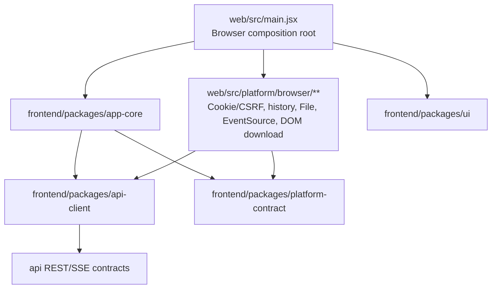
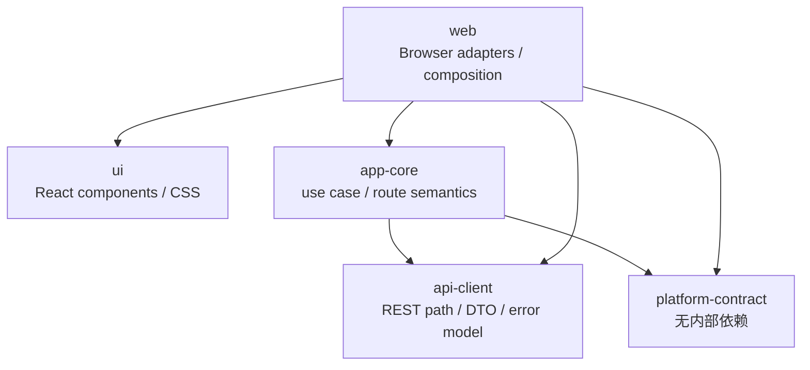
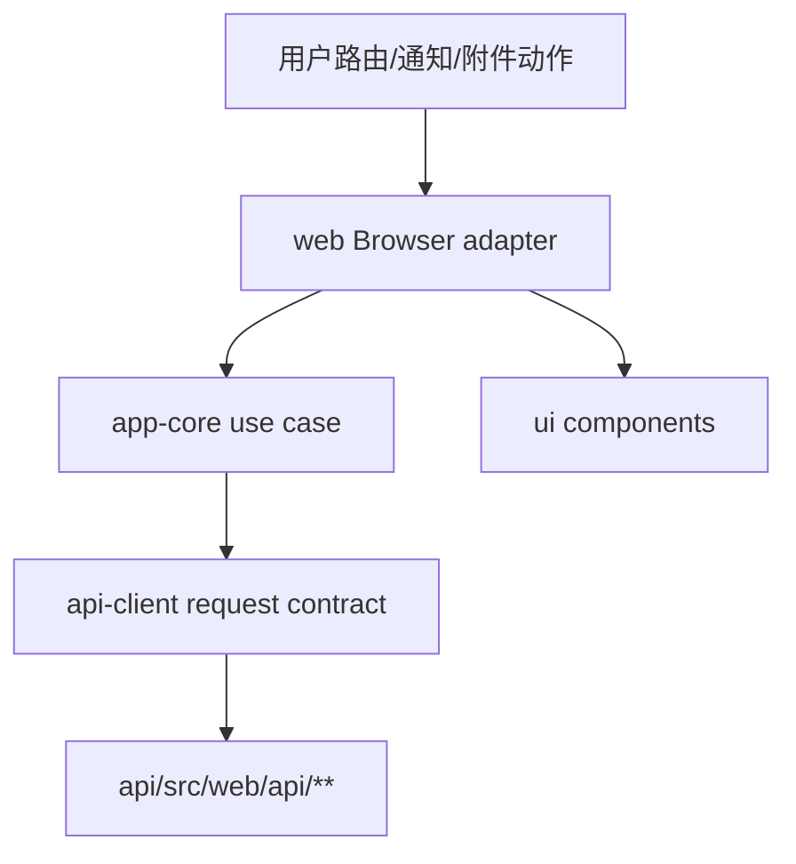

# refactor: W4 共享 JavaScript 层提炼

## 概述

本计划承接 Web 与 Desktop 共享前端主线的 W4 阶段，在工作项协作闭环已经通过浏览器验证后，从 `web/src/**` 中提炼首批稳定的 JavaScript/JSDoc 共享层：`api-client`、`app-core`、`ui` 和 `platform-contract`。

W4 的目标不是启动 Desktop renderer，也不是把所有 Web 代码一次性搬到 `frontend/`。本阶段只抽取已经由浏览器生产路径验证过的工作项协作、通知语义和路由能力；Cookie/CSRF transport、浏览器历史、`File`、`EventSource`、DOM 下载和同源资源交付继续留在 Browser 宿主内。

2026-07-31 执行记录：Unit 1-2 已完成。`frontend/` workspace 已创建，四个共享 package、JS/JSDoc 检查、source 后缀检查、package boundary 检查、基础 package tests 和 CI 路径接入已落地；根 `npm run check:frontend` 已覆盖 `web` 与 `frontend` 并通过。提交前审阅已补齐相对路径跨包 deep import、Node/Browser 宿主全局、CommonJS 源文件、package manifest 漂移和 package root exports 的边界验证。

2026-07-31 执行记录：Unit 3 已完成。`ApiError`、错误 payload 映射、注入式 `createApiClient()`、工作项/评论/附件、通知、topbar 与基础 auth/project client 已进入 `frontend/packages/api-client`；Browser Cookie/CSRF、401 登录跳转、`return_to` hash 恢复和 `EventSource` 继续留在 `web/src/lib/api.js`。`web` 已通过本地 package dependency 回接共享 `api-client`，现有 Web API transport 测试保持通过。

2026-07-31 执行记录：Unit 4A 已完成。纯路由 builder/parser 与通知 target 映射已进入 `frontend/packages/app-core`，并新增 package 单元测试；`web/src/lib/routes.js` 仅保留 `window.location` 默认参数 wrapper，`web/src/lib/notification-target.js` 改为公开 re-export。原 Unit 4 已按边界拆为 4A-4D。

2026-08-01 执行记录：Unit 4B-4D 已完成。`platform-contract` 已冻结文件选择、签名对象传输、受控下载、路由和状态反馈能力；工作项 mutation、handoff、评论及附件编排已进入 `app-core`，Browser `File`、header 过滤、对象存储请求和 DOM 下载留在 `web/src/platform/browser/files.js`。共享层与 Browser adapter 单元测试覆盖 action 过期保护、确认状态一致性、上传四段式顺序、失败短路、受控 URL/header 和 capability 生命周期；完整 19 项 Browser E2E 通过。

2026-08-01 执行记录：Unit 5 已完成。工作项详情、评论、附件、formatter 和直接样式已提取到 `frontend/packages/ui`，并通过公开 package exports 回接 Web；共享 UI 采用 `tsx --test` 执行 9 项 SSR contract 测试，不依赖 `window`、`document`、`fetch`、Browser adapter 或其他内部业务 package。Vite 已显式 dedupe React runtime，生产构建模块数由重复 React 状态的 61 降至 51；完整 19 项 Browser E2E 通过。

## 问题框架

当前 `web/src/app.jsx` 已经承载应用壳、消息中心、项目列表、工作项列表和工作项详情协作闭环。`web/src/lib/api.js`、`web/src/lib/routes.js` 和 `web/src/lib/notification-target.js` 已形成第一批可复用的 REST client、路由语义和通知目标映射，但这些代码仍与浏览器宿主能力混在一起：

- `web/src/lib/api.js` 同时包含纯 REST path/client、`ApiError`、CSRF 刷新、登录跳转、`window.sessionStorage` 片段恢复和 Browser `EventSource`。
- `web/src/lib/routes.js` 多数为纯路由解析/构建，但默认参数仍读取 `window.location`。
- `web/src/app.jsx` 同时包含 React 渲染、加载/刷新 orchestration、工作项写入、评论、附件签名上传/下载、DOM 焦点、`window.history` 和 `document` 操作。
- `web/src/app.css` 为单一 CSS 文件，组件样式与宿主布局样式尚未分界。

如果直接创建 Desktop renderer 或把 `web/src/app.jsx` 整体复制，会把 Browser Cookie、DOM 下载、`EventSource` 和历史路由假设带入共享层。W4 必须先以仓库现有 Web 证据为边界，把纯契约、use case 和无宿主副作用 UI 拆出来，再让 Browser composition root 回接共享包并证明行为不变。

## 需求追踪

- R1. 创建 `frontend/` JavaScript/JSDoc workspace，包含 `api-client`、`app-core`、`ui`、`platform-contract` 四个共享 package。
- R2. 共享 package 只包含 `.js` / `.jsx` 源码和 JSDoc/checkJs 契约，不新增业务 `.ts` / `.tsx` 源文件。
- R3. 保持单向依赖图：`platform-contract` 无内部依赖，`api-client` 不依赖 UI 或宿主平台，`ui` 不发请求也不调用平台 bridge，`app-core` 只依赖 `api-client` 和 `platform-contract`，Browser 宿主位于最外层。
- R4. 从已验证的工作项协作闭环提炼首批纯 API client、DTO、错误模型、路由语义、通知目标映射和工作项协作 use case。
- R5. Browser Cookie session、CSRF 刷新、登录 `return_to`、`window.history`、`window.location`、`window.sessionStorage`、`EventSource`、DOM anchor 下载和 `<input type=file>` 文件选择继续留在 `web/` 宿主或 Browser adapter。
- R6. Web 回接共享包后，消息中心、项目列表、工作项列表和工作项详情协作行为、URL 语义、错误提示、附件上传/下载和 Browser E2E 覆盖保持一致。
- R7. 共享 package 通过 `exports` 白名单、边界检查、禁止 deep import、禁止宿主特有依赖、循环依赖检查和 React 单例验证防止跨宿主漂移。
- R8. W4 不启动 Desktop renderer、Electron IPC、`app://`、device-session、离线缓存、富文本高级体验、资料库迁移、文档预览迁移或旧 Askama 下线。
- R9. W4 完成后同步主线计划，为 D1/D2 的 RFC 输入提供清晰的共享包边界和未完成能力清单。

## 范围边界

- 本计划只覆盖 `frontend/` 共享 JavaScript 层和 Browser 回接。
- 本计划不改变后端 REST、权限、审计、对象存储签名、CSRF、SSE 或 rollout 语义。
- 本计划不创建 `desktop/src/renderer/**`，不修改 `desktop/src/main.mjs` / `desktop/src/preload.cjs` 的业务能力。
- 本计划不把 `web/` 改成跨源部署；首期仍保持 API 同源交付。
- 本计划不迁移资料库、项目详情、文档预览、富文本回复、正文内附件节点、拖拽粘贴上传或旧版工作项详情下线。
- 本计划不把服务端业务规则复制到客户端；客户端只做展示、输入提示、状态 orchestration 和错误呈现。

## Context & Research

### Relevant Code and Patterns

- `web/package.json`：当前 Web 使用 Vite + React + JavaScript/JSDoc，已有 `check:source`、`check:js`、lint、Node test 和 Playwright E2E 聚合。
- `web/jsconfig.json`：已启用 `allowJs`、`checkJs`、`noEmit`、`jsx: react-jsx` 和 strict 检查，是共享包 `jsconfig.json` 的直接模板。
- `web/vite.config.js`：当前 Browser build 以 `/web/app/` 为 base，并通过 dev proxy 保持 API 同源行为；W4 回接时必须继续保留同源代理和资源交付边界。
- `web/eslint.config.js`：已有 flat config、React plugin、browser/node globals 和 `no-console` / `no-unused-vars` 规则，可作为 `frontend/eslint.config.js` 起点。
- `web/src/lib/api.js`：可拆分为纯 API client 与 Browser transport。纯候选包括 `ApiError`、REST path helper、DTO JSDoc、工作项/评论/附件/通知/topbar client 方法；Browser 留存包括 CSRF 刷新、登录跳转、return_to hash 恢复和 `EventSource`。
- `web/src/lib/routes.js`：纯候选包括 route parse/build、筛选参数规范化和工作项详情 hash 构建；需把默认读取 `window.location` 的 wrapper 留在 Browser adapter。
- `web/src/lib/notification-target.js`：纯候选，适合进入 `app-core` 的语义目标到内部路由映射。
- `web/src/app.jsx`：首批提炼输入包括工作项详情 load/mutation/comment/attachment orchestration、通知打开流程、路由导航语义和无宿主副作用组件；Browser 留存包括 DOM 焦点、`window.history`、`document.title`、DOM anchor 下载、`File` 和 `<input type=file>`。
- `web/test/api.test.mjs`、`web/test/routes.test.mjs`、`web/test/notification-target.test.mjs`：可迁移为共享 package 单元测试，保留 URL、method、payload、CSRF 触发边界和语义路由覆盖。
- `web/e2e/app-shell.spec.mjs`：继续作为 W4 回接后的端到端行为不变验证，尤其是工作项编辑、handoff、评论、附件四段式上传/下载和通知跳转。
- `.github/workflows/web-frontend.yml`：W4 需要把 `frontend/**`、`frontend/package-lock.json` 和共享检查纳入 CI 路径与缓存。

### Institutional Learnings

- `docs/solutions/2026-07-30-apk-oss-download-boundary.md` 强调上传、发现入口、签名下载和客户端安装/打开是不同边界。W4 的附件下载/上传也应保持同样口径：共享层只表达受控传输意图和签名请求 payload，不持久化预签名 URL，也不把 Browser DOM 下载实现带入共享包。

### External References

- Vite 官方文档（Context7 `/vitejs/vite`）：monorepo linked dependencies 会被当作源码处理并要求 ESM；library mode 应 externalize React 等不应被打包进库的依赖；`resolve.dedupe` 可用于强制 React 等依赖解析到单例。
- npm CLI 官方文档（Context7 `/npm/cli`）：`package.json` 的 `workspaces` 数组声明 workspace 包；`npm run` 支持通过 `--workspaces` 执行多个 workspace 脚本，并可用 `--if-present` 跳过缺失脚本。

## 关键技术决策

- **先冻结抽取边界，再搬代码。** W4 的第一单元必须产出包依赖图、共享/宿主清单和 import 规则；没有该边界，不创建或迁移大批共享源码。
- **共享 API client 接受注入 transport，不移动 Browser Cookie/CSRF 实现。** `api-client` 负责 path、payload、错误模型和 JSON contract；Browser transport 在 `web/` 中负责 `credentials: same-origin`、CSRF 刷新、401 登录跳转和 retry。
- **`EventSource` 首轮不进入共享 client。** Browser SSE 继续由 `web/` adapter 创建；共享层只接收“刷新事件”或定义事件订阅契约，避免把 Desktop 未来 fetch-stream SSE 约束提前固化为 Browser `EventSource`。
- **`File`、DOM anchor 下载和对象存储直传是平台能力。** `app-core` 可以编排“登记附件 -> 获取签名 -> 平台执行上传/下载 -> 标记 uploaded -> 刷新列表”，但实际 `File` 读取、header 过滤、同源 CSRF、anchor click 和 signed request 执行由 Browser adapter 负责。
- **UI 组件只接收 props 和回调。** `frontend/packages/ui` 不导入 `api-client`、`app-core`、`platform-contract`、`fetch` 或宿主 bridge；它可以导出工作项详情、列表、消息和通用 shell 组件，但不拥有业务权限或网络副作用。
- **不把 `web/src/app.jsx` 一次性整体移动。** 先提取 `web/src/lib/**` 与工作项协作最小 use case，再逐步拆组件；每个提取单元都必须保持 Web 回归可验证。
- **包解析优先服务 Browser 回接。** W4 不重组整个仓库为大 monorepo。`frontend/package.json` 管理 `packages/*` workspace 和 `frontend/package-lock.json`；`web/` 通过 package-name alias 或受控 local link 消费共享包，具体连接方式在 Unit 1 冻结，并用 checkJs、Node test 和 Vite build 证明可解析。
- **React 保持 Browser bundle 单例。** `ui` 将 `react` / `react-dom` 作为 peer 或外部化依赖处理，Web Vite 配置使用显式 dedupe/alias 验证，避免 linked package 带来第二份 React runtime。
- **W4 结束仍以 Browser feature 为验收基线。** 共享包本身通过单元/边界检查，最终成功标准是同一个工作项协作 feature 由共享包驱动且 Browser E2E 行为不变。

## Open Questions

### Resolved During Planning

- **是否已经满足 W4 启动门槛？** 满足。`docs/plans/2026-07-30-002-feat-web-work-item-collaboration-migration-plan.md` 已收口，工作项协作读写闭环通过 Browser E2E。
- **是否应该同时启动 Desktop renderer？** 不应该。D1 仍依赖 device-session、`app://`、credential、Desktop SSE 和 file-transfer RFC，本计划只为这些 RFC 提供共享包输入。
- **是否需要把 Browser Cookie/CSRF transport 提到 `api-client`？** 不需要。共享 `api-client` 接受 transport 注入，Browser Cookie/CSRF 留在 `web/`，Desktop 后续实现独立 Bearer/fetch-stream transport。
- **是否应以资料库或文档预览作为首批共享 feature？** 不应。资料库和文档预览尚未迁入新 `web/`，不能作为已验证共享基线。

### Resolved During Implementation

- **`web` 如何消费共享 package？** 已采用 `file:../frontend/packages/*` 本地 package dependency，并由 `web/package-lock.json` 固定解析；Unit 3 已通过 checkJs、Node test 和 Vite build 证明共享 `api-client` 可回接。本阶段不把整个仓库改为 root npm workspace，Unit 6 继续验证 React 单例和公开导出边界。
- **UI package 是否引入组件测试运行器？** 已引入最小的 `tsx` test runner，以 Node test + React SSR 验证组件静态 contract；用户交互和宿主集成继续由 Browser E2E 验收。
- **附件 signed request 执行 contract 的最终命名是什么？** 平台契约采用 `SignedObjectRequest`、`ObjectTransferCapability`、`uploadObject` 和 `downloadObject`，Browser adapter 只消费由认证 API 响应生成且具备用途、TTL 和一次性约束的 capability。
- **是否在 W4 顺手拆分整个 `App`？** 不拆分整个应用壳。Unit 5 只提取已验证的工作项详情、评论、附件和 formatter；消息中心、项目列表、工作项列表及 Browser 状态编排继续留在 `web/src/app.jsx`，Unit 6 只收口宿主 adapter 与 composition root。

## High-Level Technical Design

> 本图只说明预期边界，作为评审和执行上下文；实现时应以代码现状和测试结果校准，不要把图中的节点名当作必须照搬的实现规格。

### 包依赖图

## Implementation Units

- [x] **Unit 1: W4 抽取边界与包依赖图冻结**

**Goal:** 在代码改动前冻结共享/宿主边界、包依赖图、导出面、import 规则和迁移顺序，避免后续把 Browser 副作用带入共享包。

**Requirements:** R1, R3, R4, R5, R7, R8

**Dependencies:** `docs/plans/2026-07-30-002-feat-web-work-item-collaboration-migration-plan.md` 已完成。

**Files:**
- Modify: `docs/plans/2026-07-31-001-refactor-w4-shared-javascript-layer-plan.md`
- Modify: `docs/plans/2026-07-28-feat-web-desktop-shared-frontend-plan.md`
- Inspect: `web/src/app.jsx`
- Inspect: `web/src/lib/api.js`
- Inspect: `web/src/lib/routes.js`
- Inspect: `web/src/lib/notification-target.js`
- Inspect: `web/src/app.css`
- Inspect: `web/package.json`
- Inspect: `web/jsconfig.json`
- Inspect: `web/vite.config.js`

**Approach:**
- 逐项标记 `web/src/lib/api.js` 中的纯 client 候选和 Browser transport 留存点。
- 逐项标记 `web/src/app.jsx` 中的 use case、UI、路由、DOM、文件和事件边界。
- 冻结四包依赖图、包名、`exports` 策略、`web` 消费方式和 React 单例验证方式。
- 明确 W4 首轮只以工作项协作闭环为候选 feature，不纳入资料库、文档预览、富文本和 Desktop。

**Patterns to follow:**
- `docs/plans/2026-07-28-feat-web-desktop-shared-frontend-plan.md` 的 W4 阶段定义。
- `docs/plans/2026-07-30-002-feat-web-work-item-collaboration-migration-plan.md` 的 W3 收口证据。

**Test scenarios:**
- Test expectation: none -- 本单元只冻结计划和边界，不改变运行时代码。

**Verification:**
- 计划中列出的包依赖图、宿主留存清单、迁移顺序和不纳入范围与主线 W4 门槛一致。
- 后续单元可从该边界直接执行，不需要重新决策是否启动 Desktop 或跨源认证。

- [x] **Unit 2: 搭建 `frontend/` workspace 与边界检查骨架**

**Goal:** 创建共享 workspace、四个 package 骨架、JSDoc/checkJs/lint/test 聚合和基础边界检查，使后续代码迁移有可执行质量门槛。

**Requirements:** R1, R2, R3, R7

**Dependencies:** Unit 1。

**Files:**
- Create: `frontend/package.json`
- Create: `frontend/package-lock.json`
- Create: `frontend/eslint.config.js`
- Create: `frontend/jsconfig.base.json`
- Create: `frontend/scripts/assert-js-only.mjs`
- Create: `frontend/scripts/assert-package-boundaries.mjs`
- Create: `frontend/packages/api-client/package.json`
- Create: `frontend/packages/api-client/jsconfig.json`
- Create: `frontend/packages/api-client/src/index.js`
- Create: `frontend/packages/app-core/package.json`
- Create: `frontend/packages/app-core/jsconfig.json`
- Create: `frontend/packages/app-core/src/index.js`
- Create: `frontend/packages/ui/package.json`
- Create: `frontend/packages/ui/jsconfig.json`
- Create: `frontend/packages/ui/src/index.jsx`
- Create: `frontend/packages/platform-contract/package.json`
- Create: `frontend/packages/platform-contract/jsconfig.json`
- Create: `frontend/packages/platform-contract/src/index.js`
- Modify: `package.json`
- Modify: `.github/workflows/web-frontend.yml`

**Approach:**
- 以 `web/package.json`、`web/jsconfig.json` 和 `web/eslint.config.js` 为模板，建立共享包同等的 JavaScript/JSDoc 检查基线。
- `frontend/package.json` 声明 `packages/*` workspace，并聚合各包 `check`；package 目录不得生成独立 lockfile。
- 边界脚本至少覆盖：禁止 `.ts` / `.tsx` 业务源文件，禁止共享包导入 `electron`、Node 内建模块、`ipcRenderer`、`window.yuanceDesktop`，禁止跨包 deep import，禁止循环依赖。
- CI 增加 `frontend/**` 路径和 `frontend/package-lock.json` 缓存；根 `check:frontend` 扩展为 Web 与共享包共同通过。

**Patterns to follow:**
- `web/scripts/assert-js-only.mjs`
- `web/jsconfig.json`
- `web/eslint.config.js`
- `.github/workflows/web-frontend.yml`

**Test scenarios:**
- Happy path：四个空 package 均只有 `.js` / `.jsx` 源文件，workspace 聚合检查通过。
- Error path：在共享 package 中加入 `.ts` 或 `.tsx` 业务源文件时，source 边界检查失败。
- Error path：在 `frontend/packages/ui/src/**` 中导入 `fetch`/`api-client` 或在任一共享包中导入 `electron`、Node 内建模块、`window.yuanceDesktop` 时，边界检查失败。
- Integration：根前端聚合检查同时覆盖 `web` 与 `frontend`，CI 路径变更能触发对应 job。

**Verification:**
- `frontend/` workspace 可独立完成 checkJs、lint、test 和边界检查。
- 根前端聚合检查包含 `web` 与 `frontend` 两部分。
- 共享包骨架没有宿主特有依赖、`.ts` / `.tsx` 源文件、循环依赖或 deep import。

- [x] **Unit 3: 提取纯 API client、DTO 与错误模型**

**Goal:** 将 `web/src/lib/api.js` 中与宿主无关的 REST path、DTO JSDoc、错误模型和工作项/通知 client 移入 `frontend/packages/api-client`，并让 Browser transport 继续掌管 Cookie/CSRF/登录跳转。

**Requirements:** R3, R4, R5, R6, R7

**Dependencies:** Unit 2。

**Files:**
- Modify: `frontend/packages/api-client/src/index.js`
- Create: `frontend/packages/api-client/src/errors.js`
- Create: `frontend/packages/api-client/src/http-client.js`
- Create: `frontend/packages/api-client/src/work-items.js`
- Create: `frontend/packages/api-client/src/notifications.js`
- Create: `frontend/packages/api-client/src/topbar.js`
- Create: `frontend/packages/api-client/test/api-client.test.mjs`
- Modify: `web/src/lib/api.js`
- Modify: `web/test/api.test.mjs`
- Modify: `web/jsconfig.json`
- Modify: `web/vite.config.js`
- Modify: `web/package.json`

**Approach:**
- 把 `ApiError`、DTO typedef、path helper、payload 序列化、工作项、评论、附件、通知和 topbar JSON client 迁入 `api-client`。
- 新共享 client 接受注入的 request/transport，不在共享包中读取 `window`、`document`、Cookie、sessionStorage 或 `EventSource`。
- `web/src/lib/api.js` 收缩为 Browser API composition：实现 same-origin fetch、CSRF 刷新、401 登录跳转、return_to hash 恢复和 Browser SSE。
- `openTopbarEvents()` 首轮保留在 Browser adapter；若需要共享，只抽象为事件订阅 contract，不移动 `new EventSource(...)`。
- 保留 `web/test/api.test.mjs` 中对 CSRF retry 和登录跳转的 Browser transport 覆盖，同时把纯 URL/method/payload 测试迁到 package 测试。

**Patterns to follow:**
- `web/src/lib/api.js::fetchJson`
- `web/test/api.test.mjs`
- 主线计划的 Browser transport 边界说明。

**Test scenarios:**
- Happy path：共享 work item update client 使用注入 transport 产生 `PATCH /api/v1/work-items/{key}`、正确 JSON payload 和 `ApiError` 语义，不直接触碰 CSRF。
- Happy path：共享附件 client 返回清洗后的 attachment DTO，不暴露 `object_key`、`file_object_id` 等内部字段。
- Happy path：Browser transport 在写请求前刷新 CSRF，并在共享 client 调用时仍设置 same-origin credentials。
- Error path：Browser 写请求遇到 CSRF 失败后只重试一次，错误仍以 `ApiError` 传回 UI。
- Error path：401 仍触发 Browser 登录跳转和 return_to hash 恢复，不由共享 `api-client` 决定页面跳转。
- Integration：现有消息、项目、工作项、评论和附件 API 调用在 Web UI 中继续使用同一 REST 路径和 payload。

**Verification:**
- `api-client` package 单元测试覆盖 path、method、payload、DTO 清洗和错误模型。
- Browser transport 测试继续覆盖 CSRF、401、same-origin 和 SSE 留存边界。
- Web build 和 Browser E2E 在 API client 提取后行为不变。

- [x] **Unit 4A: 提取路由与通知目标语义**

**Goal:** 将纯路由语义和通知目标映射提取到 `frontend/packages/app-core`，同时把 Browser history、location 和 DOM 焦点留在 `web/`。

**Requirements:** R3, R4, R5, R6, R7

**Dependencies:** Unit 3。

**Files:**
- Modify: `frontend/packages/app-core/src/index.js`
- Create: `frontend/packages/app-core/src/routes.js`
- Create: `frontend/packages/app-core/src/notification-target.js`
- Create: `frontend/packages/app-core/test/routes.test.mjs`
- Create: `frontend/packages/app-core/test/notification-target.test.mjs`
- Modify: `web/src/lib/routes.js`
- Modify: `web/src/lib/notification-target.js`
- Modify: `web/test/routes.test.mjs`
- Modify: `web/test/notification-target.test.mjs`

**Approach:**
- 将 `buildHomePath`、`buildMessagesPath`、`buildProjectsPath`、`buildWorkItemListPath`、`buildWorkItemDetailPath` 和不读取 global 的 route parse 移入 `app-core`。
- `web/src/lib/routes.js` 只保留从 `window.location` 读取当前路由和调用 `history.pushState/replaceState` 的 Browser wrapper。
- 将 `notificationTargetPath()` 移入 `app-core`，继续以服务端语义 target 映射内部路由，不重新引入 `/web/messages/{id}/open` 作为业务协议。

**Patterns to follow:**
- `web/src/lib/routes.js`
- `web/src/lib/notification-target.js`

**Test scenarios:**
- Happy path：`buildWorkItemDetailPath({ owner: 'app', itemKey, commentId })` 输出新 Web 工作项详情 hash 路由。
- Edge case：空 work item key 映射回任务列表，不产生非法详情路由。
- Happy path：通知 target 为 work item 时映射到工作项详情并保留评论 hash。
- Error path：通知 target 缺失或未知 kind 时映射到消息中心。
- Integration：Browser wrapper 仍负责 history/location/focus，app-core 测试中不需要 DOM。

**Verification:**
- `app-core` 单元测试覆盖路由和通知 target。
- `web/src/lib/routes.js` 与 `web/src/lib/notification-target.js` 成为兼容 wrapper 或被安全移除。
- Web 页面刷新、前进/后退和通知跳转不因提取改变。

- [x] **Unit 4B: 定义平台文件、下载与路由能力契约**

**Goal:** 在 `platform-contract` 中定义 W4 实际需要的平台能力形状，不引入 Browser 或 Desktop 实现。

**Requirements:** R3, R4, R5, R7

**Dependencies:** Unit 4A。

**Files:**
- Modify: `frontend/packages/platform-contract/src/index.js`
- Create: `frontend/packages/platform-contract/src/platform.js`
- Create: `frontend/packages/platform-contract/src/files.js`
- Create: `frontend/packages/platform-contract/src/router.js`
- Create: `frontend/packages/platform-contract/test/platform.test.mjs`

**Approach:**
- 只定义文件选择结果、签名上传执行、受控下载、内部路由和状态反馈的 JSDoc 类型与最小能力接口。
- 不暴露原始本地路径、任意 URL/headers、Browser `File`、DOM 或 Electron bridge。
- 根据现有 `AppSignedObjectRequest` 冻结 signed request contract 命名，并将本计划对应 Open Question 移入已解决事项。

**Verification:**
- `platform-contract` 单元测试和边界检查通过。
- package 不导入 Browser、Electron、Node.js 或业务 feature。

- [x] **Unit 4C: 提取工作项 mutation 与评论 use case**

**Goal:** 将工作项编辑、handoff、评论新增和评论编辑编排提成不依赖 React state 或 DOM 的 use case。

**Requirements:** R3, R4, R5, R6, R7

**Dependencies:** Unit 4B。

**Files:**
- Modify: `frontend/packages/app-core/src/index.js`
- Create: `frontend/packages/app-core/src/work-item-collaboration.js`
- Create: `frontend/packages/app-core/test/work-item-collaboration.test.mjs`
- Modify: `web/src/app.jsx`

**Approach:**
- use case 接收 `api`、输入 payload 和成功后的刷新回调；不直接管理 React state、焦点或路由。
- 保留 action/request ID 的过期响应保护，服务端响应继续作为最终事实。
- Browser 宿主负责表单输入保留、错误呈现和 DOM 焦点恢复。

**Verification:**
- 单元测试覆盖编辑、handoff、评论新增/编辑、刷新顺序、错误透传和过期响应。
- Web 聚焦测试与现有工作项协作 E2E 通过。

- [x] **Unit 4D: 提取附件编排并回接 Browser adapter**

**Goal:** 提取工作项与评论附件上传/下载编排，以 Unit 4B 的平台契约执行宿主操作。

**Requirements:** R3, R4, R5, R6, R7

**Dependencies:** Unit 4C。

**Files:**
- Modify: `frontend/packages/app-core/src/work-item-collaboration.js`
- Modify: `frontend/packages/app-core/test/work-item-collaboration.test.mjs`
- Create: `web/src/platform/browser/files.js`
- Modify: `web/src/app.jsx`
- Modify: `web/e2e/app-shell.spec.mjs`

**Approach:**
- 上传严格按登记、签名、平台上传、uploaded 确认、刷新列表顺序执行。
- 下载由 use case 获取受控签名请求，Browser adapter 负责 DOM 下载或打开行为。
- `<input type=file>`、`File`、header 过滤、DOM anchor 和签名请求实际执行继续留在 Browser adapter。

**Verification:**
- 单元测试覆盖上传顺序、签名/平台失败时不确认 uploaded、下载意图和错误透传。
- 工作项及评论附件上传/下载 Browser E2E 通过。

- [x] **Unit 5: 提取首批无宿主副作用 UI 组件与样式策略**

**Goal:** 从 `web/src/app.jsx` 和 `web/src/app.css` 中提取首批纯 UI 组件，使工作项详情协作页面由共享 `ui` 组件渲染，Browser 宿主只负责状态、adapter 和 composition。

**Requirements:** R3, R4, R5, R6, R7

**Dependencies:** Unit 4D。

**Files:**
- Create: `frontend/packages/ui/src/work-item-detail.jsx`
- Create: `frontend/packages/ui/src/work-item-comments.jsx`
- Create: `frontend/packages/ui/src/work-item-attachments.jsx`
- Create: `frontend/packages/ui/src/formatters.js`
- Create: `frontend/packages/ui/src/styles.css`
- Create: `frontend/packages/ui/test/work-item-detail-components.test.mjs`
- Modify: `web/src/app.jsx`
- Modify: `web/src/app.css`
- Modify: `web/e2e/app-shell.spec.mjs`

**Approach:**
- 首批只提取工作项详情、评论、附件面板、状态/优先级展示、必要 formatter 和这些组件直接使用的样式；应用壳、消息中心与工作项列表留待后续按稳定性单独评估。
- UI 组件只通过 props 接收数据、busy/error/status 状态和回调；不得导入 `api-client`、`app-core`、`platform-contract`、`fetch`、`window`、`document` 或 Browser adapter。
- 样式策略采用共享 `ui/src/styles.css` + Browser 宿主薄入口；保留真正属于 Browser shell 的页面级布局在 `web/src/app.css`，避免把宿主导航和资源 base 假设带入 `ui`。
- 如果组件测试需要新增 runner，选择最小依赖并记录原因；无论是否新增组件测试，工作项协作行为仍以 Browser E2E 为最终验收。

**Patterns to follow:**
- `web/src/app.jsx` 当前 JSX 分区。
- `web/src/app.css` 当前 `.shell-card` 与 `.work-item-*` 样式。
- `web/e2e/app-shell.spec.mjs` 中依赖 role/label 的可访问选择器。

**Test scenarios:**
- Happy path：工作项详情组件接收详情、评论和附件 props 后渲染标题、描述、状态、优先级、评论和附件列表。
- Happy path：保存、handoff、发布评论、编辑评论、下载附件、上传附件按钮触发传入回调，不直接执行网络请求。
- Edge case：无附件、附件列表部分加载失败、空评论列表和未分配处理人时渲染明确空态。
- Error path：组件接收局部错误文本时以 `role="alert"` 或现有错误区域可见，不吞掉用户输入。
- Integration：Browser E2E 仍可通过 role/label 定位关键表单和按钮，说明可访问语义未漂移。

**Verification:**
- `ui` package 不含宿主副作用导入，checkJs/lint 通过。
- `web/src/app.jsx` 的 JSX 体积下降，Browser-specific state/adapter 留在宿主层。
- 工作项协作 Browser E2E 继续通过，页面可访问 label/role 不退化。

- [ ] **Unit 6: Web 宿主回接共享包并完成 Browser 回归**

**Goal:** 将 `web/src/main.jsx` / `web/src/app.jsx` 收口为 Browser composition root 和 adapter，实现共享 `api-client`、`app-core`、`ui` 在现有 Web 生产路径中的端到端闭环。

**Requirements:** R5, R6, R7, R8

**Dependencies:** Unit 5。

**Files:**
- Modify: `web/src/main.jsx`
- Modify: `web/src/app.jsx`
- Create: `web/src/platform/browser/api-transport.js`
- Create: `web/src/platform/browser/router.js`
- Modify: `web/src/platform/browser/files.js`
- Create: `web/src/platform/browser/events.js`
- Modify: `web/src/lib/api.js`
- Modify: `web/src/lib/routes.js`
- Modify: `web/src/app.css`
- Modify: `web/package.json`
- Modify: `web/jsconfig.json`
- Modify: `web/vite.config.js`
- Modify: `web/e2e/app-shell.spec.mjs`
- Modify: `.github/workflows/web-frontend.yml`

**Approach:**
- Browser composition root 注入 API transport、platform capabilities、router wrapper 和 UI/app-core 入口。
- 保留同源 Cookie/CSRF、登录跳转、return_to hash 恢复、`EventSource`、DOM 下载、`File` 和 `<input type=file>` 在 `web/src/platform/browser/**`。
- Web 继续使用 `/web/app/` base、现有 dev proxy 和生产同款 API 镜像交付；W4 不改变跨源部署模型。
- 使用 Vite linked dependency / alias 方案时显式 dedupe React/React DOM，并验证 bundle 中没有第二份 React。
- CI 与本地检查覆盖共享 package、Web check、Web build、Browser E2E 和生产同款 smoke。

**Patterns to follow:**
- `web/src/main.jsx`
- `web/vite.config.js`
- `.github/workflows/web-frontend.yml`
- 主线计划的同源交付与 Browser transport 约束。

**Test scenarios:**
- Happy path：直接打开 `/web/app/work-items/YCE-TASK-2` 后仍恢复会话、加载详情、评论和附件。
- Happy path：编辑工作项、handoff、发布/编辑评论、工作项附件上传/下载、评论附件上传/下载在共享包回接后继续成功。
- Happy path：消息中心打开通知后按语义 target 进入工作项详情并保留 comment hash。
- Edge case：刷新、前进/后退、登录 return_to hash 恢复和旧版详情回退入口保持原行为。
- Error path：CSRF 失效、401、附件签名失败、平台上传失败和服务端 403/400 仍展示可见错误并保留输入。
- Integration：Web build 产物仍由 API 同源 `/web/app/*` 交付，缺失 hash 资源 404、入口/manifest 缓存策略不漂移。

**Verification:**
- Web check、共享 package check、Web build、Browser E2E 和生产同款 smoke 均通过。
- Web 运行时不再 deep import `frontend/packages/**/src/**` 内部文件，只使用公开导出或已冻结 alias。
- Browser bundle 不包含 Electron/Node 宿主依赖，并保持 React 单例解析。

- [ ] **Unit 7: 收口验证、主线回填与 D1/D2 输入更新**

**Goal:** 完成 W4 收口复核，更新主线阶段状态，记录共享包边界、未纳入能力和下一阶段输入，确保 D1/D2 不误读 W4 结果。

**Requirements:** R7, R8, R9

**Dependencies:** Unit 6。

**Files:**
- Modify: `docs/plans/2026-07-31-001-refactor-w4-shared-javascript-layer-plan.md`
- Modify: `docs/plans/2026-07-28-feat-web-desktop-shared-frontend-plan.md`
- Modify: `docs/runbooks/api-v1-contract.md`（仅当 W4 暴露契约文档缺口）
- Create or Modify: `docs/solutions/*.md`（仅当出现可复用坑点或关键决策）

**Approach:**
- 将本计划状态改为 `completed`，勾选完成单元，并记录验证证据。
- 主线计划中将 W4 从“规划中/实施中”更新为实际状态，并保留 D1/D2 的明确前置：device-session、`app://`、credential、Desktop SSE、file-transfer RFC。
- 回填 W4 未纳入范围：富文本高级体验、资料库、文档预览、Desktop renderer、离线能力和旧 Askama 下线。
- 在资料库、项目详情、文档预览和 D1 RFC 中只选择一个下一切片；选定后另建可独立验收的子计划，未选方向继续保留在主线 `pending`。
- 若实现中发现包解析、React 单例、CSRF transport 或 signed request 边界的可复用经验，沉淀到 `docs/solutions/`。

**Patterns to follow:**
- `docs/plans/2026-07-30-002-feat-web-work-item-collaboration-migration-plan.md` 的收口方式。
- `docs/solutions/2026-07-30-apk-oss-download-boundary.md` 的边界沉淀口径。

**Test scenarios:**
- Test expectation: none -- 本单元只更新计划和沉淀文档；运行时行为由 Unit 6 验证。

**Verification:**
- 主线、W4 子计划和实际代码状态一致。
- 下一步可明确进入 D1 RFC 或继续 W3 feature 迁移，不会把 W4 误判为 Desktop 已可启动。

## System-Wide Impact

- **Interaction graph:** `web/src/main.jsx`、Browser adapters、共享 `app-core`、共享 `api-client`、共享 `ui`、REST/SSE API 和 Playwright E2E 会形成新的前端依赖链；旧 Askama 页面仍并存。
- **Error propagation:** API 错误统一保留 `ApiError` 语义；Browser transport 负责 CSRF/401 恢复，共享 use case 只返回可展示错误，不触发页面跳转。
- **State lifecycle risks:** 工作项 mutation、评论、附件上传/下载存在并发与路由切换风险；现有 request/action ref 模式需要在 app-core 提取时保留“过期响应不覆盖当前路由”的不变量。
- **API surface parity:** W4 不新增后端契约；若提取过程中发现缺失 OpenAPI/事件描述，只补文档或后续计划，不在共享层发明新业务协议。
- **Integration coverage:** 单元测试只能证明共享包边界；工作项协作、通知跳转、CSRF、附件 signed request 和生产同款资源交付必须靠 Browser E2E 与 smoke 覆盖。
- **Unchanged invariants:** 服务端权限、审计、工作项状态规则、对象存储签名、Cookie/CSRF、SSE 和 rollout 仍由现有 API/Web 宿主管理；Desktop、离线和跨源认证仍未启动。

## Risks & Dependencies

| Risk | Mitigation |
|------|------------|
| 抽取过大导致 Web 行为回归 | 按 API client、app-core、ui、Browser 回接分单元迁移；每单元后保留聚焦验证，最终跑完整 Browser E2E。 |
| Browser transport 被误提到共享包 | Unit 1 列出宿主留存清单；边界检查禁止共享包读取 `window`、`document`、`EventSource`、DOM 下载或 Electron/Node 能力。 |
| React linked dependency 产生多实例 | `ui` 使用 peer/external 策略，Web Vite 配置显式 dedupe/alias，并在 CI 增加 React 单例验证。 |
| npm workspace 与现有 `web` 独立 lockfile 冲突 | Unit 1 先冻结解析方式；默认 `frontend/` 使用自己的 workspace lockfile，`web` 消费方式必须被 checkJs、Node test 和 Vite build 证明。 |
| `app.jsx` 拆分时丢失过期响应保护 | 将 request/action id 语义作为 app-core 测试场景，确保路由切换后的旧响应不会覆盖当前状态。 |
| 附件 signed request 泄漏或被错误持久化 | 共享层只传递短期 request payload；实际上传/下载执行留在 Browser adapter，并沿用“签名 URL 不持久化”的 institutional learning。 |
| UI 提取破坏可访问性选择器 | 组件 props/回调保持现有 label/role；Browser E2E 继续使用可访问选择器验证关键流程。 |
| D1/D2 误以为 W4 已解决 Desktop 安全 | 计划和主线收口明确 W4 不包含 Desktop renderer、device-session、`app://`、credential、Desktop SSE 和 file-transfer。 |

## Documentation / Operational Notes

- W4 实施中如果实际包解析方式、React 单例策略或边界脚本与本计划不同，必须同步更新本计划，不能只改代码。
- W4 完成后主线计划只记录阶段状态和收口证据，不把本子计划正文合并回主线。
- 若出现可复用坑点，优先沉淀为 `docs/solutions/YYYY-MM-DD-*.md`，尤其是 npm workspace / Vite linked dependency / Browser transport 边界类问题。
- 发布与生产部署仍沿用现有 Web 同源资源交付 runbook；本计划不新增正式环境部署步骤。

## Sources & References

- **Origin document:** `docs/plans/2026-07-28-feat-web-desktop-shared-frontend-plan.md`
- **W3 evidence:** `docs/plans/2026-07-30-002-feat-web-work-item-collaboration-migration-plan.md`
- **Upstream brainstorm:** `docs/brainstorms/2026-07-28-web-desktop-shared-frontend-architecture.md`
- **Relevant code:** `web/src/app.jsx`
- **Relevant code:** `web/src/lib/api.js`
- **Relevant code:** `web/src/lib/routes.js`
- **Relevant code:** `web/src/lib/notification-target.js`
- **Relevant tests:** `web/test/api.test.mjs`
- **Relevant tests:** `web/e2e/app-shell.spec.mjs`
- **Institutional learning:** `docs/solutions/2026-07-30-apk-oss-download-boundary.md`
- **External docs:** Vite build and dependency pre-bundling docs, <https://vite.dev/guide/build.html> and <https://vite.dev/guide/dep-pre-bundling.html>
- **External docs:** npm workspaces docs, <https://docs.npmjs.com/cli/using-npm/workspaces>
