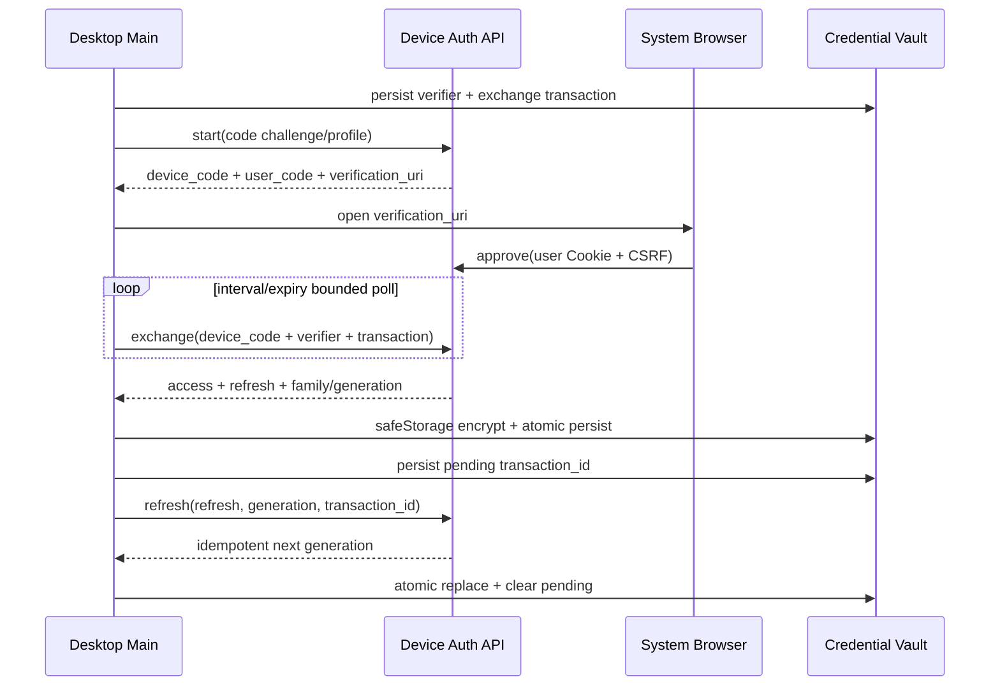
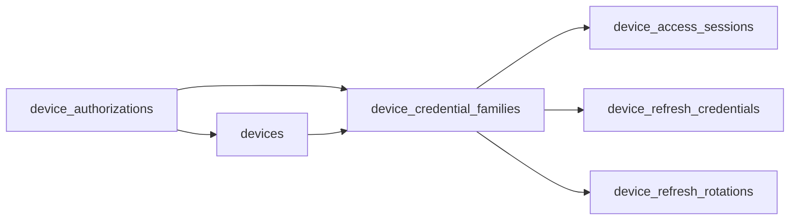

# feat: D1 设备会话与 Desktop 凭证

## 概述

本计划承接 Web 与 Desktop 共享前端主线的 D1 首个切片，建立独立于 Browser Cookie/PAT 的设备批准、设备会话、短期 Bearer access token、可恢复 refresh rotation、设备撤销和 Desktop 主进程安全凭证存储。

本切片不创建内置 renderer，也不把当前远端 `/web` 页面改造成 Desktop 应用。它先冻结并实现认证边界，使后续 `app://`、Desktop fetch-stream SSE、文件 capability/transfer 和发行 Gate 能依赖同一套设备身份与撤销语义，而不是继续复用 Cookie 或让 renderer 接触长期凭证。

## 问题框架

当前 Browser 登录由 `sessions`、`refresh_sessions` 和 HttpOnly Cookie 驱动，刷新时撤销旧 refresh row 并签发新 token。该模型适合同源 Browser，但不能直接作为 Desktop 长期凭证：

- refresh rotation 没有客户端 transaction ID、同 ID 幂等结果或响应丢失恢复；服务端已旋转而客户端尚未持久化时会永久失去会话。
- session/refresh 没有 `device_id`、credential family、server instance、authorization version 或设备级撤销边界。
- `/api/v1/auth/login` 返回 Cookie，现有 Bearer token 是用户主动创建的 PAT，并具有独立 scope 语义；二者都不是 Desktop device credential。
- Desktop `desktop/src/main.mjs` 当前直接加载远端 `/web`，Electron session 持有 Cookie；preload 暴露的通知 bridge 只按远端 Web origin 判断 sender。
- Desktop 尚无凭证库抽象、原子 credential transaction、账户/endpoint 隔离、恢复探针或凭证库不可用状态。

因此本切片必须建立第三种明确认证主体 `device_session`，并保持 Browser Cookie、OpenAPI PAT、system token 三条现有链路行为不变。

## 需求追踪

- R1. 提供浏览器批准的 device authorization flow：Desktop 发起、用户在已登录 Browser 中批准或拒绝、Desktop 轮询并交换设备凭证；不在 Desktop 内收集用户名和密码。初始 exchange 也必须使用客户端预持久化 transaction ID 实现响应丢失恢复。
- R2. device authorization 绑定 canonical endpoint、服务端生成且客户端不可覆盖的稳定 `server_instance_id`、PKCE `code_challenge`、设备显示信息、短 TTL、单次批准和明确的 `pending/approved/denied/expired/consumed` 状态；`server_instance_id` 只是可信 HTTPS origin 下的实例绑定因子，不是独立认证因子。
- R3. 设备凭证由短期 opaque access token 与具有滑动/绝对到期上限的 rotating refresh token 组成；两者具有独立 issuer/audience/token namespace，服务端只按 `device_session` 主体认证，不能把 PAT、Cookie 或 system token 当作 refresh credential。
- R4. refresh rotation 使用客户端发送前持久化的 `transaction_id`：同一 credential generation + 同 ID 必须幂等返回同一结果，不同 ID 重放旧 generation 必须拒绝并触发安全恢复或撤销。
- R5. access/refresh credential、rotation 结果和服务器身份绑定 `(canonical endpoint, server instance, user, device, credential family)`；endpoint、server instance、用户或设备切换不得复用凭证。
- R6. 支持当前设备登出、当前用户列出/撤销自己的设备；用户禁用、设备撤销、credential family 撤销后，device probe/logout/access/refresh 均拒绝。device access 对现有业务 API 默认拒绝，直到 D2 按 feature 显式登记。授权 epoch 与活跃 SSE 关闭由后续 Desktop SSE 子计划扩展，但本计划必须预留版本字段和撤销事件边界。
- R7. Desktop 仅在主进程持有 access/refresh credential。短期 access token 只驻留主进程内存；持久化 refresh credential 使用 Electron `safeStorage` 加密后写入权限受限的原子 credential record；renderer、preload、日志、崩溃信息和普通配置不得出现 token。
- R8. macOS/Windows 仅在 `safeStorage.isEncryptionAvailable()` 为真时启用持久设备会话；Linux 还必须拒绝 `safeStorage.getSelectedStorageBackend() === "basic_text"`。凭证库不可用时进入可恢复的未认证/locked 状态，留待后续 renderer 呈现，不降级为明文或 Cookie。
- R9. Desktop rotation coordinator 保证单飞，发送请求前先原子持久化 pending `transaction_id`；覆盖服务端成功后本地写入失败、响应丢失、进程强杀和旧响应迟到恢复。
- R10. OpenAPI、审计事件、错误码、配置 TTL 与测试契约同步落地；响应统一 `Cache-Control: private, no-store`，敏感端点具备速率限制/轮询间隔约束，不在审计 metadata 中记录原始 code/token。
- R11. Browser Cookie session、个人 OpenAPI PAT、system token 的现有路由、scope、CSRF 和刷新行为不得改变。
- R12. 本计划不实现 renderer、`app://`、Desktop SSE、文件 capability/transfer、离线缓存、自动更新或生产发行。

## 范围边界

### 本计划包含

- 服务端 device authorization、approval、credential exchange、access validation、refresh rotation、probe、当前用户设备列表、logout/revoke 数据模型和 REST 契约。
- Desktop 主进程 credential store、profile key、认证状态机、rotation coordinator 和最小网络 client。
- Browser 批准页面或现有 Web 壳内的批准入口；批准动作继续使用 Cookie + CSRF。
- OpenAPI、审计、配置项、迁移和聚焦测试。

### 本计划不包含

- 不创建 `desktop/src/renderer/**`，不停止当前远端 Web 壳，也不把 device access token 注入远端页面。
- 不实现 `app://` protocol、CSP、导航 sender hardening 或正式 Desktop composition root；这些属于下一独立 D1 子计划。
- 不实现 Desktop SSE。只预留 `authorization_version`/撤销字段，流的绑定、轮换和 `revocation_close_deadline` 在 network/SSE 子计划验收。
- 不实现 `StorageTransferGrant`、文件选择、对象存储请求或本地路径 capability。
- 不实现自动更新、签名、公证、release manifest、离线读写或业务 feature 对齐。
- 不允许 device credential 复用 PAT scope；设备登录代表用户交互会话，业务授权仍由现有 RBAC 在每次请求时计算。

## Context & Research

### Relevant Code and Patterns

- `api/src/domains/auth.rs`：现有 Cookie session/refresh 的签发、哈希、撤销与 rotation；可复用 opaque token 哈希和事务模式，但不能复用 Cookie transport 或当前不可恢复 rotation。
- `api/migrations/202606260001_create_core_tables.sql`：`sessions` 当前保存用户、状态、到期和访问元数据，没有设备归属。
- `api/migrations/202607160001_create_refresh_sessions.sql`：现有 refresh row 独立撤销，没有 family/generation/transaction 关联。
- `api/src/web/api/mod.rs::require_api_principal`：当前先识别 PAT Bearer，再回退 Cookie。device Bearer 必须先通过明确 token prefix 分类，避免改变 PAT scope 路径。
- `api/src/platform/crypto.rs`：已有 AES-256-GCM + AAD 的服务端 secret 加密，可用于幂等 rotation 结果的短期密文，避免数据库保存 refresh 明文。
- `api/src/domains/api_tokens.rs`：已有 Bearer parser、token prefix、哈希、用户状态和 scope 校验模式；device token 应使用不同 prefix 与独立 domain。
- `api/tests/auth_csrf_refresh_flow.rs`、`api/tests/auth_security_flow.rs`：现有 Cookie auth 回归基线。
- `docs/openapi/yuance.openapi.json`：Browser Cookie auth 与 PAT Bearer 契约的规范源，需要增加独立 `deviceAccess` security scheme 和 device auth schemas。
- `desktop/src/main.mjs`：当前 Electron 主进程及生命周期入口，后续只在主进程创建 credential coordinator。
- `desktop/src/preload.cjs`：当前 bridge 不得增加任何返回 token、原始 Authorization 或 credential record 的 API。
- `desktop/src/config.mjs`：已有开发/生产 profile 隔离，可扩展 canonical endpoint/server instance/profile key 解析。
- `desktop/test/config.test.mjs`：Node test 与源码边界断言模式。

### Institutional Learnings

- `docs/solutions/2026-07-30-apk-oss-download-boundary.md`：发现入口、认证 API 和对象存储访问必须分层；同样适用于 device credential，认证 token 不得进入对象存储请求。
- `docs/solutions/2026-08-01-docker-local-workspace-dependencies.md`：隔离环境验证必须覆盖真实依赖解析；后续 Desktop credential 测试不能只依赖开发机现有 Keychain 状态。

## 关键技术决策

### 1. 使用浏览器批准，不在 Desktop 内收集密码

Desktop 先生成高熵 `code_verifier` 与 `exchange_transaction_id` 并原子持久化，再向 `POST /api/v1/device-authorizations` 提交 `S256 code_challenge`，获取 `device_code`、短 `user_code`、`verification_path`、`expires_in` 和最小 `interval`。用户在系统 Browser 进入批准页，由现有 Cookie session + CSRF 确认当前账户和设备信息。Desktop 轮询状态并在批准后使用 `device_code + code_verifier + exchange_transaction_id` 交换 credential。

`device_code` 只返回 Desktop，数据库仅保存哈希；`user_code` 采用高熵、易输入、大小写归一化格式并受尝试次数与速率限制。批准页面不得接受 Desktop 提供的用户身份。`verification_path` 必须是固定相对路径，Desktop 使用打包内可信 origin 本地构造 URL，不能打开服务端返回的任意绝对 URL。

exchange 与 refresh 一样可恢复：相同 authorization + exchange transaction ID + verifier 重试返回同一初始 credential；不同 transaction ID 对已消费 authorization 的请求拒绝且不泄漏结果。exchange 幂等密文与 authorization TTL 一起清理。

### 2. Device access 与 PAT 使用不同 token namespace

device access/refresh 使用不同可识别 prefix，例如 `yda_` / `ydr_`；parser 先按 prefix 分类，再进入独立 domain。PAT 继续执行 scope/project scope 约束，device access 则以用户交互会话身份进入现有 RBAC。未知或混合凭证直接拒绝，不做多种凭证猜测。

认证矩阵在实现前冻结如下；表中“拒绝”表示凭证即使本身有效也不得 fallback 到另一认证类型：

| Endpoint 类别 | Cookie + CSRF | PAT | device access | device refresh/device code |
| --- | --- | --- | --- | --- |
| authorization start/exchange | 拒绝 | 拒绝 | 拒绝 | 仅接受 request body 中对应的一次性 code |
| Browser approve/deny | 必需 | 拒绝 | 拒绝 | URL/form 只携带 user code，不携带 refresh |
| device refresh | 拒绝 | 拒绝 | 拒绝 | 仅接受 body 中 refresh + generation + transaction ID |
| device probe/current logout | 拒绝 | 拒绝 | 必需 | 拒绝 |
| 现有业务 `/api/v1/**` | 保持现状 | 保持现有 scope | 默认拒绝；D2 按 method + path + feature 显式登记后才允许 | 拒绝 |
| 设备管理/撤销其他设备 | Cookie + CSRF 或后续明确的管理权限 | 仅在 OpenAPI 明确 scope 后允许，首轮拒绝 | 仅允许撤销当前 family | 拒绝 |

任何 dedicated device endpoint 收到 `Cookie`、不匹配的 `Authorization` 或多种凭证同时出现时直接拒绝；不会因为其中一种凭证解析失败而回退。

### 3. Credential family + generation 是 rotation 真相源

每次批准创建一个 `device_credential_family` 和 generation 0。refresh 记录携带 family、generation、hash、状态和到期时间。一次 rotation 在同一数据库事务中：

1. 锁定/条件更新当前 generation；
2. 创建下一 generation 的 access/refresh；
3. 记录 `(family_id, source_generation, transaction_id)`；
4. 使用 `security_master_key` 和绑定 family/generation/transaction 的 AAD 加密幂等响应；
5. 提交后返回结果。

rotation 表同时约束 `UNIQUE(family_id, source_generation)` 与全局唯一 transaction ID。相同 source generation + transaction ID 重试时，仍必须匹配旧 refresh hash、device、server 和 family 后才可解密返回同一结果；仅知道 transaction ID 不能取回 credential。相同 source generation + 不同 ID 视为 replay，事务最终必须将 family 置为 revoked，使竞争中曾返回的所有 access/refresh 都不可继续使用。幂等密文保留期至少覆盖 refresh 请求重试窗口；过期或密文因服务端密钥变化/损坏而无法恢复时，probe 只能确认 generation/revoked 状态，客户端必须进入 `reauthorization_required`，不能恢复 token 或签发第二个不相关结果。

### 4. 客户端先持久化 pending transaction，再发 refresh

credential record 采用版本化 envelope，至少包含 profile key、user/device/family、generation、refresh token、access token 到期元数据、pending rotation transaction 和 last confirmed server generation；access token 原文不落盘。每次 refresh 先将 pending ID 原子落盘，再发送；收到响应后仅当 transaction/generation 匹配才替换 credential 并清除 pending。

启动恢复时，有 pending ID 就用同 ID 重试；无 pending 但 access 已过期时执行认证 probe。迟到响应若不匹配当前 pending/generation，一律丢弃，不回滚本地状态。

### 5. `safeStorage` 加密 + 原子文件，而不是 renderer storage

本切片不新增原生 keychain addon。主进程使用 Electron `safeStorage` 加密整个 credential payload，并将密文以 `0600` 权限、临时文件 + fsync + rename 方式写入开发/生产隔离的 `userData`。macOS/Windows 要求 encryption available；Linux 除此之外拒绝 `basic_text` backend。

`safeStorage` 只解决静态加密，不提供自定义 AAD，也不替代 profile 绑定和生命周期清理。profile identity 写入加密 payload，解密后必须与当前规范化 profile 精确匹配；record 外层只保留格式版本与非敏感校验信息，不保存用户名、token hint、endpoint query 或本地路径日志。

### 6. Canonical server identity 参与所有绑定

服务端公开稳定、不可由请求覆盖的 `server_instance_id`。真正的服务身份来自 TLS 验证和打包内可信 HTTPS origin；`server_instance_id` 只防止同 origin 部署重建或错误 profile 复用。Desktop profile key 由规范化 origin + server instance 组成；正式模式忽略 endpoint 环境变量并拒绝 HTTP、userinfo、query/hash、非默认路径和重定向。开发模式可显式 allowlist loopback HTTP，但不能污染生产 profile。任何 endpoint/server instance 变化都先锁定并清除旧 profile credential，再重新授权。

本计划只冻结 profile 和凭证绑定；证书 pinning、私有 CA、代理和全量 endpoint enrollment bundle 在后续 network/security 子计划深化。

### 7. 撤销先保证 REST/refresh，SSE 后续接入同一版本

device、family 和 user 状态在每次 access/refresh/probe 时实时检查。撤销时推进 `authorization_version` 并记录审计事件。本切片不声称能主动关闭已经建立的 SSE；后续 SSE 子计划必须消费该 version 和撤销事件，实现 deadline 内关闭。

## Open Questions

### Resolved During Planning

- **是否复用 Browser refresh session？** 不复用。Browser Cookie 与 device Bearer 的客户端能力、恢复模型和撤销边界不同。
- **是否让 Desktop 使用用户 PAT？** 不使用。PAT 面向 OpenAPI 自动化，scope 与生命周期不等于交互设备会话。
- **是否使用 Electron Cookie jar 保存 device refresh？** 不使用。长期 refresh 只进入主进程 credential store。
- **是否立即引入 `keytar`？** 不引入。先使用 Electron 自带 `safeStorage`，并对 Linux `basic_text` fail closed，减少三平台 native addon 构建面。
- **rotation 是否可以只返回 409 让用户重登？** 不可以。主线明确要求响应丢失和强杀恢复；必须实现 transaction ID 幂等结果。
- **是否在本计划接入 renderer？** 不接入。认证基础与 renderer 安全宿主分开验收。

### Deferred to Implementation

- SQLite 的条件更新是否需要显式 `BEGIN IMMEDIATE`，根据并发测试和现有 sqlx transaction 行为决定；无论实现方式如何，同 family 并发 rotation 只能有一个获胜结果。
- 幂等 rotation 密文的具体保留时长从配置读取，默认值需大于客户端最大退避窗口且小于 refresh TTL；Unit 1 冻结数值和清理策略。
- device approval 页面是最小 Askama 页面还是新 Web 壳路由，根据现有认证页面复用成本决定；必须保持 Cookie + CSRF、无 token 泄漏和键盘可访问。

## High-Level Technical Design

### 服务端数据关系

## Implementation Units

- [ ] **Unit 1: 冻结 device auth 契约、配置与持久化模型**

**Goal:** 建立不影响现有 Cookie/PAT 的设备认证 schema、状态机、TTL 配置、token namespace 和 OpenAPI 基线。

**Requirements:** R2, R3, R4, R5, R6, R10, R11

**Dependencies:** W4 已收口；现有 `security_master_key` 可用。

**Files:**
- Create: `api/migrations/202608010001_create_device_sessions.sql`
- Create: `api/src/domains/device_sessions.rs`
- Modify: `api/src/domains/mod.rs`
- Modify: `api/src/platform/config.rs`
- Modify: `api/.env.example`
- Modify: `deploy/easy-deploy/production/backend/.env.example`
- Modify: `deploy/easy-deploy/production/backend/compose.yaml.example`
- Modify: `docs/runbooks/production-deployment.md`
- Modify: `docs/openapi/yuance.openapi.json`
- Create: `api/tests/device_session_contract_flow.rs`
- Test: `api/tests/device_session_contract_flow.rs`

**Approach:**
- 建立 authorization、device、credential family、access、refresh、exchange/rotation 幂等表及唯一约束；除受主密钥加密且限时保留的幂等响应外，原始 token/code 不落库。
- 冻结 token prefix、issuer/audience、状态枚举、generation、exchange/refresh transaction ID、server instance、滑动/绝对 TTL、轮询/幂等保留配置和审计 action 名称。
- rotation 固定 `UNIQUE(family_id, source_generation)` 和 transaction ID 唯一约束；幂等命中必须同时验证 source token hash、device、server、family、generation。
- Unit 1 先冻结 OpenAPI components/security scheme 和计划中的认证矩阵；各 path 在对应 handler Unit 与真实 Router 同步注册，避免静态契约长期领先于运行实现。
- migration 只新增表/索引，不改写现有 `sessions`、`refresh_sessions` 或 `api_tokens` 数据。

**Execution note:** 先写 migration/domain contract 测试，证明 token namespace、约束和配置失败语义，再实现。

**Test scenarios:**
- Happy path：migration 后可创建唯一 device/family/generation/transaction 关系。
- Negative：重复 active refresh generation、重复 source generation、重复 transaction key、非法状态和跨 family 外键均失败。
- Negative：无效/过短 TTL、轮询间隔和幂等保留配置在启动配置解析阶段失败。
- Regression：现有 Cookie session 与 PAT 表结构、OpenAPI security scheme 保持存在。

**Verification:**
- `cargo test --manifest-path api/Cargo.toml --test device_session_contract_flow`
- `cargo test --manifest-path api/Cargo.toml auth`

- [ ] **Unit 2: 实现 device authorization 发起、Browser 批准与交换**

**Goal:** 完成 Desktop 发起、用户在已登录 Browser 批准/拒绝、Desktop 有界轮询并以同 transaction 可恢复方式交换唯一初始 credential 的闭环。

**Requirements:** R1, R2, R3, R5, R10

**Dependencies:** Unit 1。

**Files:**
- Modify: `api/src/domains/device_sessions.rs`
- Create: `api/src/web/device_auth.rs`
- Modify: `api/src/web/mod.rs`
- Modify: `api/src/web/router.rs`
- Create: `api/templates/web/device_authorization.html`
- Modify: `docs/openapi/yuance.openapi.json`
- Create: `api/tests/device_authorization_flow.rs`
- Test: `api/tests/device_authorization_flow.rs`

**Approach:**
- start/exchange 为无 Cookie API；start 固定 S256 challenge，exchange 校验 verifier 与预持久化 transaction ID；approve/deny 页面和写操作只接受有效 Browser Cookie + CSRF。
- start 返回 no-store 响应、最小轮询间隔和 server identity；exchange 对 pending 返回稳定错误与 `retry_after`，批准后单次创建 device/family/generation 0。
- user/device code 的尝试次数、最小 poll interval 和 `Retry-After` 由持久化 authorization 状态约束；批准页展示 endpoint、设备名、平台和发起时间，不信任 Desktop 声明的用户或代理头推断的身份。
- approve、deny、expire 均不可逆；并发 exchange 只能创建一个 family，相同 transaction + verifier 返回加密保存的同一结果，初始响应丢失或客户端强杀后仍可恢复。

**Test scenarios:**
- Happy path：start -> Browser 登录用户批准 -> exchange，返回绑定同一 user/device/server 的 access/refresh。
- Recovery：exchange 提交后响应丢失或客户端强杀，同 transaction ID + verifier 返回同一 generation 0 credential。
- Happy path：用户拒绝后 exchange 返回稳定 `authorization_denied`。
- Negative：缺失 CSRF、未登录批准、错误 user/device code/verifier、过期 code、跨 server instance payload 被拒绝。
- Concurrency：两个 exchange 并发只有一个创建 credential family。
- Privacy：响应、模板、审计和日志不包含 raw device code、refresh token或 Browser Cookie。

**Verification:**
- `cargo test --manifest-path api/Cargo.toml --test device_authorization_flow`
- `cargo test --manifest-path api/Cargo.toml --test auth_security_flow`

- [ ] **Unit 3: 实现 device access 认证、probe、logout 与撤销**

**Goal:** 让 device access token 作为独立交互会话主体访问本切片明确开放的 probe/logout/当前用户设备接口，并保证未登记业务 API 默认拒绝。

**Requirements:** R3, R5, R6, R10, R11

**Dependencies:** Unit 2。

**Files:**
- Modify: `api/src/domains/device_sessions.rs`
- Modify: `api/src/web/api/mod.rs`
- Modify: `api/src/web/router.rs`
- Modify: `docs/openapi/yuance.openapi.json`
- Create: `api/tests/device_access_auth_flow.rs`
- Test: `api/tests/device_access_auth_flow.rs`

**Approach:**
- 在公共认证 resolver 中按明确 prefix 区分 device access、PAT 和 system token；device access 不进入 PAT scope helper，且必须经过显式 method + path allowlist。
- probe 返回 user/device/family/generation/access expiry/authorization version，不返回 refresh 或 token hint。
- logout 撤销当前 family；当前用户可通过 Browser Cookie + CSRF 列出并撤销自己的 family。本计划不允许 PAT/device access 撤销其他 family，也不新增管理员跨用户权限或复杂设备管理 UI。
- 用户禁用、device/family revoked、access 过期或 server binding 不一致统一拒绝；每次成功访问更新受控 last-seen 元数据。

**Test scenarios:**
- Happy path：device access 可访问 device probe/current logout；Browser 当前用户可列出并撤销自己的 device family。
- Negative：device access 访问现有业务读写接口时默认拒绝，即使用户 RBAC 本身允许。
- Negative：device refresh、PAT、system token 放入错误 endpoint 均拒绝。
- Negative：用户禁用、设备/family 撤销、过期 access 后 REST/probe 均返回 401/明确错误。
- Regression：PAT scope/project scope 与 Cookie + CSRF 写请求保持原行为。

**Verification:**
- `cargo test --manifest-path api/Cargo.toml --test device_access_auth_flow`
- `cargo test --manifest-path api/Cargo.toml --test auth_csrf_refresh_flow`
- `cargo test --manifest-path api/Cargo.toml --test routing_smoke openapi_json_is_served_for_api_reference`

- [ ] **Unit 4: 实现可恢复、幂等且防重放的 refresh rotation**

**Goal:** 完成同 transaction ID 可恢复、不同 ID 重放撤销、并发单飞的服务端 rotation。

**Requirements:** R4, R5, R6, R9, R10

**Dependencies:** Unit 1-3。

**Files:**
- Modify: `api/src/domains/device_sessions.rs`
- Modify: `api/src/web/device_auth.rs`
- Modify: `api/src/web/router.rs`
- Modify: `docs/openapi/yuance.openapi.json`
- Create: `api/tests/device_refresh_rotation_flow.rs`
- Test: `api/tests/device_refresh_rotation_flow.rs`

**Approach:**
- rotation request 固定 `refresh_token`、`generation`、UUID transaction ID 和 server/device identity。
- 先以旧 refresh hash + family + source generation + transaction + device/server binding 查询幂等记录，再条件消费 current generation；获胜事务创建下一 generation 与加密响应。
- 同 ID 重试返回原结果；不同 ID 使用已消费 generation 时撤销 family 并写高优先级审计。
- 不同 ID 并发的最终数据库状态必须收敛为 family revoked，所有竞争中签发的 token 都不可用；客户端以 probe 识别该终态。
- 清理任务只删除超过配置保留期的幂等密文；refresh hash/family 撤销事实继续按安全保留策略保存。主密钥变化或密文损坏返回稳定 recovery error、撤销 family 并要求重新授权。

**Test scenarios:**
- Happy path：generation 0 旋转至 1，旧 refresh 不再作为新 transaction 使用。
- Recovery：响应丢失后同 transaction ID 返回字节语义一致的 generation 1 credential。
- Concurrency：同 ID 并发收敛到同一结果且 family 保持 active；不同 ID 并发最终撤销 family，所有曾返回 token 均不可使用。
- Negative：篡改 generation/device/server/AAD、过期 refresh、用户禁用和已撤销 family 均拒绝。
- Failure：事务提交前错误不消费旧 token；提交后响应构造失败仍可用同 ID 恢复。

**Verification:**
- `cargo test --manifest-path api/Cargo.toml --test device_refresh_rotation_flow`
- `cargo test --manifest-path api/Cargo.toml --test device_access_auth_flow`

- [ ] **Unit 5: 实现 Desktop profile 与安全 credential store**

**Goal:** 在 Electron 主进程建立 fail-closed 的 profile/credential 持久化层，证明 token 不进入 renderer、Cookie jar、明文文件或日志。

**Requirements:** R5, R7, R8, R9, R12

**Dependencies:** Unit 1 的 record contract；不依赖 renderer。

**Files:**
- Create: `desktop/src/auth/profile.mjs`
- Create: `desktop/src/auth/credential-store.mjs`
- Modify: `desktop/src/config.mjs`
- Modify: `desktop/src/main.mjs`
- Modify: `desktop/package.json`
- Modify: `.github/workflows/release-desktop.yml`
- Create: `desktop/scripts/smoke-safe-storage.mjs`
- Create: `desktop/test/auth-profile.test.mjs`
- Create: `desktop/test/credential-store.test.mjs`
- Test: `desktop/test/auth-profile.test.mjs`
- Test: `desktop/test/credential-store.test.mjs`

**Approach:**
- profile 规范化 HTTPS origin/server instance；开发 loopback HTTP 通过显式配置隔离。
- credential store 接受注入的 `safeStorage`/filesystem adapter，便于无真实 Keychain 的确定性测试。
- record 版本化、整包加密、权限受限、原子 replace；POSIX 使用 owner-only mode、file fsync + rename + directory fsync，Windows adapter 使用同目录临时文件、受控 replace/backup 与当前用户 ACL 语义。读取失败、backend 不安全、格式或加密 payload 内 profile identity 不匹配时进入 locked/unavailable 状态。
- `main.mjs` 在读取 credential 前取得 `app.requestSingleInstanceLock()`；第二实例只聚焦首实例后退出，不能创建 store/coordinator。测试覆盖锁持有者退出/崩溃后的 OS 锁自动释放，不自行实现 stale lock file。
- `main.mjs` 只初始化 store 生命周期；不向现有远端 Web window 注入 Authorization，也不扩展 preload token API。
- Node 单元测试验证逻辑和故障注入；三平台 workflow 另用 Electron runtime smoke 在 `app.whenReady()` 后验证真实 `safeStorage` backend。Linux 无 secure backend 时必须证明 fail closed，可按受控 CI 环境记录预期 unavailable，不能回退明文。

**Test scenarios:**
- Happy path：macOS/Windows 可用 backend 加密并原子读写；开发/生产 profile 文件完全隔离。
- Linux：`basic_text` backend 明确拒绝，secret-service 可用 backend 才允许持久化。
- Failure：临时写失败、rename 前强杀模拟、损坏密文、错误 profile identity 均不覆盖最后已确认 credential。
- Lifecycle：第二实例不能打开 credential，首实例正常退出或被终止后新实例可重新取得 OS single-instance lock。
- Leakage：磁盘 fixture、序列化 metadata、preload 和日志测试中不存在 raw access/refresh token。

**Verification:**
- `npm --prefix desktop test`
- `npm --prefix desktop run check`
- 三平台 workflow 中执行 `desktop/scripts/smoke-safe-storage.mjs`

- [ ] **Unit 6: 实现 Desktop device auth client 与 rotation coordinator**

**Goal:** 在主进程完成 device authorization、credential exchange、access 单飞刷新和强杀恢复状态机，不向 renderer 暴露秘密。

**Requirements:** R1, R2, R4, R5, R7, R8, R9

**Dependencies:** Unit 2、4、5。

**Files:**
- Create: `desktop/src/auth/device-auth-client.mjs`
- Create: `desktop/src/auth/credential-coordinator.mjs`
- Modify: `desktop/src/main.mjs`
- Modify: `desktop/package.json`
- Create: `desktop/scripts/device-auth-headless.mjs`
- Create: `desktop/test/device-auth-client.test.mjs`
- Create: `desktop/test/credential-coordinator.test.mjs`
- Test: `desktop/test/device-auth-client.test.mjs`
- Test: `desktop/test/credential-coordinator.test.mjs`

**Approach:**
- client 固定 endpoint allowlist、禁用重定向、no-store、超时和有限响应大小；轮询遵守服务端 interval/retry-after。
- coordinator 状态至少包含 unauthenticated/authorizing/authenticated/refreshing/locked/revoked/error，并保证同 profile 单飞。
- refresh 前原子保存 pending transaction；恢复时同 ID 重放；仅匹配当前 generation/transaction 的响应可提交。
- access token 仅保存在主进程内存，refresh token 只存在于加密 record 和需要使用它的主进程内存；本单元不把任何 token 发送给远端 Web renderer。
- 提供仅开发/测试构建启用的 headless driver，输出 user code 并经主进程 `shell.openExternal()` 打开由可信 origin 构造的批准 URL；它用于 integration 验证，不进入正式 renderer 或 preload API。`desktop/package.json` 的显式 `check` 文件列表必须覆盖全部新增模块和脚本。

**Test scenarios:**
- Happy path：start/poll/approve/exchange 后 credential 原子落盘，重启可恢复 authenticated 状态。
- Recovery：服务端已成功但响应丢失、本地最终写失败、pending 写后强杀、旧响应迟到均收敛或进入明确 locked/re-auth 状态。
- Concurrency：多个 REST 调用触发过期时只发起一次 refresh，等待者接收同一结果。
- Negative：HTTP 降级、跨/同 origin 302、错误 server instance、超大/错误 content-type 响应、PAT/Cookie 形状均拒绝。
- Logout：立即冻结请求并清除内存 access；无论网络结果如何都使本地 credential 不可再用。在线时撤销服务端 family 后删除 record；离线或删除失败时保持 locked，并保留不含 token 的 pending-revocation 标记，后续只能重试撤销/清理或重新授权，不能恢复旧会话。

**Verification:**
- `npm --prefix desktop test`
- `npm --prefix desktop run check`

- [ ] **Unit 7: 端到端收口、主线回填与后续 RFC 输入**

**Goal:** 以 API integration + Desktop 主进程 headless integration 证明本切片的协议和凭证基础闭环，并为 `app://` 和 Desktop SSE 子计划提供冻结输入；本单元不宣称已有最终用户界面。

**Requirements:** R1-R12

**Dependencies:** Unit 1-6。

**Files:**
- Modify: `docs/plans/2026-07-28-feat-web-desktop-shared-frontend-plan.md`
- Modify: `docs/plans/2026-08-01-001-feat-d1-device-session-credential-plan.md`
- Modify: `docs/runbooks/api-v1-contract.md`
- Create: `docs/reviews/2026-08-01-d1-device-session-credential-review.md`
- Create: `docs/solutions/2026-08-01-recoverable-refresh-rotation.md`（仅在形成可复用结论时）

**Approach:**
- 复核需求矩阵、OpenAPI、迁移、审计、日志脱敏、Cookie/PAT 回归和 Desktop credential 边界。
- 明确本切片只证明设备会话基础，不宣称 renderer、SSE、文件、发行或 Desktop 业务可用。
- 下一切片只选择 `app://` 安全宿主 RFC；SSE/file/release 继续保持独立 pending，避免并行扩大 D1。

**Test scenarios:**
- 完整 device authorization -> approval -> exchange -> access -> refresh recovery -> probe -> logout/revoke 流程通过。
- Browser Cookie、PAT scope、system token 和现有 Web E2E 聚焦回归通过。
- source/bundle/fixture 扫描无 token、Authorization、Cookie 或 credential 明文泄漏。
- Desktop 测试覆盖 macOS/Windows 可用 backend 与 Linux secure/basic_text matrix，不依赖开发机真实凭证库。

**Verification:**
- `cargo test --manifest-path api/Cargo.toml --test device_session_contract_flow --test device_authorization_flow --test device_access_auth_flow --test device_refresh_rotation_flow`
- `cargo test --manifest-path api/Cargo.toml --test auth_csrf_refresh_flow --test auth_security_flow`
- `cargo test --manifest-path api/Cargo.toml`
- `npm --prefix desktop run check`
- `npm --prefix desktop test`
- `npm run check:frontend`

## System-Wide Impact

### Interaction Graph

- Desktop start -> device authorization API -> Browser approval -> credential exchange -> main-process credential store。
- Desktop REST -> in-memory access token -> device auth resolver -> current RBAC。
- Access expiry -> coordinator pending transaction -> refresh API -> rotation transaction -> atomic credential replace。
- Logout/revoke -> family/device status + authorization version -> REST/refresh 立即拒绝；后续 SSE adapter 消费同一撤销边界。

### Error Propagation

- 协议错误使用稳定 machine code；Desktop 状态机映射为重新授权、稍后重试、凭证库修复或安全锁定，不展示 token/底层路径。
- 服务端 rotation 不确定性通过同 transaction ID 恢复，不能由客户端猜测“可能成功”后生成新 transaction。
- credential store 不可用或原子提交失败时 fail closed；旧 access 只可在已确认到期和 generation 范围内使用，不能延长 refresh。

### State Lifecycle

- authorization 到期/拒绝/消费后不可恢复。
- device credential family 从 active 进入 revoked 后不可重新激活；重新批准创建新 family。
- access token 短期存在；refresh generation 单向递增；rotation idempotency record 只在配置窗口内可恢复。
- 本地 record 与服务端 generation 不一致时只允许同 pending transaction 恢复或重新授权。

### API Surface Parity

- OpenAPI 新增 device auth endpoints/security scheme；现有 Cookie/PAT/system token schemas 保持兼容。
- 本切片不改变业务 payload，不新增 Desktop 私有业务协议。

## Risks & Dependencies

| 风险 | 缓解措施 |
| --- | --- |
| 把 device Bearer 误判为 PAT，绕过或错误施加 scope | 独立 prefix/parser/domain，并以混合凭证负向测试锁定。 |
| rotation 响应丢失导致永久登出 | 发送前 pending transaction + 服务端加密幂等结果 + 同 ID 恢复。 |
| 不同 transaction 重放形成双 credential | 条件消费 generation，检测后撤销整个 family 并审计。 |
| Linux `safeStorage` 静默使用明文 backend | 显式检查 selected backend，`basic_text` fail closed。 |
| 原子文件失败破坏最后有效 credential | temp + fsync + rename，故障注入验证不覆盖最后确认版本。 |
| 远端 Web renderer 获得 device token | 本计划不注入 renderer，不扩展 preload secret API，并做源码/fixture 泄漏扫描。 |
| D1 范围继续膨胀 | renderer、SSE、文件和发行保持独立子计划，Unit 7 只选择一个下一切片。 |
| SQLite 并发 rotation 语义不足 | 条件更新 + 唯一约束 + 并发 integration test；必要时使用 immediate transaction。 |

## Documentation / Operational Notes

- 新增配置必须进入 `.env.example` 或对应部署文档，并在生产缺失/非法时启动失败。
- device auth 与 rotation 审计只记录 device/family/transaction 的不可逆标识，不记录 raw code/token、Authorization 或 endpoint 用户信息。
- 服务端需要定期清理过期 authorization 和幂等响应密文；清理不得删除仍需安全审计的 revoke/replay 事实。
- 本计划完成前，现有 Desktop 仍是开发/预览远端 Web 壳，不宣称支持安全 device credential。

## Sources & References

- `docs/plans/2026-07-28-feat-web-desktop-shared-frontend-plan.md`
- `docs/plans/2026-07-31-001-refactor-w4-shared-javascript-layer-plan.md`
- `api/src/domains/auth.rs`
- `api/src/domains/api_tokens.rs`
- `api/src/platform/crypto.rs`
- `api/src/web/api/mod.rs`
- `docs/openapi/yuance.openapi.json`
- `desktop/src/main.mjs`
- `desktop/src/preload.cjs`
- `desktop/src/config.mjs`
- Electron `safeStorage` API 文档
- RFC 8628 OAuth 2.0 Device Authorization Grant（流程语义参考；本项目使用自有 endpoint 与 opaque credential）
