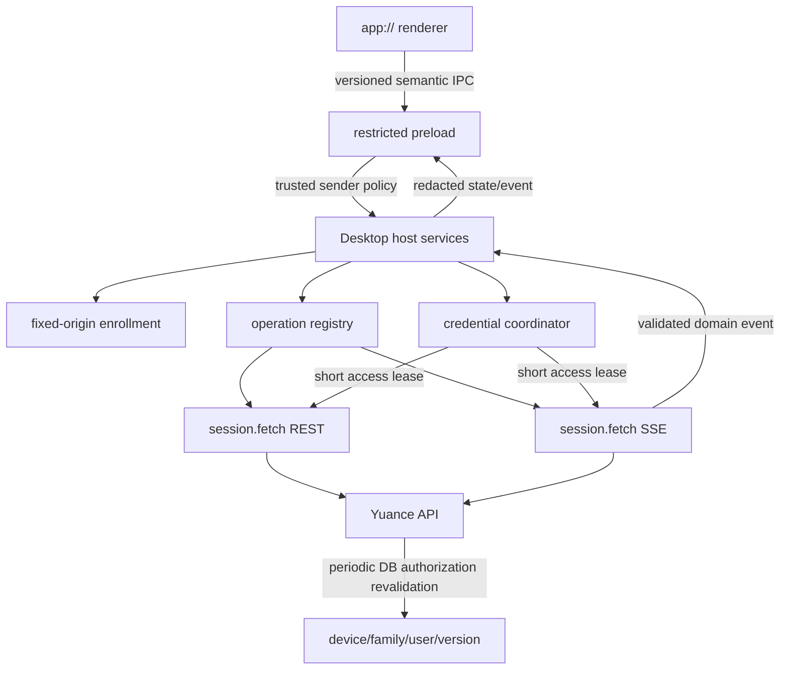

# D1 Desktop Network 与 SSE 安全边界

## Goal Capsule

- **目标：** 在 Electron 主进程建立受信 endpoint enrollment、短期 Device Bearer REST 和 fetch-stream SSE，并把脱敏认证/网络状态安全地回接本地 renderer。
- **权威来源：** 本计划承接 D1 设备凭证和 D1-A `app://` 安全宿主；服务端领域权限与 OpenAPI/事件契约仍是业务真相源。
- **执行方式：** Unit 1 至 Unit 8 串行执行。每个 Unit 形成可独立验证、提交和回退的闭环。
- **停止条件：** endpoint 身份、redirect/TLS、credential lease、SSE 撤销断流或 IPC 最小能力无法通过负向测试时，不进入下一个 Unit。
- **尾部责任：** Unit 8 完成三平台集成复核、凭证泄漏扫描、review 和父计划状态更新；D1-C 文件能力、D2 业务对齐与 G-DIST 保持独立。

---

## Product Contract

### Summary

D1-A 已将正式 Desktop 固定在 `app://yuance/`，但正常应用生命周期尚未创建 credential coordinator，也没有可信 server discovery、业务 REST transport 或 Desktop SSE。现有 Device Bearer 被普通业务 API 默认拒绝，Browser SSE 只在建连时认证，撤销后不能主动关闭已建立的流。

本计划建立一个最小但真实的在线闭环：正式包只连接内置官方 HTTPS origin，通过固定 discovery 路径确认 server instance 和协议能力；主进程持有 credential，调用 Device Session probe/control stream；renderer 只获得认证、网络状态和有限认证命令。该控制面不含项目、工作项、通知或文件数据，为 D2 增加业务 operation 提供基础但不提前开放业务 API。

### Requirements

#### Endpoint 与网络信任

- R1. 正式 Desktop 只使用构建内固定的官方 HTTPS origin，并只从固定 `/.well-known/yuance-desktop` 路径读取 enrollment；renderer、命令行参数、环境变量、远端响应和本地可写文件均不能覆盖 origin。
- R2. enrollment 响应只包含版本化的 `server_instance_id`、API protocol version 和 capability IDs，不包含任意 API/SSE URL。客户端从固定 origin 和固定 path registry 组装请求。
- R3. enrollment、REST 和 SSE 使用 Electron 专用 session 的 Chromium 网络栈，以获得平台 TLS 与系统代理/PAC 行为；正式态不得安装证书错误放行逻辑，不得降级 HTTP，不得跟随同源或跨源 redirect。
- R4. 正式 endpoint 的 TLS 信任来自 OS/企业已安装信任根。证书 pinning、用户导入私有 CA、任意私有化 endpoint 和多 profile 切换不属于本切片。

#### Credential 与 REST

- R5. 正常 Desktop 启动必须从 enrollment 创建唯一 profile，组装 credential store、pending stores、device client 和 coordinator；profile 未确认、变化或恢复失败时保持 fail closed。
- R6. access/refresh token、Authorization、Cookie、endpoint 和原始网络响应只存在于主进程受限闭包，不进入 renderer、preload 返回值、URL、日志、错误、crash fixture 或 telemetry。
- R7. 主进程 REST transport 只接受版本化 operation ID 和经 schema 校验的参数。每个 operation 固定 method、path template、request body、response schema、大小上限、超时和重试策略；renderer 不得传入 URL、method、headers 或 credentials。
- R8. REST canary 只使用既有 Device-only `GET /api/v1/device-session` probe；普通业务 API、相似 path、错误 method、PAT/system route 和文件 route 对 Device Bearer 继续默认拒绝，D1-B 不修改该默认策略。
- R9. access token 由 coordinator 单飞取得或轮换。只读 operation 遇到明确的 access-expired 响应时最多轮换并重试一次；撤销、安全错误、redirect、协议错误和未知结果写请求不得自动重放。

#### SSE 与撤销

- R10. Desktop SSE 只由主进程以 `Accept: text/event-stream`、Device Bearer、`credentials: omit` 和禁止 redirect 的 fetch-stream 建立；renderer 不使用 `EventSource`、`fetch` 或 endpoint CSP allowlist。
- R11. 新增 Device-only `GET /api/v1/device-session/events` 控制流，只发送 `connected` 事件和 heartbeat comment，不承载业务数据或撤销原因。服务端在建连时绑定 user、device、family、generation、`authorization_version` 和 access expiry，不在流状态中长期保留 raw token；授权变化通过受控 EOF + fresh-lease probe 判定。
- R12. device/family 撤销、用户禁用、authorization version 变化、access expiry 和服务关闭必须在不超过 5 秒的 `revocation_close_deadline` 内终止活跃 Device SSE。服务端按 1 秒 interval 重验，单次数据库检查 timeout 不超过 500ms，检查超时或失败即关闭；`interval + timeout + scheduler margin` 必须小于 deadline。该约束跨 API 多实例生效，不依赖单进程内广播。
- R13. SSE 使用成熟 parser 处理跨 chunk UTF-8、event、data、id、retry 和 comment；规范化 header name/value 按 UTF-8 字节求和不超过 32 KiB、parser buffer 不超过 128 KiB、单事件不超过 64 KiB、10 秒内不超过 120 个事件、45 秒无 heartbeat/event 即关闭。header 限额是应用层防御，不声明等于 HTTP wire bytes；非法 UTF-8、错误 content type、超限 payload/频率和未知关键事件 fail closed。
- R14. SSE 重连每次重新取得 access lease并校验 profile，使用有上限的指数退避、抖动和服务端 retry 提示。任意非主动 EOF 先由 coordinator 取得 fresh access lease，再执行 Device Session probe：fresh probe 确认 revoked/unauthorized 时进入 reauthorization-required，probe 有效时才进入网络退避；refresh/probe 超时按网络失败处理且不误判撤销。access expiry 必须走 refresh -> fresh probe/新流，不能复用过期 access。logout、profile epoch 变化、窗口销毁、应用退出、系统 suspend 和 coordinator locked/revoked 必须立即 abort 当前连接与退避；resume 只能取得新 lease 后新建流。
- R15. 旧 generation、旧 authorization version、旧 profile epoch 或已取消订阅的迟到响应/事件不得发布到当前 renderer。SSE 只发布版本化、脱敏、schema 校验后的领域事件或网络状态，不发布 raw chunk、headers 和 Response。

#### Renderer 与验收

- R16. preload bridge 升级为版本化最小合约，只增加设备授权、登出/恢复和脱敏网络状态能力；每个命令复用当前主窗口、顶层 frame、固定 `app://yuance` authority 和导航稳定性的 sender policy。
- R17. Desktop Shell 提供可操作的未认证、授权中、已认证连接中、在线、离线重试、locked、reauthorization-required 和 fatal 状态；用户可发起浏览器设备批准、重试和登出，但不能输入密码、endpoint 或 token。
- R18. renderer CSP 继续保持 `connect-src 'none'`，bundle 继续不包含通用 fetch、EventSource、Node 能力、credential 特征或 dev endpoint；主进程网络开放不得削弱 D1-A 的 protocol、导航、权限和 ASAR Gate。
- R19. 本切片必须由真实 API + Electron integration 证明 enrollment、授权、REST、SSE、轮换、断线重连、撤销断流、renderer 状态和重启恢复，并由 macOS、Windows、Linux Desktop Security workflow 复验。

### Acceptance Examples

- AE1. **首次授权：** 给定无本地 profile credential 的正式 Desktop，启动后只访问固定 enrollment；用户点击授权并在系统浏览器批准后，coordinator 转为 authenticated，Device Session probe/control stream 建立，renderer 显示在线且从未获得 token。
- AE2. **重启恢复：** 给定已批准设备，应用重启后从安全存储恢复 refresh credential，按需取得短期 access，建立新的 Device Session control stream；旧进程和旧 epoch 无事件进入新窗口。
- AE3. **撤销：** 给定活跃 Device Session control stream，从 Browser 撤销 family 或禁用用户后，服务端从撤销事务 commit 起 5 秒内关闭流；Desktop 停止事件投递并进入 reauthorization-required，不继续退避重连。
- AE4. **网络中断：** 给定有效设备会话，网络断开时 renderer 显示离线重试；恢复后主进程以新 access lease 重连，期间不切换 endpoint、不跟随 redirect、不向 renderer 暴露错误细节。
- AE5. **恶意 renderer：** 给定受信 main frame 中的脚本尝试传入外部 URL、Authorization header、未知 operation 或伪造 payload，IPC schema 和 operation registry 均拒绝，外部服务器未收到请求。

### Scope Boundaries

**包含：**

- 固定官方 endpoint discovery/enrollment 和正式 profile 生命周期。
- 正常 Desktop credential coordinator 组装、认证命令和公开状态联动。
- 主进程 operation registry、Device Bearer REST transport 和 Device Session probe operation。
- 服务端 Device Session control stream、authorization lease/revalidation 和撤销 deadline。
- 主进程 fetch-stream SSE、受限 IPC、renderer 网络/认证状态和三平台集成 Gate。

**不包含：**

- 不支持用户输入任意 endpoint、私有化 enrollment、证书 pinning、私有 CA 导入、多账号或多 profile 切换。
- 不开放项目、工作项、评论、附件、资料库、系统管理等完整业务 API；D2 按 feature 逐项登记。
- 不承诺角色、项目成员资格或业务权限变化主动关闭控制流，因为该流不包含业务数据；D2 为每条业务 stream 定义完整授权重验和断流矩阵。
- 不实现文件路径、文件 capability、对象存储 transfer grant 或下载上传；这些属于 D1-C。
- 不实现离线缓存、增量同步、后台常驻 agent、系统推送、自动更新、生产签名或公开发行。
- 不放宽 renderer CSP，不增加通用 fetch/IPC proxy，也不把 Device Bearer 复用为 PAT 或 Cookie session。

### Dependencies

- `docs/plans/2026-08-01-001-feat-d1-device-session-credential-plan.md` 已冻结 Device credential、rotation、profile key 和 authorization version。
- `docs/plans/2026-08-01-002-feat-d1-app-protocol-secure-host-plan.md` 已冻结 `app://`、CSP、sender policy、公开 host state 和打包 Gate。
- Electron 官方 `session.fetch` 使用 Chromium 网络栈、支持 streaming body、AbortSignal 和 redirect policy；本计划使用专用 Desktop session，不使用 renderer fetch。
- SSE parsing 使用 `eventsource-parser` 的 stream API，不自行实现跨 chunk parser；应用层仍负责 schema、大小、频率、idle 和重连策略。

---

## Planning Contract

### Key Technical Decisions

- KTD1. **固定 origin discovery，而不是任意 endpoint enrollment。** 当前产品只有一个正式服务 origin。TLS + 构建内 origin 是本切片的信任锚；`server_instance_id` 只绑定部署实例，不作为独立认证因子。私有化信任根和签名 enrollment 需要独立产品决策，不能隐式加入。
- KTD2. **网络保持在主进程。** renderer 的 `connect-src 'none'` 不变。preload 只暴露语义命令和脱敏状态，因此 XSS 或受信页面脚本无法构造任意网络请求。
- KTD3. **使用专用 Electron Session 的 `fetch`。** 该路径使用 Chromium TLS 和系统代理/PAC，并允许统一 webRequest 观测；不使用 Node `globalThis.fetch`，也不注册 certificate bypass。
- KTD4. **operation registry 是 REST 最小权限边界。** 共享 `api-client` 继续定义业务方法，但 Desktop adapter 只能映射已登记 operation。D2 每迁移一个 feature 时扩展 registry 与服务端 Device route policy，不开放路径前缀。
- KTD5. **D1-B 只使用 Device control plane。** REST 复用现有 probe，SSE 新增 Device-only control route；普通业务 handler 的 principal、RBAC 和 PAT scope 逻辑不在本切片改动。
- KTD6. **SSE 采用短 lease + fail-closed 数据库重验。** 建连后每 1 秒重验 device/family/user/version，单次查询最多 500ms并在 access expiry 前关闭。重验不可完成时直接终止流。该方案天然跨 API 多实例，不把正确性建立在当前进程内 broadcast 上。
- KTD7. **流重连不等于请求重放。** SSE 可按策略重连；REST 仅允许幂等读请求在明确 access expiry 后单次重试。未来写 operation 必须单独定义 idempotency 和未知提交结果处理。
- KTD8. **首个在线 canary 只使用 Device Session 控制面。** 既有 probe 加新增 control stream 足以证明 REST + SSE + rotation/revocation 闭环，且不会读取任何 D2 业务数据。

### High-Level Technical Design

启动顺序固定为：注册并验证本地安全协议/renderer 资源 -> 创建状态为 `starting` 的本地 Shell -> 异步读取固定 enrollment -> 创建 profile 与 credential services -> 初始化 coordinator -> 用户授权或恢复 -> 建立 Device Session probe/control stream。协议或 renderer 资源失败时使用原生错误框并退出；Shell 创建后的 enrollment、凭证或网络失败通过脱敏 locked/fatal/offline 状态呈现且网络 fail closed，不回退远端 `/web`。

### Existing Patterns

- `desktop/src/auth/profile.mjs`：canonical origin、production/development 和 profile key 绑定。
- `desktop/src/auth/device-auth-client.mjs`：固定 path、manual redirect、no-store、response URL/content type/size 校验。
- `desktop/src/auth/credential-coordinator.mjs`：single-flight refresh、rotation recovery、epoch、logout 和状态订阅。
- `desktop/src/ipc/sender-policy.mjs`、`desktop/src/ipc/host-state.mjs`：受信 sender 和脱敏状态发布。
- `desktop/src/protocol/app-protocol.mjs`：`connect-src 'none'` 与正式资源安全边界。
- `frontend/packages/api-client/src/http-client.js`：共享业务 client 的 request 注入模式。
- `api/src/web/device_auth.rs::probe_device_session`：既有 Device-only REST canary 与绑定校验。
- `api/src/domains/device_sessions.rs`：Device access、family/device/user/version 校验和 access expiry 真相源。

### Sequencing

Unit 1 先冻结 wire contract 和 Device control plane。Unit 2-3 建立 endpoint/profile 与正式 coordinator 生命周期。Unit 4-5 分别完成 REST 和服务端 SSE 安全边界。Unit 6 完成 Desktop stream。Unit 7 才向 renderer 暴露有限命令和状态。Unit 8 使用真实 bundle 与三平台 CI 收口。

### Requirement Traceability

| Requirement | Owner Unit | 主要实现 | 主要自动化证据 |
|---|---|---|---|
| R1-R2 | U1-U2 | `api/src/web/desktop_enrollment.rs`、`desktop/src/network/enrollment-client.mjs` | `desktop_enrollment_contract_flow`、`enrollment-client.test.mjs` |
| R3-R4 | U2、U8 | `desktop/src/network/network-session.mjs` | `network-session-electron-integration.test.mjs`、三平台 network smoke |
| R5 | U3 | `desktop/src/auth/credential-runtime.mjs` | `credential-runtime.test.mjs`、`device-auth-electron-integration.test.mjs` |
| R6 | U3-U4、U7-U8 | credential runtime、REST transport、preload、scan script | credential leak scan、preload contract、真实 bundle smoke |
| R7 | U4 | `desktop/src/network/operation-registry.mjs` | `operation-registry.test.mjs`、`rest-transport.test.mjs` |
| R8-R9 | U4 | Device probe contract、REST retry policy | `device_access_auth_flow`、REST transport tests |
| R10 | U5-U6 | Device control route、fetch-stream client | `device_sse_authorization_flow`、`sse-client.test.mjs` |
| R11 | U5 | `api/src/web/device_auth.rs`、OpenAPI | Device SSE contract tests |
| R12 | U5、U8 | authorization lease revalidation | deadline integration cases、network smoke deadline report |
| R13 | U6 | `desktop/src/network/sse-client.mjs` | normalized-header-32KiB、buffer-128KiB、event-64KiB、120-per-10s、UTF-8、idle-45s cases |
| R14-R15 | U3、U6、U8 | credential/network epoch、probe-after-EOF、AbortController、`powerMonitor` | revoke/service-restart/proxy-EOF/probe-timeout、suspend/resume、stale-event cases |
| R16 | U7 | preload + IPC command/state handlers | preload contract、auth-network IPC negatives |
| R17 | U3、U7 | credential runtime、Desktop Shell | renderer state tests、Electron integration |
| R18 | U4、U6-U8 | main-process transport、CSP/bundle gates | renderer composition、app protocol smoke、bundle verifier |
| R19 | U8 | real API fixture、packaged Electron、CI | `smoke:desktop-network`、三平台 Desktop Security jobs |

---

## Implementation Units

### U1. 冻结 enrollment 与 endpoint 信任契约

- **Goal：** 先建立可独立验证的 enrollment wire contract，消除 endpoint trust loop；本 Unit 不注册 Device SSE route。
- **Requirements：** R1-R2。
- **Files：**
  - 新增 `api/src/web/desktop_enrollment.rs`
  - 修改 `api/src/web/mod.rs`
  - 修改 `api/src/web/router.rs`
  - 修改 `docs/openapi/yuance.openapi.json`
  - 新增 `api/tests/desktop_enrollment_contract_flow.rs`
- **Approach：** 新增公开、no-store 的固定 discovery route。返回 schema version、server instance、API protocol version 和 capability IDs。OpenAPI 本 Unit 只登记已实现的 enrollment；Device control stream 的 route、schema 和 security matrix 在 U5 随 authorization lease 原子落地，避免出现只在建连时认证的中间提交。
- **Test Scenarios：**
  1. discovery 只接受 GET/HEAD，返回严格 JSON、no-store、稳定实例 ID 和 capability；Cookie、Authorization 和请求字段不能覆盖返回身份。
  2. 错误 method、相似 discovery path、编码绕过、请求凭证和异常 headers 不改变 enrollment 身份或 capability。
  3. Browser/PAT/Device/system token 的既有 route 行为无变化，普通业务 API 继续拒绝 Device Bearer。
  4. OpenAPI enrollment schema 与实际响应一致，尚未实现的 control stream 不提前出现在 active contract。
- **Verification：** `cargo test --manifest-path api/Cargo.toml --test desktop_enrollment_contract_flow`。

### U2. 建立固定 origin enrollment client 与专用网络 session

- **Goal：** 在发出任何认证或控制面请求前确认官方 endpoint profile，并统一 TLS、proxy、redirect、Cookie 和观测策略。
- **Requirements：** R1-R4、R6。
- **Files：**
  - 新增 `desktop/src/network/enrollment-client.mjs`
  - 新增 `desktop/src/network/network-session.mjs`
  - 修改 `desktop/src/auth/profile.mjs`
  - 修改 `desktop/src/config.mjs`
  - 新增 `desktop/test/enrollment-client.test.mjs`
  - 新增 `desktop/test/network-session.test.mjs`
  - 新增 `desktop/test/network-session-electron-integration.test.mjs`
  - 新增 `desktop/test/support/network-fixture.mjs`
  - 修改 `desktop/test/auth-profile.test.mjs`
  - 修改 `desktop/test/config.test.mjs`
- **Approach：** 正式态从构建内常量解析 official origin，开发态只允许显式 loopback。使用独立持久 partition 的 `session.fetch` 读取固定 discovery path；请求 omit credentials、禁 redirect、限制时间与字节，响应必须来自精确 URL。禁止 certificate verify override，清除该 partition 的 Cookie/cache/auth cache，并提供仅供测试的脱敏 request observer。
- **Test Scenarios：**
  1. 正式包忽略 endpoint env/argv/local state；开发 HTTP 只接受显式 loopback，且 production/development partition/profile key 互不污染。
  2. discovery redirect、错误 origin/URL、HTTP、userinfo、path/query/fragment、错误 content type、超大/未知字段、错误版本/capability 和实例 ID 漂移全部拒绝。
  3. session policy 不设置 Cookie、不持久化 response cache、不允许 renderer webContents 直接使用远端 origin；未注册 certificate bypass。
  4. 真实 Electron integration 使用测试专用 session 与 loopback HTTP fixture 验证 proxy rule、PAC、407 和 redirect capture，不修改 OS proxy/PAC；错误证书 HTTPS fixture 必须被生产策略拒绝且不降级 HTTP。三平台 smoke 断言正式代码未调用 `setProxy` 或覆盖 certificate verification，并依赖 Chromium/OS 默认网络配置。
- **Verification：** `node --test desktop/test/enrollment-client.test.mjs desktop/test/network-session.test.mjs desktop/test/network-session-electron-integration.test.mjs desktop/test/auth-profile.test.mjs desktop/test/config.test.mjs`。

### U3. 将 credential coordinator 接入正式应用生命周期

- **Goal：** 让正常 `app://` Desktop 真正恢复/创建 Device Session，并为后续 transport 提供主进程内 credential lease。
- **Requirements：** R5-R6、R16-R17。
- **Files：**
  - 新增 `desktop/src/auth/credential-runtime.mjs`
  - 修改 `desktop/src/auth/device-auth-client.mjs`
  - 修改 `desktop/src/auth/credential-coordinator.mjs`
  - 修改 `desktop/src/auth/public-auth-state.mjs`
  - 修改 `desktop/src/main.mjs`
  - 新增 `desktop/test/credential-runtime.test.mjs`
  - 修改 `desktop/test/device-auth-client.test.mjs`
  - 修改 `desktop/test/credential-coordinator.test.mjs`
  - 修改 `desktop/test/public-auth-state.test.mjs`
  - 修改 `desktop/test/device-auth-electron-integration.test.mjs`
- **Approach：** 把 headless 组装提取为可复用 runtime。enrollment 成功后按 profile 创建 stores/client/coordinator，并把 U2 专用 `networkSession.fetch` 显式注入 `createDeviceAuthClient({ fetchImpl })`；正式生命周期禁止回退 `globalThis.fetch`。初始化完成后发布公开状态。向 network 层提供不可序列化的 access lease callback和 session epoch，不提供 token getter 给 IPC；状态变化时先取消网络 epoch，再发布 renderer 状态。
- **Test Scenarios：**
  1. 无 credential、有效恢复、pending rotation、pending revocation、store unavailable、实例 ID 变化分别进入预期公开状态。
  2. authorize/openExternal/logout/retry 竞态单飞；窗口 reload 或第二实例不会重复 coordinator，也不会向旧窗口发布状态。
  3. coordinator locked/revoked/logout/profile mismatch 先推进 epoch 并清空 access，再触发 network cancellation。
  4. 正常 Electron 启动完成 Browser 批准、重启恢复和登出；renderer/IPC/log 无 credential。
  5. authorization、poll、refresh、probe和logout全部经同一专用 Electron session observer；正式 runtime 未提供 fetch 时启动失败，不回退 Node fetch。
- **Verification：** `node --test desktop/test/credential-runtime.test.mjs desktop/test/device-auth-client.test.mjs desktop/test/credential-coordinator.test.mjs desktop/test/public-auth-state.test.mjs desktop/test/device-auth-electron-integration.test.mjs`。

### U4. 建立 operation registry 与 Device Bearer REST transport

- **Goal：** 用最小权限 operation 代替通用网络代理，并以 Device Session probe 证明真实 Device REST 链路。
- **Requirements：** R6-R9、R15、R18。
- **Files：**
  - 新增 `desktop/src/network/operation-registry.mjs`
  - 新增 `desktop/src/network/rest-transport.mjs`
  - 新增 `desktop/src/network/response-contract.mjs`
  - 新增 `desktop/test/operation-registry.test.mjs`
  - 新增 `desktop/test/rest-transport.test.mjs`
  - 新增 `desktop/test/response-contract.test.mjs`
- **Approach：** registry 首批只登记 `session.probe`，并与现有 `device-auth-client` 共享固定 endpoint/response contract，避免两套安全规则漂移。transport 从 registry 生成 URL/request，使用 credential runtime 的 access lease，omit credentials、manual/error redirect、no-store、超时和 response limit。解析统一 JSON envelope/error code；只在明确 access expiry 且 operation 为 idempotent read 时单次 refresh/retry。
- **Test Scenarios：**
  1. 任意 URL/method/header、未知 operation、未知字段、原型污染、超长参数和 path confusion 在 fetch 前拒绝。
  2. 请求只发往 profile origin 的固定 path，只有 Accept/Authorization/Cache-Control 等内建 headers；Cookie、Referer、Origin 和 token query 不出现。
  3. redirect、响应 URL 漂移、HTML/错误 content type、超大/非法 JSON、错误 envelope 和未知安全错误 fail closed。
  4. 并发请求共享 coordinator refresh；明确 access expiry 对只读请求最多重试一次，revoked/replay/unknown error 不重试，旧 epoch 响应被丢弃。
- **Verification：** `node --test desktop/test/operation-registry.test.mjs desktop/test/rest-transport.test.mjs desktop/test/response-contract.test.mjs`。

### U5. 为 Device SSE 建立服务端 authorization lease

- **Goal：** 让 Device Session control stream 在建连后持续受 device/family/user/version/access-expiry 约束，并满足跨实例撤销 deadline。
- **Requirements：** R8、R10-R12。
- **Files：**
  - 修改 `api/src/domains/device_sessions.rs`
  - 修改 `api/src/web/device_auth.rs`
  - 修改 `api/src/web/router.rs`
  - 新增 `api/tests/device_sse_authorization_flow.rs`
  - 修改 `api/tests/device_access_auth_flow.rs`
  - 修改 `docs/openapi/yuance.openapi.json`
- **Approach：** 在同一 Unit 原子注册 Device-only control route、OpenAPI/security matrix 和 authorization lease，不提交只在建连时认证的流。stream 用 `tokio::select!` 同时等待 heartbeat、access expiry 和 1 秒数据库重验；单次重验设置 500ms timeout，任何 timeout、查询失败或 user/device/family/version 失配立即结束。配置验证保证 interval + timeout + scheduler margin 小于 5 秒 deadline。
- **Test Scenarios：**
  1. control stream 仅接受有效 Device access token；Cookie、PAT、refresh、system 和 wrong namespace token 拒绝，普通业务 SSE 行为不变。
  2. 建立真实流后撤销 family、撤销 device、禁用用户和推进 authorization version，从撤销事务 commit 的单调时钟起均在 5 秒内 EOF；未撤销流持续收到 heartbeat。
  3. access expiry 到达后流关闭；rotation 后旧 authorization version/generation stream 不无限存活，新 token 可建立新流。
  4. 接近轮询边界撤销、SQLite busy、连接池耗尽和 timer delay 时仍 fail closed；多个独立 AppState/连接共享数据库时按 deadline 关闭，证明正确性不依赖当前进程 broadcast registry。API graceful shutdown 从 shutdown signal 起 5 秒内 drain/关闭活跃控制流。
- **Verification：** `cargo test --manifest-path api/Cargo.toml --test device_sse_authorization_flow --test device_access_auth_flow`。

### U6. 实现主进程 fetch-stream SSE 与重连状态机

- **Goal：** 安全解析 Device Session control stream，并把 credential、network、stream 和应用生命周期统一到可取消的 session epoch。
- **Requirements：** R10-R15、R18。
- **Files：**
  - 新增 `desktop/src/network/sse-client.mjs`
  - 新增 `desktop/src/network/network-coordinator.mjs`
  - 新增 `desktop/src/network/public-network-state.mjs`
  - 修改 `desktop/package.json`
  - 修改 `desktop/package-lock.json`
  - 新增 `desktop/test/sse-client.test.mjs`
  - 新增 `desktop/test/network-coordinator.test.mjs`
  - 新增 `desktop/test/public-network-state.test.mjs`
- **Approach：** 使用 `eventsource-parser/stream` 解析 fetch body。client 校验 status/content type/final URL并限制 buffer/event bytes/idle；coordinator 负责单订阅、AbortController、access-expiry 前换流、退避抖动、online/offline状态和 epoch。Device control event decoder 位于 Desktop network 边界，只输出固定控制枚举，不解释业务事件。
- **Test Scenarios：**
  1. 任意 chunk 边界、CRLF、多行 data、comment、retry 和 UTF-8 分片正确；规范化 header name/value UTF-8 总和超过 32 KiB、128 KiB buffer、64 KiB event、10 秒 120 events、非法 UTF-8、错误 content type/status、redirect 和 45 秒 idle 均关闭。
  2. access expiry 触发 refresh -> fresh probe -> 新流；revoked/locked/security failure进入 reauthorization-required 且停止重连。撤销 EOF、服务重启 EOF、代理断流、refresh timeout 和 probe timeout 分别得到正确终态/退避，不复用过期 access，也不将网络故障误判为撤销。
  3. 网络失败采用有界指数退避和抖动；服务端 retry 只能在本地 min/max 内生效，恢复后重新取得 credential lease。
  4. logout、profile/authorization epoch 变化、window destroy、app quit、取消订阅和 `powerMonitor` suspend 立即 abort read/timeout/backoff；resume 重新取得 lease 并建立新流，迟到 chunk/event 不发布。
- **Verification：** `node --test desktop/test/sse-client.test.mjs desktop/test/network-coordinator.test.mjs desktop/test/public-network-state.test.mjs`。

### U7. 建立受限认证/网络 bridge 与可操作 Shell

- **Goal：** 让用户完成真实设备授权并观察网络状态，同时保持 renderer 无 endpoint、credential 和通用 transport。
- **Requirements：** R6、R15-R18。
- **Files：**
  - 修改 `desktop/src/preload.cjs`
  - 修改 `desktop/src/ipc/host-state.mjs`
  - 新增 `desktop/src/ipc/auth-commands.mjs`
  - 新增 `desktop/src/ipc/network-state.mjs`
  - 修改 `desktop/src/ipc/sender-policy.mjs`（仅在新增 channel registry 需要统一封装时）
  - 修改 `desktop/src/main.mjs`
  - 修改 `desktop/src/renderer/app.jsx`
  - 修改 `desktop/src/renderer/platform/auth-state.js`
  - 新增 `desktop/src/renderer/platform/network-state.js`
  - 修改 `desktop/src/renderer/app.css`
  - 修改 `frontend/packages/ui/src/host-status-shell.jsx`
  - 修改 `frontend/packages/ui/src/host-status-shell.css`
  - 修改 `desktop/test/preload-contract.test.mjs`
  - 修改 `desktop/test/renderer-composition.test.mjs`
  - 新增 `desktop/test/auth-network-ipc.test.mjs`
- **Approach：** bridge schema 升级并只增加 `auth.authorize/retry/logout` 与 `network.getSnapshot/subscribe`。主进程 handler 无业务 payload或仅接受严格空对象，先校验 sender。Shell 用标准按钮呈现当前可用命令；授权页面只通过 `shell.openExternal` 打开固定 verification URL。
- **Test Scenarios：**
  1. bridge 冻结、版本明确，公开对象中无 token、endpoint、URL、header、raw event、通用 invoke/request/fetch。
  2. subframe、旧窗口、导航中 sender、错误 authority/route 和伪造 payload 无法 authorize/logout/subscribe。
  3. 状态机覆盖首次授权、等待 Browser、online、offline retry、locked、reauthorization和logout；重复点击不会创建并行授权/流。
  4. renderer source/bundle 继续不含 `fetch(`、`EventSource`、Cookie、Node global 或 endpoint allowlist，CSP 仍为 `connect-src 'none'`。
- **Verification：** `npm run check:frontend && node --test desktop/test/preload-contract.test.mjs desktop/test/renderer-composition.test.mjs desktop/test/auth-network-ipc.test.mjs`。

### U8. 完成真实端到端、三平台 Gate 与计划收口

- **Goal：** 从干净 API 和实际 Electron bundle 证明 enrollment -> authorization -> REST -> SSE -> rotation/reconnect -> revoke/close -> renderer 状态形成闭环。
- **Requirements：** R19、AE1-AE5。
- **Files：**
  - 新增 `desktop/test/desktop-network-electron-integration.test.mjs`
  - 新增 `desktop/test/desktop-network-lifecycle-electron-integration.test.mjs`
  - 新增 `desktop/test/support/real-api-fixture.mjs`
  - 新增 `desktop/test/support/browser-approval-driver.mjs`
  - 新增 `desktop/scripts/smoke-desktop-network.mjs`
  - 修改 `desktop/scripts/smoke-app-protocol.mjs`
  - 修改 `desktop/scripts/scan-credential-leaks.mjs`
  - 修改 `desktop/package.json`
  - 修改 `.github/workflows/desktop-security.yml`
  - 新增 `docs/reviews/YYYY-MM-DD-d1-desktop-network-sse-review.md`
  - 修改本计划状态
  - 修改 `docs/plans/2026-07-28-feat-web-desktop-shared-frontend-plan.md`
- **Approach：** `real-api-fixture.mjs` 构建/启动真实 API binary，创建临时 SQLite、随机 loopback port和隔离日志目录，使用 `/ready` 判定就绪，并通过公开 bootstrap/login/CSRF/device-approval/device-revoke/system-user API 驱动状态，不新增测试后门。fixture 将 origin、server instance 和临时 profile 作为进程内数据传给 smoke，所有 child process、数据库和临时目录在 `finally` 清理；workflow 使用 `if: always()` 上传脱敏日志并执行残留进程检查。Rust `device_sse_authorization_flow` 在同一进程用单调时钟从 revoke transaction 调用前开始计时，提供保守的 commit-to-EOF deadline 证据；packaged smoke 另记录 revoke HTTP response-to-EOF 作为端到端辅助证据。`desktop/package.json` 注册 `smoke:desktop-network`。Desktop Security 的 paths 增加 `api/**`、`docs/openapi/**`、相关 frontend package 和 lockfiles；三平台复用同一正式 bundle并保留 D1-A protocol/ASAR smoke。
- **Test Scenarios：**
  1. 首次授权、restart recovery、Device Session probe/control stream、断线重连和logout在真实 Electron 中通过；renderer 只观察公开状态。
  2. 同源/跨源 redirect 捕获服务器均未收到第二跳 Bearer；错误 TLS、错误 enrollment、实例漂移和生产 env 注入 fail closed。
  3. 活跃流中执行 family/device revoke和user disable，从事务 commit 起服务端 5 秒内关闭；API graceful shutdown 从 signal 起 5 秒内 EOF。Desktop 对 EOF 使用 fresh-lease probe，不投递迟到事件、不继续安全错误重连；报告记录每次 deadline 毫秒数。
  4. credential scan 覆盖 source、fixture、logs、smoke report、renderer、ASAR 和打包产物；Authorization、access/refresh/device code 不出现。
  5. Electron lifecycle integration 通过注入的 lifecycle event source 驱动与真实 `powerMonitor` 绑定测试证明 suspend 立即 abort、resume 使用新 lease，正式包不包含测试 channel；macOS、Windows、Linux 同时通过 checks/tests、unpacked bundle、`app://` smoke、network smoke、safeStorage、single-instance和credential scan。
  6. fixture 在正常、断言失败和超时三种路径均完成 API child、临时数据库/profile/log目录清理；批准和撤销只走公开契约，CI 日志不含 Cookie、CSRF 或 device code。
- **Verification：** 完整执行 Verification Contract，并在 review 中记录三平台证据、deadline 测量和可接受残留边界。

---

## Verification Contract

| 范围 | 命令 / Gate | 通过信号 |
|---|---|---|
| API 聚焦 | `cargo test --manifest-path api/Cargo.toml --test desktop_enrollment_contract_flow --test device_access_auth_flow --test device_sse_authorization_flow` | enrollment、principal matrix、撤销断流全部通过 |
| API 回归 | `cargo test --manifest-path api/Cargo.toml` | Browser Cookie、PAT、Device Session 与业务 API 全量不回归 |
| Frontend | `npm run check:frontend` | 共享 packages、Web 与 Desktop renderer 全部通过 |
| Desktop 静态检查 | `npm --prefix desktop run check` | JSDoc/checkJs、ESLint、构建边界通过 |
| Desktop 全量 | `npm --prefix desktop test` | enrollment、runtime、REST、SSE、IPC 与既有安全测试通过 |
| 凭证扫描 | `npm --prefix desktop run scan:credential-leaks` | source/fixture/log/bundle 无 credential 特征 |
| 实际 bundle | `npm --prefix desktop run verify:bundle -- <staging>` | ASAR、CSP、renderer 与 network policy绑定通过 |
| 协议 smoke | `npm --prefix desktop run smoke:app-protocol -- <staging>` | D1-A `app://`、导航、IPC 和零 renderer 外部请求不回归 |
| 网络 smoke | `npm --prefix desktop run smoke:desktop-network -- <staging>` | 真实 enrollment/auth/REST/SSE/revoke/restart 闭环通过 |
| Deadline 自动测试 | `cargo test --manifest-path api/Cargo.toml --test device_sse_authorization_flow` | Rust 单调时钟证明撤销事务调用和 graceful shutdown signal 到 EOF 均小于 5000ms |
| Deadline 端到端报告 | `desktop/dist/verification/desktop-network-smoke.json` | 正式包记录 revoke HTTP response 到 EOF 小于 5000ms，作为跨进程辅助证据 |
| 三平台 CI | `.github/workflows/desktop-security.yml` | macOS、Windows、Linux 对同类 unpacked bundle Gate 全部通过 |

验证 fixture 必须使用每个平台本地启动的临时 API、测试专用 Electron session、loopback proxy/PAC 和错误证书 HTTPS 服务，不访问生产服务，也不修改 OS proxy 或 trust store。TLS 负向测试必须证明错误证书不会被应用层 bypass；proxy/PAC、407、同源/跨源 redirect 均由真实 Electron session integration 自动化验证。正式 bundle 另通过源码/运行期断言证明未调用 `setProxy`、`setCertificateVerifyProc` 或 `certificate-error` bypass；系统 proxy/PAC 和有效证书链的正确实现归属 Chromium/OS，不由本项目伪造。

---

## Definition of Done

- R1-R19 均有实现文件和自动化证据，AE1-AE5 可从干净临时环境复现。
- 正式 Desktop 正常生命周期不再硬编码 `unauthenticated`，而是由固定 enrollment 和真实 coordinator 驱动。
- Device access 对普通业务 API 仍默认拒绝；D1-B 只使用既有 probe 和新增 Device-only control stream，Browser/PAT/system token 语义不变。
- renderer 的 CSP 仍为 `connect-src 'none'`，preload 无通用网络代理，任何 renderer 输入都不能改变 endpoint、method、header 或 credential。
- Device SSE 在 family/device/user/version/access-expiry 变化后不超过 5 秒关闭，API graceful shutdown 也在 signal 后 5 秒内关闭控制流；Desktop 使用 fresh-lease probe 区分撤销与网络 EOF，不投递旧 epoch 事件。
- REST/SSE 不跟随 redirect、不使用 Cookie、不降级 TLS；access/refresh token 不进入 renderer、日志、错误、测试报告或 bundle。
- API 全量、Frontend check、Desktop check/test、credential scan、实际 bundle verifier、protocol smoke 和 network smoke全部通过。
- macOS、Windows、Linux Desktop Security Gate 全部通过，复核证据写入 `docs/reviews/`。
- 父计划将 D1-B 标记为 completed，并把 D1-C 文件 Capability / Transfer 设为唯一下一 Desktop 子计划。
- 执行期间产生的废弃实现、临时探针、重复 fixture 和不再采用的依赖全部移除，不遗留旁路或测试后门。
