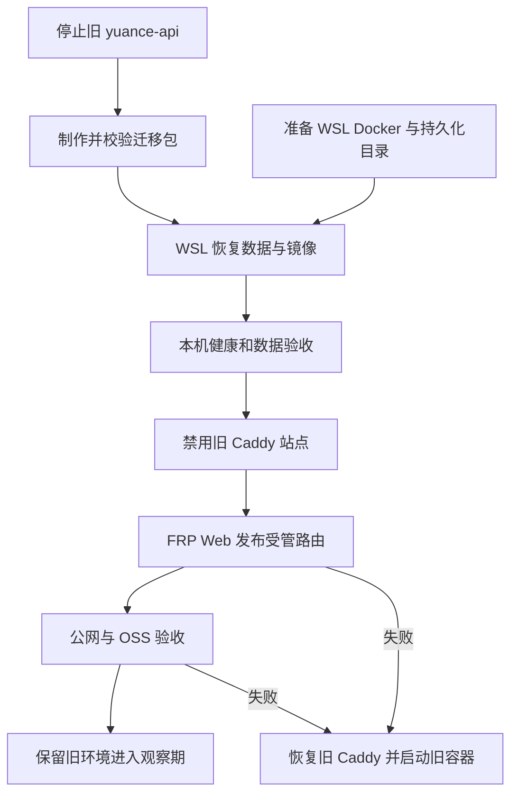
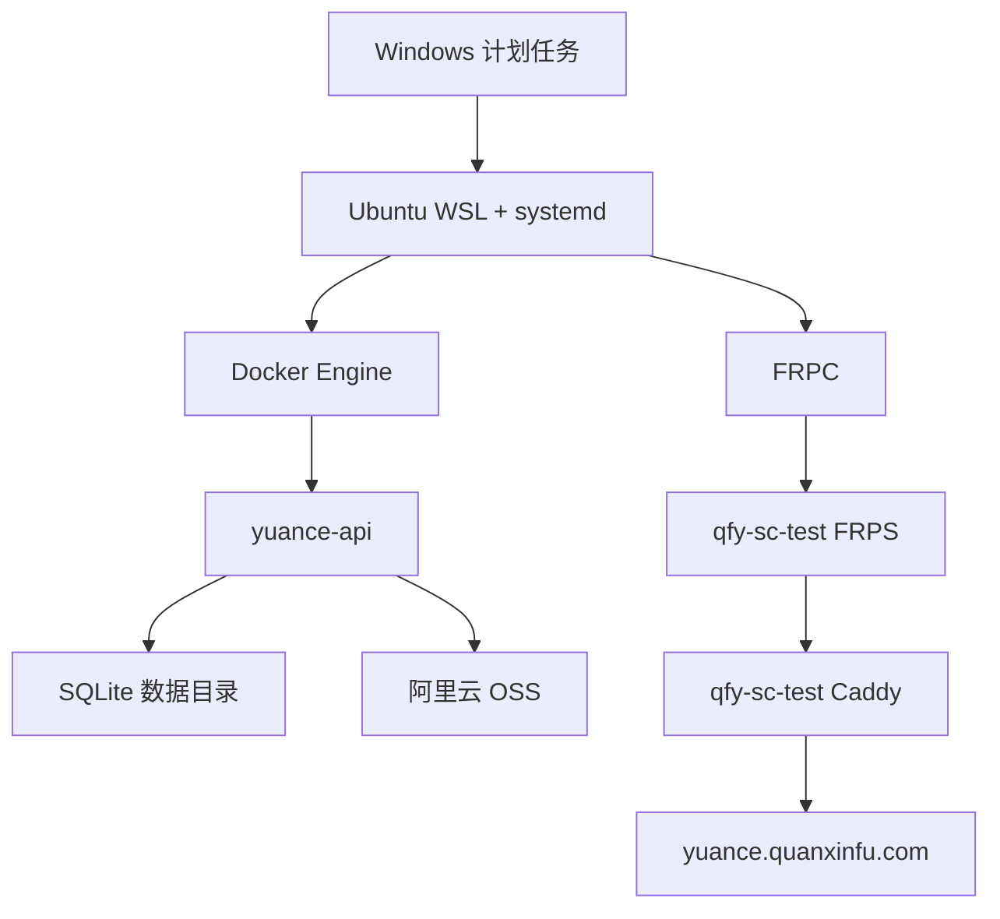

# refactor: 将元策从公网服务器迁移到 WSL 并通过 FRP 发布

## Summary

将当前运行在 `qfy-sc-test` 的 `yuance-api`、SQLite 数据和运行密钥迁移到本机 Ubuntu WSL，由 WSL 内的 Docker Engine 承载容器，并通过既有 FRPC/FRPS 和公网服务器 Caddy 继续提供 `https://yuance.quanxinfu.com`。

本次迁移允许公网测试环境长时间停止，因此采用“停止旧服务 -> 制作一致性快照 -> WSL 恢复并验证 -> Caddy/FRP 切流”的简单模式，不设计双写、在线复制或零停机切换。旧服务器的容器、数据、镜像和 Caddy 配置在观察期内只停止、不删除，作为快速回滚来源。

## Problem Frame

元策当前是单容器 Rust 单体服务：页面、API、静态资源、迁移和维护命令都由 `yuance-api` 提供，SQLite 是唯一数据库，OSS 对象保存在阿里云，OSS 运行配置及加密凭据保存在 SQLite。公网服务器 Caddy 当前把 `yuance.quanxinfu.com` 直接反向代理到服务器本机 `127.0.0.1:33033`。

目标拓扑改为：

```text
yuance.quanxinfu.com
  -> qfy-sc-test Caddy :443
  -> qfy-sc-test FRPS 127.0.0.1:40000-40999
  -> WSL FRPC
  -> WSL Docker 127.0.0.1:33033
  -> yuance-api + /srv/yuance/data/yuance.sqlite3
```

当前迁移前基线：

- `yuance-api` 运行健康，`/api/healthz` 与 `/api/readyz` 正常。
- SQLite migration 为 `26/26`，状态正常。
- 文件对象审计为 `60` 个已关联对象、`0` 个孤儿对象。
- SQLite 主库约 1.1 MB，WAL 约 1.0 MB，完整数据目录约 2.2 MB。
- 当前运行镜像 ID 与服务器 `yuance-api:latest` 一致，服务器保留当前和上一版镜像 tar。
- WSL 已启用 systemd，`frpc` 与 `frp-web` 均为 enabled/active，Windows 计划任务 `WSL-Ubuntu-KeepAlive` 正在运行。
- WSL 当前没有安装 Docker Engine，也没有 `/var/run/docker.sock`，这是迁移执行前的首个阻塞项。
- 本地仓库位于 `main` 且与本地 `origin/main` 指针一致，但存在用户未提交修改；迁移不得改动或清理这些修改。

## Requirements

- R1. 允许直接停止公网服务器的 `yuance-api`，不要求零停机，但不得停止同服务器其他项目或共享基础设施。
- R2. 最终数据备份必须在旧服务停止写入后制作，并把 `yuance.sqlite3`、`yuance.sqlite3-wal`、`yuance.sqlite3-shm` 视为同一一致性单元。
- R3. 必须原样保留 `.env`，尤其是 `YUANCE_SECURITY_MASTER_KEY`；默认同时保留 `YUANCE_SESSION_SECRET`，避免 OSS 密文不可解和无必要的会话失效。
- R4. 首轮迁移优先加载服务器当前运行镜像制品，不从有未提交修改的本地工作区重新构建替代镜像。
- R5. SQLite 数据必须放在 WSL Linux 文件系统，例如 `/srv/yuance`，不得放在 `/mnt/c`。
- R6. WSL 内使用 systemd 管理的原生 Docker Engine；`yuance-api` 继续只绑定 `127.0.0.1:33033`。
- R7. FRP Web 路由使用域名 `yuance.quanxinfu.com`、本地端口 `33033`，远端端口由 `40000-40999` 自动分配；DNS 保持解析到 `114.55.145.81`。
- R8. 原有未受管 Caddy 站点必须先备份并禁用，再由 FRP Web 受管站点接管，避免同一域名重复定义。
- R9. 切流前后必须验证数据库迁移、健康/就绪、登录、项目数据、静态资源、OSS 配置和文件对象审计。
- R10. 观察期内保留旧服务器的停止容器、数据、镜像和 Caddy 文件；回滚不得依赖重新构建镜像或反向迁移 SQLite。
- R11. 迁移成功后更新部署脚本和运行手册，避免未来默认把元策再次部署到 `qfy-sc-test` 的旧本机端口。
- R12. 备份包、日志和计划文档不得记录 `.env` 内容、FRP token、OSS AccessKey、Cookie 或其他真实密钥。

## Scope Boundaries

- 不迁移 PostgreSQL、Redis 或 NATS；元策不依赖这些服务。
- 不搬迁阿里云 OSS 对象本体；仅复用同一 Bucket，并验证 WSL 到 OSS 的访问。
- 不改变业务域名、API 契约、数据库 schema、账号、权限或现有业务数据。
- 不在本次迁移中升级 Yuance 镜像、Rust 版本、SQLite schema 或 FRP 版本。
- 不清理公网服务器已有的 242 MB 历史备份；它们继续作为服务器侧历史恢复资料。
- 不删除旧容器、旧数据目录、旧镜像 tar 或旧 Caddy 配置，清理由观察期后的独立任务处理。
- 不把 Web 管理界面、FRPS 代理端口段或 WSL 的 `33033` 直接暴露到公网。

### Deferred to Follow-Up Work

- 其他公网服务器项目迁入 WSL 的批量迁移规范。
- 阿里云 OSS Bucket 的独立灾备或跨地域复制。
- 迁移成功后的公网服务器 Yuance 历史制品和备份清理策略。
- 本地未提交代码的整理、提交以及基于最新源码重新构建镜像。

## Context & Research

### Relevant Code and Patterns

- `docs/runbooks/production-deployment.md` 已定义当前公网服务器部署拓扑、镜像 tar、SQLite、Caddy、健康检查与回滚规则。
- `deploy/easy-deploy/production/backend/compose.yaml.example` 已具备单 `api` 服务、`./data:/data`、`./backups:/backups`、loopback 端口和健康检查，可复用于 WSL。
- `deploy/easy-deploy/production/backend/scripts/00-backup-sqlite.sh` 会复制主库、WAL、SHM；迁移最终快照必须在服务停止后执行，避免三个文件复制期间继续变化。
- `deploy/easy-deploy/production/backend/scripts/80-files-audit.sh` 可在迁移前后核对 OSS 对象关系。
- `deploy/easy-deploy/production/backend/scripts/90-healthcheck.sh` 可验证 health 和 readiness。
- `scripts/deploy-production.sh` 当前默认目标是 `qfy-sc-test`，迁移后必须调整目标语义或显式拒绝旧默认值。
- `scripts/validate-deploy-templates.sh` 是部署模板静态校验入口，适合承接迁移后部署目标与敏感信息门禁。
- `api/tests/cli_migrate_flow.rs`、`api/tests/storage_config_flow.rs` 和 `api/tests/routing_smoke.rs` 分别覆盖迁移、对象存储配置和基础路由行为。

### Institutional Learnings

- 仓库没有 `docs/solutions/` 可复用记录。
- `docs/plans/2026-07-06-001-feat-testing-deployment-templates-plan.md` 已确定 SQLite 是唯一真实数据源，备份必须覆盖主库/WAL/SHM，服务启动不自动迁移，生产密钥不得轮换或提交。
- `docs/brainstorms/yuance-mvp-requirements.md` 已确定单体部署、SQLite 主存储、进程内缓存和对象存储配置入库边界。

### External Research

本计划不需要外部资料。仓库现有部署规范、FRP 模块现状和两端实际运行状态足以确定迁移方案；引入外部通用做法不会改变本次停机迁移的核心决策。

## Key Technical Decisions

- **停机快照优先于在线备份。** 用户已接受测试环境停机，停止唯一写入进程后再打包整个数据目录，比设计在线复制更简单可靠。
- **当前镜像制品是首轮迁移权威。** 本地工作区有未提交修改，服务器当前镜像比本地 Git HEAD 更新，先迁移正在运行的镜像才能把“换宿主机”和“换应用版本”两个风险分开。
- **密钥与数据库必须成组迁移。** OSS AccessKey 密文保存在 SQLite，`YUANCE_SECURITY_MASTER_KEY` 是解密条件；两者缺一不可。
- **数据落在 WSL ext4。** SQLite WAL 数据不放在 Windows 挂载盘，容器只绑定 WSL 的持久化目录。
- **Caddy 继续作为唯一公网入口。** FRPS 的受管代理端口保持 loopback，Caddy 负责域名与 TLS，FRP 只承载到 WSL 的私有链路。
- **旧环境保留为冷回滚。** 不做 SQLite down migration；失败时移除受管 FRP 站点、恢复原 Caddy 站点并重新启动旧容器。
- **后续部署必须改目标。** 迁移完成但部署脚本仍默认旧服务器会制造回迁风险，因此脚本与 runbook 更新属于迁移完成条件。
- **迁移恢复不执行数据变更命令。** 使用相同镜像恢复相同数据库时只执行 integrity 和 `migrate status`；在基线对比完成前不执行 `migrate up` 或 `seed core`。

## High-Level Technical Design

> 下图是方案评审用的方向性说明，不是要求实现者逐字复现的实现规格。



## Implementation Units

### U1. 准备 WSL 容器运行基线

**Goal:** 在不触碰公网 Yuance 数据的前提下，使 WSL 具备可自动启动、可持久化、可验收的 Yuance 容器运行条件。

**Requirements:** R5, R6, R12

**Dependencies:** None；可与 U2 并行，且不阻塞用户已允许的旧服务直接停机。

**Files:**

- Modify: `docs/runbooks/production-deployment.md`
- Reference: `deploy/easy-deploy/production/backend/compose.yaml.example`
- Test: `scripts/validate-deploy-templates.sh`

**Approach:**

- 在 Ubuntu WSL 内安装原生 Docker Engine，使用 systemd enable/start，不依赖当前已停止且未启用集成的 Docker Desktop；验收时确认实际客户端为 WSL 内的 `/usr/bin/docker`，避免误调用 Windows PATH 中的 Docker CLI。
- 将运行根目录固定在 WSL Linux 文件系统，例如 `/srv/yuance`，分离部署配置、数据、备份和镜像制品。
- 继续采用现有 Compose 单服务结构，宿主机只绑定 `127.0.0.1:33033`。
- 验证 `frpc`、`frp-web`、Docker 和 Yuance 都能随 WSL systemd 启动；确认 Windows 计划任务仍能在宿主机登录/重启后拉起 WSL。
- 不读取、打印或写入真实密钥；本单元只准备目录和非敏感模板。

**Patterns to follow:**

- `deploy/easy-deploy/production/backend/README.md`
- `deploy/easy-deploy/production/backend/compose.yaml.example`
- `docs/runbooks/production-deployment.md`

**Test scenarios:**

- Happy path: WSL 重启后 Docker daemon active，Compose 可以读取模板且 `33033` 未被其他进程占用。
- Edge case: Docker Desktop 保持停止时，WSL 原生 Docker 仍可独立工作。
- Error path: 数据目录位于 `/mnt/c`、Docker daemon 不可用或端口被占用时，中止迁移且不停止公网服务。
- Integration: Windows 计划任务拉起 WSL 后，systemd 能继续启动 Docker、FRPC 和 FRP Web。

**Verification:**

- WSL 内存在可用 Docker daemon 和 socket。
- `/srv/yuance` 位于 WSL Linux 文件系统并具备明确权限。
- FRPC 与 FRP Web 保持 active，`127.0.0.1:33033` 可供 Yuance 使用。

### U2. 停止旧服务并制作一致性迁移包

**Goal:** 停止公网服务器上的唯一 Yuance 写入进程，生成可验证、可传输、可回滚的完整迁移包。

**Requirements:** R1, R2, R3, R4, R10, R12

**Dependencies:** None；用户已确认公网测试环境可直接停止，本单元可先于 U1 执行。

**Files:**

- Modify: `docs/runbooks/production-deployment.md`
- Reference: `deploy/easy-deploy/production/backend/scripts/00-backup-sqlite.sh`
- Reference: `deploy/easy-deploy/production/backend/scripts/80-files-audit.sh`

**Approach:**

- 停止范围仅为 Compose 的 `api` 服务；FRPS、Caddy、共享数据库、Redis、NATS、Loki、Alloy和其他业务容器保持不变。
- 停止前记录健康、ready、migration `26/26`、文件审计 `60/60`、当前镜像 ID 和 Caddy 文件哈希，作为迁移后对比基线。
- 停止后确认 `127.0.0.1:33033` 不再监听，再打包完整 `data/`、`.env`、Compose/app/scripts、当前镜像 tar 和 `yuance.caddy`。
- 对迁移包和关键文件生成 SHA-256 清单；清单只包含路径、大小和哈希，不包含密钥内容。迁移包经 SSH/SCP 等加密链路传输，并在两端使用仅管理员可读权限保存。
- 原服务器上的源目录、停止容器、当前镜像和历史备份保持原位，不覆盖、不删除。

**Patterns to follow:**

- `deploy/easy-deploy/production/backend/scripts/00-backup-sqlite.sh`
- `docs/runbooks/api-migrations.md`
- `docs/runbooks/production-deployment.md`

**Test scenarios:**

- Happy path: 服务停止后，迁移包同时包含主库、WAL、SHM、`.env`、当前镜像和回滚配置，哈希清单完整。
- Edge case: WAL 或 SHM 不存在时记录实际文件集合，但不得把缺失误判为主库可单独迁移；恢复验证仍是强制步骤。
- Error path: 停止后端口仍监听、打包失败、磁盘不足或哈希不一致时，不继续 WSL 恢复，也不删除旧环境。
- Security: 终端输出、日志和计划记录不显示 `.env` 值或 OSS/FRP 凭据。

**Verification:**

- 旧服务已停止且其他服务器项目正常。
- 迁移包可重复校验，服务器侧原始数据仍保留。
- 当前和上一版镜像制品均可用于回滚。

### U3. 在 WSL 恢复并完成本机验收

**Goal:** 使用原镜像、原数据和原密钥在 WSL 启动 Yuance，并在公网切流前证明数据及外部依赖可用。

**Requirements:** R3, R4, R5, R6, R9, R12

**Dependencies:** U1, U2

**Files:**

- Modify: `docs/runbooks/production-deployment.md`
- Reference: `deploy/easy-deploy/production/backend/compose.yaml.example`
- Reference: `deploy/easy-deploy/production/backend/scripts/90-healthcheck.sh`
- Test: `api/tests/cli_migrate_flow.rs`
- Test: `api/tests/storage_config_flow.rs`
- Test: `api/tests/routing_smoke.rs`

**Approach:**

- 在 WSL 校验迁移包 SHA-256 后再解包，`.env` 保持 `600`，数据目录权限满足容器写入要求。
- 加载服务器当前镜像 tar，不在迁移过程中执行本地源码构建或 schema 升级。
- 启动前先对恢复数据库执行完整性与 migration status 检查；本次同版本主机迁移不执行 `migrate up`、`seed core`、`seed demo` 或 `seed local-admin`，避免在迁移前后数据比对完成前产生写入。
- 启动 Compose 后验证 `healthz`、`readyz`、根路径跳转、登录、项目数据、系统管理和静态资源。
- 执行文件对象审计并验证同一 OSS 配置可解密、Bucket 可访问、已有附件可读取；迁移基线验收保持只读，不上传测试对象或改写业务记录。

**Patterns to follow:**

- `docs/runbooks/production-deployment.md`
- `deploy/easy-deploy/production/backend/scripts/30-seed-core.sh`
- `deploy/easy-deploy/production/backend/scripts/80-files-audit.sh`
- `deploy/easy-deploy/production/backend/scripts/90-healthcheck.sh`

**Test scenarios:**

- Happy path: 恢复后 migration 仍为 `26/26`，health/ready 返回成功，60 个文件对象全部关联且无孤儿。
- Happy path: 使用原账号登录，项目、工作项、评论和系统设置与迁移前一致。
- Edge case: 进程内 session 缓存为空时，持久化 session 能从 SQLite 回源；如旧会话失效，不影响账号数据和重新登录。
- Error path: 主密钥错误时 OSS 配置解密失败，必须停止切流并重新核对 `.env`，不得在页面重新录入覆盖旧密文。
- Error path: SQLite integrity、migration、ready 或对象审计任一失败时，保持公网旧环境停止但可恢复，不进入 Caddy 切流。
- Integration: 容器经宿主机 `127.0.0.1:33033` 提供 `/web`、`/api`、`/static` 和附件访问。

**Verification:**

- WSL Yuance 数据和迁移基线与旧服务器一致。
- OSS 读取和必要的写入验证成功。
- 本机服务已稳定监听 `127.0.0.1:33033`，但尚未绕过 Caddy 暴露公网。

### U4. 通过 FRP Web 完成域名切流

**Goal:** 将 `yuance.quanxinfu.com` 从公网服务器本机端口切换到 WSL Yuance，同时保持 Caddy 为唯一 HTTPS 入口。

**Requirements:** R7, R8, R9, R10, R12

**Dependencies:** U3

**Files:**

- Modify: `docs/runbooks/production-deployment.md`
- Reference: `deploy/easy-deploy/production/gateway/Caddyfile.yuance.example`

**Approach:**

- 在 FRP Web 中创建路由：名称 `yuance`、域名 `yuance.quanxinfu.com`、本地端口 `33033`、远端端口自动分配。
- 预览阶段确认 DNS 指向 `114.55.145.81`、WSL listener 可达、远端端口位于 `40000-40999` 且未冲突。
- 先备份并将原 `/etc/caddy/Caddyfile.d/yuance.caddy` 移出 `*.caddy` 匹配范围，验证并 reload Caddy；允许此阶段公网暂时不可用。
- 再由 FRP Web 发布受管 Caddy snippet 和 FRPC proxy，禁止手工把 `40000-40999` 开放到公网。
- 验证受管 snippet 是该域名唯一生效站点，FRPS 代理只监听 loopback，公网只能经 443 访问。

**Patterns to follow:**

- `deploy/easy-deploy/production/gateway/Caddyfile.yuance.example`
- `docs/runbooks/production-deployment.md`

**Test scenarios:**

- Happy path: Web 预览分配未占用端口，发布后域名通过 Caddy、FRPS、FRPC 到达 WSL `33033`。
- Edge case: 原 Caddy 文件仍生效时不得强行发布重复站点；先完成站点所有权交接。
- Error path: FRP 发布、Caddy validate/reload 或 HTTPS 验证失败时，禁用受管 snippet、恢复旧 Caddy 文件并启动旧容器。
- Security: 公网无法直接访问 FRPS 的 `40000-40999` 或 WSL `33033`。
- Integration: `https://yuance.quanxinfu.com/api/healthz`、`/api/readyz`、`/web`、登录与静态资源均经过新链路成功。

**Verification:**

- 域名只由 FRP Web 受管 Caddy 站点承载。
- 公网 HTTPS、登录和数据访问正常。
- 原 Caddy 文件有可识别备份，回滚路径已现场验证。

### U5. 固化后续部署目标并进入观察期

**Goal:** 防止后续发布重新部署到旧服务器，并把 WSL 自动启动、运维、验证和回滚口径沉淀到仓库。

**Requirements:** R9, R10, R11, R12

**Dependencies:** U4

**Files:**

- Modify: `scripts/deploy-production.sh`
- Modify: `docs/runbooks/production-deployment.md`
- Modify: `deploy/easy-deploy/production/backend/README.md`
- Modify: `deploy/easy-deploy/production/gateway/README.md`
- Modify: `scripts/validate-deploy-templates.sh`

**Approach:**

- 为 `scripts/deploy-production.sh` 增加明确部署模式：默认 `local-wsl` 在当前 WSL 内直接操作 `/srv/yuance` 和本机 Docker；保留旧远程流程时必须显式选择 `remote` 并提供目标主机，禁止默认或回退到 `qfy-sc-test`。
- `local-wsl` 继续保留干净 `main`、镜像架构、SQLite 备份、migration、seed、健康检查和镜像 ID 校验门禁，只去掉不再需要的 SSH/SCP 跳转。
- 更新运行手册中的拓扑、数据目录、Docker/systemd、FRP Web 路由、Caddy 所有权和回滚流程。
- 增加静态门禁，确保文档和脚本不再把 `qfy-sc-test:33033` 描述为当前 Yuance 运行目标，也不提交真实 `.env`。
- 执行一次受控的 WSL/Windows 重启验收：计划任务拉起 WSL，Docker、FRPC、FRP Web 和 Yuance 依次恢复，公网域名重新可用。
- 观察期内保持旧容器停止、旧数据和镜像完整；记录新环境最后一次成功启动和数据验收结果，再另行决定清理。

**Patterns to follow:**

- `scripts/deploy-production.sh`
- `scripts/validate-deploy-templates.sh`
- `docs/runbooks/production-deployment.md`

**Test scenarios:**

- Happy path: 后续部署明确落到 WSL `/srv/yuance`，不会更新旧服务器的 Yuance Compose。
- Edge case: `local-wsl` 不接受远程主机参数；选择 `remote` 但未提供有效目标时脚本拒绝执行，不回退到旧服务器。
- Error path: WSL Docker、FRPC 或 Yuance 未能自动启动时，公网验收失败并指出具体 systemd 单元。
- Security: 部署脚本、日志、文档和 Git diff 不包含 `.env` 内容、OSS AccessKey 或 FRP token。
- Integration: Windows 重启后 WSL 被计划任务拉起，Docker、Yuance、FRPC 和域名链路最终全部恢复。

**Verification:**

- 仓库部署口径与实际 WSL 拓扑一致。
- 旧服务器不会再成为脚本隐式默认目标。
- 观察期检查清单和回滚步骤可由另一名运维人员独立执行。

## System-Wide Impact



- **Interaction graph:** Windows 负责拉起 WSL；systemd 负责 Docker、FRPC 和 FRP Web；Docker 负责 Yuance；Caddy/FRPS 负责公网到 WSL；SQLite 与 OSS 共同承载持久数据。
- **Error propagation:** WSL 未启动、Docker 未启动、Yuance unhealthy、FRPC 离线、FRPS/Caddy 异常都会表现为公网不可用，验收必须逐层定位而不是只检查域名。
- **State lifecycle risks:** SQLite、WAL、SHM 和主密钥是不可拆分恢复单元；旧环境在观察期保持停止，禁止新旧两端同时写同一业务数据。
- **API surface parity:** `/web`、`/api`、`/static`、附件和健康接口全部经同一域名迁移，不改变客户端 URL。
- **Integration coverage:** 本机、FRP、Caddy、公网 HTTPS、登录、OSS 和重启恢复都必须覆盖；仅有容器 healthy 不等于迁移完成。
- **Unchanged invariants:** SQLite 是唯一数据库，缓存可丢，`serve` 不自动迁移，OSS 长期密钥不进入普通环境变量或页面输出，公网入口仍为 Caddy 443。

## Risks & Mitigations

- **WSL 当前没有 Docker Engine。** 这不阻止已获授权的旧服务停机与备份，但在 U1 完成前不得尝试恢复或切流。
- **SQLite 停服快照遗漏 WAL/SHM。** 打包整个数据目录并保存文件清单，恢复后执行 integrity、migration 和业务验收。
- **主密钥丢失或权限泄漏。** `.env` 独立加密传输、保持 `600`，禁止输出内容；恢复失败时回到源文件核对，不生成替代密钥。
- **当前镜像无法由本地工作区复现。** 首轮加载服务器当前镜像 tar；源码清理和重新构建延后。
- **迁移恢复命令意外改库。** 基线验收阶段只允许 integrity、migration status 和只读审计，禁止执行 migrate up 或任何 seed。
- **Caddy 同域名重复定义。** 发布 FRP 路由前先备份并禁用旧 site，Caddy validate 成功后再交给 Web 管理。
- **新旧服务同时写入。** 迁移期间旧服务始终停止；回滚时先撤销新入口并停止 WSL 服务，再启动旧容器。
- **Windows 重启后 WSL 或容器未恢复。** 保留计划任务并验证 systemd enable 链；重启验收是完成条件。
- **公网服务器清理过早。** 观察期内不删除旧数据、镜像、容器或 Caddy 备份。
- **部署脚本误回旧服务器。** U5 移除旧默认目标并加入静态校验。

## Rollback Strategy

回滚触发条件包括：SQLite 完整性失败、migration 不一致、主密钥无法解密 OSS 配置、核心业务数据缺失、FRP/Caddy 无法稳定发布、附件无法读写或重启后服务无法自动恢复。

回滚必须按单写原则执行：

1. 停止 WSL `yuance-api`，避免回滚后两端同时写入。
2. 将 FRP Web 生成的 Yuance 受管 Caddy snippet 移出加载范围，保留文件用于排障。
3. 恢复原 `yuance.caddy`，Caddy validate 成功后 reload。
4. 在 `qfy-sc-test` 启动原 `yuance-api` 容器，不执行迁移或 seed。
5. 验证旧服务器 health、ready、登录、项目数据和 OSS 文件访问。
6. 保留 WSL 失败现场和迁移包，不覆盖源备份。

## Success Criteria

- WSL Docker、FRPC、FRP Web 和 Yuance 均由 systemd 管理并能在 WSL 重启后恢复。
- Yuance 在 WSL 使用原镜像、原 SQLite 和原主密钥启动，migration 保持 `26/26`。
- 文件对象审计继续为 60 个已关联对象、0 个孤儿对象，OSS 读写验证成功。
- `yuance.quanxinfu.com` 经 Caddy -> FRPS -> FRPC -> WSL 返回正常页面和 API。
- 公网不能直接访问 FRPS 代理端口或 WSL `33033`。
- 旧服务器 Yuance 保持停止但可在明确回滚流程中恢复。
- 仓库部署脚本和运行手册不再默认把 Yuance 部署到旧服务器本机端口。
- 迁移过程没有输出、提交或泄漏任何真实密钥。

## Documentation / Operational Notes

- WSL 目标运行根目录建议使用 `/srv/yuance`，最终路径在 U1 验收时固定并记录。
- 应用仍使用 `YUANCE_ENV=production` 保护生产 seed 边界；“公网测试服务器可以停机”只改变迁移停机策略，不改变应用环境变量语义。
- FRP Web 路由远端端口不预先写死，以发布预览实际分配结果为准。
- 原服务器 `/srv/yuance/easy-deploy/production/backend` 在观察期内是回滚源，不再接受新写入或新发布。
- 历史备份不需要全部复制到 WSL；最终停服迁移包和至少一个已知历史快照应保留两份独立副本。
- 迁移完成记录应包含时间、源/目标镜像 ID、数据库文件哈希、FRP 远端端口、Caddy 配置哈希和验收结论，但不得包含密钥值。

## Sources & References

- Related plan: `docs/plans/2026-07-06-001-feat-testing-deployment-templates-plan.md`
- Related requirements: `docs/brainstorms/yuance-mvp-requirements.md`
- Related runbook: `docs/runbooks/production-deployment.md`
- Related runbook: `docs/runbooks/api-migrations.md`
- Related deployment: `deploy/easy-deploy/production/backend/compose.yaml.example`
- Related deployment: `deploy/easy-deploy/production/backend/scripts/00-backup-sqlite.sh`
- Related deployment: `deploy/easy-deploy/production/backend/scripts/80-files-audit.sh`
- Related deployment: `deploy/easy-deploy/production/backend/scripts/90-healthcheck.sh`
- Related gateway: `deploy/easy-deploy/production/gateway/Caddyfile.yuance.example`
- Related automation: `scripts/deploy-production.sh`
- Related validation: `scripts/validate-deploy-templates.sh`
