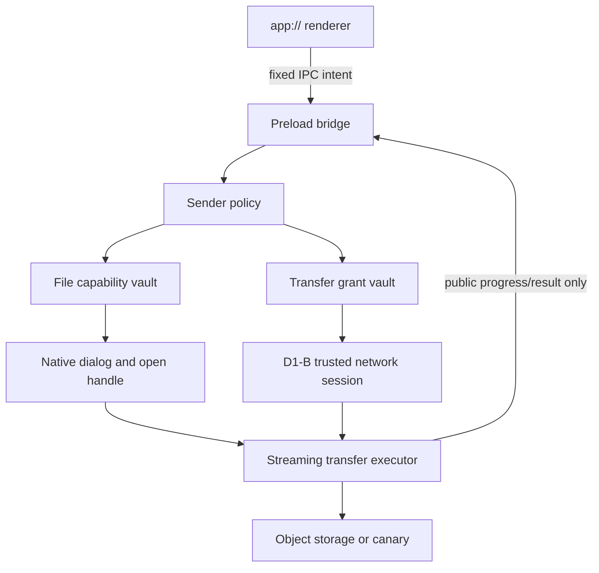

# D1-C Desktop 文件 Capability 与受控传输

## Goal Capsule

- **目标：** 在 Electron 主进程建立短 TTL、用途绑定、单次消费的文件 capability 与 transfer grant，使 renderer 能发起选择、上传和下载意图，但永远不能取得本地路径、signed URL、Bearer、任意 header 或通用文件/网络能力。
- **权威来源：** 服务端附件身份、项目权限、对象存储签名和上传完成校验是业务真相源；Desktop 主进程只执行经固定协议验证的文件选择与字节传输。
- **执行方式：** U1-U8 串行推进，每个单元形成独立实现、负向测试、提交和回退闭环。
- **停止条件：** 文件 identity 无法跨平台稳定重验、transfer request 不能在主进程内完成严格约束、renderer 能观察路径/URL/token，或 symlink/reparse point 与目标替换无法 fail closed 时，不进入 D2。
- **尾部责任：** U8 完成正式包 canary、三平台 Gate、凭证/路径泄漏扫描、review 与父计划收口；D2 才开放具体工作项/资料业务 operation。

---

## Product Contract

### Summary

D1-B 已建立固定 enrollment、主进程 Device credential lease、受控 REST/SSE 和统一生命周期取消边界，但 Desktop 尚无安全文件能力。共享层已经定义 `chooseFile`、`authorizeSignedRequest`、`uploadSignedRequest` 与 `downloadSignedRequest`，Web 适配器也已跑通“登记附件 -> 获取签名 -> 对象存储传输 -> 服务端确认”的四段式流程；这些接口目前只是抽象契约，不能直接把 Web 的 `File`、signed URL 或浏览器下载行为搬入 Electron。

D1-C 建立宿主安全底座，不提前迁移工作项或资料库 UI。renderer 只持不透明 capability ID 和安全展示元数据；文件路径、原生句柄、对象存储 URL、请求 header、redirect 响应和临时目标全部留在主进程。D1-C 使用 Device-only canary 证明传输闭环，普通业务 API 继续默认拒绝 Device principal；D2 再将固定业务 operation 与该底座组合。

### Requirements

#### 文件选择与本地身份

- R1. renderer 只能通过固定 `files.choose` 命令请求单文件选择；不能提供初始路径、过滤器、默认文件名、目录、shell command 或其他可改变原生对话框边界的参数。
- R2. 主进程为选择结果签发随机、不透明、进程内 capability ID，只返回规范化 `filename`、受控 `contentType`、`byteSize` 和 capability；绝不返回绝对/相对路径、file URL、inode/file ID、时间戳或原生 handle。
- R3. 选择后主进程必须立即以不跟随链接的方式打开源文件，比较打开前后 identity，并流式复制到权限受限的私有 spool 快照；快照记录真实 size、SHA-256 和受控 content type。POSIX 至少比较 regular-file、device/inode、size 与选择后时间边界；Windows 使用可用的 file identity/handle 元数据和 reparse point 检查。复制期间源文件被替换、增长、截断、变为链接/目录/设备或无法完成重验时 fail closed并删除快照。
- R4. file capability 绑定 spool 快照、profile epoch、窗口/webContents、顶层 frame、用途 `upload`、TTL 和单次消费状态。默认 TTL 不超过5分钟；logout、profile变化、窗口销毁、应用退出和suspend立即失效并删除快照。上传只读取不可变spool，不在传输时重新依赖用户原路径。
- R5. capability vault 只存在主进程内存，不写入磁盘、日志、renderer state、crash metadata、SSE、通知或测试报告；过期和已消费记录按上限清理，防止无界增长。

#### Transfer grant 与网络执行

- R6. signed request 只能由主进程从受信 API 响应中解析并签发 transfer grant；renderer 不得接收或回传 URL、method、header、credential、object key 或 expires timestamp。
- R7. transfer grant 绑定 profile epoch、credential lease/authorization version、固定 purpose、HTTP method、规范化 HTTPS/受信 loopback canary origin、允许 header集、预计字节数、过期时间和单次消费状态；服务端TTL仍是上限，Desktop本地TTL不超过60秒。
- R8. 上传只允许既有签名请求声明的 method 与 headers，不附加 Cookie、Device Bearer、Referer 或 Electron ambient auth，不跟随 redirect，不接受认证 challenge，不经 renderer session；响应 origin/status/headers 必须满足目的特定合约。
- R9. 上传从私有spool快照流式读取，不在renderer或主进程内存中整文件缓存；执行前复核snapshot size/hash，执行期间大小超过声明、提前EOF、取消、超时、网络失败或响应不合约时中止，grant与file capability都不得重放。
- R10. 下载先让用户选择保存位置；renderer 只能提供经过服务端净化的建议文件名，不能指定路径。主进程在目标目录创建独占临时文件，流式写入并在长度、content type/可用校验和与响应合约通过后原子替换目标。
- R11. 下载目标在对话框返回后和最终替换前必须重验父目录与目标identity；symlink、junction、mount point、reparse point、目录穿越、保留设备名、ADS、目标替换和跨设备非原子替换均fail closed。禁止使用 `unlink(target) -> rename(temp)`；平台无法证明可靠原子覆盖时第一期改用唯一新文件名或拒绝覆盖。失败/取消后删除临时文件，不损坏既有文件。
- R12. 上传/下载接入 D1-B operation registry 与 power lifecycle。logout、revoke/locked、profile epoch、窗口销毁、应用退出和 suspend 立即 abort；resume 不恢复旧 transfer，只允许重新选择/签发。

#### IPC、共享层与范围边界

- R13. preload 只暴露版本化、固定参数的 `files.choose/cancel` 与脱敏 transfer 状态能力；所有命令复用当前窗口、顶层 frame、固定 `app://yuance` authority 和导航稳定性的 sender policy。
- R14. renderer 获得的 capability 是不可解析字符串品牌值，错误只使用稳定公共 code；路径、URL、header、对象键、临时文件名、OS error detail 和 credential 不得进入错误、状态或日志。
- R15. 共享 `platform-contract` 必须区分 Browser 的本地 `File`/signed request 适配与 Desktop 的宿主 capability；不得要求 Desktop renderer 持有 Web signed request，也不得让共享 use case 绕过宿主边界。
- R16. D1-C 不扩大普通业务 API 的 Device allowlist。服务端仅新增 Device-only transfer canary/contract fixture，或使用与生产业务路由隔离且正式构建明确禁用的测试设施；最终选择必须能在三平台正式包 smoke 中运行且不能成为生产测试后门。
- R17. 正式 renderer CSP 保持 `connect-src 'none'`，bundle 不包含 `fs`、`path`、`dialog`、`shell`、通用 fetch、signed URL pattern、Bearer 或本地路径处理逻辑。
- R18. macOS、Windows、Linux 必须验证选择、上传、下载、取消、超时、生命周期 abort、替换攻击、symlink/reparse point、redirect 和泄漏扫描；平台无法创建特定链接时必须以可审计平台替代证据覆盖，不得静默跳过安全结论。
- R19. 每个renderer和全局必须限制活跃transfer数、等待队列、单文件大小、spool总量与下载最大字节数；队列项同样绑定epoch和取消信号。启动时清理上次异常退出遗留的私有spool/temp，但不得扫描用户目录或删除无法证明归属的文件。

### Actors

- A1. Desktop renderer：只表达文件操作意图、显示安全元数据和脱敏进度。
- A2. Desktop 主进程：持有文件 vault、transfer grant、原生对话框、文件 handle 和 network session。
- A3. 元策 API：验证 Device session/canary，生成受限 transfer request，并在后续 D2 中负责业务权限与附件状态。
- A4. 对象存储/测试存储：接收或返回字节，只信任短期签名请求，不接收 Device Bearer。

### Key Flows

- F1. **上传 canary：** renderer请求选择 -> 主进程以no-follow方式打开并复制到私有spool -> 签发file capability -> 主进程经固定Device canary operation获取transfer request -> 签发grant -> 从快照流式上传 -> 返回脱敏完成状态并清理快照。
- F2. **下载 canary：** 主进程取得固定下载 transfer request -> renderer 发起保存 -> 原生保存对话框 -> 独占临时文件流式写入 -> 校验 -> 重验目标 -> 原子替换 -> 返回脱敏结果。
- F3. **生命周期取消：** transfer 活跃时发生 logout、revoke、profile epoch、窗口销毁、退出或 suspend -> registry abort -> handle/stream/临时文件清理 -> capability/grant 失效 -> resume 不重放。
- F4. **攻击失败：** 选择后文件或保存目标被替换为 link/reparse point、服务器返回 redirect/错误 origin/超长 body/错误 method/header -> 主进程在副作用前或可回滚临时区 fail closed。

### Acceptance Examples

- AE1. 选择普通文件后 renderer 只看到 capability、文件名、类型和大小；扫描 IPC payload、renderer heap-facing state、日志和报告均找不到路径。
- AE2. 选择后复制期间把源文件替换为同名symlink/reparse point、不同identity或改变大小，快照签发前拒绝；快照成功后再修改原文件不改变本次上传字节。
- AE3. 上传服务器返回 301/302/307/308、401 challenge、跨源响应或 signed request 含非 allowlist header 时，不发生第二跳且不携带 Device Bearer/Cookie。
- AE4. 下载过程中替换目标或父目录、制造 junction/reparse point、提前 EOF或超长 body，既有目标内容保持不变，临时文件被清理。
- AE5. 正常 transfer、断言失败和超时后，process handle、临时文件、vault/grant、API child 与测试 profile 均清理；三平台报告不含 credential、URL 和路径。

### Scope Boundaries

- 不迁移工作项、评论、资料库或文档预览 UI；这些属于 D2/W3。
- 不给 Device principal 开放普通项目、工作项、附件或对象存储业务路由。
- 不实现目录选择、拖拽路径、剪贴板文件、文件监听、断点续传、多文件批量、离线队列或后台持久 transfer。
- 不实现 OS shell 打开下载文件、自动预览、病毒扫描、内容识别或 DLP；可在后续业务/平台专项立项。
- 不实现生产签名、公证、安装器、自动更新或发行下载；这些属于 G-DIST/G-UPDATE。

---

## Planning Contract

### Key Technical Decisions

- KTD1. **能力对象分两层且均不可序列化敏感信息。** file capability 代表本地选择，transfer grant 代表远端请求；两者在主进程 vault 中通过随机 ID 关联，renderer 不能自行组合 URL 与路径。Governs R2-R7、R13-R15。
- KTD2. **私有spool快照作为上传真相源。** Electron文件对话框只返回路径，不能提供跨平台稳定原生handle。主进程立即用no-follow/handle语义打开、比较identity并流式复制到`0700`目录/`0600`文件的私有spool；单纯`realpath + stat`或长期保存原路径不能作为安全边界。spool增加磁盘成本，但统一了修改竞态、portal短期授权和传输期重验。Governs R3-R5、R9、R19。
- KTD3. **下载采用同目录临时文件与原子替换。** 同目录保证正常文件系统上 rename/replace 不跨设备；目标已存在时保留到全部校验完成，任何失败只删除临时文件。Windows replace 复用 credential store 已验证的恢复思路，但文件下载不保留跨重启 backup。Governs R10-R12。
- KTD4. **网络沿用 D1-B trusted session，不用 Electron download API。** `session.fetch` 的隔离 partition、manual redirect、无 ambient credential和 operation registry 已有负向证据；`will-download`/renderer navigation 会扩大状态面。Governs R7-R9、R12。
- KTD5. **D1-C 以 Device-only canary 验证底座。** 在 D2 前不开放业务附件 API。canary 只传固定生成的无敏感字节与固定 contract，不接受 renderer 指定 URL/object key/header；生产是否保留由实现时以“最小公开诊断能力”或“编译/运行期测试 fixture”二选一收敛，不能新增绕过认证的测试后门。Governs R16。
- KTD6. **共享契约保留 Browser 兼容，但 Desktop 使用宿主委托。** Browser 可继续在浏览器内持有 `File` 与 signed request；Desktop adapter 只把不透明业务引用交给主进程，主进程完成 API 签名与 transfer。D2 迁移时共享 use case 不分叉业务规则。Governs R15。
- KTD7. **能力默认单次消费，失败也消耗。** 防止同一 capability/grant 在不确定远端状态后重试；用户重试必须重新选择或重新签发，避免部分上传、过期请求和替换后的文件被重放。Governs R3、R7、R9、R12。
- KTD8. **资源配额是安全边界。** 单文件沿用服务端100MB上限并从服务端契约读取；spool总量、并发和队列采用更小的本地固定上限，不能由renderer或环境变量放宽。启动清理只处理带应用私有marker且位于固定spool根的文件。Governs R5、R19。

### High-Level Technical Design

### System-Wide Impact

- **Auth：** 复用 profile epoch、credential lease、authorization version与 Device control plane；业务 principal 矩阵保持不变。
- **Network：** 对象存储 origin 是服务端签名响应中的受限动态 origin，不能沿用 API origin 白名单本身；必须通过 request schema、HTTPS、method/header、TTL和 redirect policy共同授权。
- **Filesystem：** macOS/Linux 的 symlink/device/inode语义与 Windows reparse point/file ID/replace语义不同，抽象只统一安全结论，不伪装平台 API 完全一致。
- **Frontend：** platform contract 需要避免把 Web signed request 数据模型强加给 Desktop renderer，但现有 Browser adapter 与工作项协作测试必须零回归。
- **Observability：** 只记录 operation ID、phase、公开 error code、byte count bucket和duration；禁止路径、URL、query、header、object key和原生 error detail。

### Risks and Dependencies

| 风险 | 缓解 |
|---|---|
| Node/Electron跨平台API无法提供足够强的no-follow与file identity | 优先使用原生Node fs flags/handle metadata并立即固化spool快照；若Windows仍不足，新增最小Rust/N-API helper并独立Gate，不以字符串路径比较替代 |
| 私有spool造成磁盘占用或异常退出残留 | 单文件/全局配额、流式复制、TTL与生命周期清理；启动只清理固定私有根内可证明归属的遗留文件 |
| 对象存储供应商签名 header 差异导致 allowlist 过窄或过宽 | 从 `storage::SignedObjectRequest` 结构化 schema建立目的特定规则，fixture覆盖 OSS/S3风格的合法与恶意变体 |
| 下载原子替换在 Windows 文件占用或杀毒软件干扰下失败 | 保留原文件、删除临时文件、返回可重试公共错误；不静默降级为覆盖写 |
| canary 演变为生产测试后门 | 固定 payload/size/purpose、要求 Device auth、不接受对象键/URL，并由 API principal matrix 与 OpenAPI审计约束 |
| capability 泄漏后在 TTL 内被重放 | 绑定 sender/profile/purpose，单次消费，随机高熵 ID，生命周期 abort 与上限清理 |

### Sequencing

1. 先冻结服务端 transfer request schema和 Device canary，不碰 renderer。
2. 再实现 file capability vault与跨平台 identity adapter，先通过替换攻击测试。
3. 建立 transfer grant validator和上传/下载执行器，复用 D1-B session/registry。
4. 最后接 IPC/preload/renderer canary、正式包 smoke与三平台 Gate。

---

## Implementation Units

### U1. 冻结 transfer request schema 与 Device-only canary

- **Goal：** 形成主进程可严格验证、renderer 不可见的 upload/download request 合约，并提供不扩大业务 API 的真实服务端 canary。
- **Requirements：** R6-R8、R16。
- **Files：** `api/src/domains/storage.rs`、`api/src/web/api/mod.rs`、`api/src/web/router.rs`、`api/tests/device_access_auth_flow.rs`、新增 `api/tests/device_file_transfer_flow.rs`、`docs/openapi/yuance.openapi.json`。
- **Approach：** 为 `SignedObjectRequest` 明确 version、purpose、method、URL、header、expected bytes/content type和expires字段；Device canary只允许固定小型 payload/下载对象，不接受任意 URL/object key。Browser/PAT/system/device principal matrix逐项锁定。
- **Test Scenarios：** 正常签发；错误 purpose/method/TTL/header；Cookie/PAT/system混合凭证；撤销/过期 Device；普通业务附件 endpoint继续拒绝 Device。
- **Verification：** `cargo test --manifest-path api/Cargo.toml --test device_file_transfer_flow --test device_access_auth_flow`。

### U2. 建立 file capability vault 与身份适配器

- **Goal：** 原生对话框选择的文件在主进程内形成短期、绑定 sender/profile 的不可重放能力。
- **Requirements：** R1-R5。
- **Files：** 新增 `desktop/src/files/file-capability-vault.mjs`、`desktop/src/files/file-identity.mjs`、`desktop/src/files/file-spool.mjs`、`desktop/src/files/file-dialog.mjs`、新增 `desktop/test/file-capability-vault.test.mjs`、`desktop/test/file-identity.test.mjs`、`desktop/test/file-spool.test.mjs`。
- **Approach：** 对话框返回后立即no-follow打开并复制到私有spool，前后比较identity并计算SHA-256；vault只保存快照与身份，公开层只返回安全元数据。选择、消费、过期、abort、配额和启动遗留清理使用注入时钟/根目录测试。
- **Test Scenarios：** 正常文件；取消；目录、FIFO/device、symlink；复制中删除、替换、增长、截断；复制后修改原文件不影响快照；跨sender/profile/用途；过期、重复消费、单文件/总量配额、遗留清理；Windows reparse point和保留路径边界。
- **Verification：** 聚焦 Node tests，并在三平台 runner运行平台分支。

### U3. 建立 transfer grant validator 与 vault

- **Goal：** 将受信 API response收敛为本地短期、目的绑定、单次消费 grant。
- **Requirements：** R6-R8、R12、R14。
- **Files：** 新增 `desktop/src/files/transfer-contract.mjs`、`desktop/src/files/transfer-grant-vault.mjs`、新增 `desktop/test/transfer-contract.test.mjs`、`desktop/test/transfer-grant-vault.test.mjs`。
- **Approach：** 结构化解析 URL、method、headers、TTL和expected metadata；拒绝 userinfo、fragment、非HTTPS（除真实 fixture受控 loopback）、未知 header、重复/冲突 header、超长值和跨 purpose字段。vault复用 U2 生命周期语义。
- **Test Scenarios：** 合法 upload/download；HTTP、userinfo、fragment、Unicode/混淆 host、非法端口、过长URL、redirect hint、Authorization/Cookie/Host/Referer、CRLF、TTL超界、profile epoch变化和重放。
- **Verification：** 聚焦 Node tests和credential/path leak scan fixture。

### U4. 实现流式上传执行器

- **Goal：** 从重验后的打开文件 handle向签名目标传输字节，不泄漏本地或 Device credential。
- **Requirements：** R4、R7-R9、R12。
- **Files：** 新增 `desktop/src/files/upload-executor.mjs`、修改 `desktop/src/network/network-session.mjs`、`desktop/src/network/operation-registry.mjs`、新增 `desktop/test/upload-executor.test.mjs`、新增 `desktop/test/upload-electron-integration.test.mjs`。
- **Approach：** 先消费并锁定file/grant，再复核spool size/hash；使用流和显式content length、manual redirect及目的特定响应合约；所有退出路径关闭handle、删除已消费快照并从registry移除。
- **Test Scenarios：** 正常上传；spool篡改；提前EOF/增长；301/307、401、proxy auth、错误origin/status；abort/timeout/suspend/logout；远端可能已接收时仍禁止重放。
- **Verification：** Node单测、真实 Electron session integration与API canary。

### U5. 实现安全下载与原子落盘

- **Goal：** 用户选择目标后，下载只在临时文件完整校验成功时替换目标。
- **Requirements：** R7、R10-R12。
- **Files：** 新增 `desktop/src/files/download-executor.mjs`、`desktop/src/files/download-target.mjs`、新增 `desktop/test/download-executor.test.mjs`、`desktop/test/download-target.test.mjs`、新增 `desktop/test/download-electron-integration.test.mjs`。
- **Approach：** 净化建议文件名；保存对话框后记录父目录/目标identity；同目录独占创建随机临时文件，限制最大字节并fsync，重验后原子replace。Windows若Node能力不能证明可靠replace则使用最小原生helper或拒绝覆盖，绝不先删除目标。取消与失败统一清理。
- **Test Scenarios：** 新文件和确认覆盖；取消；建议名穿越/保留名/ADS；父目录或目标替换；symlink/junction/reparse point；超长/短body、错误type/status/redirect；磁盘满、权限失败、文件占用、abort与进程关闭清理。
- **Verification：** 三平台聚焦测试和真实 Electron integration；既有目标hash保持不变。

### U6. 接入 IPC、preload 与 Desktop composition root

- **Goal：** renderer通过最小版本化合约发起文件意图并获得脱敏状态，所有能力绑定正常应用生命周期。
- **Requirements：** R3、R5、R12-R15、R17。
- **Files：** 新增 `desktop/src/ipc/file-commands.mjs`、`desktop/src/ipc/file-state.mjs`、修改 `desktop/src/preload.cjs`、`desktop/src/main.mjs`、`desktop/src/renderer/platform/unavailable.js`，新增 `desktop/src/renderer/platform/files.js`、修改 `frontend/packages/platform-contract/src/files.js`，新增/修改对应 tests。
- **Approach：** bridge只接受空对象或固定opaque ID；sender policy先于vault读取。composition root统一创建/销毁vault和executors，并把logout/profile/lifecycle abort传播到operation registry。
- **Test Scenarios：** 主窗口顶层frame正常调用；subframe、导航中、旧webContents、非法payload、伪造capability、并发重复消费、窗口关闭/suspend；IPC错误和状态无敏感字段。
- **Verification：** preload/IPC/composition tests、`npm run check:frontend`与bundle source policy。

### U7. 建立真实 API + Electron 文件 transfer 闭环

- **Goal：** 在开发测试和实际 unpacked bundle中证明选择、上传、下载、取消与攻击失败路径。
- **Requirements：** AE1-AE5、R18。
- **Files：** 扩展 `desktop/test/support/real-api-fixture.mjs`，新增 `desktop/test/desktop-file-transfer-api-integration.test.mjs`、`desktop/test/desktop-file-transfer-electron-integration.test.mjs`、`desktop/scripts/smoke-desktop-file-transfer.mjs`、`desktop/scripts/verify-desktop-file-transfer-artifacts.mjs`，修改 `desktop/package.json`。
- **Approach：** fixture只走公开Device canary；测试文件/profile/download目录全部临时隔离。正式包 smoke通过测试专用原生入口选择固定临时文件，但该入口不得进入生产renderer/preload channel；报告只记录布尔结果、byte count和公共duration。
- **Test Scenarios：** 正常upload/download字节hash一致；restart后旧capability失效；redirect捕获无第二跳；源/目标替换；断言失败与45秒超时；API child、profile、临时文件、vault/grant全部清理。
- **Verification：** `smoke:desktop-file-transfer`、artifact verifier、path/credential/URL scan。

### U8. 纳入三平台安全 Gate 并收口

- **Goal：** 对同类正式 bundle在macOS、Windows、Linux证明安全结论，形成review并把D2设为下一阶段。
- **Requirements：** R17-R18、AE1-AE5。
- **Files：** 修改 `.github/workflows/desktop-security.yml`、`desktop/scripts/verify-app-bundle.mjs`、`desktop/scripts/scan-credential-leaks.mjs`，新增 `docs/reviews/YYYY-MM-DD-d1-desktop-file-capability-transfer-review.md`，修改本计划和父计划。
- **Approach：** Gate依次执行API聚焦、Desktop全量、unpacked build、ASAR policy、app/network/file smoke、泄漏扫描和cleanup verifier；`if: always()`上传脱敏报告。Windows明确验证reparse/replace替代证据，Linux/macOS验证symlink/no-follow。
- **Test Scenarios：** 正常、恶意和cleanup矩阵三平台同义；ASAR不含测试channel、路径fixture、signed URL或Node文件能力；旧D1-A/D1-B smoke零回归。
- **Verification：** 完整执行 Verification Contract并记录CI run链接、平台差异和残留边界。

---

## Verification Contract

| 范围 | 命令 / Gate | 通过信号 |
|---|---|---|
| API聚焦 | `cargo test --manifest-path api/Cargo.toml --test device_file_transfer_flow --test device_access_auth_flow` | canary合约、principal matrix与撤销边界通过 |
| API回归 | `cargo test --manifest-path api/Cargo.toml` | Browser/PAT/system/Device与附件业务全量不回归 |
| Frontend | `npm run check:frontend` | Browser文件适配与Desktop opaque capability契约同时通过 |
| Desktop静态检查 | `npm --prefix desktop run check` | JSDoc/checkJs、ESLint与renderer边界通过 |
| Desktop全量 | `npm --prefix desktop test` | vault、identity、grant、executors、IPC和既有安全测试通过 |
| Bundle verifier | `npm --prefix desktop run verify:bundle -- <staging>` | ASAR无测试channel、路径/URL/credential和renderer文件能力 |
| 协议/网络回归 | `npm --prefix desktop run smoke:app-protocol -- <staging>` 与 `npm --prefix desktop run smoke:desktop-network -- <staging>` | D1-A/D1-B保持通过 |
| 文件smoke | `npm --prefix desktop run smoke:desktop-file-transfer -- <staging>` | 真实API、正式Electron、上传/下载/攻击失败/cleanup闭环通过 |
| 泄漏扫描 | `npm --prefix desktop run scan:credential-leaks` | source、fixture、logs、reports、ASAR和unpacked无路径、signed URL、credential特征 |
| 三平台CI | `.github/workflows/desktop-security.yml` | macOS、Windows、Linux同类Gate全部通过 |

---

## Definition of Done

- R1-R19、F1-F4与AE1-AE5均有实现文件和自动化证据，U1-U8全部完成。
- renderer和preload不能取得或构造路径、file URL、signed URL、request header、object key、Bearer、Cookie或通用文件/网络能力。
- file capability与transfer grant均绑定sender/profile/purpose/TTL并单次消费；所有生命周期中止事件立即abort且不重放。
- 源文件复制期间的替换、symlink/reparse point、目录/设备、大小变化和身份不一致在capability签发前fail closed；上传只读取hash校验后的私有spool快照。
- 下载只在完整校验后同目录原子替换；目标/父目录替换、链接、超长/短body、取消和失败不损坏既有文件且无临时文件残留。
- transfer不跟随redirect、不使用ambient credential、不接受auth challenge；对象存储请求不携带Device Bearer/Cookie。
- 普通业务API继续默认拒绝Device principal；D1-C canary不能接受任意URL/object key/header或绕过认证。
- 单文件、并发、队列、spool总量和下载字节均有固定上限；正常、失败、超时、生命周期中止和异常重启均有可重复清理证据。
- API全量、Frontend、Desktop check/test、bundle verifier、D1-A/D1-B smoke、file smoke与泄漏扫描全部通过。
- macOS、Windows、Linux Desktop Security Gate全部通过，复核证据写入`docs/reviews/`。
- 父计划将D1-C标记为completed并把D2业务功能对齐设为唯一下一Desktop子计划。
- 废弃实现、临时探针、重复fixture、测试channel和不再采用的依赖全部移除，不遗留旁路或测试后门。
