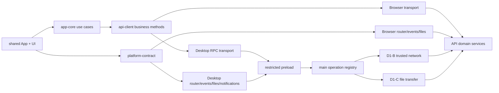

# D2 Desktop 首批业务功能对齐

## Goal Capsule

- **目标：** 以 W3/W4 已通过 Browser E2E 的业务能力为基线，让 Desktop 使用同一共享应用壳、UI、`app-core` 与 API client，完成消息中心、工作项列表/详情、编辑、handoff、评论及工作项/评论附件的在线读写闭环。
- **权威来源：** `api/src/domains/**` 继续独占权限、审计、状态流转和通知事实；共享前端只表达业务意图，Desktop 主进程只执行固定、版本化、可审计的宿主 operation。
- **执行方式：** U1-U8 按依赖串行推进；每次只实施一个可独立验证、提交、review 和回退的 feature 单元。每个业务单元必须自带 Browser 回接、真实 API + Electron、最小打包态 smoke 与安全负向证据，不能留到 U7/U8 首次补齐。
- **停止条件：** 需要复制 Desktop 业务页面、在共享 JSX 中增加 Electron 条件分支、renderer 可观察 Bearer、signed URL/header、本地路径或通用网络/文件能力，或普通业务 Device principal 权限无法收敛到固定 operation 时，停止扩大范围并回到 D1 边界复核。
- **尾部责任：** U8 完成 Browser/Desktop parity matrix、四 runner 安全 Gate、正式包 smoke、review 与主线回填；G-DIST、自动更新和 D3/D4 继续独立立项。

---

## Product Contract

### Summary

D1-A 至 D1-C 已完成 `app://yuance` 安全宿主、Device session、受控 REST/SSE 和文件 capability/transfer，并通过 macOS、Ubuntu、Windows x64 与 Windows ARM64 Gate。当前 Desktop renderer 仍只渲染认证/网络状态壳，尚未消费 W4 共享业务能力；同时 `web/src/app.jsx` 仍承担完整应用 composition，不能直接作为 Desktop 的第二份副本。

D2 首批只对齐已经在 Browser 生产路径验证过的业务能力。实施先把应用状态与页面 composition 从 `web/` 移到共享层，再为 Browser 和 Desktop 分别注入 transport、事件、路由、文件与通知 adapter。Desktop 的普通业务请求和附件签名请求由主进程基于固定 operation 发起，renderer 只能发送规范化业务参数或不透明 capability，并只能接收脱敏业务 DTO 与公共错误。

### Requirements

#### 共享应用与业务一致性

- R1. Browser 与 Desktop 必须渲染同一共享应用组件和共享 UI，覆盖首页状态、消息中心、项目列表、需求/任务/Bug 列表、工作项详情、编辑、handoff、评论新增/编辑及附件列表/上传/下载；不得复制 Desktop 业务页面。
- R2. 共享组件、`app-core`、`api-client` 和 `ui` 不得导入 Electron、Node 内建模块、`window.yuanceDesktop` 或 Browser 全局副作用，也不得通过 JSX 条件分支判断宿主类型。
- R3. Browser 现有 URL、Cookie/CSRF、SSE、附件传输和登录回跳语义保持不变；D2 不以 Desktop 对齐为由改变已通过的 19 项 Browser E2E 行为。
- R4. Desktop 认证成功且网络在线后进入共享应用；未认证、授权中、locked、离线、重新授权和 fatal 状态继续由宿主状态壳提供明确恢复入口。业务内容不得在可用 Device lease 建立前发起请求。
- R5. 工作项 mutation、评论和附件操作继续保留“路由或 action 已过期时，迟到响应不得覆盖当前页面”的不变量；网络恢复只刷新当前可见数据，不重放不确定结果的写操作。

#### Desktop 业务网络与权限边界

- R6. Desktop API adapter 只能调用主进程 operation registry 中显式注册的业务 operation；renderer 不得传入 URL、method、header、origin、redirect、credential、任意 query map 或通用 request options。
- R7. 首批 allowlist 只覆盖当前共享应用实际需要的用户/topbar、项目列表与当前项目、通知列表/目标/已读、工作项列表/详情/编辑/handoff、评论列表/新增/编辑和附件四段式业务 operation。每个动态标识必须按项目 key、工作项 key、正整数 ID 和既有分页/筛选 schema 独立验证。
- R8. API 只为 D2 明确列出的普通业务 route 接受 Device principal，并继续调用相同 domain service、权限与审计逻辑；Cookie、PAT、system 与 Device principal 的允许/拒绝矩阵必须由集成测试冻结，不得增加绕过项目成员关系或对象访问校验的 Desktop 专用业务逻辑。
- R9. 主进程通过 D1-B credential lease 注入 Device Bearer，并负责 refresh、epoch 失效、manual redirect、timeout、abort 和响应 schema 上限；renderer、preload payload、日志、错误、崩溃报告与 SSE 数据不得出现 Bearer 或 refresh credential。
- R10. 业务 DTO 必须经过 operation-specific 响应解析与大小/字段约束后才能发给 renderer；禁止把任意 JSON、响应 header、原生网络错误、服务器堆栈或未知字段直接透传。

#### 文件、事件与通知

- R11. Desktop 工作项和评论附件上传复用 D1-C file capability/spool；主进程按固定业务引用完成“登记 -> 获取签名 -> transfer grant -> 上传 -> 服务端确认”，renderer 永远不能取得 signed request、URL、header、对象键或文件路径。
- R12. Desktop 附件下载由主进程按固定业务引用取得签名请求并执行 D1-C 安全落盘；renderer 只能提供工作项 key、评论/附件 ID 等经 schema 验证的业务引用，建议文件名以服务端已验证 DTO 为准，不能指定路径。下载完成后主进程可签发短 TTL、单次消费的 `reveal-download` capability，用于在系统文件管理器中定位该次受控落盘文件；renderer 仍不能取得或回传路径。
- R13. Browser 继续使用 Browser `File` 与 signed request capability；共享 use case 可表达同一业务阶段和结果，但 Desktop adapter 必须采用宿主委托，不得为了表面接口一致把 Web signed request 暴露给 renderer。
- R14. Desktop SSE 复用 D1-B 受控事件流，只向 renderer 发布版本化的 `topbar`/`release-version` 刷新信号或经 allowlist 的通知事件；未知事件、超长 payload、旧 epoch 与窗口销毁后的事件必须丢弃。
- R15. SSE 刷新事实由主进程消费；main 使用固定 notification operation 拉取并验证通知 DTO，以通知 ID + profile epoch 作为去重键。前台窗口只刷新站内消息，后台或最小化时同一通知最多投递一次原生通知；通知不可用、权限拒绝或用户关闭原生通知时，站内消息中心始终保留等价入口。renderer 不得控制标题、正文、图标、点击 URL 或系统行为。
- R16. 点击原生通知后先恢复并聚焦现有窗口，再按共享 `notificationTargetPath` 的语义目标导航到 `app://` 内部工作项路由并保留 comment hash；只有用户点击或明确站内操作才调用既有幂等 API 标记已读。无权限、目标失效或未知 target 时留在安全默认页并显示可恢复反馈，不打开远端 `/web/*` 页面。

#### 平台安全、质量与发布边界

- R17. macOS 严禁使用 Keychain，也不得向 credential runtime 注入 Electron `safeStorage`。macOS credential storage 继续使用进程内随机 AES-256-GCM key；key 不持久化，重启后旧密文 fail closed 并要求重新授权。不得把 macOS restart persistence 描述为已支持能力。Windows 使用系统安全存储；Linux 仅允许 `gnome_libsecret` 等 D1 已批准的安全 backend，不得回退 `basic_text`。
- R18. Desktop renderer CSP 继续保持 `connect-src 'none'`；bundle 与 preload 不得包含通用 `fetch`、`XMLHttpRequest`、`EventSource`、WebSocket、`shell.openExternal`、`fs/path`、signed URL pattern、Bearer 或任意 IPC invoke helper。
- R19. Browser 与 Desktop 对同一业务输入必须得到一致的成功、权限失败、校验失败、过期响应和附件阶段语义；宿主差异只允许体现在文件选择/保存、原生通知、认证恢复和窗口生命周期。
- R20. D2 收口必须覆盖共享 package 单测、Browser 全量 E2E、真实 API + Electron 在线业务闭环、正式 unpacked bundle smoke、凭证/路径/URL 泄漏扫描以及 macOS、Ubuntu、Windows x64、Windows ARM64 Gate。
- R21. 共享 App 必须保持语义结构、键盘顺序、焦点恢复和状态播报；编辑/handoff、文件对话框、通知跳转和宿主状态切换后焦点进入可预测位置，loading、error、mutation 结果和附件阶段通过可访问 live region 呈现。
- R22. 每个业务页面必须覆盖 initial loading、empty、refreshing-with-stale-data、validation error、403/404、pending、success、uncertain 与可恢复失败；附件额外覆盖 selecting、uploading、confirming、cancelled、partial 和 completed，且明确可用操作与恢复入口。

### Actors

- A1. Browser 用户：通过 Cookie/CSRF 与 Browser adapter 使用共享应用。
- A2. Desktop 用户：通过 Device session 与受限宿主能力使用同一共享应用。
- A3. Desktop renderer：渲染共享 UI，提交规范化业务意图，只持脱敏 DTO 与不透明 capability。
- A4. Desktop preload/main：验证 sender、业务参数、operation、credential lease、网络响应、文件与通知能力。
- A5. 元策 API：执行权限、审计、业务状态与附件签名，是跨宿主唯一业务真相源。

### Key Flows

- F1. **进入业务应用：** Desktop 启动 -> 宿主恢复或重新建立 Device session -> trusted network online -> 共享应用加载用户、topbar、消息、项目与当前路由数据。
- F2. **工作项协作：** 共享 UI 发出编辑/handoff/评论意图 -> Desktop adapter 调用固定 operation -> 主进程校验并注入 lease -> API domain service 执行 -> 脱敏 DTO 返回 -> 当前 action 仍有效时提交 UI 状态。
- F3. **附件上传：** 共享 UI 请求选择 -> 主进程签发 file capability -> renderer 提交固定工作项/评论引用和 capability -> 主进程完成登记、签名、上传、确认 -> 返回阶段与最终附件 DTO。
- F4. **附件下载：** renderer 提交固定业务引用 -> 主进程校验权限并取得 signed request -> 原生保存对话框与安全落盘 -> renderer 只收到取消/完成/公共错误。
- F5. **消息与原生通知：** main 消费受控 SSE fact -> 固定 operation 拉取通知 DTO -> 共享消息中心更新 -> 按前后台、偏好和去重键决定系统通知 -> 点击后恢复/聚焦窗口、幂等标记已读并导航内部语义 target。
- F6. **会话或生命周期失效：** logout、revoke、refresh 失败、profile epoch、suspend、窗口销毁 -> 中止 REST/SSE/file operation -> 清空 renderer 业务状态 -> 回到宿主状态壳；恢复后只重新读取，不自动重放写入。

### Acceptance Examples

- AE1. 同一账号在 Browser 与 Desktop 打开同一工作项时，字段、评论、附件和允许操作一致；编辑、handoff、评论后两端刷新得到相同服务端结果。
- AE2. Desktop renderer 发起未知 operation，或把 URL/header/Authorization/path 混入 payload，IPC 在网络或文件副作用前拒绝，公开错误与日志不回显输入中的敏感值。
- AE3. Desktop 上传工作项或评论附件时，renderer 只观察文件展示元数据、阶段和附件 DTO；扫描 IPC、bundle、日志和测试报告均找不到本地路径、signed URL/header 或 Device Bearer。
- AE4. SSE 断开、系统 suspend 或 Device session refresh 后，当前页面可重新读取；已提交但结果不确定的 mutation/附件操作不会自动重放，用户能看到明确的重新检查或重试提示。
- AE5. macOS 正常运行期间可完成 D2 在线业务；应用重启后旧 credential 密文无法恢复时 fail closed 并要求重新授权，全流程不访问 Keychain、不使用 Electron `safeStorage`。
- AE6. 前台只刷新站内消息，后台/最小化对同一通知最多投递一次；系统通知不可用或被拒绝时站内入口完整保留。点击合法 target 后恢复/聚焦窗口并导航详情及 comment hash；伪造 URL、未知 kind、无权限或已删除目标不会触发外链或越权加载。

### Success Criteria

- Browser 现有全量 E2E 零回归，且共享应用组件不再由 `web/src/app.jsx` 独占。
- Desktop 首批业务 parity matrix 的每一项均有真实 API + Electron 正向和关键负向证据。
- renderer/preload 与日志扫描无法发现 credential、signed request、路径或通用宿主能力。
- 四个目标 runner 的 D2 Gate 全绿；macOS Gate 明确证明无 Keychain/`safeStorage` 依赖及重启后重新授权语义。

### Scope Boundaries

- 本计划不迁移尚未完成 W3 的资料库、项目详情、文档预览、富文本高级体验、正文内附件节点、拖拽粘贴或旧 Askama 下线。
- 不实现工作项创建 modal、保存筛选、批量操作或 Desktop 独有业务功能。
- 不实现任意外链打开、托盘、后台常驻、开机启动、全局快捷键或深度窗口管理。
- 不实现离线 SQLite、缓存持久化、后台同步、冲突解决或离线附件队列；这些属于 D3/D4。
- 不实现签名、公证、安装升级卸载、自动更新、SBOM/provenance 或生产发布；这些属于 G-DIST/G-UPDATE。
- 不改变 macOS credential 为可跨重启持久化；严禁以 Keychain 或 Electron `safeStorage` 补齐该能力。

### Dependencies

- W4 共享 package 与 Browser 协作闭环：`docs/plans/2026-07-31-001-refactor-w4-shared-javascript-layer-plan.md`。
- D1-A 至 D1-C 安全宿主、Device network/SSE 与文件 transfer，尤其 `docs/reviews/2026-08-02-d1-desktop-file-capability-transfer-review.md`。
- 当前 Browser 行为基线：`web/e2e/app-shell.spec.mjs` 与 `web/e2e/work-item-collaboration.spec.mjs`（实施前按实际文件名确认并保持全量 suite）。

---

## Planning Contract

### Product Contract Preservation

主线 Product Contract 未改变；本计划只把 `docs/plans/2026-07-28-feat-web-desktop-shared-frontend-plan.md` 已冻结的 D2 目标收敛为首批可执行范围，并明确延后尚未完成的 W3 feature、G-DIST 与 D3/D4。

### Key Technical Decisions

- KTD1. **先共享应用 composition，再接 Desktop。** 将 `web/src/app.jsx` 的宿主无关状态、页面和交互迁到 `frontend/packages/ui`/`app-core`，`web/src/app.jsx` 收缩为 Browser composition root，Desktop 直接渲染同一共享应用。复制文件或在 JSX 内判断 Electron 会立即造成行为漂移。Governs R1-R5、R19。
- KTD2. **Desktop 网络采用逐业务方法到版本化 operation ID 的显式 RPC。** `api-client` 继续定义业务方法和 DTO，Desktop adapter 只把领域参数交给窄 bridge；main registry 独占 path、method、header、body 编码和 credential lease。禁止把 api-client request descriptor 跨 IPC 传输，renderer 不获得 request primitive。Governs R6-R10、R18。
- KTD3. **API 扩权以 route + principal matrix 为单位。** Device principal 作为统一 `ApiPrincipal` 的显式 kind，携带 user、device/session actor、audit source、display-name snapshot 与 revoke/version 证据；Device Bearer 豁免 Cookie CSRF，但不豁免 domain authorization。它只进入 D2 列出的 endpoint，不建立 Desktop controller、副本 API或“已认证设备即全项目可读”的捷径。Governs R7-R10。
- KTD4. **Desktop 附件采用宿主委托的复合 operation。** (session-settled: user-approved — chosen over renderer-visible signed requests: the host boundary prevents URL, header, path, and credential exposure.) renderer 提交业务引用与 file capability，main 串联登记、签名、transfer 和确认；Browser 保留现有四段式 adapter。Governs R11-R13、R18。
- KTD5. **通知事实链固定为 SSE fact -> main 固定查询 -> 原生投递。** main 收到 allowlist SSE 刷新事实后，以固定 notification operation 拉取 DTO、按 notification ID + epoch 去重并判断前后台；renderer 只接收站内刷新和内部语义 target，不提交通知内容或 URL。Governs R14-R16。
- KTD6. **写操作永不自动重试。** 读取可在连接恢复或 refresh 后重新拉取；mutation、handoff、评论和附件只要已进入 transport 就不因 401、timeout、断连或未知响应自动重放，统一提示刷新确认。新的用户操作必须重新显式提交。Governs R5、R9、R19。
- KTD7. **macOS credential 维持 session-only。** (session-settled: user-directed — chosen over macOS Keychain/Electron safeStorage persistence: Keychain use is explicitly prohibited.) macOS 使用每进程随机 AES-256-GCM key，禁止 Keychain 和 Electron `safeStorage`；重启后旧密文 fail closed 并重新授权。Windows 与 Linux 维持 D1 已验证 backend。Governs R4、R17、R20。
- KTD8. **D2 Gate 证明共享与安全两类 parity。** Browser E2E 证明共享迁移无回归，真实 API + Electron/正式包证明 Device principal、主进程 operation 与宿主能力；二者不能互相替代。Governs R3、R19-R20。

### High-Level Technical Design

### Browser/Desktop Parity Matrix

| 能力 | Browser 基线 | Desktop 目标 | 宿主差异与证据 |
|---|---|---|---|
| 应用壳/路由 | History + `/web/app/*` | `app://yuance/*` 内部路由 | 同一 route parser/共享 App；各自 router tests + E2E |
| 用户/topbar/项目 | Cookie/CSRF fetch | Device operation RPC | 相同 DTO；principal matrix + API/Electron integration |
| 消息中心 | Browser SSE + 站内消息 | D1-B SSE + 站内/原生通知 | 只共享刷新与 target 语义；通知点击负向测试 |
| 工作项列表/详情 | 共享 api-client + Browser transport | 同一 client + Desktop RPC transport | 相同筛选、分页、DTO 与错误；双宿主 E2E |
| 编辑/handoff/评论 | Browser mutation | Device operation mutation | 不自动重试；审计/权限/迟到响应一致性测试 |
| 附件上传 | Browser `File` + signed request | file capability + main 复合 operation | renderer 不见路径/签名；IPC 与泄漏扫描 |
| 附件下载/定位 | Browser 打开 signed URL | main 安全保存、原子落盘和短期 capability 定位 | renderer 不见 URL/路径；真实文件 hash、reveal 重放与替换攻击测试 |
| 会话恢复 | Cookie 登录回跳 | Device authorization 状态壳 | macOS 重启重新授权；Windows/Linux 按 D1 backend |

每个 feature 单元还必须维护一张可执行子矩阵，至少包含：路由、共享模块、读写 API、principal/权限与公共错误、SSE 行为、附件/预览、Desktop operation/adapter、允许的宿主差异、Browser E2E、打包态 Desktop E2E、回退条件、发布条件、平台/架构、并发/取消/背压、SSE 去抖/退避、内存/CPU/磁盘/日志预算、隐藏窗口节流和系统能力不可用时的降级行为。U8 只汇总这些子矩阵，不替代单元验收。

### Shared UI State Matrix

| 场景 | 必须呈现的状态 | 可用操作与恢复 |
|---|---|---|
| 列表/详情/消息读取 | initial loading、empty、refreshing-with-stale-data、403、404、offline | loading 不误报空数据；旧数据刷新时保持可读；403/404 返回安全上级路由；offline 提供重试 |
| 编辑/handoff/评论 | validation error、pending、success、uncertain、permission changed | pending 禁止重复提交；success 恢复合理焦点并播报；uncertain 只允许刷新确认，不自动重放 |
| 附件 | selecting、registering、signing、uploading、confirming、partial、cancelled、failed、completed | cancel/failed 可重新选择；partial/uncertain 先刷新服务端状态；completed 才开放下载/定位 |
| 通知 | foreground refresh、background delivered、suppressed、permission denied、target unavailable | 前台仅站内反馈；权限拒绝保留站内入口；点击恢复窗口；失效 target 返回消息中心 |
| 宿主会话 | locked、reauthorization required、offline、fatal | 清空敏感业务状态并进入状态壳；恢复后只重新读取，焦点进入主恢复操作 |

### System-Wide Impact

- **认证与授权：** 普通业务 route 首次接受 Device principal，必须逐 route 证明与 Cookie/PAT 权限等价，并验证 revoke/epoch 对进行中 operation 的取消。
- **前端边界：** `web/src/app.jsx` 将显著收缩；共享 App 迁移会影响 Browser 全部页面，因此必须先做 characterization/E2E 保底并保持 React 单例与 package boundary。
- **网络与事件：** operation registry 从 D1 canary 扩展到真实业务，动态 path 参数和响应上限成为新的安全关键面。
- **文件生命周期：** 业务附件把 D1-C 两个 capability 与远端附件状态组合起来；失败阶段必须区分“未登记、已登记未上传、字节可能已传、已上传未确认”。
- **隐私与可观测性：** 可记录 operation name、公共 error code、阶段、duration 和大小区间；禁止记录业务正文、评论内容、路径、URL、header、token、对象键和原生错误详情。

### Risks and Dependencies

| 风险 | 缓解 |
|---|---|
| `web/src/app.jsx` 仍含 Browser 专属假设，迁移后破坏生产 Web | 先用现有 E2E 做 characterization；按 services contract 逐块迁移，Browser composition 先回接并全绿后再接 Desktop |
| operation registry 动态参数形成路径穿越或通用代理 | 每个 operation 独立 schema/path builder；不接受 URL/method/header；对 key/ID/filter 长度和枚举做负向测试 |
| Device principal 扩权绕过既有项目权限 | route 层只完成身份接入，domain service 不分叉；Cookie/PAT/system/device 矩阵和跨项目越权测试作为 U2 Gate |
| 附件复合 operation 的部分成功产生孤立记录 | 返回稳定阶段；失败后重新查询服务端附件状态，不自动重复传输；沿用服务端 uploaded 确认与审计事实 |
| SSE 与页面刷新造成重复请求或迟到状态覆盖 | 保留 request/action ref 与 epoch；事件合并、节流并只刷新当前 route 所需数据 |
| macOS session-only 导致重启体验弱于其他平台 | 明确产品文案和测试预期；禁止以 Keychain/`safeStorage` 绕开约束，重启后进入重新授权流程 |
| 本机 workspace symlink 掩盖 Desktop 打包缺失 | 复用 `docs/solutions/2026-08-01-docker-local-workspace-dependencies.md`，在 unpacked bundle verifier 中验证共享 package 产物和 React 单例 |

### Sequencing

1. U1 开始前先用最小只读与 mutation 集成探针证明 Device principal 可安全进入现有 domain service；探针通过后才冻结共享 App 的最小只读 services contract并完成 Browser 回接。
2. U2-U3 扩展完整首批 principal matrix 与 Desktop 受限业务 transport，先打通只读再开放 mutation。
3. U4-U5 对齐工作项协作和附件复合 operation，逐步扩大 operation allowlist。
4. U6 接入 SSE、消息中心与原生通知，复用前述业务读取与路由语义。
5. U7-U8 完成真实宿主 E2E、正式包、四 runner Gate、review 与主线收口。

---

## Implementation Units

### U1. 提取共享应用 composition 并保持 Browser 零回归

- **Goal：** 把已验证业务应用从 Web 私有入口变为 Browser/Desktop 可共同装配的共享 App，先证明 Browser 行为不变。
- **Requirements：** R1-R5、R19、R21-R22。
- **Dependencies：** W4 review 已通过。
- **Files：** 修改 `web/src/app.jsx`、`web/src/main.jsx`、`web/src/app.css`、`frontend/packages/ui/src/index.jsx`、`frontend/packages/ui/src/styles.css`、`frontend/packages/app-core/src/index.js`、`frontend/packages/platform-contract/src/platform.js`、对应 `frontend/packages/**/test/*.test.mjs`、`web/test/*.test.mjs`、`web/e2e/*.spec.mjs`。
- **Approach：** 先以不改生产行为的集成探针枚举 endpoint/extractor/domain service 路径，证明一个只读和一个 mutation route 可接入 Device principal；失败即停止共享迁移。探针通过后以现有 Browser E2E 固化页面与交互，再将 App、宿主无关状态和样式移入共享 package；`web/src/app.jsx`/`main.jsx` 只负责 Browser services 与挂载。首轮只冻结 `api/router/status` 及只读加载所需的最小 contract；files、events、notifications 在对应单元出现第二个真实宿主消费者时扩展。
- **Test Scenarios：** Device 探针的合法/越权/撤销路径；Browser 直接深链、前进/后退、登录回跳 hash、筛选分页、通知 target、工作项协作全部保持；仅键盘主路径、焦点恢复、live region 与 axe 或等效检查；共享源码导入宿主全局或产生 React 重复实例时检查失败。
- **Verification：** `npm run check:frontend`、`npm --prefix web run build`、`npm --prefix web run test:e2e`。

### U2. 冻结 D2 Device principal 业务 route 矩阵

- **Goal：** 让 Device principal 仅访问首批 D2 业务 endpoint，并证明权限、审计和错误语义与现有宿主一致。
- **Requirements：** R7-R10、R19。
- **Dependencies：** U1 services contract 已冻结。
- **Files：** 修改 `api/src/web/router.rs`、`api/src/web/api/mod.rs` 及相关 auth extractor/middleware、`api/src/domains/**`（仅复用入口所需的最小调整）、`api/tests/device_access_auth_flow.rs`，新增 `api/tests/device_business_parity_flow.rs`，修改 `docs/openapi/yuance.openapi.json`、`docs/runbooks/api-v1-contract.md`。
- **Approach：** 建立 endpoint/principal 表；扩展统一 `ApiPrincipal` 的显式 principal kind，定义 user、Device session actor、audit source、display-name snapshot、CSRF 规则、authorization version 与撤销检查，并让 Cookie/PAT/Device 进入相同 domain service。测试 fixture 创建两个项目和不同角色，覆盖读、写、附件签名及跨项目拒绝。
- **Test Scenarios：** 合法成员读取/编辑/handoff/评论/通知/附件；非成员、已移除成员、只读角色、错误项目/工作项关系；撤销/过期 Device；Cookie/PAT/system 原有允许与拒绝；审计 actor 和 mutation 结果一致。
- **Verification：** `cargo test --manifest-path api/Cargo.toml --test device_access_auth_flow --test device_business_parity_flow`，并执行相关既有工作项/附件/通知集成测试。

### U3. 建立 Desktop 受限业务 RPC transport

- **Goal：** 让共享 `api-client` 经 Desktop adapter 调用固定主进程 operation，先完成用户、topbar、项目、消息和工作项只读加载。
- **Requirements：** R4、R6-R10、R18。
- **Dependencies：** U1、U2。
- **Files：** 修改 `desktop/package.json`、`desktop/package-lock.json`、`desktop/src/network/operation-registry.mjs`、`desktop/src/network/response-contract.mjs`、`desktop/src/network/rest-transport.mjs`、`desktop/src/preload.cjs`、`desktop/src/main.mjs`，新增 `desktop/src/ipc/business-commands.mjs`、`desktop/src/renderer/platform/api-transport.js`，修改 `desktop/src/renderer/main.jsx`、`frontend/packages/api-client/src/http-client.js`、对应 `desktop/test/*.test.mjs` 与 `frontend/packages/api-client/test/api-client.test.mjs`。
- **Approach：** 增加 `@yuance/frontend-api-client` workspace 依赖；每个 api-client 业务方法映射为显式、版本化 operation ID，Desktop adapter 只提交领域参数。main 独占 path/method/header/body 编码，校验参数、注入 lease、解析响应 DTO 并返回公共错误。先只开放 GET/只读 operation，并把新增 IPC/network 文件加入显式检查链。
- **Test Scenarios：** 只读 happy path；非法 key/ID/filter/page/额外字段；未知 operation、URL/method/header 注入、prototype pollution、超大响应、错误 content type、redirect、401 refresh、epoch 变化、旧 sender/subframe/导航中 sender。
- **Verification：** 聚焦 operation/IPC/preload/transport tests、`npm --prefix desktop run check`、renderer build、依赖解析与 packaged ASAR 中 api-client 产物验证。

### U4. 对齐工作项 mutation、handoff 与评论

- **Goal：** Desktop 使用共享 App 和 app-core 完成工作项编辑、handoff、评论新增/编辑，并保持 Browser 错误与迟到响应语义。
- **Requirements：** R1、R4-R10、R19、R21-R22。
- **Dependencies：** U3 只读闭环。
- **Files：** 修改 `desktop/src/network/operation-registry.mjs`、`desktop/src/renderer/platform/api-transport.js`、`desktop/src/renderer/app.jsx`、`desktop/src/renderer/main.jsx`、`frontend/packages/app-core/src/work-item-collaboration.js`、共享 App 所在 `frontend/packages/ui/src/**`、对应单测，新增/扩展 `desktop/test/desktop-business-api-integration.test.mjs`。
- **Approach：** 按操作逐个开放 PATCH/POST operation；复用共享 mutation lifecycle。所有写操作进入 transport 后均不自动重试，401、timeout、断连和未知响应返回结果待确认并要求刷新；新的用户操作必须重新显式提交。
- **Test Scenarios：** 编辑、handoff、评论新增/编辑；400/403/404/冲突；提交后 companion refresh 失败；切换 route 后迟到成功/失败；网络中断、logout、revoke、suspend；同一提交不被自动重放。
- **Verification：** app-core/UI 单测、API principal 测试、Browser 全量 E2E、真实 API + Electron 工作项协作 integration及该 feature 的最小 unpacked smoke；完成后形成独立 review checkpoint。

### U5. 将 D1-C 文件能力接入真实业务附件

- **Goal：** 对齐工作项与评论附件列表、上传、下载和受控定位，同时维持 renderer 不见路径、signed request 与 credential 的边界。
- **Requirements：** R11-R13、R17-R22。
- **Dependencies：** U2、U3、U4；D1-C 已收口。
- **Files：** 修改 `desktop/src/files/**` 中现有 vault/executor 的业务绑定接口、`desktop/src/ipc/file-commands.mjs`、`desktop/src/preload.cjs`、`desktop/src/main.mjs`、`desktop/src/renderer/platform/files.js`、`frontend/packages/platform-contract/src/files.js`、`frontend/packages/app-core/src/work-item-collaboration.js`、共享附件 UI、对应单测，新增 `desktop/test/desktop-business-file-integration.test.mjs`。
- **Approach：** 增加目的特定的 `work-item-attachment` 与 `comment-attachment` 宿主 operation；main 持有附件登记/签名/确认所需的业务引用和 transfer grant。成功落盘后只为该次下载签发短期、单次消费、绑定 sender/profile 的 `reveal-download` capability，由 main 调用系统文件管理器定位。共享 use case 通过 capability contract 区分 Browser 分段执行与 Desktop 复合委托，但阶段/结果语义一致。
- **Test Scenarios：** 两类附件上传/下载/定位与取消；initial/empty/selecting/uploading/confirming/partial/uncertain/completed 状态及焦点/播报；跨工作项/评论 ID、已删除/未 uploaded、非成员；file/reveal capability 跨 sender/profile/purpose、重放、过期；签名过期/redirect/部分上传/确认失败；目标替换和生命周期 abort；IPC/日志无路径、URL、header、token。
- **Verification：** D1-C 回归、Browser attachment E2E、真实 API + Electron 文件 integration及该 feature 的最小 unpacked smoke、正式 renderer/preload leak scan；完成后形成独立 review checkpoint。

### U6. 对齐 SSE、消息中心与原生通知

- **Goal：** 让 Desktop 消息中心随 D1-B SSE 更新，并通过主进程安全投递和打开原生通知。
- **Requirements：** R14-R16、R18-R22。
- **Dependencies：** U3-U5。
- **Files：** 修改 `desktop/src/network/sse-client.mjs`、`desktop/src/network/network-coordinator.mjs`、`desktop/src/ipc/network-state.mjs`、`desktop/src/preload.cjs`、`desktop/src/main.mjs`、`desktop/src/renderer/platform/events.js`、`desktop/src/renderer/platform/notifications.js`、`frontend/packages/platform-contract/src/platform.js`、`frontend/packages/app-core/src/notification-target.js`、对应 tests。
- **Approach：** main 消费 allowlist SSE fact，经固定 notification operation 拉取 DTO，以 notification ID + profile epoch 和短 TTL 映射去重；前台只刷新站内消息，后台/最小化且用户偏好允许时投递一次系统通知。点击恢复并聚焦窗口后发送内部 target，不接受 URL；旧的任意 `yuance:notify` payload channel 必须删除。
- **Test Scenarios：** topbar/消息刷新、断线重连去重、旧 epoch/未知/超长事件；前台抑制、后台/最小化单次投递、用户偏好、通知权限拒绝与站内降级；合法 target/hash、窗口恢复聚焦、已读幂等、无权限/已删除；伪造内容/URL/图标和旧通知点击。
- **Verification：** SSE/IPC/notification 单测、Browser 消息 E2E、真实 API + Electron 消息 integration及该 feature 的最小 unpacked smoke；完成后形成独立 review checkpoint。

### U7. 建立 Desktop 首批业务 E2E 与正式包 smoke

- **Goal：** 在真实 API、真实 Electron session 和 unpacked bundle 中证明首批在线业务闭环及异常恢复。
- **Requirements：** AE1-AE6、R20-R22。
- **Dependencies：** U1-U6。
- **Files：** 扩展 `desktop/test/support/real-api-fixture.mjs` 与 Electron driver，新增 `desktop/test/desktop-feature-parity-electron-integration.test.mjs`、`desktop/scripts/smoke-desktop-feature-parity.mjs`、`desktop/scripts/verify-desktop-feature-parity-artifacts.mjs`，修改 `desktop/package.json`、`desktop/scripts/verify-app-bundle.mjs`、相关 CI workflow。
- **Approach：** fixture 创建隔离项目、角色、工作项、评论、通知和对象存储；测试通过公开 UI/受限 bridge 操作，不增加生产 renderer 通用测试后门。unpacked smoke 记录布尔结论与公共计数，统一清理 API child、profile、spool 和下载目录。
- **Test Scenarios：** parity 子矩阵全量回归；仅键盘关键路径、焦点恢复、live region 和 axe 或等效检查；低配置限制、大附件、长时间后台、频繁断网、休眠恢复、隐藏窗口节流、系统通知/凭证 backend 不可用；跨项目越权、401/403/404、附件 redirect/替换、迟到响应；macOS 重启后重新授权；失败与超时均清理且报告无敏感数据。
- **Verification：** `npm --prefix desktop run test`、`npm --prefix desktop run smoke:desktop-feature-parity`、`npm --prefix desktop run verify:desktop-feature-parity-artifacts`、`npm --prefix web run test:e2e`。`desktop/package.json` 必须把新增 IPC/network/smoke/driver 文件加入 `check:ipc`、`check:network`、`check:smoke` 显式清单。

### U8. 四平台 Gate、复核与主线收口

- **Goal：** 用同一支持矩阵收口 D2，留下可复现证据，并把后续工作明确交给 G-DIST 或独立 W3/D3/D4 计划。
- **Requirements：** R17-R22、Success Criteria。
- **Dependencies：** U7。
- **Files：** 修改 `.github/workflows/desktop-security.yml`（按实际 workflow 名称确认）、`docs/plans/2026-07-28-feat-web-desktop-shared-frontend-plan.md`、本计划，新增 `docs/reviews/2026-08-03-d2-desktop-feature-parity-review.md`，必要时更新相关 runbook。
- **Approach：** macOS、Ubuntu、Windows x64、Windows ARM64 使用相同 D2 Gate，并实际调用 D2 smoke 与 artifact verifier；平台差异必须记录替代证据，不能静默 skip。macOS 额外扫描 Keychain/`safeStorage` 注入并验证重启后重新授权。review 汇总各 feature checkpoint，对照 R/F/AE/U、parity 子矩阵、资源/无障碍、bundle、日志与正式包证据逐项判定。
- **Test Scenarios：** 四 runner 正常业务；平台文件/通知差异；正式包缺共享资源/重复 React/错误 CSP；credential/path/URL/header 泄漏；macOS Keychain/`safeStorage` 依赖回归；未完成项不得被标记 completed。
- **Verification：** CI D2 Gate 全绿，本地 `git diff --check`，review 状态 accepted 后再把主线 D2 标记 completed。

---

## Verification Contract

### 聚焦验证

- Shared/Browser：`npm run check:frontend`、`npm --prefix web run build`、`npm --prefix web run test:e2e`。
- API：`cargo test --manifest-path api/Cargo.toml --test device_access_auth_flow --test device_business_parity_flow`，加受影响的工作项、通知和附件集成测试。
- Desktop：`npm --prefix desktop run check`、`npm --prefix desktop run test`、D1 network/file smoke 回归及新增 D2 parity smoke。
- Native：涉及文件 identity/replace 时执行 `npm --prefix desktop run check:native`。

### 安全 Gate

- IPC/preload/main 的未知 operation、参数注入、sender、subframe、导航竞态与 epoch 负向测试通过。
- renderer CSP 保持 `connect-src 'none'`；bundle 扫描无通用网络、Node/Electron、Bearer、signed URL/header 与路径处理能力。
- macOS 构建和运行扫描证明未使用 Keychain、未向 runtime 注入 Electron `safeStorage`；重启后旧密文 fail closed 并进入重新授权。
- Linux 仅接受 D1 批准的安全 backend，Windows 系统安全存储回归通过。

### 集成与正式包

- 真实 API + Electron 覆盖 parity matrix 的读取、mutation、SSE、通知、上传、下载和生命周期恢复。
- unpacked bundle verifier 证明共享 App/样式/package 进入制品、React 单例、协议资源 manifest 与 CSP 正确。
- macOS、Ubuntu、Windows x64、Windows ARM64 使用同一 Gate；报告不得包含业务正文、评论、路径、URL、header、对象键或 credential。

### 资源与无障碍

- 每个 feature 子矩阵记录最大并发、队列/背压、取消、SSE 去抖/退避、隐藏窗口节流以及内存、CPU、磁盘和日志预算；U7 在受控低资源条件、大附件和长时间后台场景采集公共指标，超出预算时必须有可见降级而不是静默失效。
- Browser 与 Desktop E2E 覆盖仅键盘关键路径、编辑/文件对话框/通知跳转后的焦点恢复、loading/error/mutation/附件阶段 live region，以及 axe 或仓库采用的等效自动化检查。
- 系统通知、凭证 backend、文件对话框或网络不可用时，站内等价入口、重新授权或明确错误必须可达；平台无法自动化的读屏/系统交互以 review 中记录的可审计手工证据补齐。

### 执行方向

- U1 先运行 Browser characterization/E2E 再迁移共享 composition。
- U2-U6 每扩大一个 route/operation，先补 principal/schema/sender 负向测试，再接 UI 正向流程。
- 不以 mock renderer 测试替代真实 Electron session 和正式包 smoke。

---

## Definition of Done

### 全局完成条件

- R1-R22、F1-F6、AE1-AE6 均能映射到实现、测试和 review 证据。
- Browser 与 Desktop 使用同一共享 App、UI、app-core 和 api-client；仓库中不存在第二套 Desktop 业务页面或 Electron JSX 分支。
- 首批 Device business route/operation allowlist 最小、版本化、测试锁定，服务端权限与审计无 Desktop 特例。
- renderer/preload/log/report 不泄漏 Bearer、refresh credential、signed URL/header、对象键、本地路径或通用网络/文件能力。
- macOS 严禁 Keychain 和 Electron `safeStorage`，仅使用进程内随机 AES-256-GCM key；重启后重新授权的产品与测试语义一致。
- Browser 全量 E2E、API principal matrix、Desktop 全量测试、真实业务 integration、正式包 smoke 和四 runner Gate 全绿。
- 工作项协作、附件、消息/通知各自已有 Browser、真实 API + Electron、最小 unpacked smoke、负向安全证据和独立 review checkpoint；U8 只做跨功能汇总。
- `docs/reviews/2026-08-03-d2-desktop-feature-parity-review.md` accepted，主线只在证据齐全后更新 D2 状态。
- 实验、失败方案、临时 IPC、测试后门、调试日志和废弃 adapter 已从最终 diff 删除。

### 单元完成条件

- 每个 U-ID 的文件、测试场景和 Verification 均完成，且形成可单独解释、回滚的提交并推送。
- 单元引入的新 public contract 有边界测试与调用方回接，不留下无消费者的抽象。
- 单元完成时 Browser 回归与当前 Desktop 聚焦 Gate 同步通过，不把已知失败累积到 U8。

---

## Appendix

### Sources & Research

- 主线与阶段门槛：`docs/plans/2026-07-28-feat-web-desktop-shared-frontend-plan.md`。
- W4 共享边界与回归证据：`docs/plans/2026-07-31-001-refactor-w4-shared-javascript-layer-plan.md`、`docs/reviews/2026-08-01-w4-shared-javascript-layer-review.md`。
- D1-C 文件宿主边界：`docs/plans/2026-08-02-002-feat-d1-desktop-file-capability-transfer-plan.md`、`docs/reviews/2026-08-02-d1-desktop-file-capability-transfer-review.md`。
- 共享 App 当前来源：`web/src/app.jsx`、`web/src/main.jsx`、`frontend/packages/app-core/src/work-item-collaboration.js`、`frontend/packages/ui/src/**`。
- Desktop 当前 composition：`desktop/src/renderer/app.jsx`、`desktop/src/renderer/main.jsx`、`desktop/src/preload.cjs`、`desktop/src/main.mjs`。
- Workspace 隔离构建经验：`docs/solutions/2026-08-01-docker-local-workspace-dependencies.md`。
- Device refresh 不确定结果处理：`docs/solutions/2026-08-01-recoverable-refresh-rotation.md`。

### Research Coverage

- 本计划以仓库当前运行代码、主线/子计划、review 和 solutions 为依据；现有 D1/W4 模式充分且没有新增第三方方案选择，因此未进行外部方案调研。
- CE 独立研究代理因当前会话代理槽位已满未能启动，本轮仓库模式和经验检索由当前上下文完成；实施前 review 需承担独立交叉验证。
