# G-DIST-DEV Desktop 内部制品发行 Gate

## Goal Capsule

- **目标：** 为 Desktop 建立可重复、可验证、可撤回的内部/开发制品发行 Gate，覆盖 macOS、Windows、Linux 的 `x64`/`arm64` 六个目标，以及 SHA-256、minisign、manifest、SBOM、provenance、GitHub Release、系统发布/OSS 一致性和 N-1 回退。
- **信任定位：** macOS 只使用 ad-hoc 签名，Windows 不签名，Linux 不做 OS 级签名；六个安装包及其验证材料统一使用 minisign 完整性签名。该能力证明“制品来自本项目且未被篡改”，不建立 Apple Developer ID、notarization 或 Windows Authenticode 的系统信任链。
- **执行方式：** U1-U7 按依赖推进，每个单元形成实现、测试、文档、独立提交与回退闭环；构建 job 不持有发布私钥，签名和发布只能在受保护环境中执行。
- **停止条件：** 六目标矩阵不完整、制品与 manifest digest 不一致、签名/SBOM/provenance 无法绑定实际字节、GitHub 与 OSS 证据集不一致、撤回无法在约定窗口阻止新下载，或发布流程需要 macOS Keychain 时，禁止发布。
- **尾部责任：** U7 形成六 runner 端到端证据、review 和主线索引回填；生产 `G-DIST` 与 `G-UPDATE` 继续保持 pending/planned，不得因本计划完成而标记为 completed。

---

## Product Contract

### Summary

当前 `.github/workflows/release-desktop.yml` 已按 `desktop-v*.*.*` 标签构建六类安装包，并通过 `scripts/publish-desktop-release.mjs` 将 GitHub Release 制品发布到系统版本与 OSS。但现有流程允许 `--clobber` 覆盖已发布资产，只验证六个安装包的文件名和矩阵，不生成或验证 hash、签名、SBOM、provenance，也不支持系统版本撤回和受保护的 N-1 保留。

本计划新增 `internal` 发行渠道及其证据契约。六个安装包的字节在汇总阶段冻结，统一生成 detached minisign signature、SHA-256、CycloneDX SBOM 和可验证 provenance；GitHub Release 与系统发布/OSS 必须消费同一份 manifest 和 digest 集合。公开界面和发行说明必须准确提示 macOS ad-hoc、Windows unsigned 及可能出现的 Gatekeeper/SmartScreen 警告。

### Requirements

#### 发行定位与资产契约

- R1. 发行渠道固定为 `internal`，Gate 名称固定为 `G-DIST-DEV`；README、下载页、系统版本页、release notes 和 manifest 不得使用“生产可信”“已通过系统签名”或等价表述。
- R2. 支持矩阵固定为 macOS/Windows/Linux 与 `x64`/`arm64` 六个目标。缺少、重复、平台/架构不匹配、规范文件名冲突或额外未知安装包时，汇总和发布必须 fail closed。
- R3. macOS 安装包只允许 ad-hoc 签名，禁止 Apple Developer ID、notarization、stapling、Keychain 和 Electron `safeStorage`；Windows 安装包不使用 Authenticode；Linux 不声明 OS 级签名。
- R4. `release-manifest.json` 必须使用版本化 schema，并至少记录 `schema_version`、`channel`、版本、tag、commit、workflow run、minisign key ID，以及每个安装包的规范文件名、平台、架构、字节数、SHA-256、content type、`os_signature`、完整性签名、SBOM 与 provenance 引用。
- R5. manifest 不得包含 runner 本地路径、secret、private key、Bearer、GitHub token、OSS credential、预签名 URL/header 或其他短期能力；同一输入的规范化 JSON 输出必须确定，便于重算 digest。

#### 完整性、SBOM 与 provenance

- R6. 六个安装包都必须生成独立 `.minisig` detached signature；`SHA256SUMS` 与 `release-manifest.json` 也必须签名。Linux AppImage 的 `.minisig` 是完整性签名，不得描述为 Linux 系统签名。
- R7. minisign 私钥必须是持久发布密钥，只能存放在 GitHub protected Environment secret；公钥和 key ID/fingerprint 提交到 `desktop/release/minisign.pub`。CI 禁止临时生成发布密钥，manifest 必须记录当前 key ID，并保留可审计的轮换流程。
- R8. SBOM 使用固定版本 Syft `v1.50.0` 生成 CycloneDX JSON，并为每个安装包建立唯一、可验证的制品级映射；Syft 下载必须验证发布者提供的 checksum。
- R9. GitHub artifact attestation/build provenance 的 subject 必须绑定实际安装包 digest；用于 attestation 的 job 仅授予 `id-token: write`、`attestations: write` 和所需的最小 `contents` 权限。
- R10. minisign 固定为 `0.12`；下载 minisign 和 Syft 时都必须固定版本并校验工具发布 checksum。新增第三方 GitHub Action 必须固定到审核后的 commit SHA，不得只使用浮动 tag。

#### 发布与系统一致性

- R11. build job 不得访问 minisign private key。独立 assemble/sign job 下载六个构建 artifact，校验完整矩阵，生成证据集，签名后立即用已提交公钥复验全部签名与 digest。
- R12. publish job 先创建 GitHub draft release，上传完整证据集，再从 GitHub Release 回读并逐字节验证名称、大小、SHA-256、minisign 和 manifest；全部通过后才能公开 release。
- R13. 同一 tag/version 一经发布即不可修改。删除现有 `--clobber` 行为；重复运行只能在远端集合与预期完全一致时幂等成功，否则失败并要求新版本或显式撤回。
- R14. 系统发布模型必须记录或关联 `channel`、manifest digest、signing key ID、source commit/tag 和 verification status；系统版本在验证状态完成前不得进入 `published`。
- R15. `scripts/publish-desktop-release.mjs` 必须在任何 OSS 上传或系统发布副作用前验证 manifest schema、六目标矩阵、asset hash、minisign、SBOM/provenance 映射和 GitHub source identity；只提供六个安装包时必须拒绝。
- R16. GitHub Release、系统发布和 OSS 必须引用同一个 manifest/digest 集合；上传后从 OSS 或系统下载入口抽样/全量回读，证明远端字节与 manifest 一致。

#### 撤回、N-1 与用户可见边界

- R17. 系统版本状态机增加 `withdrawn`。撤回后 latest 查询不得返回该版本，公开下载入口和系统 OpenAPI 不再签发新下载 URL，并记录操作者、时间、原因及 GitHub Release 处置结果。
- R18. 内部发行的下载预签名 URL TTL 上限固定为 5 分钟，撤回暴露 SLO 固定为 5 分钟。若底层对象存储不能撤销已签发 URL，界面和 runbook 必须如实说明最长残余窗口，不得承诺即时失效。
- R19. retention 至少保留一个已验证、未撤回的 N-1 版本，不得被普通清理任务删除；当前版本撤回后，只有仍满足完整证据契约的 N-1 才能恢复为 latest。
- R20. GitHub Release 撤回采用删除或转 draft 的明确策略，并将远端结果写入审计；任一分发面撤回失败时整体状态保持可见告警，不得误报撤回完成。
- R21. 下载页和系统版本管理页明确显示 `internal`、OS 签名状态、minisign key ID/验证入口、撤回状态和来源警告；撤回版本不可通过旧页面生成新的下载跳转。

#### 质量与范围边界

- R22. 六个目标 runner 都必须验证安装包存在、平台/架构匹配、macOS ad-hoc 状态、Windows unsigned 状态、hash/signature/SBOM/provenance 证据以及最小安装包启动 smoke。
- R23. 日志、artifact metadata、release notes、测试输出和失败诊断不得泄漏 minisign private key、protected Environment secret、token、OSS credential 或预签名请求。
- R24. 本计划不生成 electron-updater metadata，不启用 updater，不设计 stable/beta 灰度、强制升级、最低版本或客户端回滚协议；`G-UPDATE` 继续 pending。
- R25. 本计划不实现 Apple Developer ID/notarization/stapling、Windows Authenticode 或生产信任根。因此不满足主线生产 `G-DIST` 的退出条件。

### Actors

- A1. 发行维护者：创建版本 tag、审批 protected Environment、处理撤回与密钥轮换。
- A2. GitHub Actions build runner：在无签名私钥条件下构建并验证单个平台/架构安装包。
- A3. assemble/sign/publish runner：汇总六制品、生成证据、使用受保护 minisign 密钥签名并执行不可变发布。
- A4. 元策 system OpenAPI 与系统管理员：验证完整证据集、上传 OSS、发布或撤回系统版本。
- A5. 内部测试用户：下载制品，核验 hash/minisign，并接受明确的 OS 来源警告。

### Key Flows

- F1. **构建与冻结：** tag 校验 -> 六 runner 构建/测试 -> 单目标 artifact 上传 -> assemble job 校验完整矩阵并冻结规范文件名与字节。
- F2. **生成证据：** 对六制品计算 SHA-256 -> 生成 CycloneDX SBOM 与 provenance -> 生成规范 manifest/SHA256SUMS -> minisign 签名 -> 公钥复验。
- F3. **GitHub 发布：** 创建 draft -> 上传完整集合 -> 回读所有资产 -> 重算 hash 并复验签名/映射 -> 公开 immutable release。
- F4. **系统/OSS 发布：** 获取 GitHub 或本地证据集 -> 副作用前完整验证 -> 创建 verification-pending draft -> 上传同一字节 -> 回读验证 -> 标记 verified -> publish。
- F5. **撤回：** 管理员提交原因 -> 系统版本原子进入 withdrawn -> 禁止签发新 URL/latest 返回 -> 处置 GitHub Release -> 记录各分发面结果与残余 URL 最长暴露时间。
- F6. **N-1 恢复：** 当前版本撤回或失败 -> 选择最近的已验证、未撤回版本 -> 复验完整证据 -> 恢复 latest 指向，不改写该版本资产。
- F7. **重复发布：** workflow 重跑 -> 远端资产与预期逐项一致时报告幂等成功；存在缺失、额外或 digest 差异时停止，不覆盖原资产。

### Acceptance Examples

- AE1. 六个 runner 生成的安装包进入 assemble job 后，manifest 精确列出六个目标；任意缺失、重复或文件名伪装都会在签名前失败。
- AE2. 内部用户用仓库中的 minisign 公钥验证任一安装包、`SHA256SUMS` 和 manifest 均成功；修改一个字节后 hash 与签名验证均失败。
- AE3. macOS 制品通过 `codesign` 检查为 ad-hoc 且全流程不访问 Keychain；Windows 制品经签名检查明确为 unsigned；页面和 release notes 不把 minisign 表述为系统签名。
- AE4. GitHub draft 上传后回读发现某资产 digest 不一致，workflow 不公开 Release，也不创建可下载的系统 published 版本。
- AE5. 同一 tag 已发布后再次产出不同字节，workflow 失败且不会使用 `--clobber`；相同字节重跑可以无修改退出。
- AE6. 系统发布脚本收到只有六个安装包、但缺 manifest/SBOM/signature 的目录时，在创建 draft 或申请 OSS URL 前拒绝。
- AE7. published 版本撤回后，latest 和公开下载入口立即不再签发新 URL；已有 URL 最迟在 5 分钟 TTL 后失效，审计记录 GitHub 处置结果。
- AE8. retention 执行后仍保留当前版本和至少一个 verified、未撤回的 N-1；当前版本撤回时可验证地恢复 N-1。

### Scope Boundaries

- 不使用 macOS Keychain，不注入 Electron `safeStorage`，不改变现有 macOS session-only credential 语义。
- 不购买或接入 Apple/Windows 商业证书，不做 Apple notarization/stapling，不做 Windows Authenticode。
- 不实现自动更新、更新 feed、渠道灰度、强制升级或客户端 schema rollback。
- 不把 GitHub artifact retention 当成正式 N-1 分发策略；N-1 必须是完整、已验证且未撤回的发行版本。
- 不支持六目标之外的平台、架构或包格式；增加目标必须先升级 manifest schema 与支持矩阵。
- 不将本计划完成状态映射为生产 `G-DIST` 完成；后者需在正式签名凭证可用后另立计划。

---

## Planning Contract

### Product Contract Preservation

本计划不修改 D1/D2 已完成的安全宿主、凭证、网络、文件和业务对齐契约，只补充内部制品发行控制面。它是主线生产 `G-DIST` 前的开发 Gate，不降低 `docs/plans/2026-07-28-feat-web-desktop-shared-frontend-plan.md` 对平台信任链、安装/升级/卸载与自动更新的要求。

### Key Technical Decisions

- KTD1. **新增 `G-DIST-DEV`，不重定义生产 `G-DIST`。** 当前签名选择只能形成项目级完整性信任，不能形成 Apple/Windows OS trust。Governs R1、R3、R24-R25。
- KTD2. **区分 OS 签名与完整性签名。** manifest 的 `os_signature` 对 macOS 为 `adhoc`，Windows/Linux 为 `none`；`integrity_signature` 对六制品统一为 minisign detached signature。Governs R3-R7、R21-R22。
- KTD3. **发布密钥持久化且隔离于构建。** minisign private key 只存在 protected Environment secret，build job 无权读取；仓库只提交公钥、key ID 与轮换说明，禁止临时密钥。Governs R7、R11、R23。
- KTD4. **单一 manifest 是跨分发面的字节真相源。** GitHub、system release 和 OSS 不各自推断资产；它们只消费同一规范 manifest，并在每次边界跨越后回读验证。Governs R4-R5、R12-R16。
- KTD5. **发布采用 draft-verify-publish 两阶段提交。** 远端可见性只在完整上传和回读复验后开启；已发布 tag 不可覆盖。Governs R12-R13、R16。
- KTD6. **SBOM 与 provenance 必须绑定制品 digest。** Syft 输出、attestation subject 与 manifest mapping 都指向最终安装包字节，不能只绑定源码 commit 或 workflow run。Governs R8-R10。
- KTD7. **撤回阻止新能力签发，并诚实限定旧 URL 暴露。** 系统在状态切换后立即拒绝新下载，但已签发 OSS URL 以 5 分钟 TTL 为上限；没有底层 deny 证据时不宣称即时撤销。Governs R17-R20。
- KTD8. **N-1 是受保护发行对象。** retention 必须识别 verified/withdrawn/channel，至少保留一个可重新成为 latest 的完整 N-1，不能只保留本地或 CI artifact。Governs R19。
- KTD9. **工具与 Action 供应链固定。** minisign `0.12`、Syft `v1.50.0` 校验 checksum，第三方 Action 固定 commit SHA；升级必须独立 review。Governs R8-R10。

### High-Level Technical Design

```mermaid
flowchart LR
  TAG[desktop-v tag] --> BUILD[6 build jobs\nno signing key]
  BUILD --> ART[immutable build artifacts]
  ART --> ASM[assemble + matrix verify]
  ASM --> SBOM[Syft SBOM]
  ASM --> HASH[SHA-256 + manifest]
  SBOM --> SIGN[minisign protected environment]
  HASH --> SIGN
  SIGN --> VERIFY[public-key verification]
  VERIFY --> DRAFT[GitHub draft release]
  DRAFT --> READBACK[download + byte verification]
  READBACK --> GH[immutable GitHub release]
  GH --> SYSPUB[system publisher preflight]
  SYSPUB --> OSS[OSS upload + readback]
  OSS --> SYSTEM[verified system release]
  SYSTEM --> WITHDRAW[withdraw / N-1 control]
```



### Release Asset And Support Matrix

| 平台 | 架构 | 安装包 | `os_signature` | `integrity_signature` | 必需验证 |
|---|---|---|---|---|---|
| macOS | x64 | DMG | `adhoc` | minisign | `codesign` ad-hoc、hash、signature、SBOM、provenance、启动 smoke |
| macOS | arm64 | DMG | `adhoc` | minisign | 同上；禁止 Keychain/notarization |
| Windows | x64 | NSIS EXE | `none` | minisign | Authenticode absent、hash、signature、SBOM、provenance、启动 smoke |
| Windows | arm64 | NSIS EXE | `none` | minisign | 同上 |
| Linux | x64 | AppImage | `none` | minisign | hash、`.minisig`、SBOM、provenance、`xvfb` 启动 smoke |
| Linux | arm64 | AppImage | `none` | minisign | 同上 |

证据集至少包含：6 个安装包、6 个安装包 `.minisig`、6 个 CycloneDX JSON、`SHA256SUMS`、`SHA256SUMS.minisig`、`release-manifest.json`、`release-manifest.json.minisig` 和 6 个可查询/验证的 provenance references。最终文件名在 U1 schema 中冻结。

### State Machine

```text
draft -> verification_pending -> verified -> published -> withdrawn
  |              |                 |
  +--------------+-------> failed <-+
```

- `draft`：仅创建元数据，不允许公开下载。
- `verification_pending`：允许受控上传，但 latest/下载入口不可见。
- `verified`：完整证据与远端字节已通过，可原子 publish。
- `published`：可作为 latest；资产不可覆盖。
- `withdrawn`：终态，不再签发新 URL，不参与 latest/retention 候选；恢复必须创建新审计动作并重新验证，不直接改回 published。
- `failed` 可作为 verification attempt 的结果或独立状态，具体建模在 U4 以现有 schema 最小改动为准；失败记录不得误计为可发布版本。

### Risks And Sequencing

- 先冻结 manifest/schema 和 key policy，再修改 CI、API 或发布脚本，避免三个实现各自形成不兼容格式。
- GitHub hosted ARM runner 可用性仍受账户计划影响；若 runner 不可用，只能保持该目标 Gate 阻塞，不能用交叉编译产物冒充原生 runner 证据。
- GitHub artifact attestation 对仓库可见性、权限或 GitHub 版本可能有限制；实施时必须先用最小实验确认，失败则保留 provenance Gate 为 blocking，不用自签 JSON 替代。
- DMG/NSIS/AppImage 的 SBOM 扫描深度不同；U2 必须记录可扫描层级和缺口，不能把空或只含容器文件名的 SBOM 视为通过。
- OSS 回读可能增加流量与时间；优先全量验证首次发布和每个新 key，若后续改抽样必须另行定义风险接受，不在本计划静默降级。
- 状态迁移与 retention 会影响现有 system release；U4 必须提供旧 published 数据兼容、回滚 SQL 和 latest 查询回归测试。

---

## Implementation Units

### U1：冻结内部发行、manifest 与密钥契约

- **Goal：** 将渠道、资产命名、schema、信任标签、minisign key policy 和工具固定策略变成可测试的仓库契约。
- **Requirements：** R1-R7、R10、R21、R24-R25。
- **Dependencies：** D2 review；现有 `desktop/src/release-assets.mjs` 六目标矩阵。
- **Files：** `desktop/release/release-manifest.schema.json`、`desktop/release/minisign.pub`、`desktop/src/release-assets.mjs`、`desktop/src/release-manifest.mjs`、`desktop/test/release-assets.test.mjs`、`desktop/test/release-manifest.test.mjs`、`docs/runbooks/desktop-release-publication.md`。
- **Approach：** 定义确定性 manifest schema、规范文件名和完整证据列表；提交公钥/key ID，不提交私钥；明确 `os_signature`/`integrity_signature` 和 internal 警告文案；记录 key rotation 双公钥过渡与吊销步骤。
- **Test Scenarios：** 完整六目标通过；缺失/重复/额外目标失败；非法 channel、错误签名语义、未知 schema version、路径/URL/secret 字段失败；相同输入字节级确定输出。
- **Verification：** schema validation、Node 单测、credential/path pattern scan、runbook review；确认 Git history 不含私钥。

### U2：生成 hash、minisign、SBOM 与 provenance

- **Goal：** 从冻结的六个安装包生成完整、可离线复验且绑定实际 digest 的证据集。
- **Requirements：** R6-R10、R22-R23。
- **Dependencies：** U1。
- **Files：** `desktop/scripts/assemble-release-evidence.mjs`、`desktop/scripts/verify-release-evidence.mjs`、`desktop/src/release-evidence.mjs`、`desktop/test/release-evidence.test.mjs`、`.github/workflows/release-desktop.yml`。
- **Approach：** 流式计算 SHA-256/size；固定 minisign/Syft 版本并验证下载 checksum；每制品生成 CycloneDX JSON；生成 attestation subject digest；先签安装包，再生成并签 `SHA256SUMS`/manifest，最后只用公钥全量复验。
- **Test Scenarios：** 单字节篡改、签名错配、key ID 错误、SBOM 映射错位、provenance subject 错误、工具 checksum 错误、证据缺失和超额文件均失败；敏感值不进入输出。
- **Verification：** Node 单测；本地 fixture 端到端生成/验证；Linux/macOS/Windows runner 分别验证原生包元数据与签名状态。

### U3：硬化 GitHub Actions 不可变发布流水线

- **Goal：** 将现有直接发布改为无密钥构建、受保护签名、draft 回读验证和不可变公开发布。
- **Requirements：** R2-R3、R7、R10-R13、R22-R23。
- **Dependencies：** U2；仓库管理员创建 protected Environment 和 minisign secret。
- **Files：** `.github/workflows/release-desktop.yml`、`desktop/test/release-workflow-contract.test.mjs`、`docs/runbooks/desktop-release-publication.md`。
- **Approach：** 缩小 workflow/job 权限；build jobs只上传安装包；assemble/sign 使用 protected Environment；attestation job按需获得 OIDC 权限；publish 创建 draft、上传、回读、验证后公开；删除 `--clobber`，重复 tag 按一致性处理；Action 固定 commit SHA。
- **Test Scenarios：** PR 无法触发签名；build job 无 secret；审批缺失保持阻塞；远端缺失/额外/篡改资产不公开；相同资产重跑幂等；不同资产同 tag 失败。
- **Verification：** workflow contract tests、`actionlint`、六 runner dry run/tag canary、GitHub draft/readback/公开状态证据及权限审计。

### U4：扩展 system release 验证元数据与撤回状态

- **Goal：** 让 DB、domain、system OpenAPI 和管理界面只发布已验证证据集，并支持可审计撤回。
- **Requirements：** R14、R17-R21。
- **Dependencies：** U1 schema；现有 system release domain。
- **Files：** `api/migrations/*system_release_verification*.sql`、`api/src/domains/system_releases.rs`、相关 system API/router、`docs/openapi/yuance-system.openapi.json`、系统版本管理页面、下载页、`api/tests/system_release*.rs`。
- **Approach：** 增加 channel、manifest digest、key ID、source identity、verification 状态/时间及 withdrawal metadata；冻结允许状态转换；latest/download 只接受 verified published 且未撤回版本；旧数据迁移保持可读，但不能伪造已验证 internal 版本。
- **Test Scenarios：** 未验证 publish 拒绝；非法状态跳转拒绝；撤回后 latest/download 拒绝；并发 publish/withdraw 原子；旧 published 兼容；跨 channel latest 隔离；OpenAPI schema 与运行 route 一致。
- **Verification：** migration up/down 或项目约定回滚验证、Rust domain/integration tests、OpenAPI contract tests、管理页与下载页聚焦 E2E。

### U5：硬化 system/OSS 发布脚本与一致性回读

- **Goal：** 让系统发布只消费通过完整证据验证的 GitHub/local 集合，并证明 OSS 字节一致。
- **Requirements：** R14-R16、R23。
- **Dependencies：** U2、U4。
- **Files：** `scripts/publish-desktop-release.mjs`、可复用验证模块、`desktop/test/publish-system-release.test.mjs`、`docs/runbooks/desktop-release-publication.md`。
- **Approach：** 所有副作用前执行完整 preflight；创建 verification-pending release；上传 manifest 规定的安装包和验证材料；mark uploaded 后通过受控读取接口回读 hash；验证完成再 publish；失败保留可审计 draft/failed 状态并清理短期能力。
- **Test Scenarios：** 缺证据、hash/signature/SBOM/provenance 错配、source tag/commit 错误均零副作用；中途上传失败不 publish；回读篡改失败；重跑相同集合幂等；远端冲突不覆盖。
- **Verification：** Node 单测、mock OpenAPI 顺序断言、测试 OSS 端到端、GitHub 与系统 manifest digest 对比。

### U6：实现撤回、5 分钟 SLO、N-1 与运行手册

- **Goal：** 建立可演练的撤回和回退控制面，限制新下载与残余预签名 URL 暴露。
- **Requirements：** R17-R21。
- **Dependencies：** U4-U5。
- **Files：** system release domain/API、公开下载 handler、OSS URL signing 配置、retention job/tests、`scripts/withdraw-desktop-release.*` 或既有管理命令、`docs/runbooks/desktop-release-withdrawal.md`。
- **Approach：** 固定下载 URL TTL 5 分钟；withdraw transaction 先阻止本系统新 URL/latest，再处置 GitHub 并记录结果；retention pin 当前与一个 verified N-1；runbook 定义告警、部分失败、恢复 N-1、密钥泄漏和证据保存步骤。
- **Test Scenarios：** 撤回后新 URL 立即拒绝；旧 URL 在 TTL 内外行为符合声明；并发下载/撤回；GitHub 处置失败可见；retention 不删 N-1；withdrawn/failed 不能成为回退候选。
- **Verification：** fake clock 集成测试、对象存储 TTL 测试、撤回演练计时不超过 5 分钟、N-1 恢复演练与审计记录复核。

### U7：六 runner E2E、负向验证、review 与主线回填

- **Goal：** 用真实内部 tag 证明构建到下载/撤回/N-1 的全链路，并准确更新主线状态。
- **Requirements：** R1-R25。
- **Dependencies：** U1-U6 全部完成。
- **Files：** `.github/workflows/release-desktop.yml`、跨平台 smoke/test、`docs/reviews/YYYY-MM-DD-g-dist-dev-internal-desktop-distribution-gate-review.md`、主线索引与两份 runbook。
- **Approach：** 在六 runner 运行打包、OS 签名状态、证据和启动 smoke；发布一个 internal canary 到 GitHub/system/OSS；执行篡改/重复发布负向用例、撤回和 N-1 恢复；扫描 secret；记录 run URL、release/manifest digest 和平台结果。
- **Test Scenarios：** 六目标正向；每类关键证据缺失/篡改；Windows unsigned/macOS ad-hoc 断言；GitHub/OSS digest 一致；撤回 SLO；N-1；自动更新 metadata 不存在。
- **Verification：** review 必须给出逐项 R/AE/DoD 证据。主线新增 `G-DIST-DEV completed` 记录，但生产 `G-DIST` 和 `G-UPDATE` 保持 pending/planned，并列出正式签名凭证与 OS trust 缺口。

---

## Verification Contract

### Automated Matrix

| 层级 | 必需验证 | Gate |
|---|---|---|
| Schema/Node | manifest schema、确定性序列化、六目标矩阵、hash/minisign/SBOM/provenance mapping、publisher 零副作用 | 任一失败阻塞 assemble/publish |
| Rust/API | migration、状态机、verification metadata、latest/download、withdraw、retention、OpenAPI parity | 任一未验证或 withdrawn 版本可下载即阻塞 |
| macOS x64/arm64 | D2 既有测试、构建、`codesign` ad-hoc、无 Keychain、证据验证、启动 smoke | 出现 Developer ID/notarization 依赖或非 ad-hoc 即阻塞 |
| Windows x64/arm64 | D2 既有测试、构建、unsigned 断言、证据验证、启动 smoke | 出现 Authenticode 或证据缺失即阻塞 |
| Linux x64/arm64 | D2 既有测试、构建、AppImage `.minisig`、证据验证、`xvfb` smoke | signature/hash/SBOM/provenance 任一失败即阻塞 |
| GitHub | protected Environment、最小权限、draft 回读、immutable rerun、attestation | 未回读验证不得公开 |
| System/OSS | preflight、完整上传、回读 digest、verified publish | GitHub/OSS manifest digest 不一致即阻塞 |
| Control plane | 5 分钟撤回 SLO、N-1 pin/recovery、审计 | 新 URL 仍可签发或无可用 N-1 即阻塞 |

### Focused Commands

实施时按实际新增 script 名称固化命令，至少保留以下入口：

```bash
npm --prefix desktop test
npm --prefix desktop run check
npm --prefix desktop run verify:release-evidence -- <evidence-dir>
node --test desktop/test/release-assets.test.mjs desktop/test/release-manifest.test.mjs desktop/test/release-evidence.test.mjs desktop/test/publish-system-release.test.mjs
cargo fmt --all -- --check
cargo test -p yuance-api system_release
git diff --check
```

### Manual And Operational Evidence

- GitHub Actions 六个 runner、assemble/sign、attestation、draft/readback/publish job URL。
- GitHub Release 和 system/OSS 的 `release-manifest.json` SHA-256 相同，六制品逐项 digest 相同。
- 仓库公钥对安装包、`SHA256SUMS` 和 manifest 的离线验证记录。
- macOS ad-hoc、Windows unsigned、Linux minisign 的原生命令输出摘要。
- 下载页 internal/来源警告与撤回状态截图或 E2E artifact。
- 撤回开始、禁止新 URL、旧 URL 到期、GitHub 处置完成的时间线。
- N-1 retention 与恢复演练记录；secret/leak scan 无命中。

### Review Checkpoints

- CP1（U1 后）：schema、信任文案、密钥策略与范围边界 review。
- CP2（U3 后）：CI 权限、secret isolation、供应链固定和不可变发布 review。
- CP3（U5 后）：GitHub/system/OSS 单一 manifest 与零副作用失败路径 review。
- CP4（U6 后）：状态迁移、撤回 SLO、N-1、并发和审计 review。
- CP5（U7）：全量产品/技术/安全/可靠性复核并生成正式 review 文档。

---

## 执行进度（2026-08-05）

- U1-U6 已实现并提交；U7 的 GitHub 发行链路已由 `desktop-v0.1.5` 完成最终 canary。
- 最终 commit：`eebeb0414bbb3d27bd27dad7302f94c1fc26a7fc`；workflow run：`30995988291`；公开 Release：`desktop-v0.1.5`。
- macOS/Windows/Linux 的 `x64`/`arm64` 六 runner 全部通过；macOS runner 原生验证 ad-hoc 且无 Authority/Team，Windows runner 通过 `Get-AuthenticodeSignature` 验证为 `NotSigned`。
- 公开 Release 精确包含 22 个文件。独立下载后，仓库 verifier、`SHA256SUMS`、manifest/SHA256SUMS minisign 和六安装包 provenance attestation 全部通过；key ID 为 `03488FB6A3DAD35A`。
- `desktop-v0.1.4` 与 `desktop-v0.1.5` 的完整 22 文件集合均通过 `publish-desktop-release.mjs` 无副作用 preflight，可分别作为后续 N-1 与 current 演练输入。
- 尚未完成 System/OSS 正式发布、5 分钟撤回 SLO、N-1 自动回退、最终 review 和主线回填。
- 正式拓扑已由主线 WSL 迁移记录和 FRPS 实时日志交叉确认：`yuance.quanxinfu.com` 经 `qfy-sc-test` Caddy、FRPS `127.0.0.1:40000` 转发到 `DESKTOP-H0KSULB` 的 Ubuntu WSL，正式运行目录为 `/srv/yuance/backend`；公网服务器旧 Compose 容器仅作冷回滚。当前 `dev` 尚未部署到该 WSL 实例，且本终端现有 SSH key 无权登录 `core-wsl-ssh`，因此不得把 macOS 本地同端口进程或公网服务器旧容器当作正式后端执行迁移。
- 当前仅配置普通 `YUANCE_API_TOKEN`，调用 system release API 返回 `403`；正式演练还需通过系统管理页创建仅含 `system_release:read` 与 `system_release:write` 的专用 token。

---

## Definition of Done

- [x] `internal` manifest schema、六目标规范名、OS/完整性签名语义和公钥/key ID 已冻结并测试。
- [x] 六个安装包、六个 `.minisig`、六个 CycloneDX SBOM、SHA256SUMS、签名 manifest 和 digest-bound provenance 可重复生成并全量复验。
- [x] minisign `0.12`、Syft `v1.50.0` 及第三方 Action 均固定版本/commit，并验证供应链 checksum。
- [x] build job 无发布密钥；assemble/sign/publish 使用 protected Environment 和最小权限，不在 PR 运行。
- [x] GitHub Release 采用 draft -> 回读验证 -> publish，已删除 `--clobber`，同 tag 不同字节无法覆盖。
- [ ] system release 记录 verification metadata，未验证版本不能 published；GitHub 与 OSS 使用同一 manifest/digest 集合。
- [ ] `publish-desktop-release.mjs` 在任何副作用前验证完整证据，且上传后回读验证。
- [ ] `withdrawn` 状态、latest/download 拒绝、5 分钟 URL TTL/SLO、GitHub 处置审计已实现并演练。
- [ ] retention 至少保护一个 verified、未撤回 N-1，撤回当前版本后可复验并恢复。
- [ ] 下载页、管理页、README/release notes 明确 internal、macOS ad-hoc、Windows unsigned、Linux minisign和系统警告边界。
- [ ] macOS 全流程不使用 Keychain/`safeStorage`；未引入 Apple notarization、Windows Authenticode 或 updater metadata。
- [ ] 六 runner E2E、负向篡改、重复发布、撤回与 N-1 Gate 全部通过，review 证据可回放。
- [ ] 主线只记录 `G-DIST-DEV` 完成；生产 `G-DIST` 与 `G-UPDATE` 仍为 pending/planned。

---

## Appendix

### Manifest Skeleton

```json
{
  "schema_version": 1,
  "channel": "internal",
  "version": "0.0.0",
  "tag": "desktop-v0.0.0",
  "source": {
    "commit": "<sha>",
    "workflow_run": "<run-id>"
  },
  "signing": {
    "algorithm": "minisign",
    "key_id": "<key-id>"
  },
  "assets": [
    {
      "filename": "<canonical-name>",
      "platform": "macos",
      "architecture": "arm64",
      "byte_size": 0,
      "sha256": "<digest>",
      "content_type": "application/x-apple-diskimage",
      "os_signature": "adhoc",
      "integrity_signature": "<canonical-name>.minisig",
      "sbom": {
        "filename": "<canonical-name>.cdx.json",
        "sha256": "<digest>"
      },
      "provenance": {
        "subject_sha256": "<same-asset-digest>",
        "reference": "<attestation-reference>"
      }
    }
  ]
}
```

最终字段名、排序和文件名由 U1 schema 固化；示例不授权添加 runner path、secret 或预签名 URL。

### Key Rotation Minimum Contract

1. 先提交新公钥、key ID 与生效版本，不删除仍服务 N-1 的旧公钥。
2. protected Environment 中以审批操作切换私钥，禁止在 workflow/log 中导出或回显。
3. 用 canary tag 验证新 key 的签名、GitHub/system/OSS 回读和离线验证。
4. 新版本 manifest 只引用实际签名 key；旧版本继续由其原 key 验证。
5. 私钥泄漏时停止签名与发布、撤回受影响版本、保留审计证据并发布新的信任说明；不得用改写旧 Release 的方式“修复”。

### Production G-DIST Remaining Gaps

- Apple Developer ID、hardened runtime、notarization、stapling 与真实安装/升级/卸载 Gate。
- Windows Authenticode、证书保护/时间戳、SmartScreen 信誉与真实安装/升级/卸载 Gate。
- Linux 正式发行信任策略及面向生产用户的安装来源说明。
- stable/beta 渠道、最低版本、兼容 manifest、release health、rollback protection 和生产凭证轮换/撤销。
- 上述能力完成前，任何 `G-DIST-DEV` 制品都只能标记为 internal/development。
