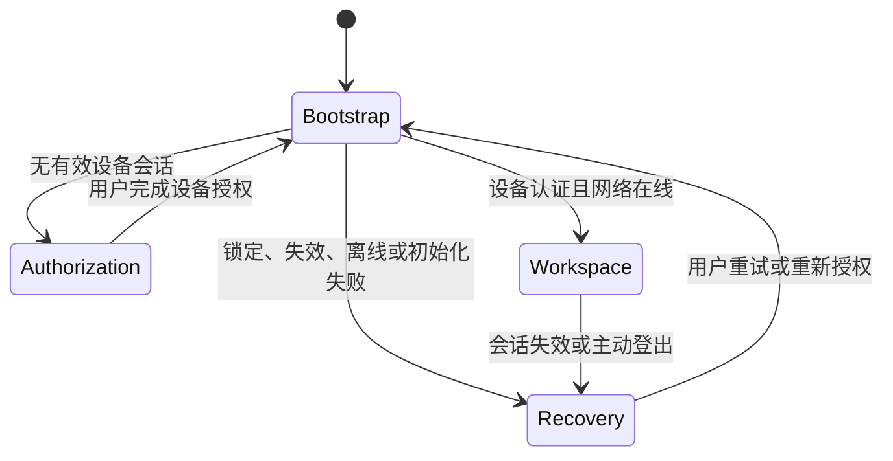
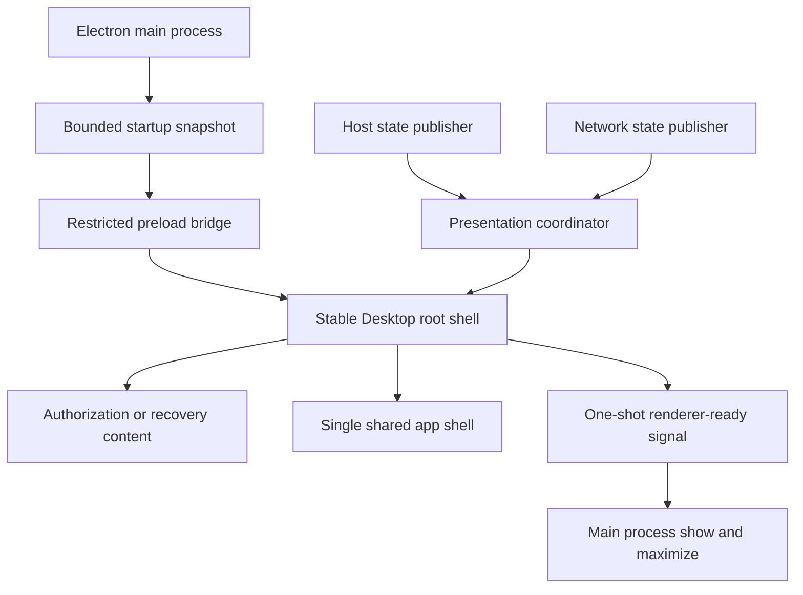

# Desktop 稳定 SPA 根壳与启动闪烁修复计划

## Goal Capsule

- **目标：** Desktop 从进程启动、设备会话恢复到共享业务工作台期间只呈现一个稳定的 SPA 根壳，不再暴露 `starting -> authenticated -> connecting -> online` 连续整页替换造成的闪烁。
- **权威边界：** 保持 `app://` 安全宿主、受信 IPC sender、主进程持有设备凭证和 Web/Desktop 共用唯一 `SharedApp` 的既有架构。
- **执行范围：** Desktop 首屏快照、启动状态协调、根壳渲染、窗口显示时机、聚焦测试与 packaged 正式环境验证。
- **停止条件：** 开发态和 packaged 应用均能稳定呈现未授权页或业务页；启动期间无空白帧、错误状态短暂闪现、主题闪变及 appearance IPC 拒绝日志。
- **非目标：** 不修改正式 API 域名，不重做授权页视觉，不新增 Desktop 专用业务页面，不以固定延时或淡入动画掩盖状态竞争。

---

## Product Contract

### Summary

Desktop 当前是 React SPA，但 `desktop/src/renderer/app.jsx` 在设备状态未稳定时渲染 `HostStatusShell`，认证与网络就绪后又将整棵根组件替换成 `SharedApp`。主窗口在 `ready-to-show` 时显示，而设备凭证恢复、网络连接和主进程状态发布仍可能继续进行，因此用户会看到状态壳连续变化或从状态壳跳到业务壳。

同时，`desktop/src/renderer/main.jsx` 在首屏渲染前调用异步 appearance IPC。该调用早于 renderer sender readiness 开放时会被拒绝，虽然回退为浅色且不阻止渲染，但会增加启动路径的不确定性，并可能在持久化深色主题时产生首屏重绘。

本计划将“SPA”从仅共享业务路由扩展为稳定的 Desktop 顶层呈现契约：单一 React root 始终挂载，启动阶段由明确状态机决定展示启动面、授权面或业务面；窗口只在首个可展示快照与主题均确定后出现。

### Requirements

**首屏稳定性**

- R1. 新启动时不得先显示空白页、错误页或不可操作的中间业务页。
- R2. 无设备会话时直接稳定进入设备授权页，不向用户展示瞬时 `starting` 页面。
- R3. 已有有效设备会话时，凭证恢复和首次网络连接期间维持统一启动面，待业务会话在线后一次性进入 `SharedApp`。
- R4. 凭证锁定、失效、正式 API 不可达或初始化失败时，必须在状态确定后显示对应可操作状态，不得无限停留在启动面。
- R5. 从授权页进入业务页、登出返回授权页、网络中断和重新授权时，不卸载 Desktop 顶层根壳；允许切换内部 stage，但页面尺寸和背景不得闪白。

**主题与窗口**

- R6. 首帧使用持久化主题，不得先按默认浅色渲染后再切换深色。
- R7. 首屏主题不能依赖 sender readiness 尚未建立时的异步 IPC，也不得为修复日志而放宽 `assertTrustedIpcSender`。
- R8. `BrowserWindow` 的 `backgroundColor`、HTML 初始背景和 React 根壳背景必须一致，窗口显示前必须已有非空首帧。

**架构与安全**

- R9. Browser 与 Desktop 继续只装配 `frontend/packages/app-shell` 中的唯一 `SharedApp`，不得复制业务组件、业务状态或路由。
- R10. Renderer 只能获得脱敏、枚举化的首屏快照；设备 token、refresh credential、文件路径和任意 URL 不得进入 renderer 或启动参数。
- R11. 不使用 macOS Keychain、Electron `safeStorage`、Cookie 注入、远程页面加载或通用 renderer fetch。
- R12. 不使用任意固定毫秒延时判断“状态稳定”；就绪必须来自明确状态和事件确认。
- R13. Stage 切换必须保持可访问名称、合理焦点位置和 `aria-live` 反馈；`prefers-reduced-motion` 下不得依赖动画表达状态完成。

### Key Flows

- **F1 新设备：** 主进程读取主题和设备状态，renderer 以同一快照完成首帧，窗口直接显示授权页。
- **F2 已授权设备：** 窗口显示统一启动面；凭证恢复与网络连接完成后，根壳内部一次性进入共享工作台。
- **F3 恢复失败：** 启动协调器收到终态后进入锁定、重授权、离线或 fatal 视图，并提供既有操作。
- **F4 运行时登出：** `SharedApp` 退出业务 stage，稳定返回设备授权 stage，不重新加载 `app://` 文档。
- **F5 主题：** 主进程在创建窗口前读取受限主题值，preload 将其作为同步只读首屏快照暴露；后续主题修改仍使用既有受信 IPC。

### Acceptance Examples

- **AE1：** 给定一个从未授权的独立 production profile，启动 packaged `.app` 后，录屏中首个可见应用帧就是授权页，之前不存在 `starting`、fatal 或白屏帧。
- **AE2：** 给定一个已有有效设备凭证的 profile，启动后只出现启动面和最终工作台两个稳定 stage，不短暂出现授权页。
- **AE3：** 给定正式 API 暂时不可达，Desktop 在有界初始化后显示离线或恢复视图，恢复网络并重试后进入工作台。
- **AE4：** 给定持久化深色主题，冷启动首帧即为深色，日志中不存在 `yuance:appearance-get-theme` 的 `Untrusted renderer IPC sender`。
- **AE5：** 用户退出设备后回到授权页，`app://yuance/` 主文档没有 reload，React root 和 Desktop 根壳保持同一实例。

### Scope Boundaries

- 保留当前授权页和共享工作台的产品文案与业务行为；本轮只调整启动呈现和顶层组合。
- 不把 `starting` 简单删除；它继续作为内部 bootstrap 状态和超时前的安全默认值，但不必直接成为用户可见页面。
- 不通过扩大 sender 白名单解决 appearance IPC 时序问题。
- 不处理共享业务 bundle 超过 500 KB 的构建警告；代码拆包属于后续性能计划。
- 不修改 Web 登录页、设备授权服务端协议或正式部署配置。

---

## Planning Contract

### Key Technical Decisions

- KTD1. **使用显式呈现 stage，而不是直接映射原始状态。** 新增纯函数协调 `bootstrap`、`authorization`、`workspace`、`recovery` 四类 stage，并为 stage 单独计算 `presentable`。初始 `starting` 可以在隐藏窗口内渲染但不可触发 show；`unauthenticated`、终态 recovery，以及 `authenticated + connecting/online` 才是首批可展示状态。认证和网络原始状态仍保留完整语义，但只有协调器决定何时切换可见 stage，避免多个 subscription 独立触发整页替换。
- KTD2. **保持一个 React root 和一个稳定 Desktop 根壳。** `HostStatusShell` 与 `SharedApp` 成为根壳内部的 stage 内容。根壳负责固定背景、最小尺寸、首屏状态和切换边界；不使用路由 reload，也不复制 `SharedApp`。
- KTD3. **首屏快照由主进程在窗口创建前确定。** 主进程读取受限主题值，并将 `theme` 与脱敏 bootstrap 状态通过固定、枚举化的 preload 启动快照提供给 renderer。快照不包含 credential、endpoint 或用户数据。后续动态状态继续走现有单向 publisher 和受信 IPC command。
- KTD4. **窗口显示以可展示首帧为准。** `ready-to-show` 只表示 Chromium 可绘制，不代表应用状态可展示。renderer 在根壳提交首个 `presentable` stage 后发送固定、单次、无 payload 的 readiness 信号，主进程再 maximize/show。该信号使用专用窄验证器，只接受当前 `BrowserWindow` 的主 frame、固定 `app://` URL、当前导航 generation 和未消费状态；它不复用尚未完成的通用 renderer readiness，也不扩大其他 IPC handler 的 sender 权限。异常路径同样必须提交 recovery stage，防止隐藏窗口永久等待。
- KTD5. **不使用展示延迟作为状态判定。** 凭证恢复和网络初始化必须有操作级 deadline，超限后由主进程发布明确 recovery/fatal 终态；禁止用最短 loading 时长、CSS 动画或仅为视觉效果设置的 timer 决定何时进入业务 stage。
- KTD6. **过渡只用于已稳定 stage 之间的局部视觉连续性。** 如需 opacity 过渡，只能发生在内容层且遵循 `prefers-reduced-motion`；正确性测试必须在关闭动画时仍通过，动画不能掩盖错误状态。

### High-Level Technical Design

首屏快照只解决窗口首次显示前必须同步知道的信息；它不是第二套状态源。publisher 的最新状态在 renderer 初始化后覆盖快照，协调器按单调规则处理过期或重复事件。首次进入 `workspace` 后，短暂 `connecting` 不应卸载共享业务壳；只有登出、会话失效或不可恢复认证终态才离开业务 stage。网络短暂离线由共享壳现有反馈或受控恢复状态处理，具体以既有 network coordinator 语义为准。

### Sequencing

1. 先用纯状态转换测试固定可见 stage，防止直接修改 UI 后靠截图猜测时序。
2. 再建立首屏主题和 bootstrap 快照，消除 renderer 首次异步 IPC。
3. 然后改造稳定根壳和一次性窗口 readiness。
4. 最后执行开发态、独立 profile、packaged 正式 API 和降级场景验证。

### Risks And Dependencies

- packaged profile 可能已有生产设备凭证，验收必须同时使用独立空 profile 和受控已授权 profile，不能只看当前用户目录。
- Electron `ready-to-show`、renderer readiness 与主进程异步初始化存在竞态；测试必须覆盖事件先后顺序互换和重复事件。
- 如果 `SharedApp` 首次业务数据加载仍产生内部布局跳动，应与“顶层壳闪烁”分开记录；本计划只保证根壳和 stage 不错误替换。
- 窗口隐藏期间发生 fatal 时仍必须显示 recovery 内容，不能因为等待成功路径而形成无窗口故障。

---

## Implementation Units

### U1. 固化 Desktop 呈现状态机

- **Goal：** 将认证与网络组合状态映射为明确、可测试的可见 stage。
- **Requirements：** R1-R5、R12。
- **Files：** 新增 `desktop/src/renderer/platform/presentation-state.js`、新增 `desktop/test/renderer-presentation-state.test.mjs`，调整 `desktop/src/renderer/app.jsx`。
- **Approach：** 建立纯函数和最小状态协调器，定义首次 bootstrap、授权、恢复、workspace 保持、登出和失效规则；重复状态不得引起 stage 重新挂载。
- **Test Scenarios：**
  - `starting + idle/connecting` 保持不可展示的 bootstrap。
  - `unauthenticated` 直接进入 authorization。
  - `authenticated + connecting` 首次启动进入可展示的 bootstrap，`online` 后进入 workspace。
  - 已进入 workspace 后的短暂 offline/connecting 不错误显示授权页。
  - locked、reauthorization、fatal 和 logout 进入正确 recovery/authorization stage。
  - 初始化 deadline 由主进程发布终态，协调器不自行计时且不会永久保持不可展示状态。
  - 重复及乱序 publisher 事件不产生无效 stage 往返。
- **Verification：** `node --test` 通过仓库既有 TSX/renderer 测试入口执行；`desktop/test/renderer-composition.test.mjs` 保持通过。

### U2. 建立受限同步首屏快照

- **Goal：** 在 React 首帧前同步获得主题和脱敏 bootstrap 状态，移除过早 appearance IPC。
- **Requirements：** R6-R8、R10-R11。
- **Files：** `desktop/src/main.mjs`、`desktop/src/preload.cjs`、`desktop/src/preferences/appearance-store.mjs`、`desktop/src/ipc/host-state.mjs`、`desktop/test/preload-contract.test.mjs`、`desktop/test/appearance-store.test.mjs`、`desktop/test/config.test.mjs`。
- **Approach：** 主进程在创建窗口前读取并规范化主题，将固定枚举快照交给 preload；bridge 只同步读取不可变快照。动态主题写入保留现有 IPC。禁止把 URL、凭证或任意对象并入快照。
- **Test Scenarios：**
  - 浅色、深色、缺失和损坏偏好得到受限默认值。
  - preload 快照不可变，字段白名单和 schema version 固定。
  - renderer 初始主题不调用 `appearance.getTheme()`。
  - 恶意启动值、额外字段和非枚举主题不能进入 bridge。
  - 现有 sender policy、CSP、Keychain/`safeStorage` 禁令测试保持通过。
- **Verification：** `npm --prefix desktop run check:main`、preload/appearance 聚焦测试和凭证扫描通过。

### U3. 稳定根壳与窗口可见性握手

- **Goal：** 保持单一根壳挂载，并在首个可展示 stage 提交后再显示窗口。
- **Requirements：** R1-R9、R12-R13。
- **Files：** `desktop/src/renderer/app.jsx`、`desktop/src/renderer/main.jsx`、`desktop/src/renderer/app.css`、`frontend/packages/ui/src/host-status-shell.jsx`（仅在需要复用 bootstrap 语义时）、`desktop/src/main.mjs`、`desktop/src/ipc/sender-policy.mjs`、新增或扩展 `desktop/test/renderer-composition.test.mjs`、`desktop/test/app-protocol-electron-integration.test.mjs`。
- **Approach：** 引入稳定 Desktop root shell，stage 内容在内部切换；增加固定、单次、无 payload 的 renderer-ready 通知。主进程只接受当前主框架受信 sender，并保证 recovery 首帧也能显示窗口。不得使用远程 URL、reload 或 timer gate。
- **Test Scenarios：**
  - React root 与 Desktop root shell 在 authorization、workspace、recovery 切换中保持挂载。
  - 首个 `presentable` stage 前窗口不显示，提交后只 show 一次。
  - readiness 重复、子 frame、错误 sender 和携带 payload 均被拒绝或忽略。
  - readiness 不能调用或放宽通用业务 IPC sender policy；导航 generation 变化后旧 readiness 失效。
  - fatal/recovery 路径不会留下永久隐藏窗口。
  - `app://` reload、恶意导航、permission 和 CSP 既有 smoke 不回归。
  - `prefers-reduced-motion` 下不存在依赖动画的可见性逻辑。
  - authorization、workspace 和 recovery 切换后，焦点进入对应主标题或首个可操作控件，状态变化由现有 live region 可感知。
- **Verification：** renderer check、Electron integration 和 app protocol smoke 通过。

### U4. Packaged 正式环境启动回归

- **Goal：** 用可重放证据证明开发态与正式 packaged 应用均无顶层闪烁。
- **Requirements：** R1-R13、AE1-AE5。
- **Files：** `desktop/scripts/smoke-app-protocol.mjs`、`desktop/scripts/smoke-desktop-feature-parity.mjs`、对应 verifier 与 integration tests；必要时新增 `.artifacts` 输出定义，但不提交运行产物。
- **Approach：** 扩展 smoke 记录首屏 stage 序列、主文档导航次数、renderer readiness 次数和最终稳定状态。macOS 使用 ad-hoc packaged `.app` 连接 `https://yuance.quanxinfu.com`，同时保留 loopback 可控场景覆盖失败与恢复；Windows/Linux 由 tag release workflow 或现有 Desktop Security 矩阵验证窗口契约和测试，不要求签名。
- **Test Scenarios：**
  - 独立空 profile 冷启动直接稳定落在 authorization。
  - 已授权 profile 恢复到 workspace，过程中不出现 authorization/fatal。
  - 正式 API 健康、enrollment 和授权入口可达。
  - API 断开后进入有界 recovery，恢复后可重试。
  - light/dark 各执行一次冷启动，无主题闪变和 appearance sender 拒绝。
  - 登出、重授权和应用重启均不增加主文档 reload。
- **Verification：** packaged bundle verifier、app protocol smoke、Desktop feature parity smoke、截图或逐帧录屏证据及凭证扫描通过。

---

## Verification Contract

| Gate | Command / Method | Covers | Done Signal |
|---|---|---|---|
| Renderer source | `npm --prefix desktop run check:renderer` | U1-U3 | TypeScript、ESLint、renderer production build 全部通过 |
| Desktop main/security | `npm --prefix desktop run check:main` | U2-U3 | 主进程、preload、IPC 与协议静态检查通过 |
| Focused tests | `npm --prefix desktop test` | U1-U4 | macOS 可执行项全通过，仅保留已登记平台跳过 |
| Shared frontend | `npm --prefix frontend run check` | U3 | `SharedApp`、UI 和 package boundary 无回归 |
| Full frontend | `npm run check:frontend` | U1-U3 | Web、共享 packages 与 Desktop renderer 全部通过 |
| Packaged app | `npm --prefix desktop run pack:dir` | U4 | ad-hoc `元策.app` 构建成功 |
| Bundle security | `npm --prefix desktop run verify:bundle` | U2-U4 | ASAR、CSP、资源 manifest、native 模块和凭证扫描通过 |
| App protocol | `npm --prefix desktop run smoke:app-protocol` | U3-U4 | SPA route/reload、安全导航及首屏 readiness 通过 |
| Production manual | packaged `.app` + `https://yuance.quanxinfu.com` | U4 | AE1-AE5 有截图/录屏和日志证据 |

验证期间产生的 `.artifacts/`、`test-results/`、临时 profile、截图和录屏均保持为本地证据，不纳入版本控制。

---

## Definition of Done

- [ ] U1-U4 均有对应实现、聚焦测试和可重放验证证据。
- [ ] Desktop 只有一个 React root 和稳定顶层根壳；`SharedApp` 仍是唯一业务组件树。
- [ ] 空 profile、有效凭证、锁定/失效、离线和 fatal 五类启动路径均进入正确稳定且可访问的 stage。
- [ ] packaged 冷启动首个可见帧非空，且不会短暂展示错误授权状态或业务状态。
- [ ] 深色与浅色首帧正确，启动日志不存在 appearance sender readiness 拒绝。
- [ ] 主窗口 readiness 只接受受信主 frame，异常路径不会永久隐藏窗口。
- [ ] 未新增固定展示延时、远程 renderer、任意 URL、renderer credential 或安全策略放宽。
- [ ] macOS ad-hoc packaged 正式环境验收通过；Windows/Linux 现有测试矩阵保持通过。
- [ ] `git diff --check`、全量相关检查和凭证扫描通过。
- [ ] 删除实施过程中的实验代码、临时日志和废弃分支，不提交 `.artifacts/` 或 `test-results/`。
- [ ] 重要启动时序决策和可复用排查方法在完成后写入 `docs/reviews/`；若形成通用模式，再沉淀到 `docs/solutions/`。
