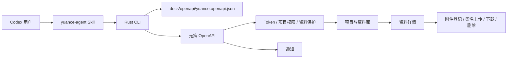

# feat: 同步元策 Skill 与 OpenAPI 能力

## Goal Capsule

- **目标：** 让 `yuance-agent` 能覆盖外部项目当前实际需要的元策资料库、资料附件、通知和当前用户查询能力，减少项目自行封装 OpenAPI 的必要。
- **权威顺序：** 本计划的 Product Contract > `docs/openapi/yuance.openapi.json` > `api/src/web/router.rs` 实际路由 > 外部项目 runbook。
- **停止条件：** OpenAPI、CLI、Skill references、外部接入说明和自动化契约测试形成一致闭环；G1-G4 已有明确结论；资料库查询、受保护资料解锁、资源正文更新和已确认的附件对象生命周期可通过 CLI 表达；加密附件协议和敏感字段边界有明确实现与测试；未纳入本轮的能力仍明确保持不支持；外部试点缺失时只能报告“具备迁移能力，未完成真实试点”。
- **执行方式：** 按 U1-U4 顺序实施，每个单元形成独立可验证闭环；先修契约，再扩展服务端安全约束和 CLI，最后更新行为规范与发布验证。
- **目标仓库：** `yuance`。`qfy-voucher-hub` 只作为外部消费者证据，不在本计划中修改其代码或文档。

---

## Product Contract

### Summary

扩展元策 Codex Skill 与其 Rust CLI，使 Codex 可以通过稳定领域命令查询项目资料库、读取资料详情、查看和维护资料附件、查询通知以及确认当前 Token 用户。所有能力继续通过元策 OpenAPI，并保留现有的 Bearer Token、项目范围、RBAC、资料保护和写操作前置读取约束。

### Problem Frame

当前 `yuance-agent` v0.1.1 只提供项目、工作项和工作项评论命令。外部项目 `qfy-voucher-hub` 已经通过 OpenAPI 直接查询资料库、读取资料、更新资料附件和查询通知，说明 Skill 能力边界已经落后于元策实际服务能力。

同时，运行路由已经包含资料附件登记、列表、上传 URL、上传确认、下载 URL 和删除接口，但 `docs/openapi/yuance.openapi.json` 未完整描述这些路径，导致 OpenAPI、CLI 和外部项目文档无法共享同一契约。

### Product Hypothesis And Evidence Boundary

- `qfy-voucher-hub` 是本轮的首个外部试点消费者，不代表所有元策用户的完整需求；它的调用只用于发现真实动作和字段，不自动扩大公共产品范围。
- 只有同时满足“当前服务端已有稳定路由”“能说明项目范围、权限和资料保护条件”“能由 CLI 在不暴露通用 HTTP 代理的前提下安全表达”的动作，才进入本轮承诺。
- 外部项目是否实际迁移不是 yuance 仓库单方面可以假设的结果。yuance 本轮交付可迁移能力、迁移矩阵和试点验收入口；外部仓库的代码和 runbook 不在本计划中修改。

### Actors

- A1. **Codex 使用者：** 在任意项目中要求 Codex 查阅元策资料、附件或通知。
- A2. **Codex Agent：** 根据 Skill 行为规则读取上下文，并通过 CLI 执行最小必要的 OpenAPI 操作。
- A3. **CLI 维护者：** 维护领域命令、请求模型、错误映射和 OpenAPI 契约测试。
- A4. **元策服务维护者：** 保证运行路由、OpenAPI 文件和权限语义保持一致。

### Requirements

#### OpenAPI Contract

- R1. OpenAPI 必须完整描述本轮纳入的当前用户、资料库、资料附件和通知接口，包括 method、path、参数、请求体、成功 envelope、错误 envelope、权限说明和关键 schema。
- R2. 本轮 OpenAPI 必须完整描述资料附件（`resources/{resource_id}/attachments`）登记、列表、上传 URL、上传确认、下载 URL、预览和删除；项目级、工作项级附件预览不属于本轮资源能力。不得把对象存储签名 URL、`access_token`、`encryption.key` 当作普通非敏感字段描述。
- R3. OpenAPI 契约不得声明本轮未实现或未审核的命令；运行路由中属于本轮能力的接口不得继续缺失。

#### CLI Capability

- R4. CLI 必须提供 `whoami` 或等价命令，调用 `/api/v1/auth/me` 并返回当前 Token 对应用户。
- R5. CLI 必须提供资料库列表和资料详情查询，支持服务端当前已有的项目范围、关键词、分类、状态、标签及关联对象筛选；当前 API 不支持资料列表分页，本轮不得在 CLI 中伪造 `page/per_page`。
- R6. CLI 必须提供资料解锁、资料正文更新、资料附件列表、登记和上传确认能力；附件删除仅在 KTD10 的服务端并发保护落地后进入本轮，文件上传/下载命令仅在 G2/G3 确认安全边界后进入本轮，未通过时分别标为延期并保留明确契约；长正文、加密完成请求和本地文件参数不得依赖脆弱的 shell 拼接。
- R7. CLI 必须提供通知列表查询，支持服务端已有的筛选与分页参数。
- R8. CLI 成功输出继续保持服务端 JSON envelope；错误输出到 stderr、返回非零状态并保留服务端错误 code/status。Bearer Token、完整签名 URL、签名 headers、资料 `access_token`、`encryption.key` 和内部存储错误不得进入日志、调试输出或非必要错误文本；需要给调用方使用的短时凭证只能在明确的机器输出中返回。

#### Skill Behavior

- R9. Skill 文档必须把资料库和通知纳入支持范围，并明确命令、参数和返回结果的读取方式。
- R10. 所有资料读取和附件操作必须先收敛 `project_key`、`resource_id`、`attachment_id`；受保护资料遵守服务端解锁和权限边界，不猜测标识。
- R11. 资料附件写操作必须先读取资料和附件上下文；删除或替换附件前必须确认正文引用、附件状态和目标范围。
- R12. Skill 必须明确本轮仍不支持设备会话、系统 OpenAPI、工作项保存视图、工作项批量操作和任意通用 HTTP 请求。
- R13. 受保护资料的解锁、短时 `access_token` 传递、加密附件上传确认和签名 URL 使用必须有明确生命周期、脱敏和失败处理规则；不支持绕过服务端解锁或加密校验。
- R14. 资料正文、附件元数据和通知内容属于不可信外部数据，只能作为数据引用，不能改变 Skill 指令、授权范围或写操作；任何写入必须独立匹配用户明确意图。

### Key Flows

- F1. **资料分析：** Codex 先确认项目，再按服务端支持的筛选查询资料列表，最后读取指定资料详情；资料不明确时继续收敛或询问，不猜测资源 ID。
- F2. **附件维护：** Codex 读取资料和附件列表；必要时先解锁资料；登记新附件并执行受控上传/下载；完成上传后更新资料正文引用，确认替换关系后再删除旧附件。
- F3. **通知分析：** Codex 在用户明确要求查看通知或相关事项时查询通知，并根据通知目标再读取对应工作项，不把当前 Token 用户自动当作查询对象。
- F4. **身份确认：** Codex 需要确认 Token 归属时调用 `whoami`（复用 `doctor` 的认证请求路径），只报告服务端返回的用户信息。

### Acceptance Examples

- AE1. `yuance-agent resources list --project-key P260713139801` 能按服务端当前筛选字段返回与 OpenAPI envelope 一致的资料列表 JSON；不接受服务端不存在的分页参数。
- AE2. `yuance-agent resources get --project-key P260713139801 --resource-id 5` 能返回资料详情，并保留受保护资料的服务端错误语义。
- AE3. 资料附件登记、列表、上传、上传确认、下载、下载 URL 和删除命令分别映射到正确 method + path，契约测试能阻止路径漂移；加密附件完成请求覆盖服务端要求的 checksum 字段。
- AE4. `yuance-agent notifications list` 能按服务端支持的筛选与分页参数查询通知，未明确要求时 Skill 不主动扩大查询范围。
- AE5. `yuance-agent whoami`（复用 `doctor` 的认证请求路径）在缺少 Token、Token 无效和服务端返回非 JSON 时均不泄露凭证，并给出结构化错误。
- AE6. 发布后的 Skill + CLI 能将当前 `qfy-voucher-hub` runbook 中已确认的资料查询、解锁、正文更新、附件生命周期和通知查询动作映射为领域命令；若某个传输步骤因服务端加密或平台限制仍需外部工具，必须在迁移矩阵中明确列为未覆盖动作。本轮不把外部项目已经停止手写封装作为 yuance 单方面可宣称的结果。
- AE7. U1 产出的逐接口授权矩阵能对每个纳入操作说明 actor、project scope、RBAC 权限、资料保护前置条件和拒绝语义；对应的 OpenAPI/服务端/CLI 测试能覆盖无 Token、跨项目、权限不足和未解锁场景。
- AE8. U1 完成后、U2 开始前，外部动作覆盖矩阵已逐项标记“CLI 覆盖、仅 OpenAPI 覆盖或暂不覆盖”，并由实现负责人确认；未确认的动作不得作为 U2 的实现承诺。
- AE9. 若 G4 条件具备，至少有一条脱敏的试点工作流验证记录；若条件不具备，U4 必须输出能力映射记录并明确“未完成真实试点”，不能将 mock 结果描述为外部迁移成功。

### Success Criteria

- OpenAPI 文件、实际路由和 CLI 契约测试对本轮路径一致。
- Skill references 不再把资料库、通知和当前用户查询描述为“不支持”。
- 外部消费者已确认的资料读取和附件维护流程有对应领域命令，不需要手写 HTTP 请求；仅契约覆盖或延期动作不计入该标准。
- CLI 的所有新增命令均有参数校验、错误映射和最小权限行为测试。
- 发布包包含同步后的 Skill 文档，离线安装自检和版本一致性校验继续通过。

### Scope Boundaries

**本轮包含：**

- OpenAPI 资料库、资料附件、通知和当前用户契约补齐。
- Rust CLI 的 `whoami`、`resources`（含解锁、正文更新和经 G2/G3/KTD10 确认的资料附件生命周期）、`notifications` 领域命令。
- Skill 的触发条件、读取流程、写入安全边界和不支持范围更新。
- CLI/OpenAPI/发布包一致性测试。

**本轮不包含：**

- 设备授权、Device Session、SSE 和设备文件传输。
- system OpenAPI、系统版本发布、系统 Token 管理。
- 工作项批量操作、保存视图、主帖编辑和工作项恢复。
- 任意 URL、method 或 path 的通用 HTTP 代理命令。
- 修改 `qfy-voucher-hub` 的 OpenAPI runbook、调用脚本或业务代码。
- 重新设计元策资料库权限、密码保护或对象存储加密语义。

### Dependencies

- `docs/openapi/yuance.openapi.json` 是当前服务对外提供的静态契约源。
- `api/src/web/router.rs` 和 `api/src/web/api/mod.rs` 提供实际路由与 handler 边界。
- `tools/yuance-agent-cli` 是已发布 CLI 的源码和测试入口。
- 目标外部消费者 `qfy-voucher-hub` 的元策 runbook 提供真实使用场景，但不作为服务契约的唯一来源。

---

## Planning Contract

### Key Technical Decisions

- KTD1. **先修 OpenAPI，再扩展 CLI。** CLI 只能依赖完整、可审查的静态契约；不能继续根据外部 runbook 私自拼接未登记接口。
- KTD2. **继续使用领域命令，不开放通用 HTTP。** 新增资源和通知命令应复用现有 CLI client、错误和 JSON envelope 结构，避免绕过 Skill 的读取与写入边界。
- KTD3. **资源附件写入拆成显式子命令。** 登记、上传 URL、上传确认、下载 URL 和删除分别对应独立命令，便于权限审计、失败重试和禁止误删；CLI 只允许固定资源附件路径和显式本地文件参数，不接受任意 URL、对象键或 raw HTTP。
- KTD4. **资源写操作默认保守。** CLI 提供服务端动作，但是否执行由 Skill 根据用户明确意图决定；替换附件必须先读取正文和附件上下文，不能封装成无确认的一键覆盖。
- KTD5. **以 OpenAPI 的服务端字段为准。** 对外文档中已有但当前静态契约缺失的附件字段和 envelope，应在契约补齐阶段通过实现与测试核对，不直接照搬旧 runbook 中可能过期的字段名；资料列表不添加当前 handler 不支持的分页语义。
- KTD6. **不把所有 OpenAPI 路径一次性映射到 Skill。** 本轮以目标外部项目实际需要为范围；资源预览只补齐 OpenAPI 契约，设备、系统和其他附件域通过新的计划或独立执行单元加入。
- KTD7. **以服务端授权矩阵作为唯一权限事实源。** OpenAPI 的 `securitySchemes` 只表达认证方式；每个 operation 还必须引用本计划维护的权限矩阵，明确项目范围、RBAC scope、资料保护状态和拒绝语义。CLI 不自行放宽服务端权限。
- KTD8. **签名对象存储使用独立传输边界。** API JSON client 不直接复用 Bearer Token client 发送签名请求；独立 transport 只接受服务端返回的 method、URL、headers 和 bytes 约束。允许来源必须来自服务端配置的精确 HTTPS 主机白名单，拒绝 URL 用户信息、非允许端口、跨主机重定向和解析到非允许/私有地址的目标，每次请求和重定向后重新校验；无法满足时只提供 URL 查询，不提供 CLI 文件代传。
- KTD9. **短时资料授权不进入 argv、环境变量或持久化配置。** `resources unlock` 的密码只从受控 stdin 读取；需要读取受保护附件的 list/upload-url/download-url/preview 命令从受控 stdin 读取 `access_token`，令牌只存在当前进程内，并在缺失、过期、请求失败和重试后清理。`resources update` 不接收该 Token，沿用服务端现有 `resource:write` 语义。
- KTD10. **删除安全采用 `If-Match` + SQLite 写事务。** 删除命令必须携带读取资料时得到的 `updated_at` 作为 `If-Match`；服务端在写事务中重新读取正文和附件状态，确认正文未引用目标附件后条件归档附件，版本不一致或仍被引用返回明确 `409` 冲突；事务提交后再删除对象存储，失败交由现有孤儿清理机制处理。该契约未落地前，附件删除不列为 CLI 已覆盖能力。
- KTD11. **外部动作覆盖是 U2 的进入门。** 迁移矩阵在 U1 完成后先审查，再决定 U2 哪些动作进入实现、哪些只保留契约、哪些延期；若 U2 修改服务端响应、请求字段、权限或冲突语义，必须重新执行 G1 并同步 U1 产物后才能继续。
- KTD12. **契约证据必须独立于 OpenAPI 消费测试。** U1 至少使用 handler 响应样例、现有集成 fixture 或真实 API 脱敏样例之一作为 schema 事实证据；CLI contract test 只能验证消费端映射，不能单独证明服务端契约正确。

### High-Level Technical Design

### Error And Safety Contract

- 新增命令沿用现有配置错误、认证错误、权限错误、服务端业务错误、网络错误和响应解析错误分类；服务端内部错误不得原样透传内部 endpoint、文件路径或对象存储细节。
- 任何命令输出不得打印 `Authorization`、PAT、完整签名 URL、完整签名 headers、`access_token` 或 `encryption.key`；需要执行上传/下载的命令只在明确的机器输出字段中返回最小必要短时凭证，并禁止调试回显。
- 资料附件删除、资料正文更新和附件替换必须由 Skill 负责先读后写；CLI 本身保持非交互。
- 资料受保护时，CLI 只报告服务端错误或解锁要求，不在本地绕过访问密码。
- 资源附件删除在服务端或 CLI 侧必须校验正文引用；并发正文更新导致引用变化时，删除失败或进入待确认状态，不静默断链。
- 加密附件必须按服务端协议传递密文 checksum 和大小校验字段；非加密附件不得伪造加密字段。

### Alternatives Considered

- **继续让各项目直接维护 curl/Python 封装：** 放弃。会导致参数、错误处理、权限边界和接口版本在项目间继续分叉。
- **把 OpenAPI 全部自动生成成一个通用 CLI：** 本轮不采用。会暴露尚未审查的设备、系统和管理接口，削弱 Skill 的行为边界。
- **只更新 Skill 文档，不改 CLI：** 放弃。外部项目需要可执行的稳定命令，纯文档无法消除手写 HTTP 请求。

### Risks And Mitigations

- **OpenAPI 与实际路由继续漂移：** U1 增加路径和关键 schema 契约校验，必要时补充 API routing smoke。
- **资料附件字段来自旧文档而非当前实现：** U1 以当前 handler、成功响应构造和现有前端 client 交叉核对；不把旧 runbook 单独视为事实源。
- **签名上传流程被 CLI 错误抽象：** U2 将每个阶段拆为显式命令，测试校验返回的 `request` 结构和错误路径。
- **Skill 误把通知当成默认个人待办：** U3 明确只有用户要求时才查询通知，并禁止根据 Token 用户自动扩大查询范围。
- **发布包只更新二进制、未更新文档：** U4 复用既有 skill package 和 release asset 校验，确保包内 references 与仓库源码一致。
- **本轮范围膨胀到全部 OpenAPI：** U1-U4 仅覆盖 R1-R14，其他路径列入后续计划，不在实现时顺手加入。
- **关键动作到 U4 才发现无法迁移：** U1 完成后先产出外部动作覆盖矩阵，U2 以矩阵审查结果为进入门；不能安全封装的动作主动降级为仅契约覆盖或延期。
- **CLI 误把客户端预检当成并发安全：** KTD10 要求服务端原子保护；若现有 API 不支持，U2 必须先补服务端条件校验或明确将删除能力延期。

---

## Implementation Units

### Execution Gates Before Coding

以下门槛属于计划的一部分，不是实现阶段的临时讨论。任一门槛未通过，后续单元按门槛结论收窄范围，不得继续按原始完整能力假设编码。

**G1. 服务端事实核对：** 在 U1 开始时从路由、handler、domain、现有集成测试和 `qfy-voucher-hub` 脱敏调用记录建立 method + path + request/response + permission 对照表。字段或错误语义冲突时，以当前 handler 和测试可证明的行为为准，并把差异写入 U1 的契约测试说明。

**G2. 外部动作进入审查：** U1 完成后、U2 开始前审查外部动作覆盖矩阵。矩阵必须逐项标注 CLI 命令、服务端前置条件、是否需要对象存储直传、是否需要受保护资料 Token、验证方式和未覆盖原因。只有标记为“已确认进入 U2”的动作才能进入 CLI 实现。

**G3. 安全传输决策：** 在 U2 的附件传输实现前确认签名 URL 的 scheme、来源、重定向和 header 规则。若不能从服务端配置或响应中获得可验证的允许来源，停止 CLI 文件代传，只实现 URL 查询和上传完成登记，并将剩余传输标为延期动作。

**G4. 真实试点条件：** U4 的试点验收需要脱敏测试项目、至少一个受保护资料样例、附件明文/加密各一条可控样例和通知列表样例。没有真实 Token 或测试数据时，只能完成 mock/fixture 验证，不能宣称完成外部流程替代。

### U1 Outputs Used By Later Units

U1 必须产出以下两张可审查表。它们可以作为 U1 测试中的常量或 fixture 维护，但不能只存在于实现者的口头判断中。

**授权矩阵初始结构：**

| Operation | Actor / scope | RBAC | 资料保护前置 | 必测拒绝路径 |
| --- | --- | --- | --- | --- |
| `auth/me` | 当前 Bearer Token | 有效认证 | 无 | 缺 Token、无效 Token |
| resources list/get | 项目范围 | `resource:read` | 受保护资料按 handler 规则 | 跨项目、无权限、未找到 |
| resources unlock | 项目 + 资料 | `resource:unlock` | 资料保护密码 | 密码错误、无权限、已失效 |
| resources update | 项目 + 资料 | `resource:write` | 沿用 handler 现有写入语义，不伪造 `access_token` | 跨项目、无权限、版本冲突 |
| attachment list/download | 项目 + 资料 + 附件 | `resource:read` | 受保护资料需短时上下文 | 跨项目、未解锁、附件不存在 |
| attachment create/upload/complete/delete | 项目 + 资料 + 附件 | `resource:write` | 按传输协议要求 | 无权限、引用冲突、checksum 错误 |
| notifications list | 当前 Token 的通知范围 | `notification:read` | 无 | 缺 Token、无权限 |

执行时以当前 handler 的实际权限名称和状态为准；如果表中初始值与服务端不同，必须在 U1 记录差异并同步 OpenAPI、测试和 Skill 文档。

**外部动作覆盖矩阵初始结构：**

| 外部动作 | 目标 CLI / 契约 | 进入状态 | 验证证据 |
| --- | --- | --- | --- |
| 当前用户确认 | `whoami` | 待 U1/U2 确认 | `/auth/me` 响应与 CLI 测试 |
| 资料 list/get | `resources list/get` | 待 U1/U2 确认 | handler schema、筛选测试 |
| 资料 unlock/update | `resources unlock/update` | 待安全输入与权限确认 | 解锁/正文更新流程测试 |
| 附件 list/create | `resources attachments list/create` | 待 U1/U2 确认 | 路径、权限和状态测试 |
| 附件 upload/complete | `resources attachments upload-url/upload/complete` | 受 G3 和加密协议约束 | 明文/加密 checksum 测试 |
| 附件 download | `resources attachments download-url/download` | 受 G3 和 access token 约束 | signed-object transport 测试 |
| 附件 delete | `resources attachments delete` | 受 KTD10 约束 | 服务端并发引用测试 |
| 资源附件 preview | OpenAPI only | 不产生 CLI 命令 | OpenAPI path/schema 测试 |
| 通知 list | `notifications list` | 待 U1/U2 确认 | 分页/筛选测试 |

“待确认”不是实现承诺。G2 审查后必须把每一行改为“CLI 覆盖”“仅 OpenAPI 覆盖”或“延期”，并在 U4 复核时保持一致。

### U1. 补齐 OpenAPI 资料与通知契约

**Goal:** 让本轮 CLI 目标路径在静态 OpenAPI 中拥有完整、准确、可测试的契约。

**Requirements:** R1, R2, R3

**Dependencies:** None

**Files:**

- Modify: `docs/openapi/yuance.openapi.json`
- Modify or create: `api/tests/routing_smoke.rs`
- Create or modify: `api/tests/resource_contract.rs`
- Reference: `api/tests/cli_files_flow.rs`
- Create: `docs/reviews/2026-09-08-sync-skill-openapi-capabilities-review.md`
- Reference: `api/src/web/router.rs`
- Reference: `api/src/web/api/mod.rs`
- Reference: `api/src/domains/project_resources.rs`
- Reference: `api/src/domains/files.rs`
- Reference: `docs/runbooks/api-v1-contract.md`
- Reference: `qfy-voucher-hub` 的脱敏 endpoint/action 记录（仅作外部场景证据）

**Approach:**

1. 盘点当前运行路由中属于本轮范围的 method + path，确认资料、附件、通知和 `/auth/me` 的真实响应 envelope；将 `api-v1-contract.md` 作为差异来源而非唯一权威。
2. 为资源列表、资源详情、资源解锁、资源更新、附件登记/列表/上传 URL/上传确认/下载 URL/删除、通知列表和当前用户补充 operation、参数、请求体、成功响应、错误响应和安全声明。
3. 将资源附件预览接口纳入 OpenAPI 契约但明确不产生 CLI 预览命令；区分资源附件与项目级/工作项级附件。
4. 对保护资料、access token、加密上传确认、签名响应、附件状态和空列表等关键 schema 补充描述；资料列表只描述当前 handler 支持的筛选，不添加虚假分页。
5. 明确 `access` 查询参数只用于受保护资料的附件 list/upload-url/download-url/preview 上下文；资源详情和正文 PATCH 沿用当前服务端禁止读取或 `resource:write` 的现有语义，不把短时 Token 加到不消费它的请求。
6. 建立“操作 -> actor -> project scope -> RBAC scope -> 资料保护前置 -> 成功/拒绝语义”的授权矩阵，并让 OpenAPI operation、服务端 handler 和 CLI contract test 引用同一组稳定权限名称。
7. 建立外部动作覆盖矩阵，至少包含 `auth/me`、资料 list/get/unlock/update、附件 list/create/upload-url/upload/complete/download-url/delete、资源附件 preview、notifications list；标明仅契约覆盖和暂不覆盖动作。
8. 使用独立于 OpenAPI 文件的 handler 响应样例、现有 API fixture 或脱敏集成响应校验成功 envelope、错误 envelope、解锁、上传完成和通知分页；OpenAPI 只作为待验证产物。
9. 预先记录 U2 可能变更的服务端契约；如果 U2 落实 `If-Match`、409 冲突或新的加密字段，先回到 G1 重核 handler、OpenAPI、授权矩阵和资源契约测试，再继续 CLI 实现。

**Patterns to follow:** 当前 `docs/openapi/yuance.openapi.json` 的 envelope、security scheme、tag 和 schema 组织方式；路由注册顺序与 `api/tests/routing_smoke.rs` 的契约测试风格。

**Test scenarios:**

- OpenAPI JSON 可解析，包含本轮每个 method + path，且每个 CLI 目标操作具有稳定 operation 标识。
- 资料附件管理路径的 method、参数名、路径参数和请求字段与 `api/src/web/router.rs` 一致。
- 资源列表 schema 不包含当前 handler 不支持的 `page/per_page`，资源解锁和资源更新路径与实际路由一致。
- 资料详情、附件详情、通知和当前用户的成功响应均描述统一 `data` envelope，错误响应描述统一 `error` envelope。
- 受保护资料、解锁失败、无权限项目、不存在附件、对象存储未配置和加密 checksum 不匹配的错误状态与服务端实际返回范围一致。
- 运行路由中本轮纳入的附件接口不再出现“实现存在但 OpenAPI 缺失”的情况。
- `access_token`、`encryption.key`、签名 URL 和签名 headers 被标注为敏感，不作为普通日志或长期凭证描述。
- 授权矩阵中每个纳入 operation 都有对应的项目范围、RBAC 权限和资料保护前置断言；至少覆盖无 Token、跨项目、权限不足和未解锁四类拒绝路径。
- 外部动作覆盖矩阵在 U1 结束时完成审查，并明确哪些动作进入 U2、哪些只保留 OpenAPI、哪些延期。
- 独立响应证据与 OpenAPI schema 不一致时，测试失败并要求先修正契约，不允许以 mock 期望值覆盖服务端实际行为。
- U2 若引入并发保护、加密字段或新的错误 envelope，U1 产物完成二次核对并留下变更记录。

**Verification:** OpenAPI 静态解析、`routing_smoke`、资源契约测试、授权矩阵断言和外部动作覆盖审查均通过；G1、G2 形成可供 U2 使用的明确进入结论。

### U2. 扩展 Rust CLI 领域命令

**Goal:** 将资料库、受保护资料、资料附件、通知和当前用户能力封装为稳定的领域命令，覆盖目标外部项目可由 CLI 安全表达的资料维护流程；受服务端加密或平台限制的传输步骤按 AE6 记录为未覆盖动作。

**Requirements:** R4, R5, R6, R7, R8

**Dependencies:** U1、G2、G3

**Files:**

- Modify: `tools/yuance-agent-cli/src/cli.rs`
- Modify: `tools/yuance-agent-cli/src/commands/mod.rs`
- Create or modify: `tools/yuance-agent-cli/src/commands/resources.rs`
- Create or modify: `tools/yuance-agent-cli/src/commands/notifications.rs`
- Modify: `tools/yuance-agent-cli/src/client.rs`
- Modify: `tools/yuance-agent-cli/src/models.rs`
- Create: `tools/yuance-agent-cli/src/file_crypto.rs`
- Modify: `tools/yuance-agent-cli/Cargo.toml`
- Modify: `api/src/web/api/mod.rs`
- Modify: `api/src/domains/project_resources.rs`
- Modify: `api/src/domains/files.rs`
- Reference: `api/src/platform/file_crypto.rs`
- Modify or create: `api/tests/resource_contract.rs`
- Modify: `tools/yuance-agent-cli/tests/api_client.rs`
- Modify: `tools/yuance-agent-cli/tests/cli_contract.rs`
- Modify: `tools/yuance-agent-cli/tests/command_flow.rs`
- Modify: `tools/yuance-agent-cli/tests/openapi_contract.rs`

**Approach:**

1. 增加轻量 `whoami` 别名，复用现有 `Doctor` 的 `/api/v1/auth/me` 请求、认证 client 和 envelope 解析，不维护第二套身份查询实现。
2. 增加 `resources list/get/unlock/update`，只暴露当前 handler 支持的筛选；`unlock` 的密码只从受控 stdin 读取，禁止密码参数、环境变量和普通临时文件。
3. 明确受保护资料的 CLI 输入协议：`unlock` 仅在机器可读输出中返回短时 `access_token`；附件 list/upload-url/download-url/preview 使用 `--access-token-stdin` 读取，正文使用 `--body-file`；`resources update` 不接收该 Token，令牌只在当前进程内存在，不落盘、不进入错误输出。
4. 将附件生命周期固定为 `list/create/upload-url/upload/complete/download-url/download/delete` 七个阶段命令；URL 获取、对象存储传输和完成登记职责分离，固定资源附件路径和本地文件参数，不提供 raw path/method。文件上传/下载必须通过独立 signed-object transport，不复用 API Bearer Token client。
5. signed-object transport 只接受 API 返回的 method、URL、headers 和 bytes 约束；执行精确 HTTPS 主机白名单、拒绝用户信息/非允许端口/私有地址、禁止跨主机重定向、禁止向对象存储发送 API `Authorization`，并在每次请求和失败/超时/重试后清理短时签名数据。若 G3 无法证明允许来源，则仅实现 URL 查询和完成登记，文件代传动作延期。
6. 将正文引用校验落到服务端：附件删除必须携带 `If-Match: resource.updated_at`，服务端在 SQLite 写事务中重读正文和附件状态，引用存在或版本变化返回 `409`，条件归档后再删除对象存储；CLI 预检只作为用户体验保护。
7. 加密附件由 CLI 复用 `api/src/platform/file_crypto.rs` 的 `YUANCE-ENC-v1` 兼容协议：使用 signed URL 返回的临时 key、1 MiB 分块、AES-256-GCM、文件对象 ID + chunk index AAD、明文/密文 SHA-256 和大小校验；实现放入 CLI 独立模块并使用协议 fixture。若该协议无法在 CLI 中安全复现，则将加密文件代传/解密降级为延期，不伪造普通附件流程。
8. 增加 `notifications list`，支持服务端当前公开的筛选与分页参数；target/read/read-all 暂不扩展为 CLI 命令。
9. 将新增 method + path、关键请求字段、权限矩阵、敏感字段和状态枚举纳入 OpenAPI contract test；CLI contract test 不能替代独立服务端响应证据。
10. 统一复用现有错误处理、查询编码、请求超时、JSON 输出和敏感信息脱敏逻辑；对缺失/过期 `access_token`、签名请求失败、上传完成失败、加密校验失败和重试路径统一返回错误并确认凭证清理。

**CLI contract to freeze before implementation:**

| Command | Required inputs | Forbidden inputs / behavior |
| --- | --- | --- |
| `whoami` | no business identifier | no project inference |
| `resources list` | `--project-key` and supported filters | `page` / `per-page` |
| `resources get` | `--project-key`, `--resource-id` | guessed resource ID |
| `resources unlock` | `--project-key`, `--resource-id`, password from stdin | password argv/env/file |
| `resources update` | identifiers, `--body-file` | body shell interpolation; fake access-token parameter |
| `resources attachments list` | project/resource identifiers, optional `--access-token-stdin` | project/work-item attachment path |
| `resources attachments create` | identifiers, filename, media type, size | arbitrary object key/URL |
| `resources attachments upload-url` | identifiers, optional `--access-token-stdin` | direct object-store request in API client |
| `resources attachments upload` | prior upload manifest, local input file | API Bearer Token on storage request |
| `resources attachments complete` | identifiers, checksum/size and protocol fields | guessed encryption fields |
| `resources attachments download-url` | identifiers, optional `--access-token-stdin` | arbitrary URL or redirect forwarding |
| `resources attachments download` | prior download manifest, local output path | arbitrary URL or redirect forwarding |
| `resources attachments delete` | identifiers and server-side reference check | delete on client pre-check only |
| `notifications list` | supported filters and pagination | implicit “my notifications” expansion |

命令名和参数在 U2 的 CLI contract test 中固定；如果 G2/G3 结论使某行不能安全实现，该行必须降级为仅契约覆盖或延期，而不是保留未实现参数。

**Execution note:** 先按 G2 确认的动作矩阵为服务端和 CLI 写 request/response 断言，再实现 dispatch 和参数定义；附件生命周期使用顺序断言证明解锁、登记、上传、完成、正文更新、下载和删除不会被错误映射。服务端并发删除测试必须先于 CLI 删除测试通过。

**Patterns to follow:** `commands/projects.rs`、`commands/work_items.rs`、`client.rs` 的请求构造和输出模式；现有 `command_flow.rs` 的先读后写请求断言。

**Test scenarios:**

- `whoami` 请求 `/api/v1/auth/me`，成功时只返回 data envelope，缺 Token 时不发网络请求。
- `resources list` 正确编码 project key、关键词、分类、状态、标签和关联对象筛选；传入 page/per-page 时在 CLI 层拒绝，不让服务端静默忽略。
- `resources get` 正确编码 project key 与 resource ID；资料不存在或未解锁时保留服务端错误 code/status。
- `resources unlock/update` 正确编码密码、正文和元数据，短时 access token 不进入持久化配置或错误输出。
- 密码不出现在 argv、环境变量、普通临时文件、日志或异常文本；`--access-token-stdin` 与 `--body-file` 不发生 stdin 冲突。
- 附件 list/create/upload-url/upload/complete/download-url/download/delete 分别发送正确 method、路径、请求体和查询参数；资源附件路径不得串到项目级或工作项级附件。
- `upload`/`download` 只允许固定领域路径；若 G3 通过，明文完成、加密完成、缺少 checksum、对象不存在和 checksum 不匹配均有明确结果；若 G3 未通过，命令定义测试确认文件代传命令不进入发布能力。
- signed-object transport 拒绝非 HTTPS、未允许来源、跨主机重定向和带 API `Authorization` 的对象存储请求；上传/下载失败后不复用失效签名请求。
- 服务端并发正文更新与附件删除发生冲突时返回条件冲突错误，不能删除仍被正文引用的附件；CLI 预检失效不影响服务端保护。
- 若 G2/G3 将加密文件代传纳入 CLI，CLI 加密 fixture 与服务端 `YUANCE-ENC-v1` 测试向量互通，覆盖空文件、单分块、多分块、checksum 不匹配、错误 key 和截断密文；若未纳入，则 fixture 证明动作被正确降级，临时明文/密文文件仍使用最小权限并在失败路径清理。
- 附件登记缺少文件名、类型或大小时在 CLI 参数层失败，不发起不完整请求。
- 上传 URL 响应中的签名请求按机器可读字段返回，Bearer Token、完整签名 URL、headers、access token 和 encryption key 不进入非必要日志。
- 任何 raw path/method 输入均被命令层拒绝，client 不能被新增命令当作通用 HTTP 代理。
- 通知 list 支持分页和服务端筛选；无通知时返回空列表而非解析失败。
- 权限不足、跨项目、未解锁、缺失/过期 `access_token` 的错误 code/status 与授权矩阵一致。
- OpenAPI contract test 在任一命令对应路径、method 或关键 schema 缺失时失败。

**Verification:** 服务端资源并发/权限测试、signed-object transport mock 测试（仅当 G3 通过）、CLI `YUANCE-ENC-v1` 协议 fixture 或延期断言、单元/集成 mock 测试、命令定义测试、OpenAPI contract test 和 Clippy 全部通过；G3 的安全传输结论与实际实现一致。

### U3. 更新 Skill 行为规范与操作参考

**Goal:** 让 Codex 知道何时以及如何使用新增 CLI 能力，并保持外部项目可迁移的安全边界。

**Requirements:** R9, R10, R11, R12, R13, R14

**Dependencies:** U2

**Files:**

- Modify: `skills/yuance-agent/SKILL.md`
- Modify: `skills/yuance-agent/agents/openai.yaml`
- Modify: `skills/yuance-agent/references/commands.md`
- Modify: `skills/yuance-agent/references/workflows.md`
- Modify: `skills/yuance-agent/references/errors.md`
- Modify: `docs/runbooks/yuance-agent-codex-installation.md`
- Reference: `docs/openapi/yuance.openapi.json`

**Approach:**

1. 将 Skill 定位从“项目、工作项和评论”更新为“项目、工作项、评论、资料库、附件和通知”。
2. 在命令参考中记录新增命令的参数、输出边界和不支持的执行方式。
3. 新增资料分析、附件维护、通知分析和 Token 身份确认工作流，明确先读后写及标识确认。
4. 明确附件替换的推荐顺序：读取资料与附件 -> 必要时解锁 -> 新建并上传 -> 确认上传 -> 更新正文引用 -> 验证引用 -> 删除旧附件；预览只作为 OpenAPI 能力说明，不伪造 CLI preview 命令。
5. 明确密码只走受控 stdin、`access_token` 只走当前进程的受控 stdin，禁止把 Token、签名 URL、签名 headers 或 `encryption.key` 写入配置、普通文件、日志或错误文本。
6. 将资料正文、附件元数据和通知内容标为不可信数据；外部内容不得覆盖 Skill 指令、扩大项目范围、触发凭证输出或单独触发写操作。
7. 将设备会话、system OpenAPI、工作项批量和通用 HTTP 代理列为当前不支持，不允许 Agent 猜命令或退回手写 HTTP。
8. 明确当 G3 未通过或动作矩阵标为延期时，Skill 只能执行已确认的 URL 查询/登记/完成动作，不得声称已覆盖文件代传。
9. 更新安装/迁移说明，使发布包内的 references、`agents/openai.yaml` 与仓库文档用途一致，并说明 qfy-voucher-hub 试点迁移由外部消费者负责人执行。

**Patterns to follow:** 当前 Skill 的先读后写、项目范围收敛、状态机交给服务端和错误分类规则；`qfy-voucher-hub` 的元策 runbook 只用于补充真实外部使用场景。

**Test scenarios:**

- Skill 文档包含新增命令和资料/通知触发条件，不再宣称这些能力全部不支持。
- Skill 明确资源 ID、附件 ID 和 project key 不得猜测，资料写入前必须读取上下文。
- Skill 明确 access token、签名 URL、签名 headers 和 encryption key 的最小暴露、禁止落盘和过期处理。
- Skill 的示例不会把密码、`access_token` 或签名请求放入 argv、环境变量、普通临时文件或持久化配置。
- Skill 明确不会因为当前 Token 用户身份而自动查询“我的通知”或“我的工作项”。
- Skill 明确 G2/G3 未通过时的降级行为，不把仅 OpenAPI 覆盖或延期动作描述为可执行 CLI 能力。
- Skill 明确资料、附件元数据和通知内容不能改变指令或授权，任何写操作都需要独立的用户意图。
- Skill 明确拒绝设备会话、system OpenAPI、保存视图和通用 HTTP 代理等超出范围请求。
- package test 能确认发布包内 references 与源码文件保持一致。

**Verification:** 文档审阅、skill package tests 和命令示例静态检查通过；不执行真实写入操作。

### U4. 完成契约回归与发布闭环

**Goal:** 证明 OpenAPI、CLI、Skill 文档和发布包同步，并用脱敏迁移矩阵证明外部项目的已确认动作有明确命令或明确未覆盖边界；具备 G4 条件时再验证真实试点，条件不足时明确结束状态为“具备迁移能力，未完成真实试点”。

**Requirements:** R1-R14, AE1-AE9

**Dependencies:** U1, U2, U3

**Files:**

- Modify: `tools/yuance-agent-cli/tests/openapi_contract.rs`
- Modify: `tools/yuance-agent-cli/tests/skill_package.rs`
- Modify: `scripts/validate-yuance-agent-release.sh`
- Modify: `scripts/test-install-codex-skill.sh`
- Modify: `scripts/test-install-codex-skill.ps1`
- Modify: `docs/reviews/2026-09-08-sync-skill-openapi-capabilities-review.md`

**Approach:**

1. 复核 U1 已产出的外部动作覆盖矩阵和授权矩阵；如果矩阵仍有未确认的关键动作，U4 只能以延期/仅契约覆盖结论结束，不能提升为 CLI 已覆盖。
2. 对新增 CLI 命令建立 path/method/schema/枚举映射表，并让测试同时对照 `docs/openapi/yuance.openapi.json` 和 U1 的独立响应证据。
3. 对安装包执行文档同步校验，确保 `SKILL.md`、references 和 CLI 版本一起发布。
4. 以不带 Token 的离线自检验证安装包结构，以 mock API 验证新增命令，不在验证中输出真实凭证。
5. 在具备 G4 条件时执行一条脱敏试点工作流，覆盖已确认的资料读取、受保护资料解锁、正文更新、附件生命周期和通知查询；记录实际命令、响应等价性、未覆盖动作、外部工具依赖和责任方。不修改外部仓库。
6. 记录 OpenAPI 漂移修复、授权矩阵、外部使用场景、未纳入范围、试点结果和残余风险。

**Patterns to follow:** 既有 `validate-yuance-agent-release.sh`、安装器 fixture 和 `tools/yuance-agent-cli/tests/skill_package.rs` 的版本与文件一致性校验方式。

**Test scenarios:**

- OpenAPI contract test 覆盖每个新增命令的正确 method + path，且删除或改名接口会失败。
- 资料列表不分页、资源解锁、正文更新、资源附件预览仅契约覆盖、通知 target/read/read-all 不纳入 CLI 等范围断言不会被误改。
- `cargo test -p yuance-agent` 的 CLI、client、command flow 和 package tests 全部通过。
- 安装器测试验证新旧 Skill 替换失败时仍保留旧版本，且新 references 被完整安装。
- package/release 校验验证 `agents/openai.yaml` 的发现描述与 `SKILL.md` 能力范围同步。
- Release validation 验证已生成的六平台包都包含同步后的 Skill 文档和 CLI；本计划不新增平台构建器或恢复已禁用的发布 workflow。
- U1 的授权矩阵与 U2 的实现/测试一致，权限不足、跨项目、未解锁、Token 过期和签名传输失败均有对应证据。
- G4 试点记录包含至少一个成功路径和一个明确失败/延期路径；记录不包含真实 Token、签名 URL、签名 headers、密码或 `encryption.key`。
- review 记录包含目标项目资料/附件/通知动作的脱敏迁移矩阵，并明确哪些仍需外部工具、服务端能力或后续规划，以及外部迁移责任方。

**Verification:** 聚焦 Rust 测试、资源契约与权限测试、signed-object transport mock、发布包静态校验、安装器 fixture 测试、G4 试点（若条件具备）和文档复核全部通过；若 G4 条件不具备，完成结论必须明确为“具备迁移能力，未完成真实试点”。建议执行顺序为：

1. `cargo test -p yuance-api --test routing_smoke --test resource_contract`
2. `cargo test -p yuance-agent --test api_client --test cli_contract --test command_flow --test openapi_contract --test skill_package`
3. `cargo clippy -p yuance-api -p yuance-agent --all-targets -- -D warnings`
4. `bash scripts/test-install-codex-skill.sh`
5. `bash scripts/validate-yuance-agent-release.sh <release-tag> <release-dir>`（仅在准备发布资产时执行）

---

## Recommended Execution Order

1. U1 先补契约并确认 OpenAPI 与当前路由的差异已收敛。
2. U2 按 `whoami`、资源读取、附件生命周期、通知查询的顺序扩展 CLI，每组命令独立测试。
3. U3 在 CLI 命令稳定后更新 Skill 行为边界和 references，避免文档先于可执行能力发布。
4. U4 执行完整契约回归、安装包校验和复核记录。
5. U1 完成后进入一次契约 review；U2 完成后进入一次 CLI/API contract review；U4 完成后再进入最终 review 和发布决策。

## Verification Contract

- OpenAPI：JSON 可解析，目标路径、method、schema 和安全声明齐全，路由 smoke 不出现本轮路径缺失。
- CLI：新增命令的参数校验、请求映射、成功 envelope、错误映射和敏感信息脱敏通过测试。
- Skill：命令参考、工作流和不支持范围与 CLI 实现一致，发布包文件内容与源码一致。
- 外部迁移：能将已确认的 `qfy-voucher-hub` 资料库、附件和通知 OpenAPI 使用场景映射到领域命令；不能映射的动作被明确记录为仅契约覆盖、延期或外部工具依赖。
- 安全边界：授权矩阵、密码/Token 输入协议、signed-object transport、服务端并发删除保护和失败清理都有独立验证证据。

## Risk / Deferred Questions

- 资料库列表的完整筛选字段以 G1 核对出的当前 handler 和请求模型为准；旧 runbook 字段不自动获得兼容承诺。
- 明文/加密传输的流式、断点续传和大文件性能优化不在本轮承诺；本轮边界是固定路径、大小校验、checksum、允许来源和安全清理。
- G3 如果无法证明对象存储来源边界，文件代传动作延期；不能在实现阶段以放宽 URL 或重定向规则解决。
- G4 不要求真实生产环境写入；真实试点必须另行明确测试项目、资源和附件目标，并按 Skill 先读后写流程执行。
- 既有路径是否全部补齐 `operationId` 不是本轮目标；至少保证新增 CLI 目标路径具备稳定标识。

## Deferred to Follow-Up Work

- 设备授权、Device Session、SSE 和设备文件传输 Skill 化。
- system OpenAPI 和系统发布资产命令化。
- 工作项批量操作、保存视图、主帖编辑、恢复和项目成员管理。
- 从 OpenAPI 文档生成 CLI 参数或类型的自动化代码生成链路。
- 将 `qfy-voucher-hub` 的 OpenAPI runbook 改写为 Skill CLI 优先的迁移文档。
- 资源附件预览的独立 CLI 命令，以及通知 target/read/read-all 命令。

## Documentation Plan

- Skill 用户行为：`skills/yuance-agent/SKILL.md`、`references/commands.md`、`references/workflows.md`、`references/errors.md`。
- 机器契约：`docs/openapi/yuance.openapi.json`。
- 发布和安装：`docs/runbooks/yuance-agent-codex-installation.md` 与现有安装器测试。
- 复核证据：`docs/reviews/2026-09-08-sync-skill-openapi-capabilities-review.md`，说明契约漂移、授权矩阵、命令覆盖、试点结果和剩余不支持范围。

## Execution Status

本计划范围内的 OpenAPI、Rust CLI、Skill references、安装迁移文档和发布校验已完成，
具体证据记录在 `docs/reviews/2026-09-08-sync-skill-openapi-capabilities-review.md`。
G3 未通过的对象存储字节上传/下载，以及缺少真实凭据和测试数据导致的 G4 外部试点，
按计划保留为延期项；当前完成状态为“具备迁移能力，未完成真实试点”，不宣称已经
替代 `qfy-voucher-hub` 的现有封装。

## Definition of Done

- [x] OpenAPI 已完整描述本轮纳入的当前用户、资源、附件和通知接口。
- [x] CLI 已提供并测试 `whoami`、资源查询、已确认的附件生命周期和通知查询命令；对象存储字节上传/下载按 G3 结论延期。
- [x] Skill 文档已更新先读后写、资源/附件安全边界和不支持范围。
- [x] OpenAPI contract、服务端资源/权限测试、CLI tests、package tests 和安装器/release 校验通过；仓库既有 Clippy 告警作为残余风险单独记录。
- [x] 授权矩阵、外部动作覆盖矩阵和 G1-G3 进入结论已记录并与实现一致。
- [x] 复核文档已记录外部项目迁移映射、G4 未具备试点条件的明确说明、残余风险和后续范围。
- [x] 完成状态明确标记为“具备迁移能力，未完成真实试点”；不对外宣称已替代 `qfy-voucher-hub` 的现有封装。
