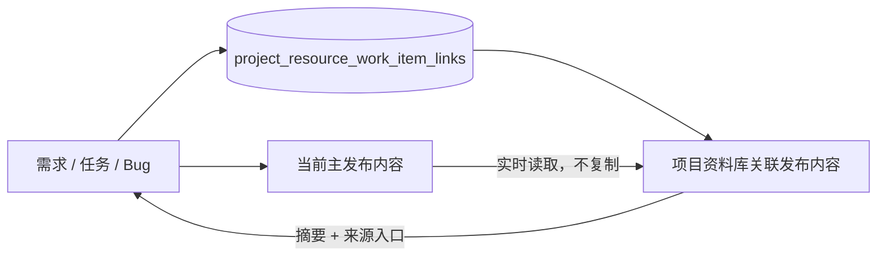

# feat: 关联工作项发布内容到资料库

## Goal Capsule

- **目标：** 需求、任务和 Bug 的主发布内容可以链接到当前项目资料库，并在资料库中作为“关联发布内容”查看；取消链接后不再出现在资料库。
- **权威来源：** 工作项主发布内容仍由 `work_item_comments` 中的主内容记录负责，链接关系只保存工作项身份和审计信息；不复制正文、摘要快照或附件。
- **执行边界：** 不改变现有资料条目接口的返回结构；新增独立的关联查询和链接/取消链接接口，并同步 Browser、Desktop、API client、OpenAPI 和共享界面。
- **停止条件：** 链接/取消链接权限、并发幂等、删除/草稿过滤、资料库展示、原工作项跳转和跨宿主契约测试全部闭环。

---

## Product Contract

### Summary

在工作项详情页提供“链接到资料库 / 取消链接”操作。链接对象是该工作项当前可见的主发布内容，不创建新的 `project_resources` 记录。项目资料库增加独立的“关联发布内容”区域，展示发布内容的来源工作项、类型、标题、摘要、更新时间和原详情入口。

### Problem Frame

当前资料库只能展示独立创建的 `project_resources`。用户常把说明资料写在需求、任务或 Bug 的主发布内容中，但资料库看不到这些内容；若复制到资料库，又会产生两份正文、附件和更新状态，后续维护容易分叉。现有 `project_resource_relations` 是“资料条目关联工作项/周期”的元数据关系，不能表达“工作项发布内容作为资料库入口”，也不能满足不复制正文的要求。

### Actors

- A1. **项目成员：** 查看资料库和关联发布内容，并从资料库返回原工作项。
- A2. **可写项目成员：** 在工作项详情页链接或取消链接主发布内容。
- A3. **只读成员：** 只能查看已有内容，不能改变链接关系。
- A4. **Browser / Desktop 客户端：** 通过同一业务接口访问关系状态和操作，不能自行拼接未登记的 HTTP 路径。

### Requirements

#### Link Lifecycle

- R1. 需求、任务和 Bug 的工作项详情页在存在可链接主发布内容且当前用户有写权限时显示“链接到资料库”。
- R2. 已链接的工作项显示已链接状态，并提供“取消链接”；取消只删除链接关系，不删除工作项、主发布内容或附件。
- R3. 一个工作项在其所属项目资料库中最多存在一条链接；重复链接应幂等，不产生重复记录。
- R4. 没有主发布内容、工作项已删除、项目不接受写入或请求方缺少权限时不能创建链接，并返回明确业务错误。

#### Resource Library Presentation

- R5. 项目资料库增加“关联发布内容”区域，与真实资料条目分开显示，避免把虚拟入口伪装成可编辑的资料正文。
- R6. 关联发布内容至少展示来源工作项编号、需求/任务/Bug 类型、标题、主内容摘要、作者、更新时间和原工作项详情链接。
- R7. 关联内容的正文和附件从原工作项详情加载；资料库不保存正文、摘要快照或附件副本。
- R8. 已取消链接、已删除工作项、已删除/草稿主内容不应出现在资料库关联内容区域；主内容后续编辑后，资料库下次加载应显示最新摘要。
- R9. 资料库关键词筛选应覆盖关联发布内容的工作项编号、标题和摘要；资料分类、标签、归档状态筛选只作用于真实资料条目，并在界面上保持语义清晰。

#### Authorization And Contract

- R10. 查看关联发布内容同时遵守项目访问权限、工作项读取权限和资料库读取 scope；链接/取消链接同时遵守项目内容写权限、工作项写入 scope 和资料库写入 scope。
- R11. 新增接口必须进入既有 `require_d2_api_principal`、CSRF、项目范围、RBAC 和 API token scope 链路，并提供 Browser 与 Desktop 同等 DTO、错误和路径行为。
- R12. OpenAPI、路由、服务端 handler、前端 API client、Desktop operation registry 和测试使用同一 method、path、字段和错误语义。

### Key Flows

- F1. **链接发布内容：** 用户打开工作项详情 -> 查看当前链接状态 -> 确认链接 -> 服务端校验主内容、项目和权限 -> 写入唯一关系 -> 工作项显示已链接。
- F2. **资料库查看：** 用户进入项目资料库 -> 读取真实资料和关联发布内容 -> 在关联区域查看摘要 -> 点击来源入口 -> 返回原工作项查看完整正文和附件。
- F3. **取消链接：** 用户在工作项详情确认取消 -> 服务端删除关系 -> 资料库重新加载后不再显示该发布内容，原工作项内容保持不变。
- F4. **内容更新：** 工作项主发布内容被编辑 -> 关联关系保持不变 -> 资料库下一次查询通过工作项当前主内容生成摘要，不使用旧快照。

### Acceptance Examples

- AE1. 管理员或可写项目成员给有 HTML 主发布内容的需求、任务和 Bug 执行链接后，项目资料库的关联区域显示三类来源，且点击入口可回到对应工作项。
- AE2. 同一工作项并发提交两次链接请求时最多产生一条关系，两个请求均返回一致的已链接结果或可识别的幂等成功。
- AE3. 取消链接后资料库关联区域不再返回该工作项；工作项详情、主内容和主内容附件仍可正常访问。
- AE4. 工作项主内容更新后，关联区域返回新的标题/摘要信息；数据库中不存在正文或附件复制记录。
- AE5. 无主内容、草稿/软删除主内容、已删除工作项、跨项目工作项、viewer 用户、缺少 `resource:write` 或 `work_item:write` scope 的请求分别被拒绝或隐藏，不产生关系。
- AE6. Browser cookie、Desktop device token 和 API token 对列表、详情、链接、取消链接的路径和 DTO 解析一致；未经登记的 Desktop URL 被拒绝。
- AE7. 资料库关键词命中关联发布内容的编号、标题或摘要；分类、标签和资料状态筛选不会错误过滤或修改关联发布内容。

### Success Criteria

- 用户不需要复制正文，就能在项目资料库发现工作项中沉淀的资料型发布内容。
- 链接和取消链接都可从工作项详情完成，关系状态在工作项详情和资料库之间一致。
- 关联内容不会形成第二份正文、摘要快照或附件生命周期。
- 现有真实资料条目、资料编辑/归档/保护和工作项编辑行为不回归。
- Web 与 Desktop 共享接口的认证、权限、错误、DTO 和异步状态保护均有验证证据。

### Scope Boundaries

**本轮包含：**

- 独立链接表、唯一约束、级联清理和关联内容查询。
- 工作项详情页链接/取消链接操作及状态展示。
- 资料库关联发布内容区域、关键词筛选和原工作项跳转。
- Browser API client、Desktop operation registry、OpenAPI 和跨层集成测试。

**本轮不包含：**

- 将关联发布内容转换成 `project_resources` 真实资料条目。
- 复制或快照保存正文、摘要、图片、视频或附件。
- 将一个工作项链接到多个项目资料库或多个资料库分类。
- 在资料库内直接编辑工作项主内容；编辑仍回到工作项详情。
- 修改现有“资料条目关联工作项/周期”的 `project_resource_relations` 语义。

### Dependencies / Assumptions

- 当前工作项主内容由 `work_items.primary_post_comment_id` 指向 `work_item_comments`，并由已有详情 API 判断可见主内容。
- 项目资料库已有独立列表路由、资源读取权限和共享 Browser/Desktop API client。
- 资料库使用服务端无分页列表，本轮关联发布内容沿用当前项目规模边界，不新增客户端静默截断。

---

## Planning Contract

### Key Technical Decisions

- KTD1. **新增独立的工作项发布内容链接表。** 不复用 `project_resource_relations`，因为后者要求已有资料条目并表达资料元数据归属；新表只表达工作项是否进入当前项目资料库。
- KTD2. **关系绑定工作项而不是固定评论 ID。** 工作项主发布内容更新时，资料库通过当前 `primary_post_comment_id` 读取最新正文摘要；关系不保存正文、摘要或附件快照。工作项删除通过外键级联清除链接，主内容不可见时查询层过滤。
- KTD3. **一工作项一链接，链接到所属项目的唯一资料库。** 数据库唯一约束和服务端幂等写入共同防止重复；本轮不引入跨项目或多位置关联选择器。
- KTD4. **资料库以独立关联区域展示。** 真实资料列表接口保持数组契约不变，新增关联发布内容读取接口，减少对现有 OpenAPI 消费者的破坏；关联条目只提供摘要和原工作项入口。
- KTD5. **链接写入采用双重 scope。** 服务端同时要求工作项写入和资料库写入能力；查看关联内容要求工作项读取和资料库读取能力，避免通过资料库绕过工作项授权边界。
- KTD6. **取消链接使用幂等无内容删除。** `DELETE` 重复执行保持成功且不删除源对象；前端成功后刷新本地关系状态，失败响应不乐观隐藏资料库入口。
- KTD7. **跨宿主操作走固定领域 operation。** Browser API client 直接使用固定路径，Desktop 通过 operation registry 映射和严格 DTO parser 访问，同步更新 web transport、Desktop 测试与 OpenAPI。

### High-Level Technical Design

### Data And Visibility Rules

- 链接表保存 `project_id`、`work_item_id`、创建人和创建时间，并以 `work_item_id` 唯一；`project_id` 必须与工作项所属项目一致。
- 关联列表通过工作项、当前主内容和项目成员范围查询；只返回未删除工作项、未删除且非草稿主内容。
- 主内容摘要在查询时从当前 HTML 正文生成，长度和清洗规则复用工作项已有摘要 helper；API 不返回可编辑的资料正文字段。
- 关联内容来源 URL 指向 `/web/work-items/{item_key}`，附件仍使用工作项评论附件的受控入口。

### Error And Concurrency Contract

- 目标工作项不存在、跨项目、已删除、项目不接受写入或没有主内容时返回对应 `404` / `400` 业务错误，不写关系。
- 唯一约束是最终并发保护；链接写入应在事务中校验工作项和主内容，并将重复插入转为幂等成功或读取已存在关系。
- 取消链接只删除关系行，关系已不存在时返回成功；数据库失败时前端保留原状态并提示用户重试。
- 旧的真实资料列表、工作项详情和资源保护错误语义不因新增关联查询失败而被静默替换；关联区域可独立显示加载错误。

### Risks And Mitigations

- **把两种关系混淆：** 通过独立表、独立 endpoint 和独立 UI 区域隔离“资料关联工作项”和“发布内容进入资料库”。
- **正文复制造成漂移：** 数据库和 DTO 都不保存发布内容 body；只返回服务端实时摘要和源链接。
- **Desktop 路径漂移：** API client、operation registry、renderer transport 和固定路径测试作为同一执行单元更新。
- **权限绕过：** 列表、链接和取消链接分别覆盖项目成员、RBAC、token scope、跨项目和只读用户测试。
- **并发重复或脏链接：** 数据库唯一约束、事务检查和删除/草稿/主内容缺失过滤共同兜底。
- **资料库布局挤压真实资料列表：** 关联区域保持有限高度或可滚动，现有资料表继续使用其内部滚动容器，不引入页面级滚动回归。

### Deferred To Follow-Up Work

- 在资料库内直接渲染完整关联发布正文、统一附件预览和跨工作项聚合阅读视图。
- 关联发布内容的独立分类、标签、排序配置和单独分页。
- 将链接关系扩展为一个发布内容可出现在多个项目资料库或多个资料库视图。

---

## Implementation Units

### U1. 建立发布内容链接数据与服务端领域行为

**Goal:** 新增不复制正文的链接数据模型、查询、幂等链接和取消链接行为。

**Requirements:** R2, R3, R4, R7, R8, R10, AE2, AE3, AE4, AE5

**Dependencies:** None

**Files:**

- Create: `api/migrations/202609110002_create_project_resource_work_item_links.sql`
- Modify: `api/src/domains/project_resources.rs`
- Modify: `api/src/domains/projects.rs`（复用主发布内容解析与摘要规则）
- Modify: `api/tests/project_management_flow.rs`
- Modify: `api/tests/resource_contract.rs`

**Approach:**

1. 建立带项目、工作项、创建人和创建时间的独立链接表，使用外键和唯一约束保证项目一致性与一工作项一链接。
2. 在资料库领域增加关联发布内容摘要模型、按项目关键词查询、按工作项读取当前链接、幂等创建和幂等删除能力。
3. 链接写入事务内确认工作项属于目标项目、项目允许写入、工作项未删除且存在非草稿主发布内容；列表查询只返回当前可见主发布内容。
4. 摘要生成复用现有主发布内容纯文本化规则，不持久化正文或摘要副本。

**Patterns to follow:** `project_resource_relations` 的外键/索引风格、`projects::work_item_primary_post` 的主内容判定、资料领域现有 `AppError` 错误映射和集成测试 fixture。

**Test Scenarios:**

- 有主发布内容的需求、任务和 Bug 可分别创建链接，并在项目查询中返回来源类型、编号、标题和摘要。
- 同一工作项重复或并发创建链接最多保留一条记录，并返回一致结果。
- 取消链接后查询不返回该内容，工作项主内容和评论附件仍存在。
- 缺少主内容、草稿/软删除主内容、已删除工作项、跨项目工作项和不可写项目均拒绝链接。
- 编辑主发布内容后重新查询，摘要来自最新正文；数据库中不出现正文复制字段或附件复制记录。
- 关键词命中工作项编号、标题和摘要，未命中时不返回关联内容。

**Verification:** 数据库迁移可在测试数据库应用；领域集成测试证明关系生命周期、并发唯一性、过滤规则和源数据不变。

### U2. 暴露 Browser/Desktop 一致的业务接口与契约

**Goal:** 让工作项详情、资料库关联列表、链接和取消链接通过固定 API 对外提供，并贯通认证、权限、DTO 和 OpenAPI。

**Requirements:** R5, R6, R10, R11, R12, AE1, AE5, AE6

**Dependencies:** U1

**Files:**

- Modify: `api/src/web/api/mod.rs`
- Modify: `api/src/web/router.rs`
- Modify: `docs/openapi/yuance.openapi.json`
- Modify: `frontend/packages/api-client/src/resources.js`
- Modify: `frontend/packages/api-client/src/work-items.js`
- Modify: `frontend/packages/api-client/src/index.js`
- Modify: `desktop/src/renderer/platform/api-transport.js`
- Modify: `desktop/src/network/operation-registry.mjs`
- Modify: `api/tests/resource_contract.rs`
- Modify: `api/tests/project_management_flow.rs`
- Modify: `web/test/api.test.mjs`
- Modify: `frontend/packages/api-client/test/api-client.test.mjs`
- Modify: `desktop/test/operation-registry.test.mjs`
- Modify: `desktop/test/renderer-api-transport.test.mjs`

**Approach:**

1. 在工作项详情 DTO 中返回当前关联状态和链接入口权限；新增项目级关联发布内容列表 DTO，保留真实资料列表数组契约。
2. 新增固定的项目关联内容读取接口，以及工作项关联/取消关联接口；所有 handler 复用 `require_d2_api_principal`、CSRF、项目访问、RBAC 和对应 token scope。
3. Browser client 提供列表、链接和取消链接方法；Desktop registry 增加读取与写入 operation，严格校验路径、查询、请求体和成功响应。
4. OpenAPI 记录 method、path、权限 scope、请求/响应字段、删除幂等语义和主内容不可见错误。

**Patterns to follow:** 资料库 handler 的项目访问与 token scope 链路、工作项主内容 handler、Desktop `project.resources` 与 `workitem.detailview` operation、现有 `parseNoContent` 和 DTO parser。

**Test Scenarios:**

- Browser API 能读取项目关联发布内容、读取工作项链接状态，并正确映射链接/取消链接请求。
- Desktop operation registry 对新增 GET/POST/DELETE 路径生成固定 descriptor，拒绝未知查询字段、未知请求体字段和任意 URL。
- 无登录、跨项目、viewer、缺少 `work_item:read` / `resource:read` / `work_item:write` / `resource:write` scope 的请求得到明确拒绝。
- OpenAPI 路径、路由 smoke、成功 envelope 和错误字段与真实 handler 一致。
- Desktop device token 与 Browser cookie 访问同一数据时返回结构等价 DTO。

**Verification:** API 集成、OpenAPI contract、Browser client 和 Desktop registry 测试同时通过，且现有资料/工作项接口的既有测试不改语义。

### U3. 在工作项详情页提供链接与取消链接操作

**Goal:** 用户能在共享工作项详情界面确认链接状态、链接发布内容和取消链接，同时避免异步响应污染其他工作项页面。

**Requirements:** R1, R2, R4, R10, AE1, AE3, AE5

**Dependencies:** U2

**Files:**

- Modify: `frontend/packages/ui/src/work-item-detail.jsx`
- Modify: `frontend/packages/ui/src/styles.css`
- Modify: `frontend/packages/ui/test/work-item-detail.test.mjs`
- Modify: `frontend/packages/app-shell/src/app.jsx`
- Modify: `web/e2e/app-shell.spec.mjs`

**Approach:**

1. 在工作项操作栏增加动态链接状态入口；无主内容或无服务端写权限时不显示可操作控件。
2. 链接和取消链接使用确认弹窗，明确正文不复制、取消不删除源内容；提交期间锁定相关操作。
3. 成功后只更新当前工作项详情的链接状态并刷新资料库入口状态，失败时保留原状态并显示错误。
4. 复用现有工作项 action generation、route/entity 校验和 mutation busy 约定，处理用户快速切换工作项或重复点击。

**Patterns to follow:** `WorkItemDetail` 操作栏和生命周期确认弹窗、`app.jsx` 的 `workItemActionRef` / 当前路由保护、现有 API 错误展示。

**Test Scenarios:**

- 有主内容的需求、任务和 Bug 分别显示链接入口，确认后变为已链接状态。
- 已链接状态可确认取消；取消成功后状态恢复，源工作项标题、正文和附件仍在。
- 只读用户、删除工作项、无主内容和服务端权限失败时不显示或不允许操作。
- 链接请求响应晚于路由切换时，不修改新工作项页面；重复点击不会发出并行写入。
- 浏览器端 E2E 覆盖链接、取消、刷新后状态保持和资料库入口跳转。

**Verification:** 共享 UI 单元测试和 Web E2E 能证明状态、确认、错误和竞态行为；需求/任务/Bug 继续共用同一实现。

### U4. 在资料库展示关联发布内容

**Goal:** 资料库可发现并跳转到已链接的工作项发布内容，同时保持真实资料列表和页面滚动布局稳定。

**Requirements:** R5, R6, R7, R8, R9, AE1, AE3, AE4, AE7

**Dependencies:** U2

**Files:**

- Modify: `frontend/packages/app-shell/src/app.jsx`
- Modify: `frontend/packages/app-shell/src/application.css`
- Modify: `frontend/packages/api-client/src/resources.js`
- Modify: `frontend/packages/api-client/test/api-client.test.mjs`
- Modify: `web/test/api.test.mjs`
- Modify: `web/e2e/app-shell.spec.mjs`

**Approach:**

1. 资料库加载时并行读取真实资料和关联发布内容；关键词变化时同步刷新两类数据，分类/标签/状态仍只作用于真实资料。
2. 在资料表上方增加独立关联区域，使用来源类型、编号、标题、摘要和更新时间组成可扫描的列表项，点击来源 URL 回到工作项详情。
3. 不把关联发布内容伪装成可编辑资料条目，不提供资料编辑/归档/保险箱操作；关联查询失败只影响关联区域提示，不清空真实资料。
4. 为关联区域设置稳定高度、内部滚动和空状态，避免挤压已有资料表的内部滚动容器或恢复页面级滚动。

**Patterns to follow:** `projectResourcesPanel` 的资料筛选/表格、`PaginatedTable` 空状态、`handleNavigate` 内部导航和资料库现有滚动布局。

**Test Scenarios:**

- 资料库同时显示真实资料和至少一条关联发布内容，关联项可打开原工作项。
- 取消链接或源工作项删除后重新加载，关联区域不再显示该项；真实资料不受影响。
- 编辑源主内容后刷新资料库，关联摘要更新；页面不创建第二份正文或附件。
- 关键词命中关联编号、标题、摘要；分类、标签和状态筛选不会错误地把关联项当作真实资料过滤。
- 空关联区域、接口失败、长摘要和多条关联项都保持可读布局和内部滚动。

**Verification:** API client、Web API transport 和 E2E 证明两类数据的加载、筛选、跳转、错误隔离和布局行为。

### U5. 复核、记录和发布前验证

**Goal:** 对照计划验证跨模块契约、范围和可回滚性，并沉淀不复制正文与权限边界的长期规则。

**Requirements:** R1-R12, AE1-AE7

**Dependencies:** U1, U2, U3, U4

**Files:**

- Create: `docs/reviews/2026-09-11-work-item-post-resource-library-links-review.md`
- Create when the decision proves reusable: `docs/solutions/2026-09-11-work-item-post-resource-library-links.md`
- Reference: `docs/solutions/2026-07-29-remove-resource-version-snapshots.md`
- Reference: `docs/solutions/2026-08-07-shared-business-endpoint-contract-boundaries.md`

**Approach:**

1. 对照本计划逐项检查数据生命周期、权限、接口契约、Browser/Desktop parity、异步竞态和 UI 滚动边界。
2. 执行聚焦 API、前端 client、UI、Desktop registry 和 Web E2E 验证；发现问题先修复再记录结果。
3. 记录未覆盖的后续能力，不把“关联发布内容”描述成独立资料正文或完成全文聚合阅读。

**Test Scenarios:**

- 全部成功标准和 Acceptance Examples 都能在 review 记录中找到验证证据。
- 现有资源/工作项测试和跨宿主 contract 测试无回归。
- 迁移失败或接口不一致时能按新增表和独立路由回滚，不触碰现有资料正文。

**Verification:** review 文档包含实际验证结果、残余风险、未执行项和部署前结论；必要的可复用经验沉淀到 `docs/solutions/`。

---

## Verification Contract

| Gate | Scope | Done signal |
| --- | --- | --- |
| V1 | Migration/domain | 链接表迁移成功，API 集成测试覆盖唯一性、权限、过滤和源数据不变。 |
| V2 | API/OpenAPI/client | Browser 与 Desktop 的新增路径、DTO、错误和 scope 测试通过，OpenAPI 与 router 一致。 |
| V3 | Shared UI | 工作项详情链接/取消链接、确认、错误和 route 竞态测试通过。 |
| V4 | Resource library | 关联区域展示、关键词、空态、错误隔离、原工作项跳转和滚动布局 E2E 通过。 |
| V5 | Final review | review 文档对照 R/AE/KTD/U 逐项给出证据，未解决风险和延期项明确。 |

---

## Definition of Done

- 独立关系表和唯一约束已迁移到测试数据库，链接/取消链接不复制或删除源正文与附件。
- 需求、任务和 Bug 的主发布内容都能从工作项详情链接到资料库，并能取消链接。
- 资料库展示关联发布内容摘要和原工作项入口；取消链接、源内容不可见或源工作项删除后不再展示。
- 真实资料条目的列表、详情、编辑、归档、保护和附件行为保持原有语义。
- Browser、Desktop、OpenAPI、前端 API client、UI 和集成测试形成一致契约。
- 计划引用的聚焦验证、review 记录和必要的解决方案沉淀已经完成；正式部署前没有未解释的高风险失败。

## Appendix

### Deferred Implementation Questions

- 具体关联列表 endpoint 的命名和响应字段可在 U2 按现有 API 命名约定微调，但不得改变“独立列表、摘要+源链接、不复制正文”的契约。
- 关联区域最终采用有限高度列表还是与真实资料表共享一个可滚动容器，留给 U4 结合当前响应式布局验证；不得引入页面整体滚动。
