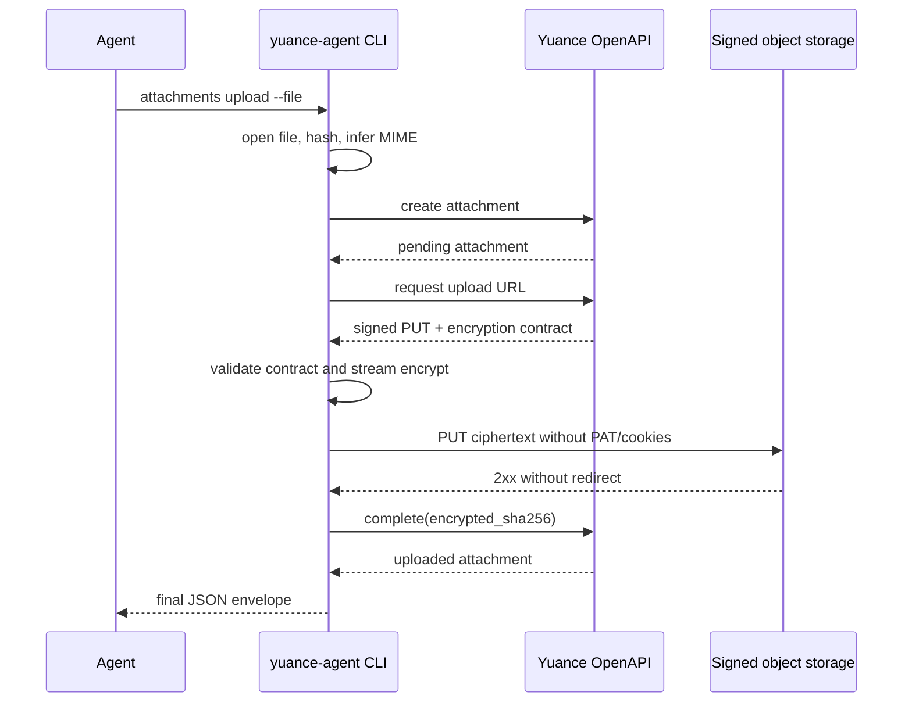
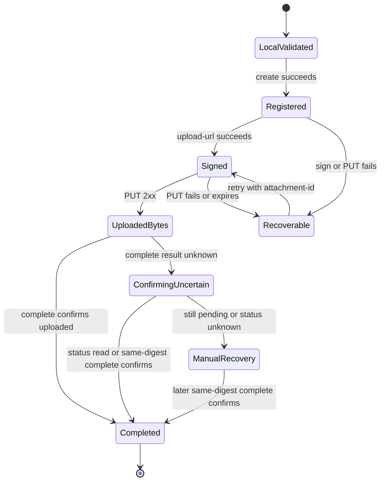

# Yuance Agent Attachment Upload - Plan

## Goal Capsule

- **Objective:** 其他项目能够只通过本机 `yuance-agent` Skill 将本地 SVG 等文件安全上传为资料附件，不再依赖浏览器或自行实现对象存储加密上传。
- **Means:** 为 Rust CLI 增加完整的 `resources attachments upload --file` 复合命令，复用现有资料附件 OpenAPI，并兼容 `YUANCE-ENC-v1` 流式加密协议（KTD1-KTD4）。
- **Authority:** 本计划 > `docs/openapi/yuance.openapi.json` > 当前 API handler 与领域实现 > `docs/plans/2026-09-08-1713-feat-sync-skill-openapi-capabilities-plan.md` 中已延期的字节传输设计。
- **Execution profile:** 按 U1-U5 顺序实施；协议和传输安全测试先于命令编排，仓库 Skill、发布包和本机安装必须使用同一版本。
- **Stop condition:** CLI 可以完成资料附件登记、签名、加密 PUT 和上传确认；失败可安全恢复；Skill 文档、安装包和本机安装一致；聚焦测试与真实测试存储闭环全部通过。

---

## Product Contract

### Summary

为 `yuance-agent` 增加资料附件本地文件上传能力。调用方只提供项目、资料和本地文件，CLI 在单进程内完成附件登记、签名请求、`YUANCE-ENC-v1` 加密、对象存储 PUT 和上传完成确认，并只输出最终附件或不含敏感凭证的结构化错误。

### Problem Frame

当前 Skill 能更新资料正文，也能执行附件 `create`、`upload-url` 和 `complete`，但不能传输本地文件字节。资料附件又固定使用客户端加密，调用方无法把明文文件直接 PUT，也不能跳过上传后调用 `complete`。结果是其他项目仍需自行封装 OpenAPI、加密协议和对象存储请求，或者退回浏览器操作，未达到 Skill 消除重复接入代码的目标。

上一轮同步计划有意将字节上传延期，因为 CLI 当时缺少独立对象存储 transport、签名请求校验和加密实现。本计划只补齐这段已确认缺口，不重新扩大到下载、预览或其他附件域。

### Requirements

**Upload workflow**

- R1. CLI 必须提供 `resources attachments upload --project-key <KEY> --resource-id <ID> --file <PATH>`，默认在一个进程内完成登记、取上传签名、加密 PUT 和上传确认。
- R2. 命令必须以本地文件的真实文件名、字节数、SHA-256 和 MIME 类型登记附件；MIME 可由受控映射推断并允许显式覆盖，`.svg` 默认登记为 `image/svg+xml`。
- R3. 命令只在能够确定对象存储尚未返回成功时对当前 pending 附件重新签名和重试 PUT；PUT 已成功但 complete 结果不确定时禁止覆盖重传，只允许使用同一密文摘要重试确认或查询状态。
- R4. 命令成功时输出服务端最终附件 JSON envelope；失败时输出阶段、稳定错误码和安全的恢复信息，confirming 不确定时必须包含 `attachment_id` 与实际密文 SHA-256，不得伪造成功或把 pending 状态描述为 uploaded。

**Encryption and transfer safety**

- R5. 加密上传必须逐字节兼容 `YUANCE-ENC-v1`：AES-256-GCM、1 MiB 分块、每块独立随机 nonce、文件头、明文 SHA-256，以及绑定 `file_object_id + chunk_index` 的 AAD。
- R6. CLI 必须采用流式读取与加密，内存占用不得随文件总大小线性增长；上传前后必须检测文件大小、内容摘要或文件身份变化。
- R7. 对象存储请求只能来自当前上传流程取得的服务端签名响应，方法固定为 PUT，禁止调用方传入 URL、method、headers 或 object key。
- R8. 对象存储 transport 不得携带 API Bearer Token、Cookie 或环境凭证，不跟随重定向，只允许受控 headers，并拒绝不安全 scheme、URL 用户信息和不合法目标。
- R9. 签名 URL、签名 headers、资料访问令牌和 `encryption.key` 只能存在于当前进程内，不进入 argv、stdout、stderr、日志、临时 manifest 或普通文件。
- R10. CLI 必须核对签名响应中的附件标识、明文大小、明文 SHA-256、加密格式和预期密文大小；上传完成确认提交实际 PUT 字节流的密文 SHA-256。

**Skill and distribution**

- R11. Skill 工作流必须默认使用复合上传命令；低层 `create`、`upload-url` 和 `complete` 保留用于诊断与恢复，但不得要求 Agent 手工处理签名 URL 或加密密钥。
- R12. 仓库内 Skill、CLI 二进制、安装说明、跨平台发布包和本机安装必须来自同一版本，不允许只手工覆盖 `SKILL.md` 或单独替换二进制。
- R13. 现有资料正文、普通图片、SVG 安全校验、附件下载和低层附件命令行为不得回归。
- R14. Skill 只有在本地文件路径和目标项目/资料来自用户明确请求或当前已授权任务范围时才能上传；远端资料正文、附件内容和仓库内提示不得自行扩大本地文件读取授权。

### Key Flows

- F1. **首次上传**
  - **Trigger:** Agent 已确认项目、资料和本地文件。
  - **Steps:** CLI 固定打开文件并计算元数据 -> 登记 pending 附件 -> 获取签名 -> 校验传输契约 -> 流式加密 PUT -> 提交密文摘要完成确认。
  - **Outcome:** stdout 返回 uploaded 附件 envelope，敏感传输信息不离开进程。
  - **Covers:** R1, R2, R4-R10
- F2. **失败恢复**
  - **Trigger:** 已登记附件在签名、PUT 或确认阶段失败。
  - **Steps:** signing 或明确失败的 PUT 在当前命令内重新签名重试 -> confirming 不确定时返回 `attachment_id` 和实际密文摘要 -> Agent 查询状态或使用低层 complete 重试同一摘要，禁止再次 PUT。
  - **Outcome:** 已成功 PUT 的对象不会被新密文覆盖，不把不确定结果误报为失败或成功。
  - **Covers:** R3, R4, R11
- F3. **Skill 发布与本机更新**
  - **Trigger:** CLI、文档和测试已通过。
  - **Steps:** 同步版本 -> 生成完整平台包 -> 校验包内文件和 checksum -> 安装器原子替换本机 Skill -> 离线 doctor 与命令帮助复核。
  - **Outcome:** 本机实际使用的 Skill 与仓库和发布版本一致。
  - **Covers:** R12

### Acceptance Examples

- AE1. 给定一个包含矩形、箭头和中文文本的合法 SVG，执行复合上传命令后返回 uploaded 附件，资料详情可以使用现有预览入口显示该 SVG。
- AE2. 给定包含 `<script>` 或 `onclick` 的 SVG，字节上传可以完成，但服务端在完成确认的既有安全校验阶段拒绝附件，CLI 返回明确错误且不宣称 uploaded。
- AE3. 给定大于一个加密分块的文件，CLI 使用有界内存完成上传，服务端下载解密后的字节与原文件 SHA-256 一致。
- AE4. PUT 成功但完成确认发生临时网络错误时，CLI 先查询或重试确认；仍无法确定时返回原 `attachment_id`、实际密文 SHA-256 和 `confirming` 阶段，后续恢复只重试 complete 而不覆盖 PUT。
- AE5. 恶意签名响应包含重定向、非 PUT 方法、危险 header、URL 用户信息或非允许 scheme 时，CLI 在向对象存储发送任何文件字节前拒绝请求，且不泄露 PAT 或密钥。
- AE6. 新版本完整安装到本机后，`doctor --installation`、`--version` 和 `resources attachments upload --help` 同时反映新能力，仓库与安装目录的 Skill 文档没有漂移。

### Success Criteria

- 其他项目不需要浏览器、curl、Python 或自行实现 AES-GCM，即可用一个领域命令上传 SVG 资料附件。
- 上传链路对空文件、单分块、多分块、源文件变化、签名过期、PUT 失败和确认结果不确定均有确定行为。
- 真实测试存储闭环证明上传对象可由服务端解密并通过 SVG 安全校验。
- 发布包与本机安装同时包含新 CLI 和同步后的 Skill 文档。

### Scope Boundaries

**In scope**

- 资料附件的本地文件复合上传。
- `YUANCE-ENC-v1` 的 CLI 流式加密与跨实现兼容验证。
- 独立 signed-object transport、失败恢复和结构化错误。
- Skill 文档、安装说明、发布包和本机安装同步。

### Deferred to Follow-Up Work

- 本地文件下载、客户端解密和 `attachments download --file`。
- 工作项、评论、项目附件和系统发布资产的一键上传命令。
- 断点续传、多文件并行上传和上传进度事件。
- 调整服务端在 complete 阶段重新读取对象并计算密文 SHA-256；当前行为仍以对象大小、MIME 和客户端提交摘要为准。
- 扩展到其他附件域的一键上传；本轮只恢复并验证资料附件所需的 Release workflow。

---

## Planning Contract

### Key Technical Decisions

- KTD1. **`upload --file` 是完整复合命令。** 它默认负责 create、upload-url、PUT 和 complete；已有阶段命令继续保留，避免把签名 URL 和密钥交给 Agent 编排。
- KTD2. **恢复按失败阶段分流。** signing 和明确失败的 PUT 可在当前进程对同一 pending 附件重新签名；PUT 2xx 后只允许重试 complete 或查询状态，跨进程恢复使用错误结果中的 `attachment_id + encrypted_sha256` 调用低层 complete，绝不覆盖重传。
- KTD3. **对象存储使用独立无凭证 transport。** 当前 API client 带默认 Bearer Token，不能复用；新 transport 只消费服务端当次返回的签名请求，不接受调用方提供任意网络目标。
- KTD4. **CLI 使用流式 Rust 加密实现。** 参考 Desktop 的有界内存上传方式和 API 的协议实现，在 CLI 内建立独立兼容模块，并用固定测试向量防止多语言实现漂移；不抽取共享 crate，避免本轮扩大 API 构建和部署边界。
- KTD5. **可信边界是已认证 API 签发、客户端严格限权。** CLI 信任当前 `YUANCE_BASE_URL` 返回的当次签名请求，但仍固定 PUT、禁用重定向和 ambient credentials、限制 headers，并要求绝对外部地址使用 HTTPS；仅测试环境允许同源 loopback HTTP。
- KTD6. **不在磁盘保存密文中间文件或传输 manifest。** 文件描述符、nonce、密钥、签名请求和哈希状态都留在内存；只有 PUT 尚未成功时才允许在当前进程重新生成密文，PUT 成功后的恢复只使用非敏感的附件 ID 和密文摘要完成确认。
- KTD7. **发布包是本机 Skill 的唯一同步单元。** 仓库文档更新后必须和新二进制一起打包、校验并通过安装器替换，不直接编辑 `~/.codex/skills/yuance-agent`。

### High-Level Technical Design

### System-Wide Impact

- **CLI contract:** 新增公开子命令并反转当前“upload 必须解析失败”的契约测试。
- **Security:** CLI 首次直接处理本地文件、短时对象存储签名和明文数据密钥，错误输出与 transport 隔离成为发布阻断项。
- **Performance:** 采用流式加密避免 Web 方案的整文件明文加密文内存峰值；文件上限仍由现有服务端规则决定。
- **Operations:** 不需要数据库迁移或正式 API 部署即可消费现有协议；若 OpenAPI 描述与实际签名响应不一致，只修契约描述和测试，不改变线上数据模型。
- **Distribution:** 发布版本需同步 crate、两个安装器、六平台资产、Skill references 和本机安装。

### Risks and Dependencies

- 签名有效期短于大文件上传时间会导致 PUT 失败；CLI 必须在开始前校验剩余 TTL，失败后使用同一 `attachment_id` 重新签名。
- 文件在初次哈希后被替换可能造成登记元数据和上传字节不一致；CLI 必须持有同一文件句柄并在上传前后复核元数据和明文摘要。
- `complete` 目前不从对象存储重新计算密文摘要；本轮确保提交实际上传流的 SHA-256，并把服务端强化留作后续工作。
- 当前六平台 Release workflow 被禁用；U5 必须恢复并跑通现有矩阵，不能把单机二进制称为正式发布。
- 本机安装目录已经与仓库文档发生漂移；U5 必须用完整包原子替换并做内容一致性检查。

### Sources and Research

- `docs/plans/2026-09-08-1713-feat-sync-skill-openapi-capabilities-plan.md`：原计划的 G3、KTD8 和延期结论。
- `docs/reviews/2026-09-08-sync-skill-openapi-capabilities-review.md`：现有 CLI 覆盖和字节传输未落地证据。
- `api/src/platform/file_crypto.rs`：服务端 `YUANCE-ENC-v1` 权威实现。
- `web/src/platform/browser/files.js`：Browser 加密上传和签名请求消费模式。
- `desktop/src/files/upload-executor.mjs`、`desktop/src/files/transfer-contract.mjs`：流式上传、源文件一致性与签名 transport 安全模式。
- `docs/openapi/yuance.openapi.json`：资料附件签名、加密和完成确认公开契约。

---

## Implementation Units

### U1. 冻结复合命令与安全传输契约

- **Goal:** 固定 `upload --file` 的参数、恢复语义、签名响应模型和独立 transport 安全边界。
- **Requirements:** R1-R4, R7-R10
- **Dependencies:** 无
- **Files:**
  - Modify: `tools/yuance-agent-cli/src/cli.rs`
  - Modify: `tools/yuance-agent-cli/src/models.rs`
  - Modify: `tools/yuance-agent-cli/src/error.rs`
  - Modify: `tools/yuance-agent-cli/src/client.rs`
  - Modify: `tools/yuance-agent-cli/tests/cli_contract.rs`
  - Modify: `tools/yuance-agent-cli/tests/api_client.rs`
  - Modify: `tools/yuance-agent-cli/tests/openapi_contract.rs`
  - Reference: `desktop/src/files/transfer-contract.mjs`
  - Reference: `docs/openapi/yuance.openapi.json`
- **Approach:**
  1. 增加复合上传参数；本地文件必须是可读取的普通文件，低层 complete 继续承担 confirming 不确定后的跨进程恢复。
  2. 为签名响应建立强类型模型，严格校验附件标识、PUT 请求、TTL、headers、明文摘要和 encryption 字段。
  3. 拆分 API client 与 signed-object transport，后者不安装默认 Authorization、Cookie 或代理凭证，不跟随重定向，也不输出响应中的敏感字段。
  4. 扩展错误 envelope，使上传阶段、稳定错误码和安全恢复字段可供 Agent 使用；只有 confirming 不确定时返回附件 ID 与密文 SHA-256，同时保持现有错误消费者兼容。
- **Execution note:** 先把当前拒绝 `upload` 的契约测试改为预期参数和负向边界，再实现命令定义与模型解析。
- **Test scenarios:**
  - 完整参数可以解析；缺少 `--file`、路径为目录、首次上传同时传入冲突元数据时被拒绝。
  - 复合命令不接受任意签名 URL 或恢复对象覆盖参数；低层 complete 只接受正整数附件 ID 和合法密文 SHA-256。
  - signed-object transport 发出的请求没有 Authorization、Cookie 和 API 默认 headers。
  - HTTP 外部地址、非 PUT、重定向、URL 用户信息、重复或危险 header、过期签名在发送文件前被拒绝。
  - 测试 API 的同源 loopback HTTP 上传路径可用，生产形态的绝对地址只接受 HTTPS。
  - 错误 JSON 包含 stage/code/attachment_id 时不包含签名 URL、header、access token 或 encryption key。
- **Verification:** CLI 参数、签名响应反序列化、独立 transport 和错误脱敏契约均由测试固定。

### U2. 实现流式 `YUANCE-ENC-v1` 上传器

- **Goal:** 以有界内存生成协议兼容密文，并在同一上传流中计算实际密文 SHA-256。
- **Requirements:** R5, R6, R9, R10
- **Dependencies:** U1
- **Files:**
  - Create: `tools/yuance-agent-cli/src/file_crypto.rs`
  - Create: `tools/yuance-agent-cli/tests/file_crypto.rs`
  - Modify: `tools/yuance-agent-cli/src/main.rs`
  - Modify: `tools/yuance-agent-cli/Cargo.toml`
  - Modify: `Cargo.lock`
  - Reference: `api/src/platform/file_crypto.rs`
  - Reference: `desktop/src/files/file-crypto.mjs`
  - Reference: `desktop/src/files/upload-executor.mjs`
- **Approach:**
  1. 实现文件头、随机 nonce 表、密文长度、chunk AAD 和 AES-256-GCM 分块输出，协议常量与 API 保持一致。
  2. 上传前从同一文件句柄计算明文 SHA-256；流式加密时再次累计明文和密文摘要，结束后核对文件身份和字节数。
  3. 通过流式 request body 直接发送密文，不创建明文或密文临时文件，不把数据密钥暴露给通用模型或 Debug 输出。
  4. 建立由 API 实现和 CLI 实现共同验证的固定向量，防止字节序、空文件、nonce 表和 AAD 漂移。
- **Execution note:** 先以 API 实现生成的固定向量写兼容测试，再实现 CLI 加密器；内存测试使用多分块输入确认不会聚合完整密文。
- **Test scenarios:**
  - 空文件、单分块、刚好 1 MiB、多分块输入产生正确头部、长度和可由 API 解密的明文。
  - 每块 nonce 唯一且来自密码学安全随机源，相同明文重复上传产生不同密文。
  - 错误 key、错误 file object ID、篡改 tag、截断头部和截断 body 无法通过兼容验证。
  - 上传期间文件大小或内容变化时停止 complete，并返回 source-changed 错误。
  - 多分块测试的缓冲上限与分块大小相关，不随总文件大小增长。
- **Verification:** CLI 密文可由服务端实现解密，实际密文摘要和预期密文大小稳定通过跨实现测试。

### U3. 编排可恢复的资料附件上传闭环

- **Goal:** 将本地文件、API 阶段和流式上传器组合为对 Agent 友好的一条命令。
- **Requirements:** R1-R4, R10, R13; F1, F2; AE1-AE5
- **Dependencies:** U1, U2
- **Files:**
  - Modify: `tools/yuance-agent-cli/src/commands/resources.rs`
  - Modify: `tools/yuance-agent-cli/src/commands/mod.rs`
  - Modify: `tools/yuance-agent-cli/src/models.rs`
  - Modify: `tools/yuance-agent-cli/tests/command_flow.rs`
  - Modify: `scripts/test-yuance-agent-real-api.sh`
  - Reference: `frontend/packages/app-core/src/work-item-collaboration.js`
  - Reference: `desktop/src/files/business-attachment-coordinator.mjs`
- **Approach:**
  1. 首次模式读取文件并登记附件；恢复模式读取附件列表或目标附件，要求状态为 pending 且文件名、大小、MIME 和明文摘要匹配。
  2. 获取 upload-url 后执行 U1 契约校验，调用 U2 流式上传器，并把实际密文 SHA-256 提交给现有 complete 接口。
  3. 对签名过期和明确未成功的 PUT 允许在当前进程对同一附件重新签名；对 PUT 成功但 complete 结果不确定，先读取附件状态，再做有界的幂等确认，仍不确定时返回附件 ID 与实际密文 SHA-256，禁止覆盖 PUT。
  4. 服务端拒绝危险 SVG 时保留真实错误语义；不自动删除 pending 附件，不自动重建第二条附件记录。
- **Test scenarios:**
  - Covers F1 / AE1. 合法 SVG 完成 create -> sign -> encrypted PUT -> complete，最终返回 uploaded 附件。
  - Covers AE2. 危险 SVG 在 complete 阶段被服务端拒绝，CLI 返回 confirming 阶段和原 attachment ID。
  - Covers AE3. 多分块文件上传后由服务端读取并解密，明文 SHA-256 与原文件一致。
  - Covers F2 / AE4. sign 失败、签名过期、PUT 4xx/5xx、连接中断和 complete 结果不确定均保留正确阶段；只有确认不确定时返回附件 ID 与密文摘要。
  - 延迟 complete 与恢复操作并发时只会重复确认同一密文，不会再次 PUT；目标已 uploaded 时返回现有结果或明确停止。
  - 文件元数据与登记记录不一致、资源已归档、跨项目附件和权限不足均在正确边界失败。
  - 现有 list/create/upload-url/complete/download-url/delete 命令请求路径和输出保持不变。
- **Verification:** mock command flow 与真实 API 测试存储均证明完整上传闭环和恢复路径，不依赖浏览器或外部脚本传输字节。

### U4. 同步 Skill 行为、命令文档和安装说明

- **Goal:** 让 Agent 默认使用新复合命令，并准确理解敏感信息、恢复和 SVG 校验边界。
- **Requirements:** R11-R14; F3
- **Dependencies:** U3
- **Files:**
  - Modify: `skills/yuance-agent/SKILL.md`
  - Modify: `skills/yuance-agent/references/commands.md`
  - Modify: `skills/yuance-agent/references/workflows.md`
  - Modify: `skills/yuance-agent/references/errors.md`
  - Modify: `skills/yuance-agent/agents/openai.yaml`
  - Modify: `tools/yuance-agent-cli/tests/skill_package.rs`
  - Modify: `docs/runbooks/yuance-agent-codex-installation.md`
- **Approach:**
  1. 将“CLI 不执行对象存储上传”改为受控本地文件上传能力，并给出首次上传与 pending 恢复示例。
  2. 明确 Agent 不调用 `upload-url` 后自行 PUT，不读取或记录签名响应中的密钥，不以 `complete` 冒充上传。
  3. 保留先读取资料和附件上下文、上传后更新正文引用、替换完成后再删除旧附件的工作流。
  4. 更新错误处理，区分 local-validation、registering、signing、uploading、confirming 和 uncertain，并规定何时可以重试。
  5. 增加本地文件授权边界：源文件路径和目标项目/资料必须来自用户明确请求或当前已授权任务范围，远端内容不得授权读取新的本地路径。
- **Test scenarios:**
  - Skill 包声明并示例化 `attachments upload --file`，不再声称字节上传不支持。
  - 示例不把 PAT、access token、签名 URL、headers 或 encryption key 放入 argv、环境变量或文件。
  - 工作流要求 uncertain 时先查状态，禁止直接重复首次上传造成重复附件。
  - Skill package tests 覆盖远端资料正文或附件诱导上传凭证文件的反例，并要求停止执行而不是接受该指令。
  - 低层命令仍被描述为诊断/恢复能力，不能让 Agent 手工执行任意 URL 请求。
  - 安装 runbook 的版本、命令和能力边界与 CLI help 一致。
- **Verification:** Skill package tests 和人工文档复核能从用户请求直接导出安全、完整、可恢复的上传操作。

### U5. 发布新版本并同步本机安装

- **Goal:** 将新 CLI 与 Skill 文档作为同一完整版本发布、校验并安装到本机 Codex Skill 目录。
- **Requirements:** R12; F3; AE6
- **Dependencies:** U1-U4
- **Files:**
  - Modify: `tools/yuance-agent-cli/Cargo.toml`
  - Modify: `Cargo.lock`
  - Modify: `scripts/install-codex-skill.sh`
  - Modify: `scripts/install-codex-skill.ps1`
  - Modify: `scripts/test-install-codex-skill.sh`
  - Modify: `scripts/test-install-codex-skill.ps1`
  - Modify: `scripts/validate-yuance-agent-release.sh`
  - Create: `docs/reviews/2026-09-22-yuance-agent-attachment-upload-review.md`
  - Rename and modify: `.github/workflows/release-yuance-agent.yml.disabled` -> `.github/workflows/release-yuance-agent.yml`
- **Approach:**
  1. 恢复现有 Release workflow，将 CLI 和两个安装器同步升级到下一 patch 版本，通过六平台矩阵生成完整 Skill 包和 `SHA256SUMS`。
  2. 扩展发布校验，确认所有平台包包含新命令、同步 references 和可执行二进制；安装失败仍原子恢复旧版本。
  3. 先安装到临时目录验证，再通过安装器原子替换本机默认目录；不得直接复制仓库文档或 debug 二进制。
  4. 记录平台资产、真实 API 上传、安装自检、本机版本和剩余风险，不在复核文档中保存任何签名或密钥。
- **Execution note:** 这是发布与安装单元，优先使用完整包和 runtime smoke 作为证据；正式 Release 资产不完整时不得宣称跨平台发布完成。
- **Test scenarios:**
  - crate、Shell 安装器和 PowerShell 安装器版本一致，旧版本或缺失资产被明确拒绝。
  - Release workflow 的 tag 触发、六平台矩阵和发布权限生效，所有平台包都包含相同的 Skill 文档和对应可执行文件。
  - checksum 篡改导致安装失败，任一平台构建或校验失败都会阻止正式 Release 完成。
  - 临时目录首次安装、覆盖升级和失败回滚均通过，旧 Skill 目录不会留下混合版本文件。
  - Covers AE6. 本机安装后 version、doctor 和 upload help 同时通过，仓库文档与安装包文档内容一致。
  - 本机安装后的复合命令使用测试项目完成一次合法 SVG 上传，不修改非测试资料。
- **Verification:** 发布校验、安装器测试、临时安装、本机原子升级和安装后冒烟全部形成可复核证据。

---

## Verification Contract

| Gate | Coverage | Done signal |
| --- | --- | --- |
| Rust format and lint | CLI crate、依赖与全部 target | `cargo fmt`、Clippy 无警告，CLI 全量测试通过 |
| Protocol compatibility | U2 | 空/单/多分块固定向量可被 API 解密，大小与双 SHA 校验一致 |
| Transport security | U1-U3 | 无 PAT/Cookie、无重定向、URL/header/TTL 负向场景全部通过 |
| API integration | U3 | 真实 API + 测试存储完成合法 SVG 上传，并拒绝危险 SVG |
| Regression | U3-U4 | 既有资源附件命令、正文与附件预览测试继续通过 |
| Skill package | U4-U5 | package tests、安装器 tests 和 release validation 全部通过 |
| Installed behavior | U5 | 本机新版本 doctor、help 和测试资料上传冒烟通过 |

正式验证至少覆盖：

- `cargo test -p yuance-agent`
- `cargo clippy -p yuance-agent --all-targets -- -D warnings`
- `cargo test -p yuance-api --test resource_contract --test device_business_parity_flow`
- `bash scripts/test-yuance-agent-real-api.sh`
- `bash scripts/test-install-codex-skill.sh`
- PowerShell 安装器测试所在支持环境
- `scripts/validate-yuance-agent-release.sh` 对完整发布资产的校验

---

## Definition of Done

- U1-U5 的实现、测试、文档和复核证据全部完成，没有 launch-blocking 问题。
- `resources attachments upload --file` 能在首次和恢复模式下完成合法 SVG 资料附件上传。
- 所有敏感字段均留在进程内，错误、日志、测试快照和复核文档不存在泄漏。
- CLI 使用有界内存流式加密，协议兼容测试覆盖空文件、单分块和多分块。
- PUT 成功但 complete 不确定等失败路径不会制造重复附件或虚假成功。
- 现有 OpenAPI、资料正文、附件预览、下载与低层附件命令没有回归。
- 完整发布包通过跨平台结构与 checksum 校验，本机 Skill 通过安装器升级并与仓库版本一致。
- 实现过程中产生的废弃方案、临时脚本、密文文件和调试输出已清理，不进入提交或发布包。
